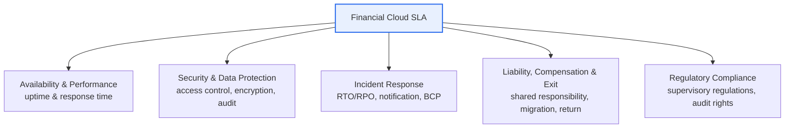
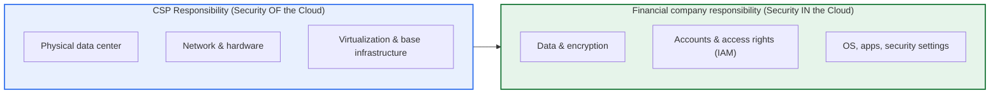

# Financial Cloud SLA (Service Level Agreement)

## 1. Overview

### A. The Concept of an SLA
> An **SLA (Service Level Agreement)** is a contract in which the service provider and the customer **agree on the level of service to be delivered (availability, performance, security, etc.) as quantitative metrics**, and codify the compensation and penalties for failing to meet targets along with the mutual responsibilities. It converts qualitative promises into measurable numbers, thereby contractually guaranteeing service quality.

The essential reason an SLA is needed is to "**promise service quality with numbers, not words**." A vague expression such as "we will provide it stably" invites disputes over who is responsible when an incident occurs. However, quantifying it—for example, "we guarantee a monthly availability of 99.9% or higher, and compensate 10% of the monthly usage fee if it falls short"—makes it clear what is normal and what constitutes a violation, and the basis for compensation is applied without dispute. In this way, an SLA is a management tool that controls service quality through **Measurability and clarity of responsibility**.

The reason SLAs are especially decisive in financial cloud is that financial data is **the most sensitive, and a service disruption immediately escalates into a major social incident**. The leakage or loss of account and transaction data, or the interruption of payment and transfer services, is not a mere inconvenience but leads directly to financial damage to customers and a collapse of trust in the entire financial system. In fact, even a few minutes of payment-settlement disruption can cause millions of transactions to fail and generate social repercussions. That is why financial cloud demands far stricter levels of availability, security, and data protection through the SLA than ordinary services, and the addition of the special requirement of **financial regulatory compliance** on top of this is the decisive difference from general IT services.

### B. Background and Necessity
In the past, the financial sector was very conservative about using the cloud due to regulatory and security concerns. However, as digital transformation and fintech competition accelerated, cloud adoption became inevitable for scalability, cost efficiency, and rapid service launch. In Korea, this began in earnest when **Article 14-2 of the Regulation on Supervision of Electronic Financial Transactions**, which took effect in January 2019, institutionally permitted cloud use for financial operations including systems that process critical information; this regulation was revised in February 2025 to streamline the usage procedures. In line with this, the Financial Security Institute published the **"Guide to the Use of Cloud Computing Services in the Financial Sector,"** presenting detailed implementation procedures and security recommendations.

Behind this institutional permission lies the **fundamental dilemma of transferring control**. When a financial company entrusts its core operations to an external CSP (Cloud Service Provider), the more its direct control over the infrastructure diminishes, the more it must secure the service level and responsibilities by contract. The SLA is precisely the mechanism that fills this control gap, becoming the **basis of trust for cloud adoption and the contractual foundation for regulatory compliance**. Adopting the cloud without an SLA is like entrusting the core of finance to something you cannot control.

## 2. Key Components of a Financial Cloud SLA

An SLA specifies the various aspects of service quality with different quantitative metrics. The diagram below shows the core areas that a financial cloud SLA addresses.

**Availability** is the first core metric an SLA addresses, expressed as the proportion of time the service operates normally (uptime, %). The allowed annual downtime changes drastically depending on the uptime target. 99.9% allows only about 8.76 hours of interruption per year, 99.99% about 52.6 minutes per year, and 99.999% ("five nines") about 5.26 minutes per year. The more a system requires zero downtime—like financial payment settlement or core banking—the higher the uptime demanded in the SLA, and this translates directly into the cost of redundancy and multi-AZ (Availability Zone) configurations.

**Performance** is specified by response time (latency) and throughput. For example, specifying it on a percentile basis, such as "95% of query transactions respond within 500ms," is more accurate in practice. Because using only the average hides a small number of delays, in environments like finance where tail latency leads to incidents, p95/p99 criteria are important. For instance, even if the average response is 200ms, if p99 is 3 seconds, then 1% of all transactions (tens of thousands under heavy traffic) effectively experience a delay tantamount to failure; therefore, taking the distribution rather than the average as the SLA metric is what guarantees substantive quality.

When setting the uptime target, the **trade-off with cost** must be considered together. To raise uptime one notch from 99.9% to 99.99%, infrastructure investment in redundancy, multi-AZ, and automatic failover surges. Therefore, rather than uniformly applying the highest tier to all systems, **tiering based on business criticality**—applying high uptime to mission-critical systems such as payment settlement and core banking, and relatively lower uptime to internal statistics and batch operations—is reasonable. This is also aligned with the business-criticality assessment required by the Regulation on Supervision of Electronic Financial Transactions.

**Incident response** quantifies the recovery objectives. **RTO (Recovery Time Objective)** is the maximum time allowed to restore the service after an incident occurs, and **RPO (Recovery Point Objective)** is the maximum data loss point (backup point) allowed at the time of the incident. For example, RTO 30 minutes / RPO 5 minutes means "recover within 30 minutes and allow the loss of at most 5 minutes' worth of data." Added to this are the incident notification deadline (e.g., notify within 30 minutes of occurrence) and the disaster recovery (DR) procedures.

**Security and data protection** is the area where the special nature of financial SLAs is concentrated. Along with control items such as access control, encryption (at rest and in transit), audit logs, and vulnerability management, it specifies the physical location of data (domestic storage) and sovereignty, and the return and destruction of data upon contract termination (Exit).

In particular, **encryption and key management** is a sharply contested area of responsibility boundaries. Encrypting data with keys managed by the CSP is convenient, but the concern remains that whoever holds the keys can read the data. That is why, in the financial sector, methods where the customer directly owns and controls the keys (BYOK, Bring Your Own Key) or integration with a Hardware Security Module (HSM) are often reflected in the SLA and design. This is a mechanism for the customer to substantively secure data sovereignty, an attempt to specify not only "is the data in the country" but also "who ultimately controls the data."

The table below organizes these key items.

| Item | Content | Representative metrics/regulation examples |
|---|---|---|
| **Availability** | Guarantee service uptime (%) | 99.9% / 99.99% |
| **Performance** | Response time & throughput | p95 response within 500ms |
| **Incident response** | Recovery objectives & notification | RTO 30 min, RPO 5 min |
| **Security** | Access control, encryption, audit | Encryption at rest/in transit, audit logs |
| **Data** | Location, sovereignty, return, destruction | Domestic storage, destruction on contract termination |
| **Liability & compensation** | Compensation on shortfall, scope of liability | 10% fee credit compensation |

## 3. Differences Between a General Cloud SLA and a Financial Cloud SLA

Whereas a general **cloud SLA guide** focuses on standardizing universal service levels such as availability, performance, and liability, a **financial cloud SLA** reflects the special nature of the financial industry—highly sensitive information and strong regulation—adding far stricter requirements. The fundamental reason for the difference lies in **regulatory risk and data sensitivity**. A general service's incident ends as damage confined to the service users, but a financial service's incident or leakage expands into sanctions by the supervisory authority, damage to trust in the financial system, and social repercussions; therefore, control at the contract level alone is insufficient, and regulatory compliance must be embedded within the SLA.

The biggest differences are: first, the requirement for **domestic data storage and network separation**. Critical financial information must be kept physically within the country, and the internet network and the business network must be separated (network separation) to block the intrusion path of external threats. Second, **compliance with supervisory regulations and the financial authority's audit and reporting rights**. A financial company must report its cloud use to the supervisory authority, and the authority must be able to demand data submission and on-site inspection from the CSP as needed, so this audit right is reflected in the SLA. Third, **outsourcing (third-party) management regulations**, which strengthen the control and scope of liability for re-outsourcing and subcontracting through the CSP.

| Category | General Cloud SLA | Financial Cloud SLA |
|---|---|---|
| **Purpose** | Standardize general service levels | Reflect financial characteristics (sensitive info & regulation) |
| **Emphasis** | Availability, performance, liability | Strengthened security, data sovereignty, supervisory compliance |
| **Regulation** | General contracts & terms | Regulation on Supervision of Electronic Financial Transactions, financial security guides |
| **Data** | Return & destruction | Domestic storage, network separation, control of critical info |
| **Supervision** | — | Financial authority reporting & audit rights, outsourcing rules |
| **Certification** | Optional | Security certification such as CSAP effectively mandatory |

In other words, a financial cloud SLA, in addition to a general SLA, strengthens **clarification of the shared responsibility model, domestic data storage and network separation, financial-security and supervisory compliance, and audit and implementation checks**. In terms of domestic implementation procedures as well, Article 14-2 of the Regulation on Supervision of Electronic Financial Transactions requires the stages of **(1) business-criticality assessment → (2) assessment of the CSP's (provider's) soundness and safety → (3) safety-securing measures and use reporting**; and with the recent revision, the Financial Security Institute can assess CSPs on behalf of financial companies so that they can utilize the results, easing the burden of use.

## 4. The Shared Responsibility Model and Practical Application

The most frequent blind spot when designing a financial cloud SLA is the ambiguity of "who is responsible for what." The concept that resolves this is the **Shared Responsibility Model**. The diagram below shows the responsibility boundary on an IaaS basis.

The key point of this model is the principle that **"the CSP is responsible for the security of the cloud itself (Security of the Cloud), and the customer is responsible for the security within the cloud (Security in the Cloud)."** The CSP guarantees the availability and security of the physical facilities, network, and virtualization layers through the SLA, but the data, accounts, and settings placed on top of it are the financial company's share. The fact that a considerable portion of actual cloud security incidents originate not from CSP infrastructure flaws but from the customer's misconfiguration of access rights (exposed storage buckets, etc.) well illustrates why this boundary must be clarified through the SLA and internal controls.

Moreover, the responsibility boundary shifts according to the service model (IaaS, PaaS, SaaS). In IaaS, the OS, middleware, and apps are all the customer's responsibility, but in PaaS the CSP handles up to the platform layer, and in SaaS the CSP operates even the application itself, so the customer's responsibility narrows to data and account management. Therefore, when reviewing an SLA, "what is the CSP's guaranteed scope and what is our responsibility" must be re-confirmed each time according to the service model being adopted, and a misperception of this boundary leads directly to a control gap.

As a concrete example, the incidents in 2021–2022 in Korea and abroad in which many services were simultaneously disrupted by a major CSP's outage in a specific region or a data center fire vividly demonstrated cloud concentration risk. Services that relied on only a single region were down for hours, whereas services with redundancy across multiple regions and multiple AZs and automatic failover minimized the impact. The financial sector's move to require in the SLA not only simple uptime figures but also region redundancy, DR drill cycles, and recovery-verification procedures is a product of such actual incident experience. This leaves the lesson that "the SLA number being high" and "having an architecture that actually keeps that number" are different things.

What is especially important in practical application is **continuity (BCP) and the Exit strategy**. Since a wide-area outage at a specific CSP while locked into it can halt the entire financial service, a multi-region/multi-cloud configuration and regular DR drills must be included in the SLA and operational plan. In addition, so that the service is not disrupted even upon contract termination or provider change, the obligation to return data in a standard format, to destroy it safely, and to support migration must be codified in the Exit clause. Compensation for SLA violations is usually made in the form of **service credits (fee reductions)**, but since this compensation amount is often small compared to the loss of an actual financial incident, one must recognize that the **redundancy and monitoring systems that prevent violations** are more essential than the compensation itself.

## 5. Considerations and Implications

1. **Security, regulatory compliance, and data control must be embedded in the SLA.** A financial cloud SLA must specify not only performance and availability but also supervisory compliance, domestic data storage and network separation, and audit rights to manage regulatory risk at the contractual level. It is desirable to incorporate regulatory compliance as an obligation in the body of the SLA, not as an attached document.

2. **Clarify the financial company's responsibility boundary in the shared responsibility model.** The boundary where the CSP is responsible for the infrastructure and the financial company for data, accounts, and settings must be codified in the SLA and internal control policies to eliminate blind spots. In particular, since misconfiguration of access rights (IAM) is a major cause of incidents, the principle of least privilege and constant inspection should be pursued in parallel.

3. **Secure continuity (BCP) and the Exit strategy as mandatory clauses.** So that the service is not disrupted even during a specific CSP's outage or upon contract termination, multi-region/multi-cloud, regular DR drills, and support for data return, destruction, and migration must be included in the SLA to mitigate vendor lock-in risk.

4. **Operate the SLA with a focus on prevention rather than compensation.** Compensation in the form of service credits does not fully make up for actual financial loss. Therefore, the effectiveness of an SLA must be approached from the view that it comes not from post-violation compensation but from the redundancy, real-time monitoring, and automatic failover systems that prevent violations in advance.

5. **Make the SLA's measurement and verification system continuous.** Whether the agreed metrics (uptime, RTO, RPO, etc.) are actually being kept must be independently measured and reported, and the SLA must be maintained as a living control tool through regular implementation checks and audits. An SLA that is not measured remains a mere declaration.

6. **Manage cost and safety simultaneously through SLA tiering based on business criticality.** By linking with the criticality assessment of the Regulation on Supervision of Electronic Financial Transactions and differentially applying high uptime and short RTO/RPO to core systems and eased levels to non-core operations, one can achieve a balance between regulatory requirements and service quality without over-investment.

7. **Expand the SLA scope in response to the spread of AI and SaaS.** As the financial sector's adoption of generative AI and fintech SaaS increases, the need to include in the SLA not only traditional infrastructure but also model availability, restrictions on data use for training, and control of re-outsourcing is growing. Governance that periodically reorganizes SLA items in line with technological change is required.

## References
- Financial Security Institute, "Guide to the Use of Cloud Computing Services in the Financial Sector." https://www.fsec.or.kr/bbs/detail?menuNo=222&bbsNo=11152
- AWS, "Financial Cloud Guide A to Z Part 1 – Regulation on Supervision of Electronic Financial Transactions." https://aws.amazon.com/ko/blogs/tech/financial-cloud-guide-a-to-z-part1/

---

> **In one line**: An SLA is a contract that quantitatively agrees on the service level, and a financial cloud SLA, in addition to a general SLA, strengthens *security, domestic data storage, network separation, supervisory compliance, and audit rights*, and clarifies the shared responsibility model, continuity (BCP), and the Exit strategy to protect sensitive financial data.
