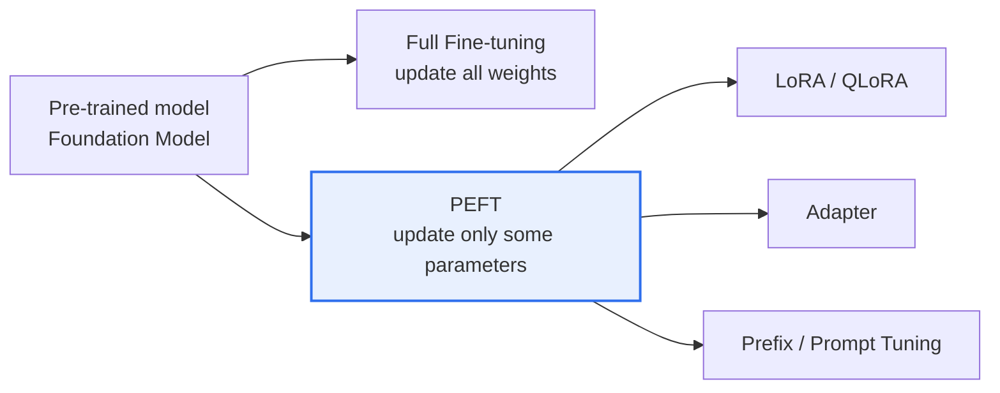
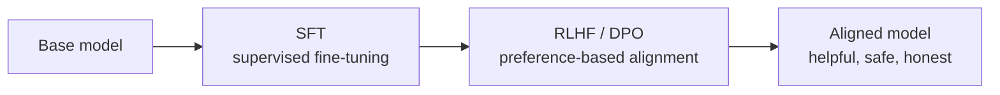

# AI Fine-tuning

## 1. Overview

### A. Definition
> A transfer learning technique that optimizes performance by taking a **Foundation Model** pre-trained on large-scale data and **additionally training it on a relatively small amount of data** tailored to a specific domain, task, or response format, thereby adjusting the model's weights.

The premise of fine-tuning is that "the pre-trained model already holds general knowledge about language and the world in its parameters." So, instead of learning from scratch, only **minute adjustments in the desired direction** are added on top of the already-learned representations. This can be likened to a person receiving specific job training after completing general education, and the key advantage is that expertise can be imparted with little data and cost.

### B. Background and Necessity
A general-purpose foundation model has broad knowledge but is not optimized for a specific domain's technical terminology, response formats, or a company's unique tone. Re-learning this from scratch (pre-training) requires thousands of GPUs and vast amounts of data, which is unrealistic for most organizations. On the other hand, prompt engineering alone makes it difficult to reliably elicit a consistent style or deep domain knowledge. Fine-tuning is the practical solution in between, obtaining domain-specialized performance and a consistent format by **adjusting only a part rather than re-training the whole**. However, as the demand to further reduce training cost grew, PEFT-family techniques emerged.

## 2. Types of Fine-tuning

The types diverge by "**how many parameters are touched**." The Full method, which updates everything, has maximum expressive power but also large cost and risk, while PEFT, which updates only a part, greatly lowers cost and risk in exchange for giving up a little expressive power. The position of this compromise is what governs the practical choice.

| Category | Content | Trade-off |
|---|---|---|
| **Full Fine-tuning** | Update all model weights — highest performance possible | High GPU/storage cost, risk of **Catastrophic Forgetting** |
| **PEFT (Parameter-Efficient Fine-Tuning)** | Train only a few parameters, freeze original weights | Low cost, low memory, preserves original knowledge vs. may not match Full for extreme performance |

**Catastrophic forgetting** is the phenomenon of forgetting what was previously known while learning a new task, and it is especially pronounced in the Full method. This is because moving all weights greatly to fit the new data overwrites the general abilities gained from pre-training. The very reason PEFT freezes the original weights and trains only a few is to structurally suppress this forgetting.

## 3. Key PEFT Techniques

The common principle of PEFT is to "**leave the huge original as is and train only a small set of added parameters**." Doing so reduces the training and storage target to around 1% of the whole, making tuning possible even on a single GPU.

| Technique | Core principle | Advantage |
|---|---|---|
| **LoRA** | Approximate the weight change $\Delta W$ as the product of two low-rank matrices, and train only those few parameters | Freezes original, tiny storage, easy to swap multiple adapters |
| **QLoRA** | Quantize the model to 4-bit to reduce memory, then apply LoRA on top | Tune large models on a single consumer GPU |
| **Adapter** | Insert small neural-network modules between transformer layers and train only those modules | Separate and reusable per-task modules |
| **Prefix/Prompt Tuning** | Optimize only learnable virtual tokens (soft prompt) prepended to the input, freeze the body | Extremely few parameters, easy task switching |

The basis on which **LoRA** holds is the observation that "the weight change needed for fine-tuning actually lies in a low rank (intrinsic dimension)." So even approximating $\Delta W$ as $B\cdot A$ (two small matrices) causes little performance loss. **QLoRA** adds 4-bit quantization on top of this, and its practical impact was large in making the tuning of large models—which previously required, say, tens of GB—possible on a single 24GB-class GPU.

## 4. Alignment Fine-tuning

Alignment is fine-tuning that goes beyond "capability" to make the model "**behave in accordance with human intent and values**." A pre-trained model is good at predicting the next token, but the tendency to follow instructions or refuse harmful answers must be trained separately. This process usually builds the backbone of instruction-following with SFT, then aligns the quality of answers to human taste with preference-based alignment.

| Stage | Content | Role |
|---|---|---|
| **SFT (supervised fine-tuning)** | Train on instruction-response pairs | Impart the basics of instruction-following ability |
| **RLHF** | Align using a reward model learned from human preferences + reinforcement learning (PPO) | Reflects even subtle preferences; complex and unstable |
| **DPO** | Optimize directly from preference pairs without a reward model or reinforcement learning | Simpler and more stable than RLHF, easy to implement |

RLHF is powerful, but the two stages of reward-model training and PPO reinforcement learning are unstable and resource-intensive. **DPO** removes this complexity by directly optimizing the policy from preference pairs (better answer / worse answer), which is its background and the reason it is preferred in recent practice.

## 5. Comparison with RAG

Fine-tuning and RAG are not substitutes but have **different roles**. Fine-tuning internalizes knowledge and ability into the weights, so it is strong for teaching format, tone, and specific abilities, but when knowledge changes it must be re-trained. RAG injects facts and up-to-date information from the outside, so updating is fast and it can present sources.

| Category | Fine-tuning | RAG |
|---|---|---|
| **Knowledge injection** | Internalized into weights (learning) | Combined into the prompt via external retrieval at inference |
| **Currency** | Requires re-training (slow, costly) | Update only the knowledge base (fast) |
| **Suitable for** | Internalizing format, tone, expert ability | Up-to-date, evidence-based factual responses, presenting sources |
| **Cost** | Training cost, data construction | Retrieval infrastructure |

> That is why in practice the two are often used together as **"ability by fine-tuning, knowledge by RAG."** For example, an internal support chatbot fixes its tone and response format through fine-tuning, and injects frequently changing product and policy information via RAG.

## 6. Considerations and Implications
- **Data quality and quantity govern performance**: Training on little or low-quality data leads to overfitting or even worse performance. Even at a scale of a few thousand records, refinement and diversity matter.
- **Preventing catastrophic forgetting**: Suppress damage to general abilities with PEFT, a low learning rate, regularization, and mixing existing data (rehearsal).
- **Compliance and security**: If personal or copyrighted data is used for training, that information may remain in the model and leak, so the data's source, license, and de-identification must be reviewed in advance.
- **On-premises, cost-efficient strategy**: Combining PEFT with a small specialized model (sLLM) allows domain-specialized AI to be operated at low cost on one's own infrastructure, suitable for organizations where data sovereignty matters.

---

> **In one line**: Fine-tuning is a transfer learning technique that adjusts weights by *additionally training a pre-trained model on a small amount of task data*, achieving **low cost and low forgetting with PEFT (LoRA, QLoRA)**, **aligning to human preferences with SFT and RLHF/DPO**, and complementing up-to-date knowledge by using RAG in parallel ("ability by fine-tuning, knowledge by RAG").
