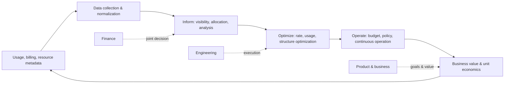
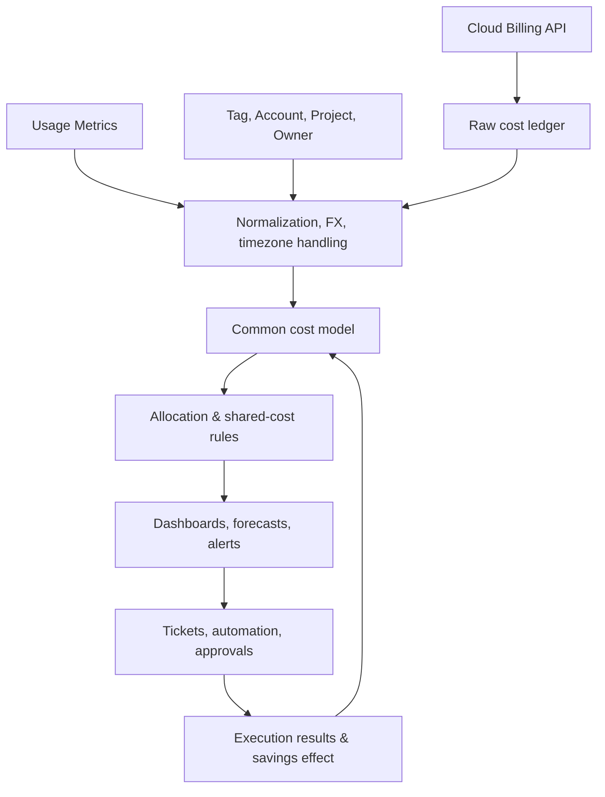

# FinOps (Cloud Cost & Value Optimization)

## 1. Overview

> **Definition**: FinOps is an operational framework and cultural practice that maximizes the business value of cloud and technology spending and creates financial accountability through timely, data-driven decision-making and collaboration among engineering, finance, and business teams.

The cloud provides a variable-cost model in which cost changes according to usage.
This model reduces large upfront capital investment and enables elastic scaling that matches demand.
On the other hand, because resources are created instantly via APIs and shared by many teams, it is difficult to control actual usage and cost with a traditional annual budget alone.
Developers prioritize performance and speed to market, the finance department values budgets and accounting, and executives look at the product's revenue and customer value.
FinOps does not forcibly unify these differing viewpoints into the single goal of cost reduction.
Instead, it connects each team so that they make responsible choices based on the same cost/usage data and business metrics.

Therefore, FinOps is not merely a bill-analysis tool or a cloud-purchase negotiation technique.
It is a management system that extends through budgeting, cost allocation, anomaly detection, reservation/commitment discounts, resource optimization, unit economics, and sustainability.
Reducing cost unconditionally can cause performance degradation, availability degradation, and development delays.
The core question of FinOps is closer to "what value did we get from the spending, and how much did we lower the uncertainty of the next decision" than "how much did we cut."

The 2025 FinOps Foundation Framework describes an expanded scope and the concept of Scopes that address technology spending—not only public cloud but also SaaS, data centers, and licenses.
Therefore, even an organization that has finished its cloud migration can apply FinOps.
In particular, because generative AI's GPU, inference calls, storage/transfer, and vector-search costs move together with quality and latency, combining FinOps with model operations is important.

## 2. Necessity and Core Principles

### 2.1 Background of Adoption

First, cloud cost is incurred at the same speed as the organization's decision-making.
When development and data teams create experimental environments, cost can accumulate before the month-end close.
Second, cost spanning shared accounts and multiple regions is hard to assign improvement responsibility for unless it is broken down by service, product, environment, and owner.
Third, if missing tags and inconsistent account structures recur, the reliability of cost reports drops.
Fourth, reserved instances or commitment discounts are valid when long-term usage is certain, but if purchased incorrectly they become a new waste called unused commitments.

FinOps sees this problem as a combined problem of people, process, and platform.
On the organizational side, engineering, finance, and product personnel must use a common vocabulary.
On the process side, cycles of budgeting, forecasting, optimization, and exception approval must be operated.
On the platform side, billing data, metadata, resource measurements, and service performance indicators must be connected.
If only one of these is adopted, a dashboard appears but no behavior change occurs.

### 2.2 Core Principles

| Principle | Meaning | Practical application |
|---|---|---|
| Teams collaborate | Joint decision-making between finance and technology | Monthly cost reviews, joint product/platform meetings |
| Everyone takes ownership of their usage | Cost is not managed by the central organization alone | Assign budgets and unit metrics per service owner |
| Decisions are made based on business value | Evaluate cost and performance together | Analyze cost per order, cost per active user |
| Data should be accessible and accurate in a timely manner | Late or incomplete data blocks action | Quality management of the cost ledger, tags, allocation rules |
| Enable FinOps centrally | Standards and tools are provided centrally | Provide a platform for policy, dashboards, training, automation |
| Take advantage of the variable cost model | Adjust resources to match demand | Review elastic scaling, serverless, spot usage |

These principles differ from a central approval system that controls cost.
If the central organization takes over all resource-creation authority, waste may decrease, but deployment speed and experimentation speed may drop.
Conversely, giving each team complete autonomy fragments cost, security, and compliance.
The balance point of FinOps is a structure where the center provides guardrails and data, and the front-line teams choose quickly but are accountable for the results.

## 3. FinOps Operating Structure and Lifecycle

### 3.1 Overall Structure Diagram

The Inform phase of FinOps is the phase that explains what was incurred, where, and how much.
It does not end at simply showing the cloud provider's billing details but classifies cost by account, project, service, environment, team, and product.
Unallocated cost consists of items that are hard to attribute directly, like shared platform cost or shared data transfer.
Forcibly allocating this to a specific team makes the numbers look complete but loses trust.
Distinguishing direct cost, shared cost, and unallocated cost and disclosing the allocation rules and exceptions is more advantageous for management.

The Optimize phase is the phase of choosing methods to lower cost.
Rate optimization is the approach of lowering the unit price, such as reservations, commitments, and volume discounts.
Usage optimization is the approach of reducing consumption, such as terminating idle resources, right-sizing, storage lifecycles, and query efficiency.
Structure optimization is the approach of improving the relationship between cost and quality by changing the architecture.
The three approaches do not substitute for one another, and rate discounts alone cannot solve an over-provisioning problem.

The Operate phase creates a management loop rather than a one-off campaign.
It monitors the gap between budget and forecast, responds to policy violations or anomalies, and verifies the effect of optimization tasks.
The operating cycle can be separated into daily, weekly, and monthly units.
The daily unit is suited to detecting outages and spikes, the weekly unit to reviewing execution tasks, and the monthly unit to connecting product value with the budget.

### 3.2 Roles and Responsibilities

The FinOps Practitioner is responsible for the common data model, operating processes, training, and coordination roles.
Finance provides the financial standards for budgets, accounting, forecasts, and commitments.
Engineering executes the technical choices of resource configuration, performance, stability, and automation.
The product/business organization defines performance indicators such as customer value, revenue, and activity.
The procurement, legal, and security organizations review contracts, licenses, regulations, and data-location conditions.

| Role | Main question | Core deliverable |
|---|---|---|
| Executives | Does technology spending support strategic goals? | Investment priorities, acceptable cost/risk |
| Finance | How do actual/forecast costs differ from budget? | Budget, outlook, accounting standards |
| Engineering | Can we deliver the same quality with fewer resources? | Optimization backlog, architecture improvement |
| Product & business | How to connect cost to customer outcomes? | Unit economics, product KPIs |
| FinOps practitioner | How to maintain the data and execution system? | Cost model, policy, reports |
| Security & compliance | Does saving undermine controls/regulation? | Exception criteria, audit trail |

When assigning responsibility, defining it only as "cloud cost is central IT's cost" does not change front-line behavior.
Show service owners both the cost and performance within their controllable scope, and separately display uncontrollable shared cost.
For example, the data-platform team can control storage and processing cost, but cannot fully control the data-growth volume of a specific business unit itself.
This distinction is necessary for KPIs to be fair and for the acceptance of optimization recommendations to rise.

## 4. Data, Process, and Tool Design

### 4.1 Cost Data Pipeline

For cost data, collecting only the amounts is not enough.
Dimensions such as billing period, service, region, account, resource identifier, usage, unit price, discount, tax, currency, and tags are needed.
Because the names and units of measure differ by provider, a common vocabulary is created in the normalization layer.
For example, compute time, request count, storage capacity, and data transfer volume must be preserved along with each service's original units to enable reproducible analysis.
Preserve the source data without modification, and record the version and execution time at the transformation and allocation stages.

Tags are convenient but not the only means of control.
Tags may be missing on auto-generated resources, users can change values arbitrarily, and the scope of application differs by provider service.
Therefore, use the account/project hierarchy, organizational directory, IaC variables, and service catalog together with tags.
Block resources lacking required metadata at the creation stage or send them to an isolation account, and put an expiration date on exceptions.

### 4.2 Allocation and Showback/Chargeback

Showback is the method of showing cost information to teams but not actually billing them internally.
Chargeback is the method of attributing cost to an organization's or product's cost center by agreed rules.
In the early stage of adoption, starting with showback to raise data trust and then, once the allocation rules and dispute process stabilize, expanding to chargeback is the safe approach.
A dedicated database that can be attributed directly can be allocated to the team that actually uses it.
For a Kubernetes cluster used by multiple teams, cost drivers such as CPU/memory request volume, actual usage, namespace, and request count must be chosen.

| Cost type | Allocation example | Caution |
|---|---|---|
| Direct cost | Attribute a product-dedicated DB to the product cost | Verify resource ownership and lifecycle |
| Shared platform | Split by usage, reservation volume, number of teams | Disclose and review cost drivers |
| Common cost | Maintain as organization-wide common cost | Transparent unallocated display over forced allocation |
| Unallocated cost | Missing tags, classification failure | Manage as an improvement target but do not manipulate numbers |

### 4.3 Budget and Forecast

The budget sets goals and limits, and the forecast estimates future spending with current information.
Cloud forecasting reflects not only fixed monthly cost but also number of users, request volume, data growth rate, region, FX, discount expiry, and new projects.
Simply multiplying the previous month's cost by a single growth rate can miss seasonality or large-scale commitment purchases.
Define usage drivers per product and manage optimistic, baseline, and pessimistic scenarios together.

A budget-overrun alert is a control mechanism, not the same as an automatic block.
Batch training or development environments can be candidates for automatic shutdown, but core operations such as medical or financial transactions cannot be stopped immediately due to availability and regulatory conditions.
The alert's severity, approvers, response time, and exception expiry must be set by policy.

## 5. Optimization Techniques and the Balance of Cost and Quality

### 5.1 Rate Optimization

Reservation-type discounts or commitments can lower the unit price of workloads with continuous usage.
However, buying a long-term commitment first for a new service with uncertain demand removes flexibility.
Before purchase, review baseline usage, growth trend, expiry timing, transfer/exchange conditions, and cross-organization sharing possibility.
Spot/preemptible resources are suited to batch processing that can withstand interruption, and must be able to externalize session state and retry.

### 5.2 Usage Optimization

Right-sizing is performed by looking at CPU, memory, IOPS, network utilization, and latency together.
Because shrinking based only on average utilization can raise the error rate at peak times, use percentiles and service-level objectives.
Identify idle disks, unattached IPs, old snapshots, and duplicate logs, and verify retention policies and recovery requirements.
Storage is tiered based on access frequency and recovery-time objective, and is not moved en masse to a tier with long recovery time just because it is cheap.

### 5.3 Architecture Optimization

Serverless can be effective for event processing with long idle time but can cause cost to surge sharply when call volume spikes.
Caching reduces database load and latency but creates cache inconsistency and memory cost.
Multi-region improves resilience and latency but increases replication, transfer, and operational cost.
Therefore, architecture choices are judged not by comparing the monthly bill alone but by total value including outage cost, development productivity, security controls, and data sovereignty.

## 6. Metrics and Unit Economics

Total cost is a necessary starting point for management but insufficient to explain performance.
Dividing service cost by business units such as number of orders, API calls, active users, training samples, and generated tokens allows growth and cost efficiency to be observed together.
Even if unit cost falls, if customer satisfaction or processing quality worsens, it cannot be regarded as a success.
Conversely, even if unit cost temporarily rises, if revenue, quality, and stability improve more, it can be a rational investment.

| Metric | Calculation example | Interpretation |
|---|---|---|
| Total technology spend | Sum of cloud, SaaS, licenses | Grasp scale and trend |
| Service cost of goods | Direct cost related to the service + agreed shared cost | Product profit/loss analysis |
| Unit cost | Service cost / business unit | Efficiency and scale effect |
| Forecast error | Actual cost − forecast cost | Planning quality and uncertainty |
| Commitment utilization | Committed volume used / committed volume purchased | Purchase-decision quality |
| Optimization realization rate | Actual applied savings / approved task amount | Measure of execution |
| Cost anomaly detection rate | Detected anomaly events / total anomaly events | Effectiveness of the detection system |
| Carbon intensity | Emissions per unit of technology activity | Sustainability linkage |

For example, if an e-commerce service processes 10 million orders per month and technology cost is 200 million won, the cost per order is 20 won.
If cost rose to 220 million won but orders increased to 15 million, the cost per order falls to about 14.7 won.
However, before declaring success based only on cost per order, one must also check the return rate, failure rate, and payment success rate.
In this way, FinOps requires unit-economics analysis that connects accounting amounts with operational and business metrics.

## 7. Comparison and Cases

### 7.1 FinOps vs. Traditional IT Cost Management

Traditional IT cost management centers on annual budgets, asset purchases, and cost-center closes.
This has strengths in environments where controlling fixed assets and long-term contracts is important.
FinOps presupposes variable usage, rapid deployment, and technical choices by service owners, so it demands a shorter feedback cycle.
The two systems are not in competition but in a relationship that connects the control of accounting/procurement with the agility of technology operations.

| Category | Traditional IT cost management | FinOps |
|---|---|---|
| Cost form | Fixed, asset-centric | Variable, usage-centric |
| Cycle | Annual, month-end centric | Real-time, daily/weekly/monthly combined |
| Responsible party | Central IT and finance | Technology, finance, product jointly |
| Optimization criterion | Budget compliance | Business value relative to cost |
| Control method | Pre-approval centric | Guardrails and after-the-fact accountability |

### 7.2 Case: AI Inference Service

Assume a customer-consultation summarization service uses a large-language-model API.
Looking only at the token cost per call, changing to a shorter prompt looks like optimization.
But if the prompt is excessively abbreviated, summary quality drops, which can increase consultation reprocessing and agent review.
From the FinOps perspective, tokens per request, success response rate, retry rate, latency, and consultation completion rate are connected on one dashboard.

For operations with constant traffic, review batch processing and caching; for operations with high real-time demands, compare the routing policy between a small model and a large model.
Before and after a model change, fix a quality evaluation set, and set not only the savings amount but also the below-quality-threshold rate as an approval condition.
When operating GPUs directly, measure GPU utilization, memory-load ratio, inference volume per model, idle time, and power consumption together.
This case shows that AI cost management is not simple infrastructure reduction but joint design of model, data, and product policy.

### 7.3 Case: Kubernetes Shared Cluster

When multiple product teams use one cluster, it is hard to divide node cost accurately by namespace.
Allocating based on CPU/memory request volume can reflect the responsibility for reserved resources.
Allocating based on actual usage favors efficient teams but may underestimate the cost responsibility of a team that prepared for peaks.
Therefore, a compromise is possible: set the default allocation by request volume, a separate metric by actual usage and idle rate, and maintain shared control-plane cost as common cost.

## 8. Deep Dive: The 2025 Framework and the Cloud+ Perspective

The FinOps Foundation's 2025 Framework expands FinOps from a cost tool for a specific cloud provider into a technology-value-management practice.
The Framework's Scope means the segment of technology spending to which FinOps is applied, allowing spending other than public cloud to be handled in the same decision-making system.
This change means it can be applied to areas like SaaS, PaaS, data centers, licenses, and AI—which differ in billing form but require managing the relationship between usage and value.
However, it does not mean integrating all cost with the same allocation method.
Because each Scope's usage definition, contract terms, cost visibility, and optimization levers differ, common principles and area-specific execution models must be separated.

Utilizing a common billing-data schema such as FOCUS helps reduce the difference in billing formats across providers.
But adopting a standard schema does not automatically guarantee data quality.
Organization-specific information such as resource owners, product tiers, FX, discount allocation, and tax handling requires separate integration.
In practice, source billing data, standardized data, and management allocation data are all preserved so they remain traceable.

## 9. Considerations and Implications

### 9.1 Balancing Savings and Service Level

Always attach an impact assessment of performance, availability, and recovery time to cost-optimization tasks.
Stage automatic-shutdown or downsizing policies based on business criticality and operating hours.
Excluding the revenue loss and recovery cost from outages when calculating savings leads to a wrong decision.

### 9.2 Data Quality and Accountability

Manage the cost data's accuracy, completeness, timeliness, and lineage as quality metrics.
Check not only the tag-application rate but also the owner-identification rate of cost and the allocation dispute rate.
When a report number is modified, one must be able to explain which source data and rules produced it in order to use it for audits and management decisions.

### 9.3 Automation and Exception Management

Expressing policy as code allows automating tag checks at resource creation, off-hours shutdown, and anomalous-cost alerts.
However, since automation can amplify a wrong classification, put approval, simulation, and rollback on high-impact actions.
Exceptions are managed as tickets with a reason, owner, expiry date, and re-review condition—not as permanent exemptions.

### 9.4 Organizational Culture and Evaluation System

Evaluating a development team only by savings amount creates distortions like lowering performance or moving cost to another account.
Cost must be evaluated together with product KPIs, service level, security, and sustainability.
Even a failed optimization experiment contributes to maturity improvement if it leaves learning results and recurrence-prevention measures.

### 9.5 Expansion to AI and Data Centers

For AI workloads, model quality, tokens, GPU time, data transfer, and power/cooling must be viewed together.
Because data-center cost, unlike public cloud, mixes fixed costs of depreciation, power, floor space, and personnel, a per-Scope cost model is designed separately.
An engineer should not simplify different cost structures into a single number but present a cost perspective and unit economics suited to the decision's purpose.

### 9.6 Adoption Roadmap

In stage 1, define the management goals, cost owners, core Scopes, and the scope of data collection.
In stage 2, organize accounts, projects, tags, and the service catalog and build a showback dashboard.
In stage 3, operate budgets, forecasts, anomalies, and the optimization backlog and verify the realized effect.
In stage 4, expand to unit economics, the commitment portfolio, sustainability, and AI cost.
The completion condition of each stage should be defined not as tool installation but as the establishment of data trust, responsible parties, and repeatable decision-making.

## References

- FinOps Foundation, "FinOps Framework Overview": https://www.finops.org/framework/
- FinOps Foundation, "Framework 2025 reflects the addition of Scopes": https://www.finops.org/insights/2025-finops-framework/
- FinOps Foundation, "FinOps Framework 2025 PDF": https://www.finops.org/wp-content/uploads/2025/05/English-FinOps-Framework-2025.pdf

---

> **In one line**: FinOps is not an activity of simply cutting cloud cost but an operating system that continuously makes decisions by connecting technology usage, cost, quality, and business value.
