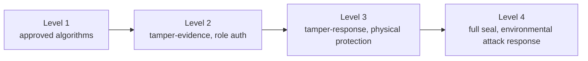

# FIPS 140-2 (Security Requirements for Cryptographic Modules)

## 1. Overview

### A. Definition
> A federal standard for the **security requirements of a Cryptographic Module** established by the U.S. NIST. It specifies, in four levels (Level 1–4), the security requirements that hardware, software, and firmware modules performing cryptographic functions must satisfy, and has them verified by a third party through the **CMVP (Cryptographic Module Validation Program)**.

### B. Background and Necessity
No matter how strong a cryptographic algorithm (AES, RSA) is used, if the **module itself that holds the algorithm and generates, stores, and uses the keys is flawed**, the keys can be physically stolen or leak through side channels, collapsing the entire security. That is, the actual point of failure of security lies not in the mathematical strength of the algorithm but in the **implementation and operational boundary**. FIPS 140-2 emerged to verify, by a standardized criterion, not only "is the algorithm secure" but also "is the box that holds that algorithm secure." The U.S. federal government and financial institutions require this validation for procurement, and because unvalidated products are effectively barred from market entry, it operates as a de facto global trust standard.

## 2. Security Level Classification (Level 1–4)

The four levels progressively raise the defense strength against physical threats, with requirements accumulating as the threat model grows stronger. **Level 1** requires only the use of approved algorithms and has no physical protection, so a general-purpose PC's software cryptographic library falls here. **Level 2** requires **tamper-evidence** devices such as seal stickers and cases that leave traces of physical intrusion, along with role-based authentication, so that tampering can be recognized after the fact. **Level 3** requires not only leaving traces but also active **tamper-response**—immediately deleting keys (zeroization) when intrusion is detected—along with strong physical protection and identity-based authentication. **Level 4** is the highest grade that completely seals the module and **detects and responds even to environmental tampering attacks** such as voltage and temperature, targeting high-risk equipment placed in physically exposed environments.

| Level | Core requirement | Representative application |
|---|---|---|
| **Level 1** | Use of approved algorithms (no physical protection) | SW cryptographic library |
| **Level 2** | Tamper-evidence, role-based authentication | Commercial security equipment |
| **Level 3** | Tamper-response (key zeroization), physical protection, ID authentication | HSM, financial terminals |
| **Level 4** | Full seal, environmental (voltage, temperature) attack response | High-risk physically exposed equipment |

## 3. Considerations When Designing a Cryptographic System

What FIPS 140-2 actually validates is not a single algorithm but the **entire key lifecycle and the module's self-defense capability**. First, only **approved algorithms** must be used, chosen from a list validated by NIST such as AES, SHA-2, RSA, and ECDSA. Second, **key management** must protect the entire cycle of generation, distribution, storage, use, and disposal, and especially must minimize the moment a key is exposed in plaintext. Third, **random number generation (RNG)** requires an approved DRBG and a sufficient entropy source, because unpredictability governs cryptographic strength. Fourth, the module performs a **self-test** that checks its own integrity and the correctness of the algorithm at power-on and under certain conditions, to prevent it from operating in a damaged state.

| Consideration | Content | Reason |
|---|---|---|
| **Approved algorithms** | Validated list such as AES, SHA-2, RSA | Exclude unvalidated algorithms |
| **Key management** | Protect the whole cycle from generation to disposal | Key exposure is the final point of failure |
| **RNG** | Approved DRBG, sufficient entropy | Keys can be inferred if predictable |
| **Self-test** | Power-on and conditional self-test | Block operation in a damaged state |

## 4. Security Elements and Threat-Response Strategy

The threats the module must defend against span beyond logical attacks into the **physical and side-channel domains**. Against physical attacks, it provides tamper-evidence and response through sealing and zeroization; against **side-channel attacks** that reverse-engineer keys from minute changes in power and timing, it responds with constant-time operations or **masking** that adds random noise. To prevent key exposure itself, an **HSM** that handles keys only inside the hardware is combined with access control. These elements become substantive defense not individually but when layered.

| Category | Threat | Response |
|---|---|---|
| **Physical attack** | Opening, tampering | Sealing, tamper-evidence, zeroization |
| **Side-channel attack** | Power/timing analysis | Constant-time operations, masking |
| **Key exposure** | Memory/storage theft | HSM, access control, zeroization |
| **Environmental attack** | Voltage/temperature manipulation | Environmental sensors, cutoff (Level 4) |

## 5. Considerations and Implications
- **Transition to FIPS 140-3**: The successor standard **FIPS 140-3** is based on the international standard **ISO/IEC 19790**, and requirements such as side-channel response have been strengthened. Since new validations are done under 140-3, it should be used as the basis for procurement and design.
- **Domestic response (KCMVP)**: Korean public institutions respond with the National Intelligence Service's **KCMVP (Korea Cryptographic Module Validation Program)**, which includes validation of domestic algorithms such as ARIA and SEED.
- **Preparing for Post-Quantum Cryptography (PQC)**: As RSA and ECC become vulnerable to quantum computing, migration to the PQC algorithms whose NIST standardization is complete, and crypto-agility (flexibility to replace algorithms) design, is the next task.

---

> **In one line**: FIPS 140-2 is a *federal standard for the security requirements of cryptographic modules*, which divides modules into Level 1–4 according to physical-protection and authentication strength, validates them via the CMVP, and requires approved algorithms, key management, RNG, self-tests, and physical/side-channel responses as design requirements, evolving into FIPS 140-3 and PQC.
