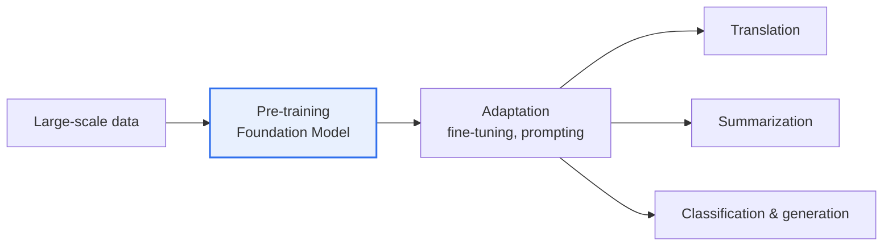

# Foundation Model

## 1. Overview

### A. Definition
> A **general-purpose large-scale AI model** that is **pre-trained** on vast amounts of data and can be adapted to and utilized for a variety of downstream tasks. GPT, BERT, and CLIP are representative examples, and it is reused for many applications through fine-tuning or prompting.

The paradigm shift the foundation model brought is the move '**from building a new model for each task to adapting a single general-purpose model to many tasks**.' In the past, a translator, a sentiment analyzer, and a chatbot each had to be trained separately from scratch. A foundation model first acquires general representations of language and images (broad knowledge and patterns about the world) through large-scale pre-training, then performs a variety of tasks such as translation, summarization, and classification with only a small amount of data or a prompt. Many applications are placed on top of a single 'Foundation.' This dramatically lowers the barrier to entry for AI development and maximizes reusability, changing the very structure of the AI industry.

### B. Background
The confirmation of the 'Scaling Law'—that scaling up data, computation, and model size predictably improves performance—combined with the Transformer architecture and large-scale GPU infrastructure, made ultra-large-scale pre-training possible, which is the technical background for the rise of foundation models.

## 2. Characteristics

The characteristics of a foundation model are interconnected. **Generality** is using one model for many tasks, and this comes from **large scale** of parameters and data. When the scale exceeds a certain threshold, **emergence**—abilities not trained for suddenly appearing—is observed, and it can be **adapted** to a specific domain via fine-tuning, prompting, and RAG. Recently it is expanding into **multimodal**, handling text, images, and audio together.

| Characteristic | Content |
|---|---|
| **Generality** | Utilize one model for various tasks |
| **Large scale** | Pre-trained on vast parameters and data |
| **Emergence** | Unexpected abilities appear as scale grows |
| **Adaptability** | Domain specialization via fine-tuning, prompting, RAG |
| **Multimodal** | Integrated processing of text, images, audio |

## 3. Underlying Technologies

A foundation model is an aggregation of several technologies. **Transformer Self-Attention** is the core architecture for learning long-range dependencies in context; **self-supervised learning** enables pre-training on vast raw data without labels; **distributed training and multi-GPU** (HBM, InfiniBand) support the training of ultra-large-scale models; **alignment (RLHF, DPO)** matches the model's output to human preferences; and **RAG and fine-tuning** inject up-to-date and domain knowledge.

| Technology | Role |
|---|---|
| **Transformer & Self-Attention** | Learn long-range context |
| **Self-supervised learning** | Large-scale pre-training without labels |
| **Distributed training & multi-GPU** | Train ultra-large-scale models |
| **Alignment (RLHF, DPO)** | Fine-tuning that reflects human preferences |
| **RAG & fine-tuning** | Inject up-to-date and domain knowledge |

## 4. Considerations in Implementation (Legal, Environmental, Social)

The more powerful a foundation model is, the more it carries responsibility on three layers. **Legally**, the copyright and licensing of training data, personal information, liability for results, and AI regulatory compliance become issues. **Environmentally**, since training an ultra-large-scale model consumes enormous power and carbon, Green AI and efficiency are required. **Socially**, bias and discrimination, misinformation and deepfakes, changes in jobs, misuse, and the monopoly of a few Big Tech firms along with fair accessibility are raised.

| Aspect | Consideration |
|---|---|
| **Legal** | Training-data copyright/license, personal info, liability, regulation |
| **Environmental** | Power/carbon emissions of training, Green AI, lightweighting |
| **Social** | Bias/discrimination, misinformation/deepfakes, jobs/monopoly/accessibility |

## 5. Considerations and Implications

1. **The spread of the application ecosystem** is the core trend. On top of foundation models, countless applications are created via fine-tuning, prompting, and agents, becoming the central axis of AI utilization.
2. **Reliability, safety, and cost are the tasks.** Reliability that reduces hallucination and bias, safety through alignment, and efficiency that lowers cost via lightweight models (sLLM) and quantization are the keys to practical use.
3. **Embedding legal, environmental, and social risks at the design stage** is needed. The more powerful a general-purpose technology is, the greater its side effects, so responsible-AI principles must be integrated from the early stage of development.

---

> **In one line**: A foundation model is a *large-scale pre-trained general-purpose AI* that adapts to various tasks via fine-tuning and prompting, is based on Transformer, self-supervised learning, and alignment, and must integrate and manage legal, environmental, and social risks—such as training-data copyright, power, and bias—from the design stage.
