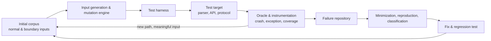
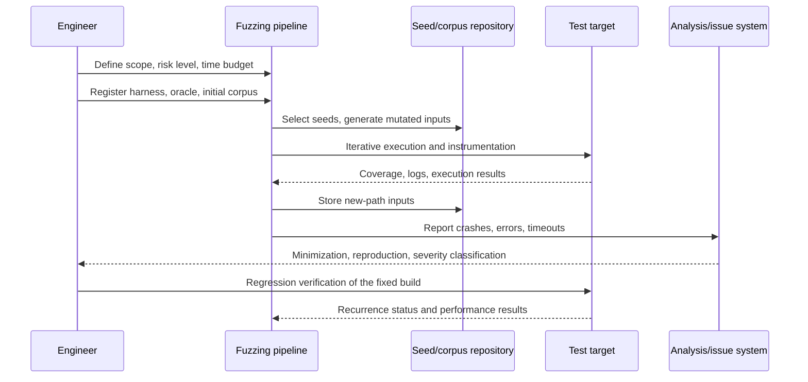

# Fuzz Testing and Vulnerability Detection Strategy

## 1. Overview

> **Fuzz Testing (Fuzzing)** is a dynamic testing technique that injects not only normal inputs but also random, mutated, boundary, and abnormal inputs into a program in large quantities, and automatically observes anomalous signs such as crashes, exceptions, memory errors, consistency violations, and performance degradation to find defects.

Software does not process only the inputs the developer anticipated. Data coming from the outside—network packets, image/document files, compressed data, API requests, protocol messages—may contain malformed formats, excessive lengths, or mutually contradictory values. Manual testing is strong at verifying representative normal scenarios, but it is difficult for a person to directly construct every combination for parsers and communication modules whose input space is very large.

Fuzzing automatically explores this wide input space. Rather than simply generating random numbers, it uses the target's input format and execution results to select the next input to try. A good fuzzer keeps stimulating branches or states the program has not yet passed through, and preserves the minimal input that reproduces an anomaly, turning it into a defect the developer can fix.

The direct targets of fuzzing are code that interprets external input, such as file parsers, protocol stacks, compilers, interpreters, authentication modules, serialization libraries, and smart contracts. But the targets are not limited to these. The amount/currency/date combinations of a financial-transaction API, the command messages of an IoT device, and the schema of a data-transformation pipeline can also be targets of fuzzing.

Fuzzing's purpose is not to execute many test cases in itself. Explored code coverage, unique defects found, reproducibility, and whether regression is prevented after a fix determine the outcome. Therefore, it must clearly define the target's boundary, design the input-generation strategy and the oracle to observe, and include the operational procedures for classifying, reproducing, and fixing failures.

### A. Background and Necessity

First, the input boundary has expanded outside the system. Web APIs and mobile apps receive data from various clients, and microservices exchange messages between services over the network. Even if one service sends an unexpected value, the receiving service must safely reject it, so the robustness of the contract boundary needs to be automatically verified.

Second, security vulnerabilities often occur not on the normal flow but on exceptional paths. Integer overflow in length calculation, faulty decompression, infinite recursion in nested structures, and bypass of authentication-state transitions are easy to miss with ordinary functional testing alone. Fuzzing repeatedly stimulates these boundary conditions, creating a point of contact between security testing and quality testing.

Third, development and deployment cycles have become shorter. If many inputs are made manually per release, testing becomes a bottleneck, but fuzzing work can be automated in CI for a fixed time or a fixed number of executions. However, if only brute-force execution is put into the pipeline, failure classification and environment reproduction become difficult, so quality gates and resource limits must be defined together.

## 2. Components and Operating Principle of Fuzz Testing

A fuzzing system is not made up of the fuzzer alone. The test harness, the input corpus, the mutation/generation engine, the instrumentation, the oracle, and the results repository work together. If any one is poor, the number of executions increases but the defect-finding power does not.

### A. Test Harness

The harness is a thin adapter that connects the byte sequences or structured values generated by the fuzzer to the target's call format. For example, when fuzzing an image decoder, it reads the input bytes into a memory buffer and calls the decoder's public function; when fuzzing an API, it delivers the generated request through the authentication, routing, and validation stages.

The harness should be small and deterministic. Booting up the entire actual operational server each time makes the cost of a single execution large and makes results vary with external system state. Where possible, virtualize file storage, time, random numbers, and the network, and quickly call the target's core parsing and validation logic within the process.

If the harness rejects input too early, the fuzzer cannot reach deep code. Conversely, removing all validation ends up testing behavior different from the operational path. Therefore, a balance is needed that maintains the input's format boundary but replaces external dependencies with fake objects or fixed fixtures to reach deep states.

A good harness makes a single input express a single clear test. When bundling multiple tests in one process, global state and caches must be initialized, and it must be confirmed that the result of a previous input does not affect the next input. If state remains, the result of the same input changes, and defect reproduction becomes difficult.

### B. Input Corpus and Seeds

The corpus is the set of inputs used when fuzzing starts. A short file that parses normally, an API request with each field filled, a packet of minimum/maximum length, and a failure input found in the past can all be seeds. The quality of the seeds affects how quickly the fuzzer reaches a valid internal state.

For a corpus, diversity matters more than quantity. If there are many nearly identical inputs, storage space and execution time are wasted. Reduce duplicates based on coverage or structural features, and keep inputs representing different versions, encodings, nesting depths, and optional fields.

When using inputs collected from operations as seeds, personal information, authentication tokens, and customer identifiers must be removed. Putting raw logs directly into the corpus makes the test repository a new storage place for personal information. Include de-identification, access rights, retention period, and a destruction procedure on leakage in the corpus-management rules.

### C. Mutation and Generation

Mutation-based fuzzing changes part of an already-valid input. Operations such as bit flipping, byte insertion/deletion, boundary-value substitution, token reordering, and length-field tampering stimulate exceptional paths while maintaining the existing structure to some degree. It has the advantage that even a fuzzer that does not know the grammar of a file format or protocol can apply it quickly.

Generation-based fuzzing creates inputs from scratch using a grammar or schema. Using a JSON schema, ASN.1, SQL grammar, or protocol state definition can create many valid combinations. The implementation cost is high, but it can handle nested structures and state transitions precisely and easily reflects the semantics of a specific domain.

In practice, the two methods are combined. Create a valid base message with a grammar, then apply boundary-value, abnormal-token, and order-violation mutations to the result. For example, create a request with an order API's schema, then change the quantity to 0, a negative number, or the maximum integer, and misalign the combination of currency and amount.

### D. Oracle and Anomalous Signs

The oracle is the criterion for judging whether an input revealed a defect. The simplest oracle detects process crashes, abnormal termination, timeouts, and memory-access errors. Combining a dynamic-analysis tool that inspects address, memory, and undefined behavior can catch as errors even executions that outwardly succeeded.

Functional oracles are also important. Even if the program did not crash, it is a defect if the parsing result differs among grammatically identical inputs, the sum of amounts is not preserved, or an unauthorized state transition is allowed. Expressing such invariants as code can find security and business-rule violations.

The sensitivity and specificity of the oracle must be managed together. Too sensitive, and normal warnings pile up as thousands of failures; too insensitive, and actual defects are treated as successes. Record the failure type, stack trace, input hash, execution environment, and target version to group duplicates of the same cause.

### E. Coverage-Guided Exploration

Coverage-guided fuzzing uses the newly visited paths, basic blocks, and branch information after executing an input to set the priority of the next input. Inputs that opened a new area are preserved in the corpus, and inputs with a low likelihood of leading to deeper code have their selection probability lowered.

Coverage is a signal that suggests exploration direction, not complete proof of quality. Even with high branch coverage, semantic defects such as authentication bypass or amount preservation may not be executed. Therefore, structural coverage, error detection, invariant checks, and requirement-based scenarios must be combined.

## 3. Fuzzing Execution Procedure

### A. Target and Risk-Based Scope Setting

First, list the components that receive external input and the paths with large business impact. A protocol parser exposed to the internet has a wide attack surface, and payment, authentication, and personal-information transformation modules have high defect impact. Take these two as priority targets, but clearly define the isolation boundary that can be executed in the test environment.

Investigate the target's owning team, supported languages, build method, dependent services, and acceptable execution cost. For targets with high memory-error risk, such as C/C++ libraries, process fuzzing combined with sanitizers can be prioritized. For Java, Go, Rust, and Python targets, the language-specific harness, instrumentation method, and exception-handling characteristics must be checked.

Risk-based prioritization is not decided by attack likelihood alone. Evaluate it together with asset sensitivity, business interruption on failure, recovery time, patch difficulty, and external exposure. The result is recorded as a fuzzing plan that includes the target, input type, test time, owner, and stop conditions.

### B. Harness Design and Baseline Measurement

After building the harness, pass normal inputs and known boundary inputs to confirm the target's basic behavior. If, at this stage, one cannot distinguish an error in the harness itself from a defect in the target, subsequent results are contaminated. Measure the processing time per input, memory usage, whether exceptions occur, and initial coverage as a baseline.

If the initial coverage is too low, the input may be rejected at the entrance of the parser. Conversely, if all inputs pass through only the same path, seed diversity must be raised or grammar information added. The harness should prioritize faithfully reproducing the target's actual operational path over the fuzzer's performance.

A harness that calls an external API must prevent request floods and cost. Do not directly connect real payment, SMS-sending, or data-deletion APIs; use a sandbox and virtual responses. Perform network fuzzing on a separate isolated network, and limit the source and rate of the generated traffic.

### C. Execution and Resource Budget

The execution method can be divided into a developer's local short session, a nightly long session, and a change-impact session in CI. The local session is used for harness development and quick reproduction, the nightly session finds long-running paths and rare states. The CI session, rather than infinitely exploring every commit, quickly re-verifies changed modules and past vulnerable inputs.

Manage the time budget by effective execution count and target throughput rather than a simple execution count. If one input's processing time becomes long, send timeout inputs to a separate queue for root-cause analysis. Set upper limits on memory, CPU, and disk, and plan the retention capacity for the corpus and crash files.

Increasing the number of concurrent executions can speed up defect discovery, but if shared files, ports, or database state contend, results become unstable. Use independent working directories, ports, and read-only fixtures, and fix the version and configuration of the execution environment.

### D. Failure Minimization and Reproduction

An input found by the fuzzer may be thousands of bytes or a complex message. Minimization is the process of iteratively finding a smaller input that causes the same error. As the input gets smaller, it becomes easier for the developer to read the cause, and the cost and storage space of adding it to a regression test decrease.

The success criterion of minimization is not the file size itself but the preservation of the error type and reproduction conditions. If a crash turns into a simple exception, or a timeout disappears, it has been reduced excessively. Compare the error code, stack, sanitizer report, and the range of return values and execution time together.

Reproduction requires the binary version, library version, OS/architecture, environment variables, and random-number seed. Storing a container image or reproduction script together lets the responsible team confirm the defect under the same conditions. Do not discard non-reproducible reports either; track the cause of non-determinism as a separate defect.

## 4. Types and Comparison of Related Techniques

Fuzzing is classified in several ways according to the perspective of creating input, the perspective of observing the program, and the amount of knowledge. Since one classification is not exclusive of another, they can be combined and described, as in "gray-box coverage-guided fuzzing."

| Classification criterion | Representative type | Core characteristic | Suitable situation |
|---|---|---|---|
| Input generation | Mutation-based | Transform valid seeds | When there is a file/message format and abundant seeds |
| Input generation | Generation-based | Generate new inputs with grammar/schema | When exploring complex grammar and state transitions |
| Internal knowledge | Black-box | Little knowledge of internal structure | Testing closed products/remote interfaces |
| Internal knowledge | Gray-box | Uses coverage/state signals | General CI/library fuzzing |
| Internal knowledge | White-box | Uses path constraints and code structure | Analyzing specific branches/unreachable paths |
| Exploration signal | Coverage-guided | Favor new-path inputs | Automatic exploration of a wide code space |
| Purpose | Security fuzzing | Focus on vulnerabilities/memory errors | Verifying attack surface and input validation |
| Purpose | Functional fuzzing | Focus on invariant/contract violations | Verifying domain rules and state transitions |

Black-box fuzzing can start even with almost no prior knowledge of the target. Since it sends inputs based on the product's actual external interface, it is good for confirming a realistic attack surface, but its efficiency in reaching deep branches may be low. It is useful for initial exploration and evaluating external products, but if instrumentation to explain internal state is lacking, analyzing the cause of failures is difficult.

White-box fuzzing uses internal information such as code, control flow, and constraint expressions. It can expand paths by calculating branches that require specific conditions to enter, but the analysis cost and implementation complexity increase. For a large-scale service whose code changes frequently, it is realistic to apply it in a limited way to high-risk functions rather than precisely analyzing every path.

The gray-box method uses limited internal signals such as coverage and execution results. It preserves inputs that discovered new paths without interpreting the meaning of the entire source, so it has a good balance of performance and applicability. It is widely used in modern automated fuzzing pipelines, but semantic invariants and state models must be provided separately.

| Comparison item | Fuzz testing | General functional testing | Static analysis | Penetration testing |
|---|---|---|---|---|
| Execution method | Automatically repeat abnormal-input execution | Execute defined scenarios | Static inspection of source/binary | Manual/tool-based verification from the attacker's perspective |
| Strength | Explore exceptional, boundary, rare inputs | Verify requirements and user flows | Early discovery and wide code inspection | Confirm actual attack paths and impact |
| Weakness | Requires oracle/harness design | Input space may be limited | Limits in reflecting execution state and environment dependency | Cost, scope, reproducibility constraints |
| Main deliverable | Reproduction inputs, coverage, error reports | Pass/fail scenarios | Warnings, potential defect list | Vulnerabilities, attack evidence, improvement recommendations |

The four techniques are not substitutes but complements. Narrow down candidates for dangerous functions and missing input validation with static analysis, confirm normal contracts with functional testing, explore abnormal combinations with fuzzing, and then verify with penetration testing the actual attack paths where multiple vulnerabilities combine. This order need not be fixed, but the results must be connected to one another.

## 5. Application Cases

### A. Image/Document Parser Case

Assume a document-upload service converts PDF and image files. The target interprets the file header, length fields, compression streams, color tables, and nested objects. Put normal files and each format's minimal file into the initial corpus, and configure the mutation engine to change the length, offset, and compression data.

The harness reads the file from memory and calls the conversion library, and writes the output file only to an isolated temporary directory. By using a memory-error detector and a timeout watchdog together, it observes not only crashes but also signs of excessive recursion and compression bombs. It does not connect external storage or customer notifications, so that test inputs do not propagate into business data.

Suppose that minimizing a discovered crash input reveals it reproduces only when a specific object's length field is larger than the actual buffer. The developer adds length validation and integer-overflow defense, and puts the minimal input into the regression test. After the fix, the same fuzzing is performed to confirm the crash has disappeared and that other parser paths are still being explored.

### B. Semantic Fuzzing Case of a Payment API

A payment API is not safe just because it matches JSON grammar. Whether the order amount is negative, whether the currency and decimal places are correct, whether duplicate approval occurs when an idempotency key is reused, and whether the state transition of approval cancellation is correct—these matter. Therefore, schema-based generation and domain invariants are designed together.

For example, change one request's quantity to the maximum integer, make the discount rate negative, and shuffle the order of approval and cancellation requests. The oracle checks whether the balance decrease does not exceed the total payment amount, whether the final result of the same idempotency key is consistent, and whether an unauthorized user cannot change another customer's order.

The test must use a payment sandbox and virtual currency. In failure inputs, synthetic identifiers are recorded instead of raw customer data, and connections to real card numbers, tokens, and money-transfer APIs are blocked. This case shows that fuzzing can find not only security vulnerabilities but also defects in business rules and distributed state.

### C. Network Protocol Case

Assume an IoT gateway processes device registration, authentication, and status-report messages. The protocol has message type, length, sequence number, authentication tag, and optional fields, and some messages require a prior state. Since simple random byte input may all be rejected at the entrance, a state model and valid message sequences are provided together.

The fuzzer sends a status report after normal registration, then skips the sequence number, changes the authentication tag, or repeats messages excessively fast. The oracle observes process crashes, authentication bypass, session-resource exhaustion, and replay-prevention failure. The real actuators connected to the device are not used; they are replaced by a virtual device simulator.

If long-running fuzzing reveals a problem where a specific abnormal sequence does not reclaim session memory, it may be a state-lifecycle defect rather than a bug in a single message. In this case, message-sequence minimization must be performed together with simple input minimization. After the fix, regression scenarios with changed device firmware versions and network latency are also added.

## 6. Automation and Quality Management

When incorporating fuzzing into DevSecOps, distinguish the purpose of the developer-local, pre-merge, nightly, and pre-release stages. Pre-merge runs short-duration reproduction/regression-centric tests, while nightly performs long-duration exploration and corpus expansion. Pre-release separately approves a risk-based campaign for changed parsers and external interfaces.

CI results should not show only "how many times it ran." They should also display new coverage, unique error count, new input count, average throughput, timeout count, and the severity and reproduction status of unresolved errors. If coverage decreases or a new high-risk error occurs, halt the quality gate and automatically assign it to the responsible team.

Treating every failure as a build failure can turn fuzzing off due to false positives. Conversely, leaving every failure as only a warning mixes vulnerabilities into the release. Distinguish by policy the types that must be blocked immediately—memory-safety violation, authentication bypass, data corruption—from the types to be judged after investigation, such as lack of reproducibility and performance warnings.

The outcome of a fuzzing campaign is not evaluated by defect count alone. Look together at the harness's target-code reach rate, failure-reproduction time, mean time to fix, regression-test conversion rate, and the trend of unresolved high-risk errors. If many defects are found but the owner cannot reproduce them, the operational system must be improved.

## 7. Deep Dive: Modern Fuzzing and Its Linkage with the Development Lifecycle

Recent fuzzing is evolving in the direction of being operated as part of the software supply chain and quality pipeline rather than as an independent security tool. Combining continuous fuzzing of open-source libraries, automatic corpus sharing, sanitizer-based error reporting, and per-commit regression verification allows quickly confirming whether a new change has undermined existing safety.

Large-scale fuzzing services targeting open-source projects show a model that provides long-running execution resources to many projects and delivers discovered defects to the project maintainers. An organization should confirm whether such public results match the version, build options, and platform in use rather than trusting them as is, and should separately maintain its own harness and security policy.

When using generative AI for input generation, a verification procedure is still needed. The model can propose complex grammars and meaningful scenarios, but generation cost is high, there are many duplicate/invalid inputs, and results may be non-deterministic. A multi-stage gate is needed that incorporates AI-generated inputs into the corpus only after grammar validation, safe execution, coverage evaluation, and personal-information filtering.

The linkage of fuzzing with SBOM and vulnerability management is also important. Component information about which library and build artifact a discovered defect affects must be connected in order to judge the patch scope. Conversely, when a third-party library is updated, re-run that library's harness and past crashes to confirm whether regression has occurred.

In an engineering-exam answer, do not write fuzzing only as "random testing"; explaining it as one operational system—risk-based target selection, harness and oracle design, coverage guidance, failure minimization, CI quality gates, and personal information and isolated networks—yields high completeness.

## 8. Considerations and Implications

### A. Representativeness of the Test Target

It must be confirmed whether the harness sufficiently represents the actual operational path. Fuzzing only internal test-only bypass paths yields high coverage but misses operational vulnerabilities. Conversely, connecting the entire operational system as is increases cost and side effects, so design an isolated test boundary that preserves the core input validation and state transitions.

### B. Business Meaning of the Oracle

Crash detection is only the starting point of fuzzing. Business invariants such as authentication, authorization, amount, state transition, and data preservation must be expressed as oracles to find logical vulnerabilities. Defining "if the process is alive, it is a success" because oracles are hard to make can miss silent data corruption.

### C. Reproducibility and Evidence Management

The discovered input, execution command, build identifier, environment, random-number seed, and stack report must be preserved together. When a security incident or audit occurs, one must be able to explain which version passed which test. However, apply automatic masking and access control so that personal information and secret values do not enter the evidence repository.

### D. Resource and Safety Controls

Because fuzzing intentionally stimulates the target's vulnerable behavior, it must be separated from the operational network. Limit network addresses, ports, and request rate, and isolate the file system and database as a disposable environment. Set upper limits on execution resources and storage space so that fuzzing itself does not become a cause of failure in the development infrastructure.

### E. Prioritization of Results

Not all errors carry the same risk just because there are many. Determine severity by comprehensively considering remote executability, whether authentication is required, data impact, reproducibility, attack difficulty, and external exposure. Group multiple inputs originating from the same root cause as a single defect, but separately review whether different execution paths create additional risk.

### F. Linkage with Organization and Process

Fuzzing must be a quality activity shared by development, testing, and operations—not a one-off campaign performed only by the security team. Define the harness owner, vulnerability-triage owner, fix SLA, exception approver, and re-verification responsibility, and connect the discovered results to the backlog and release decisions. Incorporating discovered minimal inputs into regression tests creates a lasting effect of the campaign.

### G. Application Cost and Trade-offs

Applying the same long-duration fuzzing to every module is inefficient. Start with modules that receive external input and have large impact of harm, and reallocate resources based on harness reusability and the history of error discovery. Since there is no simple linear relationship among execution count, coverage, and defect count, evaluate the risk reduction relative to cost periodically.

## References

- NIST, *Technical Guide to Information Security Testing and Assessment (SP 800-115)*: https://csrc.nist.gov/pubs/sp/800/115/final
- OWASP, *Fuzzing*: https://owasp.org/www-community/Fuzzing
- LLVM, *libFuzzer documentation*: https://llvm.org/docs/LibFuzzer.html
- Google, *ClusterFuzz documentation*: https://google.github.io/clusterfuzz/
- Google, *OSS-Fuzz*: https://google.github.io/oss-fuzz/
- AFLplusplus, *AFL++ documentation*: https://aflplus.plus/

---

> **In one line**: Fuzz testing is a risk-based dynamic testing strategy that combines the harness, input generation, oracle, coverage, and reproduction procedures to continuously find security and business defects in the abnormal inputs that are hard for a person to construct.
