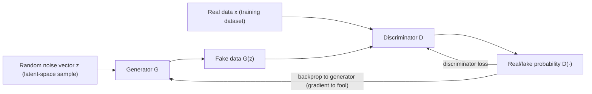
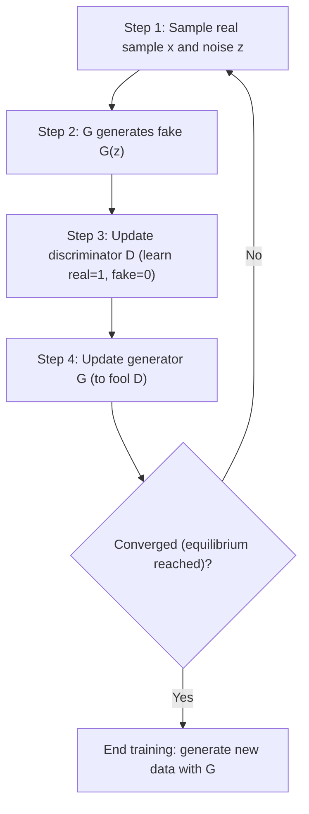

# Generative Adversarial Network (GAN)

## 1. Overview

> A **Generative Adversarial Network (GAN)** is a deep-learning-based generative model that simultaneously trains two neural networks in competition with each other—a **Generator** that creates new data and a **Discriminator** that judges whether the data is real or fake—to approximate the distribution of real data and generate realistic samples from it.

The fundamental goal of a generative model is to figure out the probability distribution p_data(x) that the training data follows, and to draw new, never-before-seen samples from that distribution. Traditionally this problem was approached by explicitly modeling the likelihood of the data (e.g., Boltzmann machines, Variational Autoencoders (VAE)), but for complex distributions like high-dimensional images, directly computing or optimizing the likelihood was very difficult. VAE was stable to train but had the limitation that generation results became blurry.

The GAN proposed by Ian Goodfellow in 2014 broke through this dilemma with a conceptual shift: "instead of directly computing the likelihood, let's turn the problem into a **game of making fakes that are hard to tell apart**." The analogy of a counterfeiter (the generator) and the police (the discriminator) is widely used. The counterfeiter tries to make ever more sophisticated counterfeit bills, and the police try to detect them more accurately; when this competition repeats, the counterfeit bills become so refined as to be indistinguishable from real ones. A GAN formalizes this adversarial competition as the loss function of neural networks.

Behind GAN's explosive spread, several conditions of the times came together. Deep learning's convolutional neural networks had matured in image recognition, which supported the discriminator's performance; GPU parallel computation made large-scale neural-network training feasible; and large image datasets had accumulated. On this foundation, GANs advanced rapidly in realism within just a few years—DCGAN in 2015, CycleGAN and Pix2Pix in 2017, and StyleGAN in 2018. In that this rapid pace of advancement itself was a signal foreshadowing the impact generative AI would have on society, the background of GAN's emergence carries significant meaning from an engineering-history standpoint.

The reason GANs are important from the perspective of an information-management professional engineer is that they were **a turning point in the lineage of generative AI**. Since 2014, GANs became the de facto standard for realistic image generation, and even after the mainstream of today's text-to-image generation shifted to diffusion models, they are still used in practical areas such as image super-resolution, image-quality enhancement, data augmentation, and anomaly detection. At the same time, they gave rise to the misuse case of deepfakes, becoming the starting point of AI reliability, security, and ethics issues, so it is a topic where the technical principles and social implications must be understood together.

The core characteristics of GANs can be summarized as follows. First, it is an **implicit generative model that does not explicitly compute the likelihood**. It does not directly formulate the probability density the data follows, but learns only the ability to draw samples from that distribution. Second, **the competition of the two neural networks is itself the training signal**. Without a separate ground truth, it has a self-supervised character in which each improves the other based only on the counterpart's judgment. Third, **the continuity of the latent space**. Changing the input noise vector little by little smoothly deforms the generation result, so the semantic axes of the data can be handled by vector operations. These three characteristics make GANs both powerful and tricky to handle.

## 2. The Overall Structure of GAN and the Principle of Adversarial Training

A GAN is a structure in which two neural networks play a **minimax game** over a single objective function. The generator G takes a low-dimensional noise vector z drawn from, say, a normal distribution, and outputs a sample G(z) similar to real data. The space in which z exists is called the **latent space**, and it is an interesting property of GANs that continuous movement in this space leads to meaningful changes in the generation result (e.g., changes in a face's angle or expression). The discriminator D judges, as a probability from 0 to 1, whether the input is real data or a fake made by G.

Here, understanding the discriminator not as a simple "detector" but as a **learned loss** makes the essence of GAN clearer. Traditional generative models minimize a fixed, human-defined loss such as a pixel-wise error (e.g., mean squared error), but such a loss poorly captures the perceptual realism of an image, so the result becomes blurry. A GAN, by contrast, has the discriminator learn from the data itself "what looks real" and feed it back to the generator. That is, since the loss criterion itself is refined through learning, GAN's fundamental strength is that it can learn "realism"—which is hard for a human to prescribe in advance—in a data-driven way.

The core of training lies in the fact that the two neural networks' goals are exactly opposite. The discriminator D is trained to assign 1 to real and 0 to fake (i.e., to distinguish well), and the generator G is trained so that D judges its output as 1 (real) (i.e., to fool well). In formula terms, D maximizes the objective function V(D,G) and G minimizes it; theoretically, when the two networks reach equilibrium, the generator's distribution matches the real data distribution, and the discriminator cannot distinguish either side, outputting 0.5 for all inputs, reaching a **Nash equilibrium**.

The properties of the latent space broaden GAN's practicality further. In a trained generator, moving the noise vector z little by little deforms the generation result smoothly rather than jumping abruptly (e.g., a frontal face gradually turning into a profile), and one can edit the output by finding and adding or subtracting a direction vector corresponding to a specific attribute (wearing glasses, age, expression). This means the latent space holds the semantic structure of the data continuously and linearly, and it becomes the theoretical foundation for applications such as image editing, attribute control, and interpolation. That StyleGAN could realize fine attribute control is also because it reorganized this latent space into style axes.

The objective function V(D,G) of this game is defined as the sum of the expected values of "the log probability of D for real samples" and "the log(1−D) for fake samples." D tries to increase this value and G tries to decrease it, so training becomes not simple minimization but **optimization that finds a saddle point**. If ordinary loss minimization is the problem of finding the bottom of a valley, a minimax game must find a point that is a maximum in one direction and a minimum in another, so convergence guarantees are weak and it tends to oscillate. The fundamental difficulty of GAN training stems precisely from this game-theoretic structure.

In actual implementation, the two networks are trained alternately. First, with G fixed, D is updated for a few steps with real and fake samples; next, with D fixed, G is updated. In the original paper, G's loss had a problem of vanishing gradients early in training, so a practical correction is applied by changing to a **non-saturating loss** that "maximizes the log probability of misjudging a fake as real," strengthening the signal early in training. In this way, GANs are theoretically elegant but delicate in the training process, and balancing the training speed of the two networks determines success or failure.

## 3. Training Procedure and Representative Variant Architectures

The figure above is GAN's iterative training procedure. At each iteration, the discriminator and generator are updated alternately, and the knack for stability is to train the discriminator slightly more often or more strongly than the generator to maintain a discriminator that is "not fooled too easily." However, if the discriminator becomes too strong, the gradient delivered to the generator vanishes and training stops, so the **capability balance** of the two networks must be carefully coordinated.

One thing to note is that this training procedure has no clear stopping point or validation-accuracy curve like supervised learning. Since the loss value is the result of a tug-of-war between the two networks, a low value is not necessarily good, nor does converging to a specific value mean training is done. Therefore, in practice, instead of a loss curve, training is managed by **periodically inspecting generated samples by eye or by using quantitative metrics like FID in parallel**. This point creates the operational difficulty peculiar to GANs, where even judging "when to stop training" is hard.

Here, it is worth pointing out concretely why coordinating the training balance is difficult. If the discriminator's training speed is excessively faster than the generator's, it perfectly filters out fakes, and the gradient carrying information about "what to improve" vanishes for the generator; conversely, if the generator gets ahead, the discriminator is fooled and gives only meaningless signals. So in practice, the discriminator update count, learning rate, batch composition, etc., are adjusted through repeated experiments, and this tuning burden is a representative reason GANs are considered "hard-to-handle models."

Since its emergence, GAN has developed into various derivative models tailored to purpose and data characteristics. Understanding each variant as an attempt to solve a specific weakness of the original GAN (training instability, inability to control conditions, low resolution, etc.) makes the lineage clear.

| Variant model | Core idea | Problem solved |
|------|------|------|
| DCGAN | Redesign generator/discriminator with convolutional (CNN) structure, introduce batch normalization | Improve image quality and training stability |
| cGAN (Conditional) | Also input condition information such as labels | Control generation of the "desired kind" of data |
| Pix2Pix / CycleGAN | Image-to-image translation (paired/unpaired) | Domain translation (photo↔drawing, horse↔zebra) |
| WGAN / WGAN-GP | Replace loss with Wasserstein distance, gradient penalty | Alleviate mode collapse and training instability |
| StyleGAN | Inject style vectors per layer, progressive resolution growth | Ultra-high resolution and fine attribute control |

**DCGAN (Deep Convolutional GAN)** introduced convolutional neural networks instead of fully connected ones, greatly raising image-generation quality and becoming the de facto standard skeleton. In the generator, it gradually expands low-resolution features with transposed convolution; in the discriminator, it uses strided convolution; and it applies batch normalization to both networks to stabilize training. DCGAN also has great significance in showing that arithmetic operations on the noise vector z (e.g., subtracting a "neutral-face" vector from a "smiling-face" vector and adding a "male" vector) lead to meaningful results, proving that the latent space structurally holds the semantics of the data.

**Conditional GAN (cGAN)** feeds a condition y—such as a class label, text, or another image—into both the generator and discriminator along with the noise, moving beyond random generation to enable purpose-directed generation such as "a cat image" or "turn this sketch into a photo." Since the discriminator is trained to judge not only "is this image real" but also "does it match the given condition," it is guided to generate an image that fits the condition rather than merely a plausible image. This conditional structure later became the starting point of practical applications such as text-to-image and image editing.

**Pix2Pix and CycleGAN** are a family specialized in image-to-image translation. Pix2Pix trains on paired data whose input and output are matched (e.g., sketch-photo pairs), whereas in reality such pairs are often hard to obtain. CycleGAN learns translation that goes back and forth between two domains (e.g., summer scenery↔winter scenery, horse↔zebra) even without paired training data, using a **cycle consistency** loss. The key idea is to impose the constraint that translating A→B and then back B→A should equal the original, thereby learning a meaning-preserving translation even without pairs.

**StyleGAN** (2018–) introduced a structure that, instead of turning noise directly into an image, first transforms the latent vector into a style space with a mapping network and injects it into each layer of the generator (AdaIN). This made it possible to separately control coarse attributes such as overall composition and face shape and fine attributes such as hair and wrinkles per layer, generating ultra-high-resolution faces nearly indistinguishable from real ones by the human eye, which caused a stir. At the same time, this realism is also a representative case that triggered deepfake concerns, symbolizing the two-sidedness of GANs where technological advancement and social risk grow together.

## 4. Performance Evaluation Metrics for GANs

Unlike supervised learning that compares ground-truth labels and predictions, a generative model is hard to quantify in terms of "how well it generated." Good generation means individual samples must be realistic (fidelity/quality) and must also evenly reflect the diverse aspects of the training data (diversity), and these two axes sometimes conflict. For example, a model that has fallen into mode collapse may look high in quality but is extremely low in diversity. Therefore, an evaluation metric must be able to capture both together. Since human subjective evaluation is costly and low in reproducibility, two automatic metrics are widely used in GAN research. The first is the **Inception Score (IS)**, which combines into one value the two conditions that, when generated images are fed into a pre-trained classifier (Inception), the class prediction of each individual image is clear (quality) and the class distribution of all generated outputs is even (diversity). Higher is better, but it does not directly compare with the real data distribution and has the limitation of depending on the class system the classifier learned. Also, since a high score can be obtained even by memorizing and reproducing the training data as is, it does not always catch loss of diversity.

The second metric, and the one used as the standard today, is the **Fréchet Inception Distance (FID)**. FID moves the real images and generated images each into a feature space, then measures the difference in the mean and covariance of the two distributions with the Fréchet distance. A **smaller** value means the generated distribution is closer to the real distribution, and since it correlates well with human perceptual judgment, it has become the de facto standard for model comparison. However, since FID is sensitive to the feature extractor used and the number of samples, it is more accurate to interpret it as a relative comparison under the same conditions rather than absolutely comparing figures across different papers and settings. In this way, knowing the limitations of the evaluation metrics is the premise for correctly interpreting GAN results.

In practice, these metrics are used as **the basis for judging early stopping and model selection**. Since the loss value itself poorly reflects training progress in GANs (quality can be bad even when the loss is low), FID is measured at regular intervals, and when the value no longer improves, training is stopped and the weights at that point are adopted. However, since both FID and IS are metrics optimized for the image domain, when generating audio, time-series, or tabular data with a GAN, a separate evaluation suited to that domain (e.g., downstream-task performance, statistical similarity) must be designed. That is, one must recognize that the very definition of "what counts as good generation" differs by task.

## 5. GAN vs. Diffusion Models — Comparison and Practical Application

GANs and diffusion models are the two major families of today's image generation, but they clearly differ in generation method and strengths/weaknesses. Rather than merely listing items, one must point to **the principle by which the difference arises**. A GAN generates an image from noise **in a single forward pass**, so inference is very fast, but because it depends on the adversarial balance of the generator and discriminator, training is unstable and it is vulnerable to **mode collapse**, where generated samples cluster on only certain patterns. A diffusion model, by contrast, gradually removes noise over tens to thousands of steps, so training is stable and diversity/quality are excellent, but its generation speed is slow due to iterative inference.

The root of this difference lies in the nature of the training objective. A GAN's only goal is to fool the discriminator, so it has a weak incentive to evenly cover the whole distribution of the training data, and hence mode collapse—focusing on "a few things that are easy to fool with"—occurs structurally. Diffusion solves a clear regression problem at each step of predicting the noise actually added, so its training signal is stable and the pressure to learn the whole distribution naturally operates. In this way, the difference in "what is taken as the training signal" results in an all-around difference in diversity, stability, and speed.

| Category | GAN | Diffusion model |
|------|------|------|
| Generation method | Single forward pass (single step) | Multi-stage iterative denoising |
| Inference speed | Very fast | Relatively slow (proportional to number of steps) |
| Training stability | Unstable (balance collapse, mode collapse) | Stable |
| Sample diversity | Limited (mode-collapse risk) | Excellent |
| Representative use | Real-time generation, super-resolution, data augmentation | Large-scale text-to-image generation |

This difference leads to practical choices. In **data augmentation in the medical and manufacturing fields**, normal and defective data are often extremely imbalanced, so a GAN is used to create synthetic data for the deficient class to reinforce classification-model training. For example, in manufacturing defect inspection, when actual defective samples are less than 1% of the whole, an approach of adding GAN-synthesized images to improve the recall of the minority class is reported. However, in this case, if the synthetic data does not accurately reflect the physical characteristics of actual defects, it can instead mislead the model, so domain-expert review and adjustment of the mixing ratio with real data must be pursued in parallel.

In **anomaly detection**, a method of training a GAN with normal data only and then judging inputs with large reconstruction error as anomalies is applied to financial-transaction fraud detection and industrial-equipment predictive maintenance. Since a generator trained only on normal patterns poorly reproduces never-before-seen abnormal patterns, the magnitude of the reconstruction failure becomes the anomaly score. This provides the practical advantage of being able to **build a detector with normal data only** in a reality where labels for anomalous cases are hard to secure.

Also, **super-resolution (SRGAN)** that restores low-resolution video to high resolution is used for improving the image quality of CCTV and medical imaging, and in this area where real-time performance matters, the strength of GANs—generating quickly in a single step—stands out.

**Generating synthetic data for privacy protection** is also a noteworthy use case. Sharing actual customer or patient data as is carries a high risk of privacy infringement, but if a GAN is used to create synthetic data that maintains the statistical characteristics but is not linked to a specific individual, analysis, training, and sharing become relatively safer. However, even in this case, there is a risk that the generative model memorizes and reproduces the training data as is (memorization) and leaks the original, so re-identification-possibility verification of the synthetic data and privacy guarantees (e.g., combining differential privacy) must be pursued in parallel. In summary, it is reasonable to understand it as a complementary structure in which diffusion has the edge for large-scale, diversity-centric creative generation, while GANs have the edge for practical generation centered on speed, specialized domains, and data reinforcement.

## 6. Deep Dive — Types of Training Failure and Latest Trends

The biggest obstacle when applying GANs in practice is training instability, and understanding the representative failure types itself becomes the response strategy. **Mode collapse** is the phenomenon of the generator repeatedly generating only a few samples that fool the discriminator, losing diversity—e.g., even if there are ten digits in the training data, the generator keeps making only "1." To alleviate this, **WGAN (Wasserstein GAN)**, which changed the loss function itself, was proposed; it replaced the existing distance between distributions (JS divergence)—which fails to give a gradient when the two distributions do not overlap—with the **Wasserstein distance**, and added a gradient penalty (WGAN-GP) to stabilize training.

Why the Wasserstein distance is effective can be understood intuitively. JS divergence returns a constant distance when the two distributions do not overlap at all, losing the information of "how far apart" they are, and as a result the generator cannot know the direction of improvement. The Wasserstein distance, by contrast, measures the minimum cost (earth-mover) of moving one distribution to the other, so the distance changes continuously even when the two distributions do not overlap, providing a stable training signal. In this way, the history of GAN improvements can also be read as "a journey to find a better distance metric," which is a case showing that objective-function design is as important as architecture in generative-model research.

Another failure is **vanishing gradients** and **oscillation**. If the discriminator becomes too perfect, the training signal flowing to the generator converges to 0 and progress stops; conversely, if the two networks fail to find a balance, the loss does not converge and keeps fluctuating. In practice, various stabilization techniques such as learning-rate adjustment, spectral normalization, adjusting the discriminator/generator update ratio, and label smoothing are combined. It is a characteristic that the success or failure of GAN training depends greatly on such **engineering know-how** rather than theory.

These stabilization techniques each target a different failure cause. Spectral normalization limits the size of the discriminator's weights to suppress the discriminator from becoming excessively strong; the gradient penalty keeps the gradient of the discriminator's output within a certain range to smooth training. Label smoothing relaxes the ground truth, such as "real=0.9" instead of "real=1," so the discriminator does not become overly confident. Practitioners select and combine these techniques according to the data characteristics and symptoms (whether it is mode collapse or oscillation), so when adopting GANs, sufficient experiment iteration and a visual-quality monitoring system must be planned together.

As for the latest trends, while the mainstream of large-scale text-to-image generation has shifted to diffusion models and GANs' standing has relatively declined, recent research is proceeding in the direction of **combining GANs' fast inference speed with diffusion's quality**. A representative approach uses an adversarial loss when distilling a diffusion model into a few steps (even a single step). This shows that GANs are being re-illuminated as **components of the generation pipeline** rather than as an independent technology. However, since the detailed performance figures of such latest techniques vary by research, it is more accurate to understand them as "a trend to alleviate the speed-quality trade-off" rather than as a definitive claim.

The expansion of application areas is also noteworthy. If early GANs focused on still images such as faces and scenery, they later broadened to super-resolution that scales low resolution to high, colorization of black-and-white photos, restoration of damaged images (inpainting), 3D shape generation, and audio synthesis/conversion. In particular, research that converts imaging modalities in medical imaging (e.g., MRI↔CT style translation) or augments rare-disease data, and attempts to generate candidate molecular structures in drug development, and other **specialized-domain generation** are active. This shows that GANs retain practical value as a tool for solving the data-shortage problem of specific industries rather than for general-purpose creation.

Another noteworthy trend is the **co-evolution of detection and defense technologies**. As GAN-based deepfakes become more sophisticated, the models that detect them advance together, and interestingly, the detector itself plays a role similar to the discriminator, so generation-detection forms an adversarial competition again. Because of this, it is difficult to fundamentally solve the problem with detection technology alone, and the recognition that **multi-layered defense**—combining watermarking that proves content provenance and authenticity at the generation stage with signing standards (such as C2PA)—is needed is spreading. In an engineering-exam answer, a perspective that views a GAN not as a simple generation algorithm but as a technology within an ecosystem where generation, evaluation, detection, and governance interlock is required.

In summary, GANs are a core technology that drove the rapid growth of generative AI after 2014, and today they maintain a practical foothold in specialized domains, real-time generation, and data augmentation while dividing roles with diffusion models. The initiative for large-scale creative generation has passed to diffusion, but GAN's idea of "learning realism through adversarial competition" is being inherited in various forms such as distillation, super-resolution, and anomaly detection. Therefore, it is reasonable to understand GANs not as a technology of the past but as a still-valid option and a framework of thinking in generative-AI design.

## 7. Considerations and Implications

From an engineering-professional perspective, GANs are a representative dual-use technology where technical possibility and social risk must be considered together.

As generative AI spreads across industries, GANs have come to sit at the intersection where data strategy, security, regulation, and ethics cross—beyond a simple algorithm choice. In an engineering-exam answer, in addition to the technical principles, the following multi-dimensional considerations are needed.

- **Application strategy (problem-fit first):** A GAN is not a cure-all but a tool with clear strengths. It is suitable for problems where speed matters and diversity requirements are limited, such as real-time generation, super-resolution, and data augmentation, but for large-scale generation requiring broad diversity and stable training, a diffusion model is advantageous. Before adoption, one must first select the model family based on the **required quality, speed, and data scale**.
- **Trade-offs (quality vs. stability vs. cost):** Using the WGAN family to gain training stability increases training time, and ultra-high-resolution StyleGAN demands enormous computational resources. When used for data augmentation, there is a risk that synthetic data distorts the real distribution and instead lowers model performance, so the synthetic-to-real ratio and a quality-verification procedure must always be pursued in parallel.
- **Reliability and security threats (deepfake response):** The hyper-realistic synthetic media created by GAN/StyleGAN give rise to serious social threats such as deepfakes, misinformation, identity theft, and voice forgery. As a response, watermarking of generated outputs, content-provenance standards (such as C2PA), detection models, and regulation containing an obligation to label AI-generated content (e.g., the EU AI Act) are being discussed, so when adopting the technology, a **detection, labeling, and governance system** must be designed together.
- **Privacy and ethics (legitimacy of training data):** Face/voice generation models use the data of real people for training, with the possibility of infringing portrait rights, copyright, and privacy. A legitimate basis for collecting the training data, a check of reproduction/leakage risk (memorization), and a review of the legitimacy of the generation purpose are required.
- **Responsibility and governance (establishing usage principles):** An organization-level usage policy for the generation and distribution of synthetic media, a procedure for labeling and recording generated outputs, and the locus of responsibility in case of misuse must be defined in advance. In particular, when utilizing GAN-generated outputs in external services, a governance system that reviews compliance with terms of use, disclosure obligations, and relevant laws (the Personal Information Protection Act, AI-related regulations) is needed.
- **Evaluation and operations perspective:** Since a GAN cannot have its quality judged by the loss value alone and has no clear training-stopping point, an adoption plan must be built on the premise of a monitoring system that pursues quantitative metrics like FID and visual inspection in parallel, and sufficient experiment iteration. One must also consider that if the domain is not images, the evaluation metrics themselves must be redesigned.
- **Resource and cost perspective:** Training high-quality models such as StyleGAN takes considerable GPU resources and training time, and considering the repetition of hyperparameter tuning, the total cost of ownership (TCO) becomes large. A strategy of saving resources through fine-tuning/transfer learning of a pre-trained model, or optimizing cost through elastic use of cloud GPUs, must be reviewed in parallel.
- **Related-technology perspective:** GANs form the lineage of generative AI together with diffusion models and VAE, and recently they are reused as **complementary components** in diffusion distillation, super-resolution, data augmentation, etc. Rather than viewing them in isolation as a single technology, it is desirable to grasp their position within the whole pipeline spanning generation, detection, and governance.

## References

- Ian Goodfellow et al., "Generative Adversarial Networks", 2014 — https://arxiv.org/abs/1406.2661
- Google Developers, "Generative Adversarial Networks (GAN) Overview" — https://developers.google.com/machine-learning/gan
- NVIDIA, "StyleGAN (A Style-Based Generator Architecture for GANs)" — https://arxiv.org/abs/1812.04948
- Wikipedia, "Generative adversarial network" — https://en.wikipedia.org/wiki/Generative_adversarial_network

---

> **In one line**: A GAN is a generative model that adversarially competes a generator that creates data with a discriminator that tells real from fake to approximate the real distribution; it has strengths in fast inference, data augmentation, and super-resolution, but carries the challenges of mode collapse, training instability, and deepfake misuse, and is developing complementarily with diffusion models.
