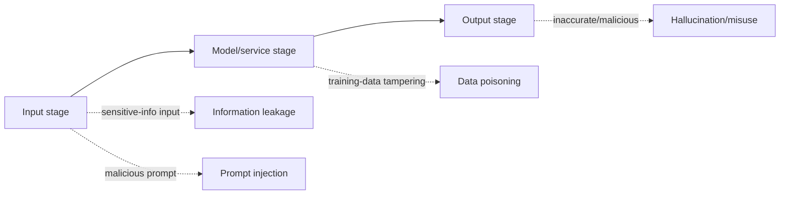

# Generative AI Security Guidelines

## 1. Overview

### A. The Concept of Generative AI
> **Generative AI** is AI that learns the patterns of training data with LLMs, diffusion models, and the like to **generate new content—text, images, audio, code, etc.—on its own**. The National Cyber Security Center published related security guidelines for the safe use of such services.

Generative AI dramatically increases work productivity, but **the nature of its threats differs** from that of existing IT systems. This is because content a user enters in natural language can flow directly into model training and logs, and the accuracy of the model's output cannot be guaranteed. That is, since a new attack surface arises across the entire span of input, model, and output, existing security controls alone are insufficient, and guidelines tailored to the threats peculiar to generative AI are needed.

### B. Examples of Services in Use
The reason guidelines are needed is that generative AI is already widely used in work. As it spreads to productivity work such as document summarization and translation, development work such as code generation and review, customer touchpoints such as chatbot consultation, and marketing creation, the points of contact where confidential information can be exposed to AI have increased accordingly.

| Field | Example |
|---|---|
| **Work productivity** | Document summarization/writing, translation, meeting-minutes organization |
| **Development** | Code generation/review, test automation |
| **Customer touchpoints** | Chatbot consultation, FAQ auto-response |
| **Creation** | Image/design/marketing-copy generation |

## 2. Causes and Resulting Threats by Type of Security Threat

Generative AI threats are easy to understand from the perspective that they arise at **three points—input, model, and output**. At the **input stage**, if a user puts confidential or personal information into a prompt, that content can be stored in training and logs and reproduced/leaked (information leakage), and **prompt injection**—where untrusted input overwrites system instructions to bypass intended controls—occurs. At the **model stage**, if training/RAG data is tampered with, **data poisoning**—implanting bias or a backdoor—occurs; at the **output stage**, **hallucination**, the intrinsic limitation of statistical generation, and the generation of malware and deepfakes that misuse generation capability become problems.

| Threat | Main cause | Possible security threat |
|---|---|---|
| **Information leakage** | Entering confidential/personal info into a prompt → stored in training/logs | Trade-secret/personal-info exposure, reproduction leakage |
| **Prompt injection** | Untrusted input overwrites system instructions | Instruction bypass, privilege takeover, data leakage |
| **Data poisoning** | Tampering with training/RAG data | Bias/backdoor, inducing wrong answers |
| **Hallucination** | Factuality limit of statistical generation | Misinformation reflected in work, decision errors |
| **Misuse** | Misuse of generation capability | Generation of malware/phishing/deepfakes |
| **Model theft/inversion** | API exposure, repeated queries | Model replication, inference of training data |

For example, an incident in 2023 in which a developer at a company pasted source code into a chatbot to have it reviewed, resulting in **confidential code flowing into an external model**, became known, highlighting that input-stage information leakage is the most realistic threat.

## 3. Security Considerations and Countermeasures During Development and Use

The response, too, is key to composing it as **layered controls of input, model, output, and governance**. At the input stage, apply filtering/masking and **DLP (Data Loss Prevention)** so that sensitive information does not flow in in the first place, and set an input-prohibition policy. At the model stage, isolate the system prompt from user input to block injection, and verify the integrity of RAG data. At the output stage, filter and review results, present evidence together, and put a watermark on generated outputs to trace misuse. An organization-level usage policy and training wrap around all these technical controls.

| Category | Security consideration | Countermeasure |
|---|---|---|
| **Input** | Block inflow of sensitive info | Input filtering/masking, DLP, policy prohibiting sensitive-info input |
| **Model/service** | Prevent injection/poisoning | Prompt isolation (separate system/user), input validation, access control/logging, RAG data validation |
| **Output** | Control harmful/inaccurate results | Output filtering/review, evidence presentation, watermarking, hallucination verification |
| **Governance** | Organization-level control | Usage policy/approval process, employee training, private model/network separation, audit |

## 4. Considerations and Implications
- **Pursuing the three axes of technical, policy, and human control in parallel**: Technical controls such as DLP or prompt isolation alone are insufficient. A usage policy and employee training must go together to become substantive defense. This is because most information leakage comes from carelessness rather than malice.
- **Securing data sovereignty**: For sensitive work, compose it with a **closed/on-premises LLM** and RAG instead of an external commercial API, so that data does not leave the organization.
- **Linkage with regulation and governance**: Establish a risk-based management system linked with regulations such as the EU AI Act and Korea's AI Framework Act, and secure AI reliability.
- **Making attack and defense continuous**: Since adversarial prompt attacks keep evolving, operate red-team checks and monitoring continuously to keep updating the defense.

---

> **In one line**: Generative AI security controls the threats of *information leakage, prompt injection, data poisoning, hallucination, and misuse* in layers of input (DLP), model (isolation/validation), output (filtering/watermarking), and governance (policy/training), with the parallel pursuit of the three axes—technical, policy, and training—and the securing of data sovereignty at its core.
