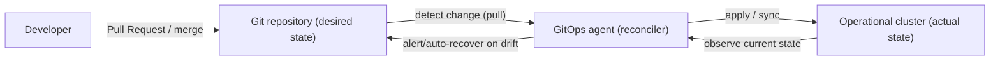
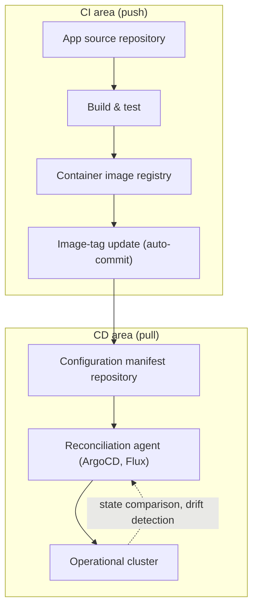

# GitOps — A Git-Based Declarative Operations Model

## 1. Overview

> **Definition**: GitOps is an operations model that **declaratively describes a system's desired state in a Git repository** and has **an agent continuously reconcile** the actual operating environment so that it matches that declaration. Git serves as the Single Source of Truth for deployment and configuration and as the gateway for changes.

Traditional deployment was a **procedural, push-based approach** in which an operator pushed commands such as `kubectl apply` or `terraform apply` from a CI pipeline or shell.
In this approach, "who ran what, when, and in what order" is scattered across pipeline logs, and the moment an operator touches things directly on a console, **configuration drift**—where the repository's code and the actual cluster state diverge—occurs.
When clusters grow to dozens and microservices to hundreds, one reaches a situation where no one can accurately answer "what version and configuration is actually running in production right now."

GitOps solves this problem with a **shift in perspective**.
It redefines deployment not as "the act of executing commands" but as "a convergence process that narrows the difference between the target state described in the repository and the actual state."
The operator does not touch the cluster directly and performs **only changes to Git (Pull Requests and merges)**, while an agent running inside the cluster detects those changes and matches the actual state to the target on its own.
As a result, the Git commit history becomes a complete deployment history and audit trail, and rollback is reduced to a `git revert` to a previous commit.

From an engineering-exam-answer perspective, GitOps should be described not as a mere "single CI/CD tool" but as an operations paradigm that combines the **declarativeness of IaC (Infrastructure as Code)**, a **version-control and review culture**, and the **closed-loop control of control theory**.

### 1.1 Background and Necessity

First, **Kubernetes' declarative API** laid the premise for GitOps.
Kubernetes already has a built-in reconciliation loop that "if you describe the desired state, a controller matches the current state to it."
GitOps can be seen as **externalizing the input (desired state) of this reconciliation loop into Git**, so it naturally took root in the Kubernetes ecosystem.

Second, the problem of **configuration drift and non-reproducibility**.
If a person makes an emergency patch on a console and leaves no record, that state cannot be reproduced during disaster recovery or cluster rebuilding.
In GitOps, since every change goes through Git, the entire cluster can be deterministically reconstructed with only the repository.

Third, **security and governance requirements**.
The push method, which grants broad write access to the operational cluster to a CI server or many developers, has a wide attack surface.
GitOps' pull method has the cluster's internal agent **pull** the repository, so there is no need to hold cluster credentials externally, conforming to the principle of least privilege.

## 2. GitOps' Four Principles and the Reconciliation Loop

The four principles of GitOps, proposed by Weaveworks and organized by the OpenGitOps (CNCF) community, compress the essence of this model.
Rather than merely listing the principles, one must understand them by connecting how each principle resolves the aforementioned drift, reproduction, and security problems.

In the figure above, the key is the arrow direction that **the agent pulls the repository**, and the **closed loop** that reads back the cluster state and compares it to the target.
These two characteristics are the decisive difference that separates push-type CI/CD from GitOps.

First, it is **Declarative**.
The desired state of the system is described not as a procedure of "how to make it" but as a result of "what it should be."
YAML manifests, Helm charts, and Kustomize overlays are representative, and unlike procedural scripts, they guarantee **idempotency**—the same result no matter how many times they are applied.

Second, it is **Versioned and Immutable**.
The desired state is stored in Git so that every change remains as a commit, and each version is preserved immutably.
Therefore, "when, who, and why it was changed" is recorded in commit messages and PR reviews, securing auditability, and restoration to a specific point in time is reduced to a commit checkout.

Third, it is **Pulled Automatically**.
The agent detects changes by periodically polling the repository or via a webhook and pulls them on its own.
Since an external system does not push into the cluster, there is no need for cluster credentials to leak outside.

Fourth, it is **Continuously Reconciled**.
The agent repeatedly observes the actual state to detect any difference from the target, and even if drift occurs because a person manually changed something on the console, it detects and alerts on this or automatically recovers to the target state.
This self-healing property fundamentally suppresses the drift problem.

| Principle | Problem solved | Means of implementation |
|------|--------------|-----------|
| Declarative | Order dependency and non-idempotency of procedures | YAML, Helm, Kustomize |
| Versioned & immutable | Non-reproducibility, absence of audit | Git commits, PR reviews, signing |
| Automatic pull | Credential exposure, manual deployment | In-cluster agent |
| Continuous reconciliation | Configuration drift, manual changes | Reconciliation loop, auto-recovery |

## 3. Architecture and Deployment Strategy

A GitOps architecture usually separates the **application source repository** and the **configuration (manifest) repository**.
When the source repository's CI builds and tests a container image, uploads it to the registry, and updates the tag, that image tag is reflected (auto-committed) in the manifests of the configuration repository.
Then the deployment agent detects the change in the configuration repository and reflects it in the cluster.
Separating **CI (build/verify) and CD (deploy/reconcile) by a repository boundary** in this way is the typical structure of GitOps.

Representative tools are **Argo CD** and **Flux**, both CNCF Graduated projects.
Argo CD's strengths are a web UI that visualizes application state and multi-cluster management, while Flux's strengths are lightweight, modular controllers based on the GitOps Toolkit and Helm/image automation.
Either way, the core operating principle (Git as the target, observing the cluster as the actual and reconciling) is the same.

In terms of deployment strategy, GitOps controls risk by combining with **progressive delivery**.
It declares canary and blue-green deployments as manifests, and a controller like Argo Rollouts or Flagger observes metrics (error rate, latency) and shifts traffic in stages.
For example, first route 5% of traffic to the new version, and if the error rate does not exceed a threshold for 5 minutes, expand to 25%→50%→100%; if exceeded, automatically roll back to the previous commit state.
Here, the operational advantage of GitOps is that rollback is not "a separate procedure to revert to a previous image" but a **Git revert**.

## 4. Comparison with Push-Type CI/CD

To understand GitOps accurately, one must point out the difference from the existing push-type pipeline down to **the reason the difference arises**.
The two methods fundamentally differ in the subject and direction of deployment and the trust boundary.

| Category | Traditional Push CI/CD | GitOps (Pull) |
|------|-------------------|--------------|
| Deployment subject | External CI server applies to the cluster | In-cluster agent pulls and reconciles |
| Source of truth | Pipeline scripts, manual operation | Git repository (declarative state) |
| Credentials | CI holds cluster write access | Only the agent has internal access, no external exposure |
| Drift response | No detection/recovery means | Automatic detection/recovery via continuous reconciliation |
| Rollback | Re-run a separate pipeline | Immediate reduction with `git revert` |
| Auditability | Distributed, incomplete logs | Commit history is itself a complete deployment history |

The core of the difference is the **location of the trust boundary**.
In the push method, cluster credentials reside in the CI system, so if the CI is compromised, the entire operation is at risk.
In GitOps, credentials exist only inside the cluster and the direction is to pull from inside to outside, so the very pathway to manipulate the cluster directly from outside disappears.
Also, the push method has no mechanism to prevent drift if a person touches the console after deployment, but GitOps has the reconciliation loop operating at all times, so drift is immediately restored.
However, GitOps is not superior in all situations, so **non-idempotent, imperative operations** where order and state transitions matter—such as DB schema migration—must be supplemented with a separate procedure or migration tool.

## 5. Deep Dive — Practical Challenges in Adoption and Latest Trends

**First, the problem of secret management.**
Putting manifests in Git in plaintext exposes passwords and tokens, so Sealed Secrets (committed in encrypted form and decrypted only in the cluster), the External Secrets Operator (integration with Vault or cloud secret stores), SOPS, and the like must be designed together.
Reconciling the principle of "everything in Git" with the security requirement of "do not put secrets in Git" is the core hard problem in practice.

**Second, the observability of drift.**
Automatic recovery is not always desirable, because the agent may revert even a temporary change an engineer made intentionally during incident response, causing confusion.
Therefore, automatic sync, manual approval, and sync windows must be designed to fit the situation.

**Third, multi-cluster and multi-tenant scaling.**
To simultaneously manage common configuration and per-environment differences across dozens of clusters, a design that reduces configuration duplication with Kustomize overlays, Helm value separation, the App-of-Apps pattern, and ApplicationSet is needed.

As for the latest trends, **combination with policy-based governance** is prominent.
By putting a policy engine such as OPA/Gatekeeper or Kyverno into the reconciliation pipeline, unapproved images or manifests violating security policy are blocked before deployment.
Also, intertwined with **software supply-chain security**, the trend of integrating commit signing (Sigstore, cosign) and image-signature verification into the GitOps flow to guarantee "is what is being deployed a verified artifact" is strengthening.
Furthermore, it is maturing in the direction of a **Crossplane-based control plane** that manages not only applications but also the cluster and cloud infrastructure itself with GitOps, and of combining with observability to track reconciliation results and drift on a dashboard.

## 6. Considerations and Implications (Engineering Perspective)

- **Application strategy**: Rather than turning on full automatic recovery from the start, **gradual adoption**—starting at the drift-detection/alerting (read-only) stage and expanding to automatic sync after the organization becomes familiar with the GitOps flow—is safe. A separation of source and configuration repositories and a per-environment branch/directory strategy must be established early.
- **Trade-offs**: Since every change goes through Git and PRs, **speed can degrade** during an emergency incident. For this, a break-glass emergency path for relaxed approval and its after-the-fact audit procedure must be designed together to balance control and speed.
- **Security and governance**: With the removal of external cluster credentials, commit/image signing, and combination with a policy engine, GitOps connects naturally with supply-chain security (SBOM, DevSecOps). Since the Git repository itself becomes the top attack target, repository access control, signing, and protected branches are essential.
- **Organization and culture**: GitOps is not the adoption of a tool but a **shift in collaboration culture** to "operating through code review." Since development, operations, and security collaborate in the same repository, the effect is maximized when combined with DevOps, SRE, and platform engineering.
- **Outlook and linkage**: The trend is for the declarative reconciliation model to expand beyond Kubernetes to cloud infrastructure, edge, and AI pipelines. Combined with IaC, platform engineering, and policy-based governance, it is expected to take root as the foundational infrastructure for **autonomous operations**.

---

> **In one line**: GitOps is an operations model that declaratively stores the desired state in Git and has an in-cluster agent continuously reconcile (pull, self-healing) the actual state, realizing safe and reproducible deployment through drift suppression, complete auditability, minimal credential exposure, and `git revert` rollback.
