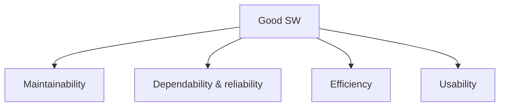

# The Four Characteristics Good Software Must Have

## 1. Overview

### A. Definition
> Good software is software that, in addition to satisfying the user's functional requirements, is balanced across four quality characteristics: **Maintainability, Dependability, Efficiency, and Usability** (I. Sommerville).

The key here is that "having implemented the required functions" and the judgment "this is good software" are **different dimensions**. Functionality is merely the minimum condition at the point of acceptance, and the actual value of software is determined over years of **operation, change, and expansion** after delivery. That is why Sommerville presented the non-functional qualities that cannot be reduced to a functional specification—namely, how well it accommodates change (maintainability), how much it can be trusted and relied upon (dependability), how much resource it conserves (efficiency), and how easily it can be used (usability)—as the axes of good software.

### B. Background and Necessity
Most of the cost of software arises not from development but from **maintenance**. Typically, more than 60% of the total lifecycle cost is spent on defect fixing, feature improvement, and environment migration after delivery, and requirements change endlessly. Sacrificing structure in pursuit of initial development speed alone accumulates **technical debt**, where the cost of a single subsequent change grows exponentially. Also, in areas like finance and healthcare where a failure leads directly to loss or risk to life, once trust collapses the product itself becomes meaningless. The four characteristics of good software are, in this way, a concept that elevates the qualities that govern cost but are invisible into explicit management targets, in order to manage **long-term value and risk**.

## 2. The Four Characteristics

**A. Maintainability** is the degree to which software is easy to **modify and evolve** in line with changing requirements and environments. Software does not physically wear out, but it "ages" as the world changes. When regulations change and pricing policies change, the code must change accordingly, and at that point, maintainability is said to be high if fixing a specific part does not cause other parts to break in a chain. A module structure with low coupling and high cohesion is its foundation.

**B. Dependability & reliability** is a characteristic that encompasses **whether the user can trust and rely on the software**, spanning reliability (continuous normal operation), availability (usable when needed), safety (no harm even in failure), and security (defense against attacks). For example, online banking must not have an account transfer go wrong even once in a while (reliability), must not be unavailable due to maintenance (availability), and must not leak account information (security). Dependability is thus the sum of several sub-attributes, and the weakest link determines overall trust.

**C. Efficiency** is the degree to which **resources are not wasted**—CPU, memory, storage, network, response time, etc. However, efficiency is not an absolute good but a concept relative to the goal. If the same response time is achieved with twice the servers, cloud fees double, so efficiency directly translates into operating cost and the user's perceived performance. For example, changing an O(n²) sort to O(n log n) reduces processing time by hundreds of times when there are a million records.

**D. Usability** is the degree to which the **target user** can learn easily and use conveniently without mistakes. Here "target user" matters, because a terminal for professional traders and a public app for the elderly have entirely different criteria for good usability. No matter how excellent the functions are, if the user cannot reach the desired task, that function is as good as nonexistent.

| Characteristic | Description | Symptom on failure |
|---|---|---|
| Maintainability | Easy to modify and evolve with change | Wide ripple even from a small change, regression defects |
| Dependability & reliability | Trust, availability, safety, security | Failures, data leakage, malfunction |
| Efficiency | No resource waste | Slow response, excessive infrastructure cost |
| Usability | Easy to learn and convenient | Difficulty learning, operational mistakes, churn |

## 3. Linkage with Quality Standards (ISO/IEC 25010)

Sommerville's four characteristics are academic concepts, so they are hard to measure directly. What standardizes them into a form amenable to **quantitative measurement, contracting, and auditing** is the ISO/IEC 25010 product quality model, which concretizes the four characteristics with eight quality characteristics and their sub-characteristics. That is, 25010 serves as a bridge that reduces the qualitative goal of "good software" to metrics.

| 25010 quality characteristic | Corresponding characteristic among the four |
|---|---|
| Maintainability (modularity, reusability, analyzability, modifiability, testability) | Maintainability |
| Reliability, security, safety | Dependability |
| Performance efficiency (time behavior, resource use, capacity) | Efficiency |
| Usability (learnability, operability, accessibility, etc.) | Usability |
| Functional suitability, compatibility, portability | Expansion perspective |

## 4. Means of Securing Them

Each characteristic cannot be attached merely by inspection late in development but must be **embedded across all stages of design, implementation, and verification**. Maintainability is secured through modularization, low coupling and high cohesion, clear interfaces, documentation, and static analysis. Dependability is secured through sufficient testing, fault-tolerance design, secure coding, and redundancy. Efficiency is secured through the choice of data structures and algorithms, architecture optimization, profiling, and performance testing. Usability is secured through UX design principles, accessibility guidelines (WCAG), and real-user testing.

| Characteristic | Means of securing |
|---|---|
| Maintainability | Modularization, low coupling/high cohesion, code conventions, documentation, static analysis |
| Dependability | Test automation, fault tolerance, redundancy, secure coding |
| Efficiency | Algorithm/architecture optimization, profiling, performance testing |
| Usability | UX design, accessibility (WCAG), user testing |

## 5. Considerations and Implications
The four characteristics are not independent and often **trade off** with one another. Optimizing at a low level for extreme efficiency makes the code obscure and lowers maintainability, and strong security procedures can harm usability. The key from an engineering perspective is not to maximize any single one but to **set priorities according to the nature of the system and design the balance point**. Safety-critical systems put dependability first, mass-market services put usability first, and high-traffic services put efficiency first. Also, quality is minimized in cost when **embedded at the design stage (Quality by Design)** rather than reinforced late, and it must be continuously managed by quantitatively measuring and tracking it with the ISO/IEC 25010 metrics.

---

> **In one line**: Good software must be balanced across *maintainability, dependability (reliability), efficiency, and usability*, and since these characteristics trade off with one another, they must be embedded at the design stage with priorities suited to the nature of the system and quantitatively managed with ISO/IEC 25010.
