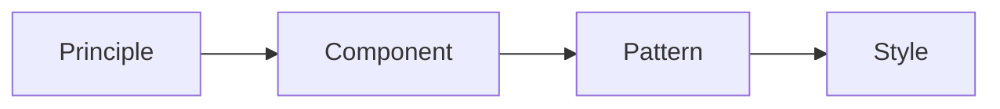
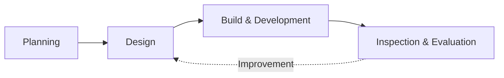

# Digital Government Service UI/UX Guideline (Feb 2024, Ministry of the Interior and Safety)

## 1. Overview

### A. Definition and Purpose
> A set of principles and detailed design requirements published by the Ministry of the Interior and Safety that central government agencies, local governments, and public institutions must follow in order to **consistently improve the UI/UX quality** of the digital services (web and apps) they provide. Its goal is to implement services that **every citizen can use easily and without discrimination**.

### B. Background and Necessity
Until now, public digital services have been separately commissioned and built by each ministry and agency, so even for the same government service the screen layouts, terminology, and authentication procedures differed from one to another, placing a heavy burden on citizens who had to learn each one anew. In addition, **digitally vulnerable groups** such as the elderly, people with low vision, and people with disabilities faced a serious digital divide, unable to use services at all when confronted with screens that lacked accessibility. This guideline was created to resolve such **fragmentation and lack of accessibility** by presenting common design standards and reusable components shared across the whole of government, thereby providing citizens with a consistent experience while simultaneously giving agencies both development efficiency and higher quality.

The core values the guideline pursues are fourfold. **Consistency** lets citizens use any agency's service in a familiar way; **inclusiveness and accessibility** consider the digitally disadvantaged; **user-centeredness** designs from the citizen's perspective rather than the provider's convenience; and **reliability** provides the sense of stability befitting a public service.

## 2. Structure of the Guideline (Components)

The guideline has a **four-layer structure** that descends from abstract direction to concrete visual rules. The reason for dividing it into layers is to ensure that the higher-level principles are consistently carried through into the lower-level components, patterns, and styles, so that designers produce unified results without relying on arbitrary judgment.

At the top, the **Principle** layer presents criteria for judgment such as "user-centeredness, consistency, accessibility, and trust." Below it, the **Component** layer defines the common UI parts that make up a screen, such as buttons, input fields, and navigation; the **Pattern** layer defines the standard design of screen flows that recur across many services, such as search, application, and authentication; and at the bottom, the **Style** layer defines visual expression rules such as colors, typography, and icons. For example, the principle of "accessibility" is implemented at the component layer as "buttons must have sufficient size and brightness contrast," and at the style layer as the concrete figure "at least 4.5:1 contrast against body text."

| Component | Content | Role |
|---|---|---|
| **Principle** | User-centeredness, consistency, accessibility, trust | Criteria for design judgment |
| **Component** | UI parts such as buttons, inputs, navigation | Unit of reuse |
| **Pattern** | Recurring screen flows such as search, application, authentication | Standard design template |
| **Style** | Visual rules such as colors, typography, icons | Consistent appearance |

## 3. Scope of Application and Standards

The scope of application covers all web and app digital services operated by central government agencies, local governments, and public institutions. The core of the compliance standards is **web accessibility (KWCAG, Korean Web Content Accessibility Guidelines)**. This is not a mere recommendation; as shown later, it is tied to a legal obligation, and through items such as alternative text, keyboard operation, and brightness contrast, it enables even users who cannot see the screen or find it difficult to use a mouse to use the service.

| Category | Content |
|---|---|
| **Target** | Web and app services of central government agencies, local governments, and public institutions |
| **Standard** | Web accessibility (KWCAG), responsive/mobile-first, compliance with common components |
| **Accessibility** | Consideration for digitally vulnerable groups such as low-vision and elderly users (alternative text, keyboard access, brightness contrast) |

In particular, adopting **Mobile-First and responsive** design as a standard reflects the reality that a majority of citizens access public services via smartphones rather than PCs. Only when the layout flexibly rearranges itself according to screen size can the same service quality be guaranteed on any device.

## 4. How to Use It (Application Process)

The guideline is not a document referenced only at a particular stage; it is **applied across all stages of the service lifecycle**. In the planning stage, user journeys and patterns are defined; in the design stage, common components and styles are reused; in the build stage, accessibility standards are reflected in the code; and in the inspection and evaluation stage, compliance is verified through checklists and usability evaluations. The evaluation results are fed back into design, forming a cyclical structure in which improvement is repeated.

Here, the **reuse of common components** carries a meaning that goes beyond simple efficiency. By taking and using parts whose accessibility and usability have already been verified, agencies no longer need to secure quality anew each time, so it functions as a **design system** that simultaneously raises development productivity and the quality floor. This also has the benefit that during maintenance, improving a single component is reflected in every service that uses it.

## 5. Considerations and Implications
- **Phased application strategy**: Because existing services already in operation are difficult to change all at once, a realistic approach is needed that gradually incorporates the guideline in step with renewals and reorganizations.
- **Linkage with legal obligations**: Web accessibility is an obligation grounded in the Act on the Prohibition of Discrimination against Persons with Disabilities, so complying with the guideline is directly connected to regulatory risk management. Cost can be reduced only when accessibility is embedded from the earliest stage of design (Accessibility by Design) rather than being retrofitted afterward.
- **Evolution into a whole-of-government design system**: This guideline is expanding beyond individual guidance into a design system in the form of shared component libraries and design tokens, establishing itself as infrastructure that raises both the consistency of the citizen experience and the government's development efficiency together.

---

> **In one line**: This guideline is a whole-of-government standard that uses a four-layer structure of *Principle, Component, Pattern, and Style* to consistently secure the UI/UX quality and accessibility (KWCAG) of public digital services, applying the reuse of common components across all stages from planning to inspection and evaluation, and it is linked to the legal obligation of accessibility.
