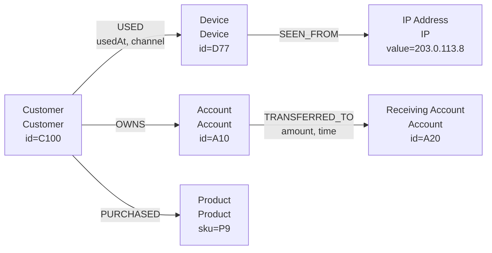
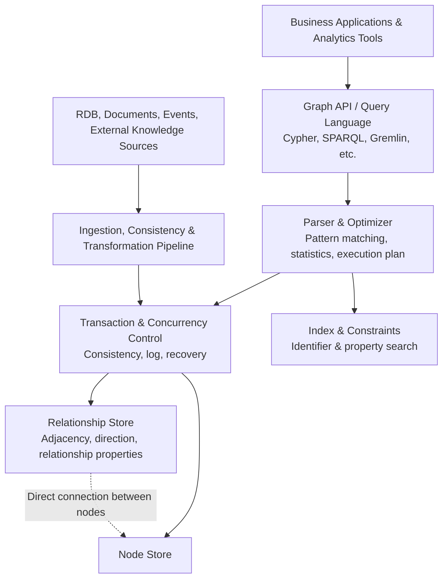

# Graph Databases and the Property Graph / RDF Models

## 1. Overview

> **Definition**: A graph database is a database that represents data as **nodes, relationships (edges), and properties** rather than as sets of independent rows and columns, and that treats relationships as the core of its storage structure so as to efficiently query connections, paths, and patterns.

A relational database stores entities in tables and reconstructs the relationships between tables using foreign keys and `JOIN`s. This approach is extremely strong for the integrity, aggregation, and transactions of structured data, but queries can become complex in problems where the depth of connections grows or where the kinds of relationships keep increasing. Consider a fraud-detection problem in which people and accounts, accounts and transactions, transactions and devices, and devices and IP addresses are connected across multiple levels; the core question becomes "through what path are they connected?" rather than the value in each table.

A graph database manages nodes and relationships together from the moment of storage, rather than fabricating these connections with joins each time at query time. As a result, it can naturally express path-centric questions such as "can you get from A to B?", "how many hops of common relationships do two customers share?", and "is a particular transaction connected to an already-known attack group?" The advantage of a graph does not mean that every query is automatically fast; it means that the data model and execution method fit well with problems where the breadth and depth of relationship traversal matter.

Behind the attention drawn to graph databases lies the increasing connectedness of data. In social networks, supply chains, telecommunication networks, knowledge graphs, recommendation systems, and financial transaction networks, the relationships between data determine business meaning more than the data itself. In environments where relationships keep being added as new business rules, directly modeling domain objects and relationships as a graph can be more flexible to change than continually decomposing tables and joining them.

That said, a graph database does not entirely replace a relational database. For work whose core is large-scale settlement aggregation, strict row/column schemas, complex numerical analysis, or integration with general-purpose SQL tools, the relational model may be more suitable. An advanced professional must comprehensively weigh relationship complexity, query depth, consistency requirements, analytical patterns, and the operations workforce and ecosystem, then choose the graph in one of three ways: standalone, supplementary, or polyglot.

The scope of this note covers the basic structure of graph databases, the difference between property graphs and RDF graphs, the principles of modeling, querying, and analysis, a comparison with relational databases, industry cases, and adoption considerations from an advanced-professional perspective.

## 2. The Graph Data Model and Overall Structure

A graph \(G\) can be thought of as a pair \(G=(V,E)\) of a vertex set \(V\) and an edge set \(E\). Nodes represent entities such as people, products, accounts, documents, and places, while relationships represent meaningful connections between nodes. By assigning properties to nodes and relationships, domain facts can be expressed directly, such as "customer A used device X" or "product P belongs to category C."

In a property graph, one or more labels are attached to a node, and a direction and type are given to a relationship. For example, a `USED` relationship can be placed between a `Customer` node and a `Device` node, and properties such as `usedAt`, `channel`, and `riskScore` can be placed on the relationship. The fact that properties can be placed on the relationship itself—because the relationship itself is a business fact—is what distinguishes it from a simple adjacency list.



In the structure above, customers, devices, accounts, products, and IP addresses are nodes, and `USED`, `OWNS`, `TRANSFERRED_TO`, and so on are relationship types. `amount` and `time` are properties of the transfer relationship, not properties of the receiving-account node. If this distinction is made wrongly, relationship facts that change over time get overwritten onto the node, and history and auditability are lost.

A **node** consists of an identifier, a label, and a set of properties. The identifier may be a business key or a system-internal key; when integrating keys from multiple systems into a single graph, one must decide on global uniqueness, key collisions, and reuse. Labels indicate the role of a node and are used to scope indexes and constraints.

A **relationship** connects a start node and an end node and generally has a direction, type, and properties. Even for a relationship that is directionless in business terms, it tends to be advantageous for operations to fix a consistent direction at storage time and allow bidirectional traversal. If direction is mixed arbitrarily, connections of the same meaning end up stored redundantly as two kinds, and the results of path queries may differ.

A **property** is key-value data attached to a node or relationship. Because properties are used in search conditions, sort conditions, and score calculations, their data types must be made clear. If dates are stored as strings or monetary units are stored differently per record, the graph traversal itself may succeed, but the reliability of the analysis results collapses.

The internal implementation of a graph database differs by product, but logically it can be understood as being divided into a catalog, indexes, a node store, a relationship store, a query engine, and a transaction layer. There are native graph engines that store relationships so they can be followed quickly in an adjacent form, while there are also multi-model databases that provide a graph query layer on top of a relational store.



In query processing, the index reduces the cost of finding the start node, and the relationship store reduces the cost of moving from a found node to the next. Therefore, a graph query must be designed by separating "where to start" from "which relationships to traverse and how many hops." An exhaustive traversal with an unclear starting point can be costly even with an index.

The difference between a relational join and a native graph traversal comes from the purpose of the storage structure. A relational join combines the rows of each table according to conditions, whereas a graph traversal follows the adjacent relationships of the current node to expand to the next set of nodes. For this reason, a graph is strong for queries where the path length is short and selectivity is high, while for large-scale full aggregation, a separate analytical engine or columnar store may be more suitable.

## 3. Property Graphs and RDF Graphs

The first thing to decide when designing a graph database is the semantic model of the graph. The model widely used in practical products is the property graph, while in web standards, knowledge representation, and data integration, the RDF graph is important. Both express nodes and connections, but their identification, properties, semantics, and query methods differ, so they must not be treated as the same thing.

### A. Property Graphs

A property graph is a model in which key-value properties can be placed on both nodes and relationships. It intuitively expresses the object structure of an application domain by giving labels to nodes and types and directions to relationships. For example, `(:Person {id:'P1'})-[:WORKS_AT {since:2020}]->(:Company {id:'C1'})` expresses a person, a company, and the employment start date as a single relationship pattern.

A property graph has the advantage of being able to quickly begin domain traversal and path analysis. Putting `since`, `weight`, or `status` on a relationship makes it possible to distinguish multiple business events between the same two nodes. However, because property names and semantics can differ from one organization to another, the graph becomes flexible but low in consistency unless labels, relationship types, and property types are managed as data standards.

Identifier design in a property graph is especially important. If a sensitive business key such as a resident registration number or account number is used directly as a node identifier, personal information can proliferate through logs, backups, and query records. A safe approach is to use an internal surrogate key and manage the source-system keys as separate protected properties or in a mapping table.

### B. RDF Graphs

RDF (Resource Description Framework) expresses facts as triples of subject, predicate, and object. For example, `ex:customer100 ex:owns ex:account10` is a single fact that a customer owns an account. The W3C RDF 1.1 concepts document defines an RDF graph as a set of RDF triples and describes IRIs, literals, and blank nodes as RDF terms.

RDF is strong at connecting data across different organizations that have agreed on the identifiers and meaning of the data. By globally identifying resources with IRIs and combining ontologies and inference rules, one can semantically express "to which higher-level concept does this resource belong?" In data integration and linked data, this exchangeability and semantics are often more important than application-specific property names.

SPARQL is the query language for RDF data. A basic graph pattern is matched against a subgraph as a combination of triple patterns, and results can be returned in the `SELECT`, `CONSTRUCT`, `ASK`, and `DESCRIBE` forms. By using `OPTIONAL`, `UNION`, `FILTER`, aggregation, and property paths, one can express complex graph patterns and multi-hop paths.

### C. Criteria for Choosing Between the Two Models

A property graph is convenient for application developers to quickly model objects, relationships, and properties and to implement relationship properties, paths, recommendations, and fraud detection. RDF is suitable for environments whose core is inter-organizational semantic integration, standard vocabularies, data exchange, knowledge graphs, and inference. It is not that one is absolutely superior to the other; rather, the consumers of the data and interoperability requirements determine the model choice.

| Category | Property Graph | RDF Graph |
|---|---|---|
| Basic representation | Nodes, relationships, properties | Subject-predicate-object triples |
| Identification | Product/domain-specific IDs and labels | IRI-centric global identification |
| Relationship properties | Key-value properties placed directly on relationships | Reconstruct relationships as resources, or use reification / named graphs |
| Main query | Cypher, Gremlin, product-specific languages | SPARQL |
| Strengths | Intuitive modeling, path traversal, application development | Semantics, data integration, standard exchange, inference |
| Cautions | Requires separate agreement on inter-organizational meaning and schema | Requires managing ontology design and inference cost |

The differences in the table are not merely syntactic differences. In a property graph it is natural to attach properties to the relationship itself, but because RDF's basic unit is the triple, the way to express additional facts about a relationship is different. Conversely, RDF's IRIs and ontologies are advantageous for making multiple data providers point to the same concept, whereas in a property graph such agreement must be supplemented by separate governance.

## 4. Modeling, Loading, and Query Processing Procedure

Building a graph is not a simple ETL task of moving source data into a graph. The core is the domain-modeling process of deciding which objects to make into nodes and which events to make into relationships. If "a customer purchased a product" is stored only as the current state of the customer and the product, the time of purchase, quantity, price, and channel are lost. Whether to place the purchase event as a relationship or as a separate event node must be decided according to the importance of history and analysis.

The first step is to collect the queries and business questions. "Find the transfer path between two accounts" and "aggregate monthly sales" require different storage and execution characteristics. The former requires attention to relationship direction and time conditions, while the latter requires columnar aggregation and partitioning, so even if both are placed in the same graph, the auxiliary store and access paths must be designed together.

The second step is to derive candidate nodes, relationships, and properties, and to decide on identifiers. When a single business entity is duplicated across multiple sources, entity-resolution rules must be decided first. Rules such as whether to merge people with the same name into the same node, or whether different people can share the same phone number, determine the connection results of the graph.

The third step is to decide the direction, cardinality, validity period, and deletion policy of relationships. `OWNS` can be directed from a customer to an account, and `TRANSFERRED_TO` must preserve the sender and receiver of a transfer. Because physically deleting a relationship when it is canceled can break the audit trail, an approach of managing validity periods with `status`, `validFrom`, and `validTo` is frequently used.

The fourth step is to apply indexes, constraints, and quality rules. Indexes are placed on properties frequently used for starting-point searches, such as customer IDs and account IDs, and uniqueness constraints are set so that identifiers are not duplicated. Required properties per relationship type, allowed start/end labels, date ranges, and monetary units must also be validated before loading.

The fifth step is to separate the initial bulk load from the reflection of change data. The initial load is made reproducible based on a source snapshot, and thereafter changes are reflected via CDC, events, or batch differencing. It is important to store source event IDs and idempotency keys so that duplicate relationships are not created upon reprocessing.

The sixth step is to verify query performance and graph quality together. Even if a query that finds 3-hop neighbors from a particular customer is fast, if a single hub node has millions of relationships the entire result can explode. By specifying the maximum depth, result count, time limit, and allowed relationship types, one must prevent operational queries from traversing the entire graph without limit.

## 5. Graph Queries and Analytical Algorithms

A graph query usually identifies the start node, then matches relationship patterns, expands to the next nodes that meet conditions, and returns path, aggregation, and sort results. Property-graph queries use a declarative language in which patterns can be read visually. The example below is meant to show the concept of the syntax; the actual syntax and functions must be checked against the product version.

```text
MATCH p = (c:Customer)-[:TRANSFERRED_TO*1..3]->(a:Account)
WHERE c.id = 'C100'
  AND ALL(r IN relationships(p) WHERE r.status = 'COMPLETED')
RETURN a.id, length(p) AS hops
ORDER BY hops
LIMIT 50
```

What matters in this query is that it traverses the relationships directed from the customer to accounts up to 1–3 hops. If the depth is left open to infinity, the execution time becomes unpredictable due to cyclic graphs and hub nodes. In practice, one controls business meaning and performance simultaneously by adding a time window, relationship types, status, and a maximum result count as conditions together.

In an RDF environment, one uses SPARQL's basic graph patterns and property paths. For example, a pattern that finds resources reachable by following the `ex:knows` relationship one or more times from a particular resource expresses a repeated path of relationships. The W3C SPARQL 1.1 Query Language defines sequence, alternative, inverse, zero-or-more, and one-or-more paths for property paths.

Graph algorithms must be distinguished from queries. A query focuses on finding facts and paths under particular conditions, while an algorithm computes structural characteristics of the whole graph or a subgraph. Path analysis uses BFS, DFS, and the Dijkstra family; importance analysis uses degree, closeness, betweenness, and the PageRank family; and group analysis uses community detection and connected-component analysis.

**Path finding** is the problem of finding a path connecting two entities, the shortest path, or all paths that satisfy conditions. In a road network, distance, time, and tolls can be used as weights; in a supply chain, delivery time, risk, and substitutability can be used as weights. Unless one first defines whether "shortest" means distance, cost, or risk, the business result will be wrong even if the algorithm is exact.

**Centrality analysis** measures influence or structural importance in the graph. Degree centrality looks at the number of direct connections, betweenness centrality at how often a node appears on the paths between other nodes, and closeness centrality at the average distance to other nodes. In financial fraud detection, an account with high betweenness centrality may be a relay point of fund flows, but high centrality does not itself mean wrongdoing, so it must be combined with rules, models, and investigation.

**Community detection** finds groups whose internal connections are dense while external connections are relatively few. It can be used for social recommendation, supply-chain risk clustering, and analysis of account-takeover organizations. Because the number of clusters and the resolution vary with algorithm settings, results should not be interpreted as absolute organizational boundaries but used together with business labels, temporal changes, and field verification.

**Similarity and embeddings** represent a node's neighborhood structure or properties as a vector to find similar products, documents, or customers. Graph embeddings are useful for recommendation and classification, but the vector does not automatically preserve the meaning, timing, or prohibition rules of the original relationships. Whether personal information is included in the model input, whether relationship direction and deletion requests are reflected, and whether results are reproducible upon retraining must be managed separately.

## 6. Comparison with Relational Databases

The difference between the relational model and the graph model is not the difference of "tables versus pictures," but the difference of where and at what cost relationships are computed. A relational database reduces redundancy through normalized tables and indexes and strongly handles aggregation and transactions. A graph database directly represents and traverses connections, making multi-hop relationship queries concise.

| Comparison item | Relational Database | Graph Database |
|---|---|---|
| Basic unit | Rows, columns, tables | Nodes, relationships, properties |
| Relationship representation | Foreign keys and JOINs | Stored relationships and traversal |
| Strengths | Structured aggregation, transactions, SQL ecosystem | Multi-hop paths, connection patterns, relationship traversal |
| Schema change | Strict schema and migration | Flexible model or constraint-based evolution |
| Analytical suitability | Large-scale numerical aggregation, reporting | Path, centrality, community, connection anomalies |
| Risks | Deep JOINs, schema coupling | High-degree hubs, path explosion, lack of standardization |
| Operational focus | Indexes, partitions, execution plans | Starting-point selection, traversal depth, graph quality |

In a relational database, a query that joins five tables in succession becomes costly depending on the join order, statistics, and intermediate-result size. A graph database is not free either, but if it is stored so as to follow already-connected adjacent relationships, it can perform the same relationship traversal more directly. Conversely, aggregating all of billions of nodes by group cannot be solved by graph storage alone and may require an analytical replica or a columnar engine.

Schema flexibility is also easily misunderstood. Even if a graph is flexible about adding properties, data quality quickly deteriorates unless identifiers, relationship meaning, required properties, and prohibited connections are controlled. Therefore, "schemaless" must not be interpreted as "governance-less," and the logical schema and quality rules must be managed in a separate catalog.

In practice, the two are often seen as complementary rather than competing. The ledgers of customers and accounts and payment settlement can be handled in the relational system, while relationship traversal and risk analysis are projected onto the graph. In this case, one must document data ownership—whether the graph replaces the ledger system, is a read-only derived graph, or is the system of record for some relationships.

## 7. Application Cases

### A. Financial Anomaly / Fraud Detection

In a financial transaction network, accounts, customers, devices, phone numbers, IPs, merchants, and receiving accounts can be made into nodes, and ownership, use, login, transfer, and sharing can be made into edges. Even a transaction that looks normal by its single amount can be raised in investigation priority when a cluster of accounts sharing the same device within a short time or a path to an already-sanctioned address is revealed.

For example, suppose a new transfer by customer C100 occurred on device D77, that D77 was used on several new accounts over the past 24 hours, and that those accounts converge on the same receiving account A20. A graph query can find the path customer→device→other accounts→receiving account and turn it into a risk feature. This figure becomes an explainable basis for investigation, but the actual decision to block must be made including the transaction amount, customer verification, false-positive cost, and legal procedures.

In operational design, real-time path queries and batch analysis are separated. The real-time approval stage uses only a limited depth, a recent time window, and core relationship types, while nightly analysis computes communities, centrality, and long-term patterns. A structure that does not directly overwrite the final decision on ledger transactions with the graph result, but instead passes the risk score and evidence path to the review system, is advantageous for auditing and handling false positives.

### B. Recommendation and Knowledge Graphs

In a recommendation system, users, products, categories, brands, search terms, and purchase events can be connected. Paths such as "products also viewed by customers who viewed this product" or "products similar to the categories the customer prefers" can be extended to use collaborative filtering and content attributes together.

In a knowledge graph, documents, concepts, institutions, people, laws, and products are connected by standard identifiers, and source, creation date, reliability, and validity period are stored together. When using a graph for the retrieval augmentation of generative AI, one must trace the paths and original sources used in the answer, and must not guarantee the truth of a fact merely because things are connected.

The core of recommendation cases is not the number of connections but the meaning of connections. If purchases and mere views are merged into the same `INTERACTED` relationship, the model cannot distinguish strong purchase intent from weak interest. Relationship types, weights, and time decay must be specified, and restrictions on recommendations to minors, sensitive products, and personal-information-based recommendations must be reflected as policy.

### C. Supply-Chain / Asset Dependency Analysis

In a supply chain, products, parts, suppliers, factories, transport routes, certificates, countries, and regulatory requirements can be connected. When a particular parts supplier is disrupted, one can find the affected products and alternative suppliers via a path of a few hops, and can trace which production line a certificate expiry affects.

In IT asset management, connecting services, applications, APIs, servers, databases, cloud accounts, and responsible organizations enables change-impact analysis. Checking, before deployment, the path from the service to be changed to the payment, personal-information, and disaster-recovery components makes it easier to understand the scope of business impact than a simple configuration-file search.

In this case, the graph's currency matters. If the CMDB and asset inventory are stale, the graph answers with past connections rather than actual dependencies. Event-driven updates, owner verification, comparison against observed data, and deactivation of expired relationships are essential procedures of quality operations.

## 8. Advanced: Combining Graph Analytics, Vector Search, and Knowledge Graphs

Recent graph usage is expanding beyond simple CRUD toward combining graph analytics with vector search. By embedding documents or products to find similarity and using the graph to filter by permission, source, time, and business context, one can select results that are semantically similar yet permitted from a business standpoint.

However, vector similarity and graph connectivity are different signals. There is no guarantee that a document that is close in the embedding space is an organization's official supporting document, nor that a document connected in the graph is semantically appropriate to the question. Therefore, the retrieval pipeline must observe, as separate steps, vector-candidate generation, graph-condition filtering, verification of original-source evidence, re-ranking, and answer citation.

When building a knowledge graph, one must distinguish the lifetimes of the ontology and the factual data. If, because the conceptual scheme has changed, all past facts are overwritten with the current concept, point-in-time reproducibility is lost. It is desirable to store source, collection time, validity period, reliability, and verification status on facts, and to separately manage ontology versions and mapping rules.

The scalability of graph analytics is influenced much more by the connection distribution than by the number of nodes. If a particular hub node has an abnormally large number of connections, traversal results explode, and community and centrality computations also grow in memory and time. The cost of whole-graph analysis must be controlled using pre-filtering of high-degree nodes, sampling, layered graphs, time slicing, and precomputed features.

W3C RDF 1.1 and SPARQL 1.1 can serve as reference points for graph exchange, representation, and querying. In contrast, the query languages and storage features of property graphs differ greatly by product, so one must not mistake a particular product's syntax for the organization's data standard. Separating the logical model, query abstraction, exchange format, and product-specific adapters at adoption time can improve long-term portability.

## 9. Considerations and Implications

### A. Modeling by Working Backward from Business Questions

The starting point of graph adoption should not be product selection or "the number of nodes," but the relationship questions that existing systems have repeatedly failed to solve. Confirm whether deep paths, dynamic relationships, and connection-based explanation are central to business value, and if it is a simple listing or aggregation problem, not adding a graph can lower overall complexity.

### B. Graph Quality and Entity Resolution

If the same entity from different sources is merged incorrectly, the graph creates false paths. One must not compare names, addresses, and phone numbers simply, but manage identifier reliability, matching rules, manual review, and merge/split history. Graph-quality metrics can include the ratio of orphan nodes, the duplicate-node rate, the missing-required-relationship rate, the validity-period error rate, and the ratio of facts without a source.

### C. Performance, Cost, and Scalability

Starting-point indexes, relationship-type selectivity, traversal depth, hub nodes, and result caps should be treated as the basic axes of performance design. Operational queries should have timeouts and a maximum expansion count, and long-term analysis should be performed on a separate batch/analytical graph. In a distributed graph, relationship traversal that crosses partitions incurs network cost, so one must examine whether to place frequently co-traversed data in the same partition and how to distribute hotspots.

### D. Consistency and the Boundary of the Ledger System

If one carelessly moves the system of record for data requiring strong consistency—such as payments, account balances, and inventory—into the graph, a double ledger is created. When placing the graph as a derived read model, one must define CDC latency, duplicate events, order reversal, deletion reflection, and reprocessing criteria. The allowable range in which the graph's result may differ from the ledger and the currency SLA must be agreed upon per business area.

### E. Security, Privacy, and Auditing

A graph can enable sensitive inferences that did not exist in the sources, through the connection of multiple datasets. Because relationship paths can reveal an individual's behavior, relationships, and risk, one must apply node- and relationship-level access control, row/column or subgraph filters, purpose-specific access logs, and masking/pseudonymization. For deletion requests, one must not only delete the direct node but trace and handle derived relationships, caches, embeddings, backups, and search indexes.

### F. Standardization and Vendor Lock-In

First decide whether RDF/SPARQL-based interoperability is needed or whether the development convenience and product features of a property graph take priority. Evaluate the differences in query language, indexes, transactions, and distributed features per product, and secure portability by separating the logical and physical models. In a PoC, one should measure not a feature demonstration but the actual query set, data-reload time, failure recovery, backup restoration, and the learning cost of the operations workforce.

### G. Operational Observability and Explainability

Monitoring only query latency is insufficient for a graph service. One must also observe traversal depth, the number of expanded relationships, result count, hub-node access frequency, CDC latency, orphan nodes, quality-rule violations, and missing sources. For results that influence decisions—such as fraud detection, recommendation, and AI retrieval—the nodes, relationships, filters, and model versions used should be left as an evidence path to enable reproduction and appeal.

## References

- W3C, RDF 1.1 Concepts and Abstract Syntax: https://www.w3.org/TR/rdf11-concepts/
- W3C, SPARQL 1.1 Query Language: https://www.w3.org/TR/sparql11-query/
- Neo4j, What is a graph database: https://neo4j.com/docs/getting-started/graph-database/
- Neo4j, Cypher Manual Introduction: https://neo4j.com/docs/cypher-manual/current/introduction/
- Oracle, What Is a Graph Database?: https://www.oracle.com/apac/autonomous-database/what-is-graph-database/

---
> **In one line**: A graph database is a technology that treats relationships, rather than nodes, as first-class data to make path, pattern, and connection analysis efficient; practical value arises only when one designs together the difference in purpose between property graphs and RDF, data quality, security, and the ledger boundary.
