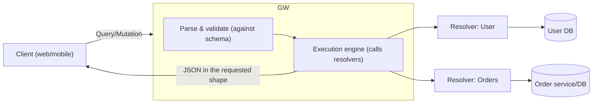
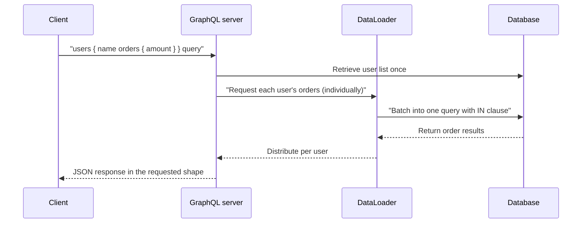

# GraphQL (API Query Language)

## 1. Overview

### A. Definition

> **GraphQL** is a **query language and runtime execution specification for APIs** in which a client specifies for itself the structure of the data it needs, and the server returns a response in exactly that shape. It was released by Meta (formerly Facebook) in 2015 and is now managed by a neutral foundation (the GraphQL Foundation).

The core idea of GraphQL is to invert the traditional API structure in which "the client transcribes a response the server has predetermined." Whereas REST places an endpoint per resource and lets the server decide the shape of that response, GraphQL places a strongly typed schema at a **single endpoint (usually `/graphql`)** and lets the client compose a query by choosing only the fields it wants within that schema. As a result, the response comes back as JSON that matches the requested fields exactly. In other words, control over "what to fetch and how" moves from the server to the client.

For this reason, GraphQL should be understood not as a mere protocol but as a contract-centric technology that jointly specifies a **type system, query language, and execution engine**. The schema is at once the API's specification and its documentation, and the front end and back end can develop independently by taking this schema as a shared contract.

### B. Background and Necessity

GraphQL was born from the concrete problem awareness of the spread of mobile environments. As various screens (iOS, Android, web) use the same back end while each screen needs slightly different data, supporting this with REST produces two chronic inefficiencies. The first is **over-fetching**: even when only a user's name is needed, the server returns the entire user object it has predetermined (address, sign-up date, settings, etc.). The second is **under-fetching**: to render a single screen, one must call the user, order, and product endpoints separately, several times each. Especially in environments with high latency and limited bandwidth such as mobile networks, this round-trip cost greatly degrades perceived performance.

Another difficulty REST faces is **endpoint proliferation and version management**. Each time a screen requirement grows, custom endpoints such as `/user/{id}/summary` and `/user/{id}/detail` accumulate, and to change the response structure one must fork the entire API into `/v1`, `/v2`, and so on. Because in GraphQL the client selects the fields, there is no need to add server endpoints even when the screen changes, and evolutionary changes that add new fields do not break existing clients, enabling **versionless evolution**.

In summary, GraphQL simultaneously targets four needs: (1) minimizing network round-trips and payloads, (2) accommodating the different requirements of diverse clients, (3) separated front-end/back-end development through a strongly typed contract, and (4) self-documentation based on the schema. However, this flexibility comes at the cost of server-side complexity and caching/security burdens, so its adoption presupposes a judgment about the trade-offs.

## 2. GraphQL Architecture and Execution Structure

A GraphQL system processes a query document sent by the client in a flow of **parse → validate → execute → respond**. At the center of execution are the schema and the **resolvers**—functions that actually compute the value of each field. A client query is tree-shaped, and the server follows this tree from top to bottom, calling each field's resolver to fill in values.



In the structure above, the server **aggregates** multiple sources (DBs, microservices, external APIs) behind a single schema. The client requests only the fields the schema promises, without needing to know where the data comes from, and each field's resolver calls the appropriate source behind the scenes. In this respect, a GraphQL server often also serves as an **API gateway and composition layer (BFF, Backend For Frontend)** that ties together multiple back ends.

GraphQL specifies three kinds of operations. **Query** is data retrieval (read) and must have no side effects; **Mutation** is data modification (write) that changes server state; and **Subscription** is an operation by which the client continuously receives server events (real-time push, usually WebSocket-based). The table below conceptually compares the three operations with their REST counterparts, but the essential difference is that in GraphQL all are handled through the same single endpoint.

| Operation | Purpose | Side effects | Similar REST concept |
|------|------|----------|----------------|
| Query | Retrieval (read) | None (idempotent) | GET |
| Mutation | Create, update, delete | Yes (state change) | POST/PUT/PATCH/DELETE |
| Subscription | Subscribe to real-time events | Receives a stream | WebSocket/SSE |

## 3. Core Components — Schema, Types, and Resolvers

The backbone of GraphQL is a strongly typed schema described in the **Schema Definition Language (SDL)**. The schema is the contract that declares the types and fields the API provides, and it nails down what the client can ask and in what shape it will receive answers. For example, one defines it as follows.

```graphql
type User {
  id: ID!
  name: String!
  orders: [Order!]!
}
type Order { id: ID! amount: Int! }
type Query { user(id: ID!): User }
```

Here, `!` means non-null and `[ ]` means a list. Because the types are specified this way, the server can perform **static validation** by checking against the schema before executing the request, and client tools can download the schema to provide autocomplete, type generation, and documentation. Thanks to **introspection**—the ability to query the schema itself—a GraphQL API describes itself without any separate documentation.

A resolver is a function that defines what value each field of the schema actually returns. The execution engine traverses the query tree, filling in values by passing the result of a parent field to the child resolvers. This hierarchical execution is both the power of GraphQL and the source of its risk; for example, if you retrieve a list of users and then retrieve each user's orders, an **N+1 problem** arises in which, for N users, N additional order-retrieval queries occur. Left unaddressed, a single screen can trigger hundreds of DB queries.

The standard solution to this problem is the **DataLoader** pattern. It briefly gathers (batches) the individual retrieval requests that occur within the same execution cycle, processes them as a single query, and caches results for the same key. For example, instead of retrieving the orders of 100 users individually, it processes them with a single `WHERE user_id IN (...)`, reducing the number of queries from 101 to 2. In this way, to handle GraphQL's flexibility in practice, batching and caching strategies become virtually essential components.



## 4. Comparison with REST — Why the Differences Arise and Their Practical Implications

Simply ranking GraphQL and REST as superior or inferior is inappropriate; the key from an advanced-professional perspective is understanding **where the differences originate**. The fundamental point of divergence between the two is "who holds the authority to decide the response shape." Because REST fixes the resource representation at the server, it is advantageous in caching, security, and learning curve, but the greater the diversity of clients, the harder it is to avoid over/under-fetching and endpoint proliferation. Because GraphQL lets the client decide the shape, network efficiency and front-end productivity are high, but at the cost of increased server complexity, caching difficulty, and the risk of query abuse.

| Category | REST | GraphQL |
|------|------|---------|
| Endpoints | Many, per resource | Single endpoint |
| Data fetching | Server decides shape (over/under-fetching) | Client selects fields |
| Type contract | Separate spec (OpenAPI, etc.) | Schema built-in, strongly typed |
| Caching | Naturally uses HTTP cache (GET+URL) | Requires separate application-layer cache design |
| Version management | Tendency to fork into `/v1`, `/v2` | Evolves by adding/deprecating fields |
| Learning curve / ecosystem | Low, mature | Relatively high |

In particular, the difference in **caching** greatly affects practical design. In REST, the URL uniquely identifies the resource and GET is idempotent, so CDNs, browsers, and proxies can use the standard HTTP cache as is. In contrast, GraphQL usually exchanges various queries through a single POST endpoint, so URL-based caching is nullified, and separate strategies are needed—such as the client library's normalized cache (e.g., keyed by object `id`) or building cache keys from persisted queries. This is a representative reason why the common belief that "GraphQL is always fast" does not hold.

In practice, **mixing** is common rather than a dichotomy. For example, public external APIs, file uploads, and simple CRUD are kept on REST, and only complex screens that must compose multiple sources or the mobile BFF layer are built with GraphQL. Representative examples at home and abroad include GitHub offering a GraphQL API (v4) alongside REST, and companies such as Shopify and Netflix adopting GraphQL for their internal service-composition layers.

## 5. Advanced — Security/Performance Threats and Federation

GraphQL's flexibility is also its **attack surface**. Because the client can freely construct query structures, **query depth/complexity attacks** are possible that exhaust server resources with deeply nested queries (e.g., `friends { friends { friends ... } }`). To prevent this, practice combines: (1) a maximum query depth limit, (2) **query cost analysis** that sums per-field costs and rejects when a threshold is exceeded, (3) a **persisted query allowlist** that permits only pre-registered queries, and (4) rate limiting. Also, while introspection provides development convenience, it is recommended to disable it in production to reduce exposure of the internal schema.

**Authorization** also requires a different approach than REST. REST can gate permissions per endpoint, but because a single GraphQL query spans multiple types and fields, **field-level authorization** is required. That is, the caller's permission must be checked for each field in the resolver or a schema directive, and omitting this creates a flaw where an unauthorized user accesses sensitive data through nested fields.

In large organizations, the problem of a schema becoming bloated is solved with **GraphQL Federation**. Multiple teams independently operate the subgraphs they each own, and a gateway composes these into a single unified supergraph. This aligns the microservice organizational structure with schema ownership, avoiding the situation where a single giant schema is managed as a bottleneck by one team. However, federation newly introduces the cost of gateway composition and the burden of distributed tracing (observability), so it is justified when the organizational scale and team boundaries are sufficiently large.

## 6. Considerations and Implications

First, **the adoption decision must start from trade-off analysis.** GraphQL offers large benefits in situations where diverse clients require different data and network round-trips are the bottleneck (mobile, complex dashboards, multi-back-end composition). Conversely, for simple CRUD, public APIs that need strong HTTP caching, and file-streaming-centric services, REST is simpler and safer. The choice should be based on client diversity and data-composition complexity, not on "trendiness."

Second, **performance is not free but the result of design.** Unless DataLoader batching for the N+1 problem, caching of query results, and cache-key securing through persisted queries are designed together, GraphQL can end up slower and heavier than REST. Observability (monitoring per-request resolver execution time and query complexity) must be secured from the start.

Third, **security must be redesigned at the field level.** Query depth/complexity limits, a persisted-query allowlist, control of introspection in production, and field-level authorization must be treated as defaults, and rather than leaving these to application code alone, it is desirable to enforce them in a common layer such as the gateway or schema directives.

Fourth, **governance and a schema-evolution strategy determine success or failure.** GraphQL pursues gradual evolution through adding fields and marking `@deprecated`, instead of forking versions. Therefore, backward-compatibility checks for schema changes (schema checks) should be included in CI, and as the organization grows, an **operational system that manages the API like a product**—such as distributing schema ownership via federation—is needed. From the perspective of an advanced information management professional, it is appropriate to treat GraphQL not as a single technology but as an architectural decision problem in which the API contract, organizational structure, performance, and security are intertwined.

## References

- GraphQL official spec and learning materials: https://graphql.org/learn/
- GraphQL Specification (GraphQL Foundation): https://spec.graphql.org/
- Apollo GraphQL — Federation overview: https://www.apollographql.com/docs/federation/

---

> **In one line**: GraphQL is an API specification in which a client picks only the fields it needs within a strongly typed schema and queries through a single endpoint; it resolves over/under-fetching and endpoint proliferation, but it is a trade-off technology in which the caching, security, and N+1 performance burdens must be handled by design.
