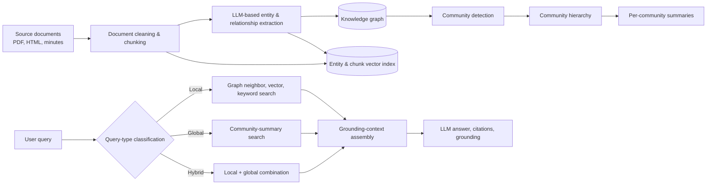
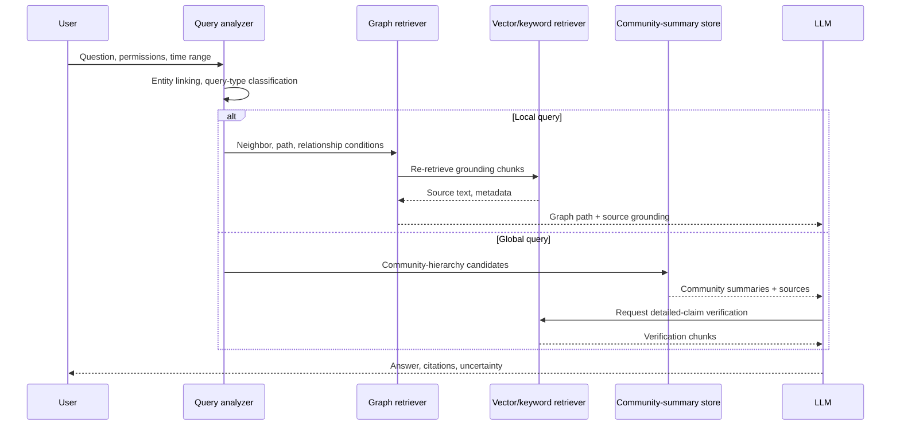

# GraphRAG (Graph-based Retrieval-Augmented Generation)

## 1. Overview

### A. Definition

> **GraphRAG (Graph-based Retrieval-Augmented Generation)** is a retrieval-augmented generation architecture that extracts entities and relationships from unstructured documents to build a knowledge graph and community summaries, and, depending on the query's purpose, retrieves graph structure, source text, and summaries to provide as the grounding for a large language model's (LLM's) answer.

Ordinary RAG divides documents into fixed chunks, generates embedding vectors, retrieves the chunks closest to the query, and inserts them into the LLM's context.
This approach is effective for finding a specific fact or the meaning of a single paragraph, but it has limitations for questions that connect the relationships among people, organizations, and events scattered across multiple documents, or that summarize the common themes of an entire corpus.
Because there is no guarantee that the retrieved chunks are connected to one another, the LLM must infer the connecting links, and widening the retrieval scope increases both token cost and noise at the same time.

GraphRAG does not preserve a document's meaning as a single vector alone.
It represents the entities and relationships extracted from documents as the nodes and edges of a graph, groups connected sets of entities into communities, and then generates a summary for each community.
At query time, it distinguishes between local search, which follows the surroundings of individual entities, and global search, which combines multiple community summaries.
Thus GraphRAG takes as its retrieval target not only "the most similar paragraph" but also "what is connected to what, and what meaning that connection has in the overall context."

### B. Background and Necessity

First, an enterprise's knowledge is not complete within a single document.
An incident report records the symptoms, a change-management document records the cause, and meeting minutes record the decisions and responsible organizations—so clues about the same event are divided across multiple documents.
Using vector search alone, one can find documents whose expression is similar to the query, but it is difficult to reliably combine the relationships between documents.

Second, a global query such as "what risks recur across the entire body of material?" does not fit an approach that returns a few top chunks.
Feeding all documents to the LLM creates cost and context-length problems, and simply concatenating retrieval results makes it hard to guarantee representativeness or deduplication.
If a community layer and summaries are built in advance, one can explore group-level patterns at query time without re-reading the entire body of material.

Third, a graph is well suited to managing the basis and provenance of data connections together.
By linking provenance—such as source document, page, extraction time, and reliability—to entities and relationships, one can trace the basis of an answer and mark points for human review.
However, the mere fact that a graph was generated automatically does not guarantee accuracy, so extraction errors and summarization errors must be treated as objects of quality management.

### C. Characteristics and Scope of Application

The core of GraphRAG is not the introduction of a graph database itself, but the extension of the retrieval unit from document chunks to structured knowledge and a summary layer.
The graph expresses paths, membership, dependencies, and temporal order among entities, while the vector index complements semantic similarity.
In real implementations, a hybrid structure that mixes graph search, vector search, keyword search, and full-text search within a single pipeline is common.

The targets of application are areas where connections between documents and collective summarization matter, such as internal regulation/policy queries, research-material exploration, correlation analysis of incidents and changes, supply-chain risk analysis, and patent/paper investigation.
Conversely, ordinary RAG is cheaper and easier to operate for services with little material that accurately find simple facts.
The adoption of GraphRAG should be judged by "does the reasoning value the graph adds exceed the cost of building and verifying it?" rather than "can we build a graph?"

## 2. Overall Structure and Processing Flow

### A. Reference Architecture

The structure above separates the indexing stage and the query stage.
In the indexing stage, source documents are cleaned, chunks are created, and entities, relationships, and claims are generated by an LLM or a rule-based extractor.
These results are stored in different forms in the graph store, the source-text store, and the vector index, but document IDs and chunk IDs are used as common keys to connect provenance.

The graph's nodes represent entities such as people, organizations, systems, products, events, and concepts, and the edges represent relationships such as "belongs to," "calls," "affects," and "occurred."
Document grounding and a time range are placed on the relationships.
For example, the relationship "service A calls database B" can record, as additional properties, the operational document from which the fact was extracted, the observation date, the extraction model, and the review status.

### B. Indexing Stage

The first step is ingestion and cleaning.
If a PDF's headers, footnotes, tables, and scanned images are mixed together, the subsequent entity extraction goes wrong, so OCR, layout preservation, deduplication, language detection, and inheritance of access permissions are handled first.
A graph that has lost the documents' own ACLs can cause a security problem larger than a loss of retrieval accuracy, so an access scope must be linked to both the source chunks and the graph facts.

The second step is semantic-unit chunking.
Simply cutting by fixed length can sever the relationships among clauses, events, and the rows and columns of a table.
Using the title hierarchy, paragraph boundaries, table headers, and time expressions, one designs it so that "who did what and when" is maintained within a single chunk.
If a chunk is too large, extraction cost and noise increase; if too small, the subject and object of a relationship are separated—so domain-specific experimentation is needed.

The third step is entity and relationship extraction.
The LLM is presented with a schema of allowed entity types and relationship types and made to output a JSON structure, but format validation and source-span validation are placed separately.
Normalization, synonym handling, and identifier mapping are applied so that the same target is not created separately as "Korea Electric Power," "KEPCO (Korean)," and "KEPCO."
If one does not verify whether the extraction result is actually grounded in the source text, the graph's connections become a path for spreading plausible false facts.

The fourth step is community detection and layering.
Rather than summarizing every node of the graph individually, sets of nodes with high connection density are grouped into communities, and sub-communities are layered into higher-level communities.
Here, community size and resolution are a compromise between query cost and the cohesion of the summary.
A community that is too large drifts into generalities in its summary, and one that is too small loses the context needed for global questions.

The fifth step is community-summary generation.
It is good to include in a summary the main entities, relationships, the flow of events, recurring claims, exceptions, and a list of sources.
Storing only the summary text weakens the link to the source, so the IDs of the graph elements and source chunks that composed the summary are preserved together.
The status labels "grounded," "estimated," and "conflicting" are separated so that the summarization model's expression does not turn into a stronger assertion than the source text.

### C. Query Stage

When a query arrives, the scope and intent of the question are analyzed first.
A question asking the cause of a particular system's incident is close to a local query that follows the neighbors and temporal path of that entity.
Conversely, "what is the common cause of delay that appeared across all projects?" is close to a global query that compares multiple communities.
Misclassifying the query type leads to answering a global question with a single document, or feeding an unnecessarily large number of summaries into a local question.

Local search identifies entities from the query and combines the k-hop neighbors of the corresponding node, related chunks, and vector-similar documents.
Reflecting the direction and time range of relationships makes it possible to distinguish "A affected B" from "B affected A."
The search results must be assembled so that the graph path and source citations are shown together, which lowers the chance that the LLM will arbitrarily interpolate the connections.

Global search makes community summaries into candidates and partially compares and aggregates multiple summaries to build the answer context.
An approach is used in which the question is decomposed into sub-questions, per-community answers are generated, and finally duplicates and contradictions are reconciled.
However, because detailed grounding is compressed as one climbs the summary hierarchy, a verification step that re-retrieves source chunks when necessary is placed in the final answer.

## 3. Core Components and Design Principles

### A. Graph Schema and Ontology

The schema defines which targets to make into nodes and which connections to recognize as valid relationships.
For example, in the IT-incident domain one can set services, infrastructure resources, deployments, incidents, causes, and responsible teams as entity types, and "deployed," "calls," "presumed cause of," and "responsible for" as relationship types.
If this classification is too fine, extraction and normalization costs increase; if too simple, important semantic distinctions in queries disappear.

A gradual approach is safe: initially build a minimal schema together with domain experts, and expand it while analyzing actual query-failure cases.
A schema change can trigger re-extraction of the existing graph and regeneration of summaries, so versions, migration rules, and compatibility are managed.
Expressing the temporality, reliability, source, and validity period of relationships as properties makes it possible to distinguish current state from past state.

### B. Entity Resolution and Provenance Management

Entity resolution is the process of judging whether different expressions refer to the same target.
Using name similarity alone can wrongly merge namesakes or organizational reorganizations, so identifier properties such as organization ID, system ID, address, and point in time are used together.
It is operated so that automatic merging creates candidates and high-risk merges receive human approval.

Provenance explains not so much what the graph knows as why it knows so.
Each node, edge, and summary should be linked to the source document, the page or character span, the extraction time, the model version, the reviewer, and the reliability.
When displaying sources in an answer, one should not present only the graph path but also provide document-level citations that let the user open and verify the original.

### C. Retrieval Combination and Context Assembly

Graph search is strong at structural connections, and vector search is strong at semantic similarity where the expression differs.
Because keyword search is strong at exact tokens such as product names, codes, and legal-clause numbers, the three methods are combined in the candidate-generation and re-ranking stages rather than pitted against one another.
For example, one can first link entities, then expand graph neighbors, and re-rank the chunks connected to each neighbor by vector similarity and source reliability.

More context is not necessarily better.
If duplicate chunks and contradictory facts from different points in time enter together, the LLM may select the most plausible sentence.
In the context-assembly stage, one performs deduplication, time filtering, ACL filtering, minimization of relationship paths, and marking of conflicting claims, and the answer prompt is given a rule that prohibits inference beyond the grounding.

## 4. Comparison with Ordinary RAG and Adoption Procedure

### A. Comparison

The difference between ordinary RAG and GraphRAG lies not in the presence of a vector database but in the representation unit of knowledge and the scope of the question.
Ordinary RAG centers on the semantic proximity of chunks, so implementation is simple and indexing cost is low.
GraphRAG, through the additional steps of graph extraction, normalization, and community summarization, precomputes inter-document structure and group-level meaning.

The graph-based approach is not superior for every query.
A question that finds an exact manual sentence is faster with source-chunk retrieval, and in environments where data changes frequently, the update lag of the graph and summaries becomes a problem.
Conversely, questions that require multi-hop reasoning, global comparison, and connecting organizations, events, and dependencies can have their retrieval candidates and answer explainability improved by GraphRAG's structural information.

| Comparison item | Ordinary RAG | GraphRAG | Practical implication |
|---|---|---|---|
| Basic unit | Embedded document chunks | Entities, relationships, communities, chunks | Select the unit according to question type |
| Strengths | Simple fact retrieval, fast to build | Multi-hop / global queries, connection explanation | Select domains where building a graph is worthwhile |
| Indexing cost | Chunking/embedding-centric | Adds extraction, resolution, detection, summarization | Budget for initial and update costs |
| Currency | Source/vector-update-centric | Requires graph/summary synchronization | Design incremental updates and validity periods |
| Grounding representation | Citation of retrieved chunks | Combines path, summary, and source citation | Include provenance in the answer contract |
| Main risks | Missing relevant chunks, fragmentation | Connection/amplification of extraction errors | Source verification and quality gates essential |

### B. Phased Adoption Procedure

Step 1 is to define the queries and success criteria.
Representative questions are divided into local, global, and hybrid types, and targets for correctness, groundedness, completeness, latency, and cost are set.
For example, "which services and supporting documents are affected by a particular incident?" and "what is the common cause of incidents over the past year?" are organized into separate evaluation sets.

Step 2 is to organize the material and permissions.
The owner, retention period, classification level, ACL, and version of documents are checked, and the access policy is inherited so that graph nodes do not have broader permissions than the source text.
For documents containing personal information or trade secrets, masking/tokenization/de-identification policies are applied, and the scope transmitted to the model provider is made clear.

Step 3 is to verify the indexing pipeline on a small domain.
In an area with few documents, such as incident management or product design, the entity types, relationship types, synonyms, and time expressions are decided, and the extraction results are sampled for human review.
If graph quality does not exceed the criteria, one improves the schema, chunking, and source cleaning first rather than tweaking the retrieval prompt.

Step 4 is to connect hybrid retrieval and answer evaluation to operations.
Starting with ordinary RAG as the default path and routing only questions where graph search is advantageous can limit cost and risk.
The answer displays supporting documents and uncertainty, and user feedback is classified into failed queries, missing entities, wrong relationships, and stale summaries and reflected into pipeline improvement.

## 5. Cases and Evaluation

### A. Incident-Knowledge Analysis Case

Suppose a hypothetical large-scale shopping platform integrates incident reports, deployment records, monitoring alerts, and meeting minutes.
Ordinary RAG can return chunks similar to "payment delay," but it is difficult for it to reliably show the entire path in which that delay began after a particular deployment and propagated to the order service through a surge of message-queue retries and exhaustion of the database connection pool.

GraphRAG makes the payment service, deployment version, message queue, database, and responsible team into nodes and records their relationships in temporal order.
If the query is "what was the initial change and scope of impact of this incident?", it locally searches the path from the deployment node to the incident node and the related chunks.
If the query is "what common cause recurred in last quarter's incidents?", it globally searches by comparing per-incident-community summaries for whether retry settings, capacity shortages, and external payment-API delays recurred.

The core of this case is that the graph does not automatically determine the cause but connects investigable candidates and grounding.
An edge expressed as causality must distinguish the states "observed temporal ordering," "confirmed by a responsible person," and "verified by experiment."
Otherwise, a simple temporal ordering gets summarized as a definitive cause and can mislead operational decisions.

### B. Evaluation Metrics and Testing

Retrieval evaluation measures whether the relevant entities, relationships, and chunks are included in the retrieval results.
Answer evaluation looks together at factuality, the accuracy of grounding citations, completeness in covering all conditions of the question, the handling of conflicting information, and whether there is any permission violation.
Optimizing a single score alone can hide problems where citations are abundant but the question is not answered, or the answer is fluent but has no grounding.

The offline evaluation set includes local questions with known correct paths, global questions requiring the synthesis of multiple communities, intentionally ambiguous questions, and questions where stale and current information conflict.
Online, beyond the answer-acceptance rate, one observes the grounding-view rate, re-query rate, the number of incorrect permission blocks, latency, and token cost.
When applying a new schema or extraction model, the existing evaluation set is re-run to check for regressions in graph quality.

## 6. Advanced: Cost, Currency, and Operational Trends

The cost of GraphRAG must be viewed separately as query-time cost and indexing-time cost.
Entity/relationship extraction and community summarization create an initial cost on large document sets, but they can lower the query cost for recurring global questions.
Conversely, if documents change frequently, regenerating the entire graph each time is inefficient, so incremental processing and a re-summarization policy that updates only the changed documents and affected communities are needed.

Rather than handling local and global search with a single giant prompt, a modular design that combines a query router, graph traversal, vector search, and summary re-retrieval is advantageous for operations.
Layering—using a low-cost model for candidate extraction and format validation, and a high-performance model in a limited way for contradiction reconciliation and the final answer—also helps reduce cost.
However, separating models creates per-model extraction bias and expression differences, so the compatibility of model versions and results must be recorded.

Microsoft's official GraphRAG documentation describes this approach as structured, hierarchical RAG, and the public repository README as of August 2026 states that the repository is in a maintenance-focused state and prioritizes responding to security vulnerabilities and dependency updates.
Therefore, rather than adopting a particular implementation as a standard platform as is, it is desirable to design the principles—graph schema, provenance, evaluation sets, access permissions—independently on the organization's data and LLM platform.
In the future, hybrid graph-and-vector search, dynamic community selection, lazy summarization, and agent tool calls are likely to be combined, but grounding traceability and update consistency should be prioritized over feature expansion.

## 7. Considerations and Implications

### A. Accuracy / Hallucination Control

The structural nature of a graph does not automatically guarantee the truthfulness of an answer.
If an entity or relationship that the LLM extracted incorrectly is connected to many documents, the error can be amplified, so source-span verification, relationship reliability, human approval, and marking of conflicting claims are placed as quality gates.
The final answer must separate inference that lacks grounding and, when unconfirmed, express it as "estimated" or "requires further verification."

### B. Currency / Synchronization

If the source has changed but the graph and community summaries remain, stale knowledge is retrieved as if it were current fact.
Document versions, change events, the graph's scope of impact, and summary expiration times are managed, and for high-risk work, source re-verification at query time is made mandatory.
For areas where batch updates alone are insufficient, change data capture and incremental re-indexing are introduced, but a consistency policy is set so that a graph undergoing partial update is not exposed to users.

### C. Security / Privacy / Permissions

Because a graph reveals at a glance the relationships that were scattered across documents, it can become more sensitive knowledge than the source text.
Document ACLs, tenant, retention period, and personal-information classification are inherited to nodes and edges as well, and it is separately tested whether unauthorized information can be inferred through graph-traversal paths.
Trust boundaries, input sanitization, tool-call permissions, and audit logs are applied so that prompt-injection documents do not contaminate the graph's relationships or summaries.

### D. Cost / Performance / Scalability

The number of LLM calls needed for entity extraction, relationship extraction, and summarization, and the cost of graph storage and search, are estimated according to document volume, change rate, and query volume.
Rather than making all community summaries at the highest resolution, the hierarchy and update cycle can be differentiated according to question frequency and importance.
In large graphs, the k-hop expansion breadth, relationship filters, cache, and precomputed summaries govern latency, so accuracy and response time are measured together.

### E. Organization / Governance

The responsibilities of the graph-schema owner, per-domain reviewers, data stewards, and AI-service operators are made clear.
When adding a new relationship type, its definition, examples, prohibited cases, and quality criteria are documented, and model or prompt changes are included in configuration management and the evaluation-approval process.
From an advanced-professional perspective, GraphRAG should be evaluated not as a simple chatbot feature but as an informatization architecture that connects data governance, knowledge management, security, and MLOps.

## References

- Microsoft Research, "Project GraphRAG" — https://www.microsoft.com/en-us/research/project/graphrag/
- Microsoft Research, "GraphRAG: New tool for complex data discovery now on GitHub" — https://www.microsoft.com/en-us/research/blog/graphrag-new-tool-for-complex-data-discovery-now-on-github/
- Microsoft, "GraphRAG documentation" — https://microsoft.github.io/graphrag/
- Microsoft GraphRAG GitHub repository — https://github.com/microsoft/graphrag
- Edge et al., "From Local to Global: A Graph RAG Approach to Query-Focused Summarization" — https://arxiv.org/abs/2404.16130

---

> **In one line**: GraphRAG is a RAG-extension architecture that combines entities, relationships, community summaries, and hybrid retrieval to support inter-document multi-hop reasoning and global queries over an entire body of material, and the key to a successful adoption lies not in the graph itself but in operating provenance, permissions, currency, and evaluation together.
