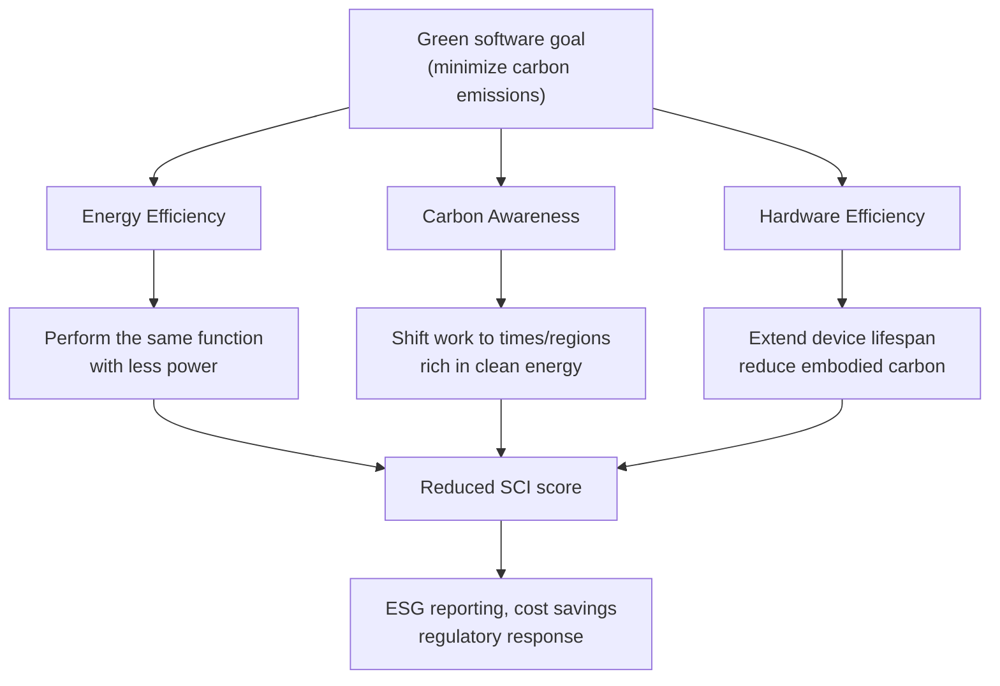
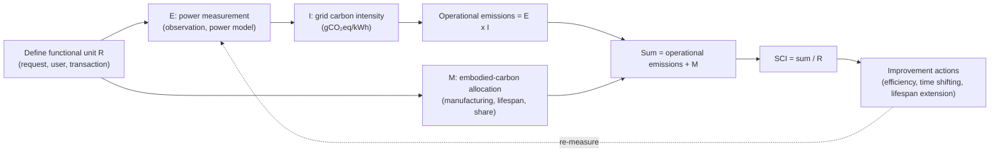

# Green Software and Sustainable Software Engineering

## 1. Overview

> **Definition**: Green software is software built to minimize power consumption and carbon emissions across the entire software lifecycle—from design, development, and deployment to operation and disposal—and sustainable software engineering is the engineering practice of treating carbon efficiency as a first-class quality attribute alongside performance, cost, and stability.

An information system runs on physical hardware that consumes power, and that hardware in turn emits greenhouse gases in the course of manufacturing, transport, and disposal.
Therefore, although software has no smokestack of its own, it indirectly causes carbon emissions by determining the power demand of servers, networks, and terminals.
In the past this emission was regarded as belonging only to data-center operators or hardware manufacturers, but with the spread of the cloud and generative AI, it has become an era in which a single line of code, a single query, and a single model inference are converted into power and carbon.
The recognition that a software engineer's design choices govern emissions is the starting point of green software.

Behind the rise of green software, three pressures overlap.
First, ESG management and each country's carbon-neutrality (Net-Zero by 2050) regulations require companies to report not only Scope 1 and 2 but also Scope 3 emissions, which include partners and the cloud.
Second, as generative-AI training and inference have surged, data-center power demand has grown to a level that pressures national power grids, and power cost has come to be directly connected to operating cost (FinOps).
Third, with the enactment of international standards such as ISO/IEC 21031:2024 (SCI), the vague slogan of "eco-friendly" has been converted into measurable metrics.
These three pressures have turned green software from a moral choice into a management task that combines regulatory response, cost reduction, and technological competitiveness.

Sustainable software engineering is therefore not merely a "let's write lighter code" austerity campaign.
It is a comprehensive management system encompassing architectural decisions, deployment strategy, operational scheduling, hardware-lifecycle management, and even the organization's measurement and reporting systems.

## 2. Core Principles and Overall Structure of Green Software

The Green Software Foundation (launched in 2021 under the Linux Foundation) organizes emission reduction into three principles.
These principles are complementary, and applying only one can create a balloon effect in which emissions increase elsewhere, so they must be considered in an integrated way.

### A. Energy Efficiency

Energy efficiency is the principle of making the same function performed with less power.
The key is to lower algorithmic complexity, remove unnecessary computation, network round-trips, and redundant rendering, and reduce the consumption of idle resources.
For example, changing an O(n²) sort to O(n log n), or consolidating N+1 queries into a batch retrieval, reduces CPU occupancy time and immediately saves power.
Eliminating idle instances with serverless and auto-scaling is also a representative case of energy efficiency.

A point to note is that energy efficiency does not always coincide with performance.
Over-provisioning resources for a fast response improves performance but increases idle power.
Conversely, excessive compression or deferred processing can actually increase CPU usage.
Therefore, energy efficiency is measured with a unit metric such as "watt per request," and a balance point with performance must be found.

In practice, one uses profiling to find power hotspots, removes repeated computation with caching, indexing, and batching, and at the code level even examines the choice of compiled languages and lightweight runtimes.
A large domestic commerce company has reported a case of significantly reducing computation by changing its product-recommendation batch from a single nightly run to incremental processing.

### B. Carbon Awareness

Carbon awareness exploits the point that emissions differ even for the same power depending on "when and where" computation is performed.
The carbon intensity of the grid (gCO₂eq/kWh) varies greatly by time of day and region.
At midday when solar power is strong or during hours with a lot of wind power, the share of clean power is high and the emission factor is low, while during late-night peak hours dominated by thermal generation it is high.

Two practices that use this principle are demand shifting (time shifting) and demand shaping (location shifting).
Time shifting is scheduling non-urgent batch work (backups, report generation, model retraining) to times of low carbon intensity.
Location shifting is placing workloads in regions with a high share of clean power, within the range that latency constraints allow.
For example, Microsoft and Google have stated that they operate carbon-aware scheduling that adjusts the execution timing of training work by receiving real-time grid carbon signals.

Carbon awareness does not reduce total power usage, so it must always be combined with energy efficiency.
It also has the limitation of being difficult to apply to latency-sensitive online transactions, being confined to shiftable, deferrable workloads.

### C. Hardware Efficiency and Embodied Carbon

Hardware efficiency is the principle of reducing the embodied carbon that is generated when a device is manufactured and disposed of.
A substantial part of the carbon emissions of a server or a smartphone is already fixed in the manufacturing stage, not from power during use.
Therefore the key is to extend device lifespan, keep software running smoothly even on old hardware, and raise server utilization to reduce the number of physical devices needed.

From a software perspective, hardware efficiency is realized in two directions.
First, supporting backward compatibility and lightweight clients so that frequent forced upgrades do not prematurely retire older devices.
Second, raising physical-server utilization through container density (bin-packing) and multi-tenancy to eliminate idle equipment.
This is why virtualization and container orchestration are cited as base technologies of green IT.

## 3. The Measurement Standard: SCI (Software Carbon Intensity) and the SCI Calculation Process

Following the principle that "you cannot improve what you cannot measure," a standardized measurement metric lies at the center of green software.
The representative one is SCI (Software Carbon Intensity), developed by the Green Software Foundation and enacted as the international standard **ISO/IEC 21031:2024** in March 2024.
SCI is characterized by the fact that it does not deal with totals or offsets, but calculates a **rate** of carbon emissions per functional unit.

The basic formula for SCI is as follows.

> **SCI = ((E × I) + M) / R**
> - E: energy the software consumed (kWh)
> - I: the location-based marginal carbon intensity of the relevant grid (gCO₂eq/kWh)
> - M: embodied carbon allocated from hardware manufacturing and disposal (gCO₂eq)
> - R: functional unit — one user, one API call, one transaction, etc.

Here (E × I) represents the operational emissions of the use phase and M represents the embodied emissions of the hardware, and dividing this by the functional unit R quantifies "how many grams of CO₂ are emitted per request."
Because it is defined as a rate, even if a service grows and total emissions increase, a decline in SCI can be interpreted as an improvement in unit efficiency.
This is especially useful for organizations that want to track growth and decarbonization together.

SCI calculation proceeds as a cyclical process of defining the functional unit → setting the boundary → computing E, I, and M → normalizing by the functional unit → improving and re-measuring.
The most difficult steps are the allocation of M (embodied carbon) and the accurate metering of E (power).
Power, which is hard to measure directly in cloud environments, is estimated with a CPU-utilization-based power model or the cloud provider's emissions dashboard, and transparently disclosing the estimation method and boundary is a requirement of the standard.

## 4. Relationship with and Comparison to Green IT

Green software is one axis of the broader field of Green IT.
Whereas Green IT centers on physical infrastructure—data-center cooling, renewable-power procurement, hardware recycling—green software deals with the code and operational methods running on that infrastructure.
The difference between the two lies in the different levers of improvement.
Infrastructure efficiency is managed with facility metrics such as PUE (Power Usage Effectiveness), but no matter how low the PUE, if inefficient code triggers unnecessary computation, total emissions do not decrease.

| Category | Green IT (hardware/infrastructure) | Green software | Carbon-aware computing |
|------|--------------------------|------------------|-------------------|
| Focus | Data-center/device efficiency | Code, architecture, operation | Execution timing/location |
| Representative metric | PUE, WUE | SCI, watt/request | Grid carbon intensity |
| Owner | Facilities/infrastructure team | Development/architects | Operations/scheduler |
| Limitation | Cannot control code waste | Cannot control facility emissions | Does not reduce total |

As this table shows, the three areas are not substitutes but complements.
For example, even in a 100%-renewable data center, if power is globally scarce, the saved clean power can be used elsewhere, so software efficiency still holds social value.
Ultimately, sustainability is realized when facilities, software, and operations collaborate in the common language of SCI.

## 5. Advanced: Sustainability in the Age of Generative AI and Recent Trends

The spread of generative AI has elevated green software from an option to a mandatory agenda.
Training a large language model runs thousands of GPUs for weeks, and inference too, as the service scale grows, has cumulative power that surpasses training.
Therefore, recent discussion is shifting toward the **carbon efficiency of the inference stage** rather than training, and toward methodologies for reflecting this in a company's greenhouse-gas inventory (especially Scope 3).

The practice of AI sustainability connects to the three principles above.
On the energy-efficiency side, model lightweighting (quantization, pruning, knowledge distillation), adoption of small specialized models (sLLM), batch inference, and KV-cache reuse greatly reduce power.
On the carbon-awareness side, deferrable training/retraining is scheduled to clean-power time slots and regions.
On the hardware-efficiency side, multi-tenancy that raises GPU utilization and the adoption of inference-dedicated accelerators improve throughput per unit of embodied carbon.

Standards and policy trends are also moving quickly.
Following the international standardization of ISO/IEC 21031 (SCI) in 2024, cloud providers offer per-customer carbon dashboards (e.g., AWS Customer Carbon Footprint Tool, Microsoft Emissions Impact Dashboard, Google Cloud Carbon Footprint) and are strengthening alignment with SCI and the GHG Protocol.
In the open-source camp too, such as CNCF, tools that observe the carbon and power of workloads (e.g., Kepler) and benchmarking such as green-reviews are spreading, so the scope of observability is trending beyond performance and cost toward carbon.

The expected exam-question directions from an advanced-professional perspective are as follows.
For the conceptual type, "explain the three principles of green software and the SCI formula"; for the essay type, "strategies to improve the carbon efficiency of generative-AI services" or "a plan to design a sustainable architecture based on SCI" are likely.
When composing an answer, one should develop it in the flow of principles → measurement (SCI) → architecture/operational application → trade-offs → governance, and mentioning the linkage with ESG, FinOps, and observability is a high-scoring strategy.

## 6. Considerations and Implications

First (measurement reliability and preventing greenwashing), carbon metrics often depend on estimation, so unless the boundary, assumptions, and data sources are transparently disclosed, one is exposed to greenwashing controversy.
An advanced professional must clearly define SCI's functional unit and calculation boundary and design the organization to prioritize actual abatement over reliance on offsets.

Second (managing trade-offs), carbon efficiency can conflict with performance, availability, cost, and development productivity.
Excessive time shifting threatens SLAs, and excessive lightweighting invites quality degradation.
Therefore, rather than pushing carbon as a single objective, one should treat it as a multi-objective optimization problem and make the judgment of differentiated application by distinguishing deferrable and real-time workloads.

Third (governance and organizational embedding), sustainability is not a one-off campaign; it is sustained only when a carbon budget and SCI gates are embedded in architecture reviews, CI pipelines, and SRE operations.
An effective approach is to extend FinOps' cost-governance system into GreenOps, which manages cost and carbon together.

Fourth (linked technologies and outlook), green software is tightly interlocked with cloud-native (auto-scaling, serverless), observability (Kepler, OpenTelemetry), FinOps, and ESG disclosure (ISSB, CSRD).
In the future, it is expected that SCI, like the SBOM, will establish itself as a standard deliverable of the software supply chain, and that carbon metrics will be included in procurement and contract requirements.
An advanced professional must play the role of proactively reflecting such regulatory and standards changes into architecture and organizational processes.

## References

- Green Software Foundation, "SCI — Software Carbon Intensity" — https://greensoftware.foundation/standards/sci/
- Software Carbon Intensity (SCI) Specification — https://sci.greensoftware.foundation/
- ISO/IEC 21031:2024, Information technology — Software Carbon Intensity (SCI) specification — https://www.iso.org/standard/86612.html
- Green-Software-Foundation/sci (GitHub) — https://github.com/Green-Software-Foundation/sci
- CNCF green-reviews-tooling, SCI measurement documentation — https://github.com/cncf-tags/green-reviews-tooling/blob/main/docs/measurement/sci.md

---

> **In one line**: Green software is an engineering practice that reduces the carbon emissions of the software lifecycle through the three principles of energy efficiency, carbon awareness, and hardware efficiency; it measures per-functional-unit emissions with ISO/IEC 21031 (SCI) and embeds sustainability as governance by linking it with ESG, FinOps, and observability.
