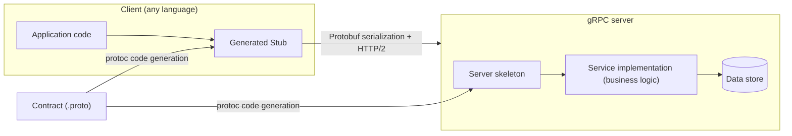
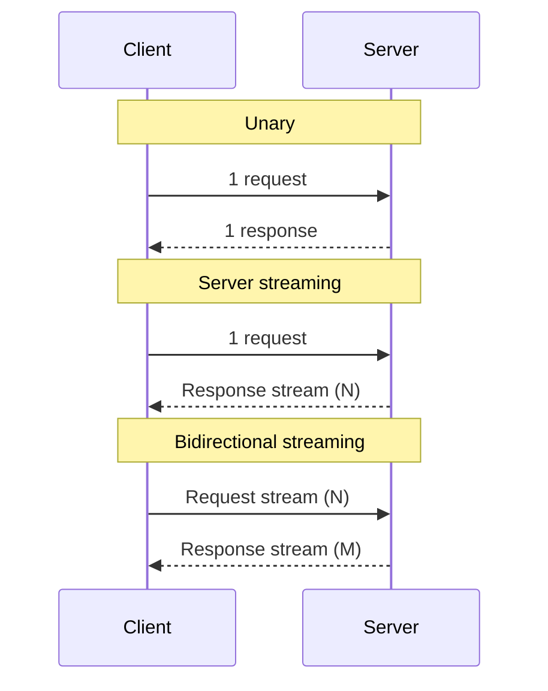

# gRPC (Google's RPC Framework)

## 1. Overview

### A. Definition

> **gRPC** is a **high-performance Remote Procedure Call (RPC) framework** that lets different processes and servers call a remote function as if calling a local one. It defines the interface with a language-neutral IDL called **Protocol Buffers (protobuf)**, auto-generates client and server code from that definition, and performs transport as binary serialization over **HTTP/2**. It was released by Google in 2015 as a redesign of its in-house RPC system (Stubby) and is now managed by the CNCF (Cloud Native Computing Foundation).

The core idea of gRPC is to revive, on modern infrastructure, the RPC tradition of "treating a network call like a local function call." Whereas REST is resource-oriented—"representing a resource as a URL and manipulating it with HTTP verbs"—gRPC is **behavior-oriented (method-oriented)**, centered on "what to do." A developer first declares a service contract such as `GetUser(UserRequest) returns (UserReply)`, and tooling generates stubs for both languages (Go, Java, Python, C++, etc.) from that contract. As a result, the client only needs to call the generated method, without knowing the network or serialization details.

For this reason, gRPC should be understood not as a mere communication protocol but as an integrated specification that bundles **IDL (contract), code generation, serialization, transport, and authentication** into one. The `.proto` file becomes the single source of truth for the API, so multilingual microservices share this contract and can be developed and deployed independently.

### B. Background and Necessity

gRPC was born from the concrete problem awareness of the spread of large-scale microservice architectures (MSA). In environments where hundreds to thousands of services call one another an enormous number of times per second, text-based JSON/REST incurs three chronic costs. The first is **serialization/payload cost**: JSON is human-readable but repeats field names in every message and is slow to parse. The second is **connection cost**: because in HTTP/1.1 request-response is sequential on a single connection, round-trip latency accumulates in high-volume internal communication. The third is **contract fragility**: REST's JSON has weak schema enforcement, so field typos and type mismatches surface only at runtime.

gRPC confronts this head-on by (1) greatly reducing payloads with Protobuf binary serialization, (2) concurrently handling many calls with HTTP/2's single-connection multiplexing, and (3) catching contract mismatches at compile time with a strongly typed IDL. In particular, by supporting streaming as a first-class feature at the protocol level, it naturally expresses patterns that REST handles with difficulty, such as real-time data feeds and bidirectional communication.

In summary, gRPC simultaneously targets four needs: (1) low-latency, high-throughput internal communication, (2) contract-based integration of polyglot services, (3) diverse call models including streaming, and (4) development productivity through code generation. However, because it is a binary format that is hard for humans to read directly and hard to call directly from a browser, its adoption presupposes a judgment about the usage context (internal vs. external/public).

## 2. gRPC Architecture and Call Flow

A gRPC system processes the `.proto` contract with a compiler (`protoc`) to generate the **client stub** and **server skeleton**, and at runtime the two are connected by an HTTP/2 channel to exchange messages. The client calls a stub method, the gRPC runtime serializes the arguments as Protobuf and transmits them as HTTP/2 frames, and the server deserializes them, runs the actual implementation, and returns the response by the same path.



The essence of the structure above is that **the contract (.proto) specifies both sides' code at once**. Even if the client and server are in different languages or owned by different teams, they share the same `.proto`, so contract changes such as adding a field or changing a type are consistently reflected on both sides at the code-generation step. This structurally reduces the chronic API-operation ailment of "documentation-implementation mismatch."

A gRPC call strongly depends on **HTTP/2** at the transport layer. HTTP/2's (1) stream multiplexing that carries multiple requests concurrently on a single TCP connection, (2) header compression (HPACK), and (3) server push and flow control are the foundation that makes gRPC's low latency and streaming possible. The table below conceptually compares transport/serialization characteristics against REST (HTTP/1.1, JSON), but because the actual performance difference varies with message size, language, and network, it should be understood as a tendency rather than absolute figures.

| Category | gRPC | Traditional REST (HTTP/1.1) |
|------|------|------------------------|
| Contract (IDL) | `.proto` (strongly typed, required) | OpenAPI (optional, loose) |
| Serialization | Protobuf (binary) | JSON (text) |
| Transport | HTTP/2 (multiplexing) | Mainly HTTP/1.1 |
| Streaming | 4 kinds supported natively | Separate (SSE/WebSocket) |
| Readability | Low (binary) | High (human-readable) |
| Direct browser call | Limited (needs gRPC-Web) | Easy |

## 3. Core Components — Protobuf, Service Contract, and 4 Call Models

The backbone of gRPC is the strongly typed message/service definitions described with **Protocol Buffers**. In a `.proto` file, one declares messages (data structures) and services (sets of callable methods), and each field is given a **field number (tag)**. This number becomes the key of the binary encoding, so the core rule of backward compatibility is never to reuse a number once deployed. For example, one defines it as follows.

```protobuf
syntax = "proto3";
message UserRequest { int32 id = 1; }
message UserReply { int32 id = 1; string name = 2; }
service UserService {
  rpc GetUser(UserRequest) returns (UserReply);
}
```

Here the field numbers (1, 2) are preserved even if order or names change, so the evolutionary change of **adding a new field with a larger number** does not break existing clients. This "number-based backward compatibility" is the core device that makes contract evolution safer than REST's JSON. Conversely, reusing a field number or changing a type misaligns the binary interpretation and can cause silent data corruption, so an organization-wide discipline for `.proto` changes is essential.

The call models gRPC specifies are fourfold, and this is gRPC's differentiator that elevated streaming to a first-class protocol feature. **Unary** is 1-request/1-response, similar to REST. **Server streaming** sends multiple responses sequentially from the server for one request and is used for large retrievals and subscriptions. **Client streaming**, in which the client sends multiple messages and the server responds once, is suited to uploads and aggregation. **Bidirectional streaming**, in which both sides independently exchange streams, is used for interactive cases such as chat and real-time collaboration.



## 4. Comparison and Application — How It Divides from REST and GraphQL

The criterion that divides gRPC from REST and GraphQL is the usage context of "who calls from where." gRPC's strengths (binary efficiency, strong typing, streaming) are maximized in **service-to-service internal communication**, but because it is a binary format that is hard for a human to read directly with browser dev tools, and because a browser cannot handle HTTP/2 frames directly, it must go through a proxy layer called **gRPC-Web**. For this reason, the dominant pattern in practice is a division of roles: "REST/GraphQL for public external APIs, gRPC between internal microservices."

The fundamental reason the differences arise is that the optimization goals differ. REST prioritizes **generality and readability** (the web ecosystem, caching, human comprehension), GraphQL prioritizes **client-driven data composition** (resolving over/under-fetching), and gRPC prioritizes **machine-to-machine low latency and high throughput**. Therefore none is absolutely superior; the choice should be based on the nature of the traffic (internal/external), the consumer (human/machine, browser/server), and the data pattern (single/stream). The table below summarizes this judgment.

| Perspective | gRPC | GraphQL | REST |
|------|------|---------|------|
| Best use | Internal service-to-service communication | Composite retrieval by diverse clients | Public, general-purpose web APIs |
| Consumer | Servers, microservices | Web/mobile front ends | Broad external |
| Performance (internal) | Very high | Medium | Medium |
| Streaming | Strong (bidirectional) | Subscription | Requires separate | 
| Learning/operation burden | High (tooling, binary) | Medium | Low |

As a concrete application case, large operators such as Netflix and Google handle calls among thousands of internal services with gRPC to reduce latency and bandwidth, and combine it with a service mesh (Istio, Linkerd) to layer on observability, security, and traffic control. Also, the fact that **Kubernetes** itself extensively uses gRPC-family communication for communication among control-plane components and for accessing the state store (etcd) shows that gRPC has established itself as the de facto standard means of internal communication for cloud-native infrastructure.

## 5. Advanced — Error Handling, Authentication, gRPC-Web, and Recent Trends

gRPC expresses success/failure not with HTTP status codes but with its own **status codes**. It returns standard codes such as `OK`, `NOT_FOUND`, `INVALID_ARGUMENT`, `DEADLINE_EXCEEDED`, and `UNAVAILABLE` carrying a message and detail, so multilingual clients can handle errors consistently. It also propagates a **deadline/timeout** per call, so that the deadline set by an upstream call is inherited down to downstream services, structurally preventing indefinite waits and resource exhaustion in large call chains. On the security side, it encrypts channels with **TLS as a default premise** and standardly combines authentication, authorization, and logging via tokens, mutual TLS (mTLS), and interceptors.

**gRPC-Web**, which works around browser constraints, is a method in which a proxy (such as Envoy) converts the HTTP/1.1-compatible requests a browser sends into gRPC. However, due to browser constraints, client streaming and bidirectional streaming may not be fully supported, so a layered configuration is common in which the front end uses REST/GraphQL and gRPC is used internally after the front-end/back-end gateway. Relatedly, a dual-interface strategy that exposes both REST (JSON) and gRPC from a single `.proto` using a **gateway** tool is also widely used.

Recent trends include: securing **observability (tracing, metrics)** outside application code through combination with a service mesh; **client-side load balancing** that performs load distribution on the client side; and combinations with stateless event processing. However, because such features, versions, and implementation details keep evolving, it is advisable to check the supported scope in the official documentation at the time of actual adoption.

## 6. Considerations and Implications

From an advanced-professional perspective, adopting gRPC requires judging the following strategy and trade-offs together.

- **Clarifying the boundary of application**: gRPC is not an all-purpose substitute; it has a clear zone of strength in "low-latency communication between internal services." Forcibly unifying even public-facing, browser-consumed APIs into gRPC can actually increase total cost of ownership due to the gRPC-Web proxy and degraded readability. It is realistic to nail down as an architectural principle the layered standard of **REST/GraphQL externally, gRPC internally**.

- **Contract (.proto) governance**: One must discipline `.proto` changes organization-wide—prohibiting field-number reuse, backward-compatibility rules, a schema registry, CI validation, and so on. Because the contract is a shared asset of many teams, embedding change reviews, version policy, and compatibility tests into the pipeline is the key to stable operation.

- **Observability / operational maturity**: A binary protocol is hard for humans to debug by eye. One must secure distributed tracing (OpenTelemetry), structured logging, and metrics via interceptors or a service mesh, and standardize deadline, retry, and circuit-breaker policies to control failure propagation in large call chains.

- **Organizational capability and learning curve**: The barrier to entry—code generation, toolchains, understanding HTTP/2—is higher than REST. Validating with a pilot service and adopting it gradually while running in-house standard scaffolding, templates, and training lowers the risk.

- **Outlook and linked technologies**: gRPC has settled as the de facto internal standard of cloud-native (Kubernetes, service mesh), and its combination with observability, zero trust (mTLS), and event-driven architectures is expanding. A design that absorbs protocol conversion (gRPC↔REST) at the API-gateway/BFF layer is establishing itself as a practical solution that satisfies both human and machine consumers at once.

---

> **In one line**: gRPC is an RPC framework that combines a strongly typed `.proto` contract and code generation, Protobuf binary serialization, and HTTP/2 multiplexing/streaming to realize **low-latency, high-throughput communication between microservices**, forming the axis of a layered API strategy of "gRPC internally" that divides roles with public-facing REST/GraphQL.
