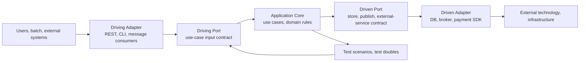
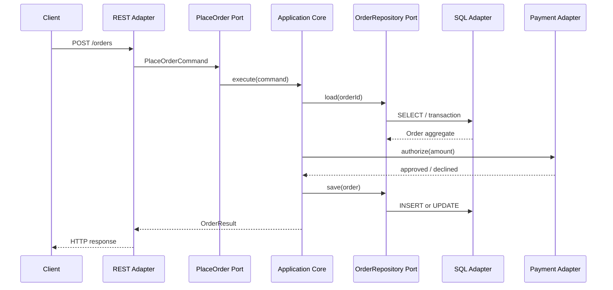

# Hexagonal Architecture (Ports and Adapters)

## 1. Overview

> Hexagonal architecture is an architectural style that separates an application's business core from external technology and connects it to users, databases, messaging, and external systems through ports, which express purpose, and adapters, which convert technology.

Enterprise software often has its structure determined by the calling conventions of web frameworks, ORMs, message brokers, and cloud SDKs rather than by business rules.
At first one can quickly build screens and tables, but over time business rules creep into controllers, domain objects become bound to a specific ORM, and a real database must be spun up for testing.
This phenomenon can be viewed as technology dependency and business-logic contamination.

Hexagonal architecture places the application at the center and represents the outside world as connection points in multiple directions.
The hexagon shape itself does not mean six fixed layers; it is a visual metaphor used instead of a rectangle to express diverse conversations.
What matters is not which direction the outside is in, but that the core converses with the outside only through the abstract contract called a port.

A port is the contract of a meaningful conversation that the application provides or requires.
For example, business purposes such as `place an order`, `reserve stock`, and `save the payment-authorization result` can be expressed as ports.
An adapter converts technical input/output such as HTTP, SQL, Kafka, files, and test doubles into port calls and data.
Therefore a REST adapter and a CLI adapter can be connected to the same port at once, and a PostgreSQL adapter and an in-memory adapter can be swapped and connected to a storage port.

The goal of this style is not simply to split folders into `domain`, `application`, and `infrastructure`.
The core goal is to make the direction of dependency point inward so that business rules can be executed and verified without knowing the existence of the UI, database, or framework.
By separating the reason external technology changes from the reason business policy changes, one can reduce the scope in which a requirement change propagates through the entire code.

Whether to apply it is judged by the direction of change rather than by trend.
The effect is large when payment methods, storage, messaging platforms, or channels change, or when the same business rules must be reused from multiple entry points.
Conversely, creating excessive ports and adapters for a system with almost no business rules and a short lifespan—such as a simple CRUD screen—only increases abstraction cost.
An advanced professional must weigh together the expected change-isolation benefit and the operational/training cost of the additional structure.

## 2. Overall Conceptual Diagram and Design Principles

Hexagonal architecture is a way of explaining the boundary between the core and the outside rather than a single fixed layer model.
Inside are domain rules and use cases, and outside are the technical elements that call them or are called by them.
The rule that the inside does not directly import the outside is the core of the structure.

In the figure above, a driving adapter starts the flow from the outside inward.
An HTTP controller, GraphQL resolver, scheduler, CLI, or message consumer converts a request into a command the input port understands and then calls the application core.
This adapter handles technical conversions such as JSON parsing, extracting the authentication context, and protocol-specific error responses, and does not decide discount rules or stock invariants.

A driven port abstracts the capability the core requires from the outside.
The core need not know whether `OrderRepository` is PostgreSQL or a document database, nor whether `PaymentGateway` is a specific card company's SDK or a mock object.
When the core owns the port's interface, external implementations connect to that contract, so the dependency-inversion principle appears in the import direction of the actual code.

A driven adapter converts the core's calls into a technical protocol.
A SQL adapter maps domain objects and rows, a message adapter serializes domain events into broker messages, and an external-API adapter translates timeouts, retries, and error codes into results the business core will use.
Only by not mixing this conversion responsibility into the core can one separate the failure modes of infrastructure from business policy.

### 2.1 The Boundary Between Inside and Outside

The application core can be thought of as divided into a domain model and application services.
The domain model protects business rules and invariants such as amounts, states, permissions, and stock, while an application service coordinates the order in which a single use case is executed.
Neither element should directly receive external concepts such as a web framework's request object or an ORM's lazy loading.

When drawing the boundary between the business core and the technical outside, one asks about the reason for change.
The `order-cancellation window` changes due to a policy change, but the `HTTP status code` changes due to an API-contract change.
If the two rules are in the same class, a change to one shakes the other's tests and deployment, so elements with different reasons for change are separated by the port-and-adapter boundary.

| Category | Key question | Representative composition | External dependency allowed |
|---|---|---|---|
| Domain core | What must always be true in the business? | Entities, value objects, domain services | Direct dependency on framework/DB prohibited |
| Application core | In what order are use cases coordinated? | Commands, handlers, transaction boundaries | Depends only on port interfaces |
| Driving port | What business function does the outside request? | `PlaceOrderUseCase` | Uses business terms over technical terms |
| Driven port | What external capability does the core require? | `OrderRepository`, `PaymentPort` | Depends on the contract, not the implementation |
| Driving adapter | How is external input turned into a core call? | REST, CLI, consumers | Protocol, authentication, deserialization |
| Driven adapter | How is a core call turned into external technology? | SQL, Kafka, SDK | Mapping, retry, timeout |

The distinctions in the table do not mean deployment units.
All ports and adapters can exist even inside a small monolith, and conversely even a microservice fails to keep the hexagonal principle if its core is contaminated by external technology.
Architectural judgment prioritizes the separation of dependency, responsibility, and change boundaries over process separation.

### 2.2 The Meaning and Direction of Ports

A port is not simply a collection of every CRUD method but a purposeful conversation boundary.
Exposing `save()`, `find()`, and `update()` indiscriminately lets an adapter manipulate the core's internal data structures, so one uses names and inputs that preserve the intent of the use case and the invariants of the domain.
For example, `reserveStock(productId, quantity)` reveals the policy of stock reservation, whereas `updateInventoryRow()` reveals the storage structure.

A driving port is the input contract the core provides to the outside.
A REST endpoint and a message consumer can call the same use case in different ways, but from the core's perspective they can be unified into the same conversation that passes a `PlaceOrderCommand`.
If the port comes to know HTTP headers or a broker offset, the technical boundary penetrates inward, so only the meaning needed for business processing—such as the authentication subject and trace ID—is passed as a separate context.

A driven port declares the result the core wants to obtain from the outside.
A storage port expresses the meaning of persistence and the concurrency conditions, and a notification port expresses the purpose "notify of the fact that an order was received."
The port's return values and errors must also be designed from a business perspective, converting a `SQLException` or a specific SDK exception into meanings such as retryable/non-retryable and duplicate/rejected, rather than propagating them as is to the core.

That multiple adapters connect to a single port is an important characteristic of this style.
Connecting a real payment adapter, a sandbox adapter, and a failure simulator to `PaymentPort` lets one swap the technology of the operation, verification, and development environments.
However, one need not create a port for every external system; one should abstract, starting from the boundaries that have swappability, test isolation, and business meaning.

### 2.3 Dependency Inversion and Assembly

Dependency inversion is not the slogan "let's abstract" but a design that changes the ownership of dependency.
In a traditional structure, a service calls a DB implementation and business code may be written to fit the API the DB provides.
In a hexagonal structure, the core declares the contract it needs—the port—and the outside adapter implements that port.

Assembly (composition) is the step of connecting ports and implementation adapters in the execution environment.
A dependency-injection container can be used, but the container itself does not guarantee a hexagonal structure.
At the production startup point one connects `PostgresOrderRepository`, `RealPaymentAdapter`, and `RestController`, and in tests one connects `InMemoryOrderRepository` and `StubPaymentAdapter`.

When assembly code manages per-environment differences in one place, one can reduce the core's directly reading configuration files or global singletons.
To avoid accidentally connecting an in-memory adapter that works only in development to production, startup-time configuration validation and a dependency list are managed together.
Whether to start the application partially or fail immediately when an adapter connection fails must also be decided according to the service's availability requirements.

## 3. Per-Component Design and Implementation Procedure

### 3.1 A Use-Case-Centric Application Core

Use cases are defined based on business purpose rather than on user screens.
`Receive an order`, `Cancel a payment`, and `Change the shipping address` are more suitable as core use-case names than the "save button" of an order screen.
This way, when REST, a mobile app, and batch call the same business function, only the expression differs and the rules are not duplicated.

An application service validates input, retrieves the necessary aggregate, calls domain behavior, and coordinates the boundary of saving and event publishing.
However, if one puts all rules with business meaning—such as discount-rate calculation or order-state transitions—into the service, the domain model becomes anemic.
Responsibilities are arranged so that the service handles orchestration and the domain objects protect the invariants.

Use-case input is separated from external DTOs.
Even if the external API uses `customer_id`, there is no reason for the core to know JSON naming conventions; the adapter converts them into meaningful types such as `CustomerId` and `Money`.
Conversely, the response is not returned as the domain entity as is but converted into a use-case-result DTO to prevent leakage of internal attributes and serialization dependency.

### 3.2 The Domain Model and Invariants

Domain entities have identity and a lifecycle, and value objects complete their meaning with values and validation rules.
The rule that an `Order` cannot re-authorize a payment while in the `CANCELLED` state should be inside the domain.
If this rule exists only in a controller's if-statement, a wrong state is created when a batch adapter or message adapter bypasses it.

A domain model is not a copy of a database table.
If all columns of a table are made public attributes, anyone can change the state directly, weakening the invariants.
State changes are restricted to meaningful behaviors such as `cancel(reason)` and `confirmPayment(reference)`, and invalid transitions are rejected as explicit domain errors.

Domain events express meaningful facts inside the core.
`OrderPlaced` means "an event has occurred to which stock, notification, and settlement can now react," and does not force a specific implementation command on the consumer.
When publishing an event to an external broker, the serialization adapter adds the schema version, trace ID, and deduplication key, but the domain model must not come to know Kafka headers.

### 3.3 The Storage Port and the Persistence Adapter

The storage port expresses the meaning of retrieval and storage that the domain requires.
Because the port that restores an aggregate and the port for the bulk retrieval of an analytics screen require different performance, shape, and consistency, it is better not to put them all into a single all-purpose repository.
If the read model is a simple projection, it can be placed as a separate query port to separate it from the complexity of the write domain model.

The SQL adapter handles the mapping between rows and domain objects.
Putting the ORM's entity annotations directly onto domain objects can raise initial productivity, but lazy loading, proxies, and the persistence lifecycle can penetrate business rules.
Even when using an ORM according to the organization's technical capability and performance requirements, one consciously decides the degree of coupling between the domain model and the mapping strategy.

The transaction boundary is connected to the use case's consistency requirements.
If `saving the order` and `authorizing the payment` cannot be bound into a single local transaction, compensation for authorization failure, retry, idempotency, and status inquiry are specified in the use case and the port.
Even if the adapter provides a database transaction, it does not automatically guarantee the atomicity of the external payment system.

### 3.4 The Conversion Responsibility of External-System Adapters

An adapter looks like simple pass-through code, but it is a translator that preserves meaning at the boundary.
When an external payment company returns `AUTHORIZED`, `PENDING`, or `DECLINED`, the core does not use these strings as is but converts them into internal states such as approved, processing, and rejected.
So that the external system's naming and error scheme do not contaminate the internal model, one manages a mapping table and contract tests.

A network adapter has timeout and retry policies.
A safe-to-retry retrieval and an authorization request that could cause a duplicate payment cannot use the same policy.
Idempotency keys, retryable errors, exponential backoff, circuit breaking, and compensating inquiries must be connected to the port contract and operational metrics.

A message adapter separates technical messages from business events.
That a broker's offset was committed does not mean business processing is complete, and upon processing failure one must consider reprocessing and a quarantine queue.
The consumer assumes it may receive the same event twice and secures idempotency based on an event ID or a business key.

### 3.5 Phased Adoption Procedure

First, select use cases that change frequently and carry high business risk.
Rather than rewriting the entire system at once, target flows where the test and swap effect is clear—such as payment, authorization, and order cancellation—and draw the current dependencies and failure points.
The success criteria of the adoption target include test execution time, the scope of changed files, the swappability of external technology, and the degree of failure isolation.

Second, organize the domain language and use cases.
Agree with business owners on states, behaviors, errors, and exceptions, and do not design ports using only technical table names or screen names.
Confirm that the defined terms are used consistently across code, API, tests, and operational dashboards.

Third, declare the input ports and output ports separately.
Document each port's caller, owner, input/output, errors, time limits, and consistency requirements.
If a port is too large, every change concentrates on the same interface; if too small, meaningless abstractions increase—so find an appropriate granularity based on use cases and swappability.

Fourth, create unit tests that run the core without external technology.
Verify normal, failure, and boundary conditions using an in-memory store and a test payment adapter, and confirm that tests iterate quickly.
Then add adapter integration tests and contract tests that use a real DB, messaging, and external APIs.

Fifth, bring assembly and observability up to an operational level.
Per-environment adapter connections, configuration validation, trace IDs, per-port latency, external error rates, retry counts, and the quarantine queue must be viewable on an operational dashboard.
Even if the structure is separated, if it cannot be measured, it is hard to judge whether the boundary actually helped during a failure.

## 4. Test, Quality, and Operational Design

### 4.1 The Test Pyramid and Port Tests

The most direct benefit of a hexagonal structure is being able to test the core business rules separated from the technical environment.
Domain unit tests confirm state transitions and invariants without a DB or an HTTP server, and use-case tests confirm the call order, failure handling, and transaction semantics through the port's test doubles.
Fast tests do not make the actual adapter's mapping errors disappear, so the purpose of each layer is separated.

| Test level | Target | Main doubles/environment | Question to confirm |
|---|---|---|---|
| Domain unit test | Value objects, entities, policies | No external dependency | Does it reject an invalid state? |
| Use-case test | Application service | In-memory ports, stubs | Are the input/output and error flows correct? |
| Adapter integration test | SQL, HTTP, message adapters | Real or compatible infrastructure | Are the mapping, timeout, and serialization correct? |
| Contract test | Port and external contract | Consumer/provider contracts | Are both sides compatible upon change? |
| End-to-end test | Main business scenarios | Production-like environment | Does the assembled system complete the target flow? |

Test doubles are convenient but may not reproduce the concurrency, constraints, and latency of real infrastructure.
For example, an in-memory store does not automatically imitate SQL's unique constraint or isolation levels.
Therefore, the core's rules are protected with fast tests, while the adapters' realistic failures are supplemented with container-based integration tests and fault testing.

### 4.2 Designing Contracts and Errors

It is insufficient to define only the success result in a port contract.
One must define what business state the core creates and what recovery path the adapter takes when external payment delay, storage conflict, authentication expiry, message duplication, or a schema-version mismatch occurs.
Errors can be managed divided into the message to show the user, retryability, audit targets, and operational-alarm level.

An API adapter distinguishes responses such as HTTP 400, 409, 429, and 500 into business errors and technical errors.
Even for the same 500 response, the retry strategy differs depending on whether it is a temporary external failure or a permanent contract violation.
If the core does not judge HTTP numbers directly but returns a meaningful error type, the REST adapter, message adapter, and batch adapter can each convert it into an appropriate representation.

### 4.3 Security and Observability

As boundaries increase, so does security responsibility.
The input adapter validates authentication and authorization information, and the core confirms in the business context whether the calling subject has permission to execute the use case.
The external adapter does not leave secrets in logs, masks sensitive requests/responses, and uses least-privilege credentials for each port call.

Observability is designed along the boundary of the core and adapters.
Tracing the use-case name, port name, external-call target, retry count, and correlation ID makes it possible to distinguish whether "order reception" itself is slow or the "payment adapter" is slow.
However, do not put business personal information into trace IDs, and set the data-retention period and access permissions together.

## 5. Comparison with Similar Architectures

### 5.1 Comparison with Layered Architecture

Traditional layered architecture arranges the presentation, service, and data-access layers vertically.
The structure is easy to understand and can be quickly applied to CRUD systems, but if an upper service depends directly on the lower ORM or DB model, business rules can be dragged along by the storage method.
Also, if designed on the premise of a single entry point, rules can be duplicated in batch and message processing.

Hexagonal architecture can also use layers, but it emphasizes the independence of the core and the ownership of ports over layer names.
If in a layered structure a service calls a repository implementation, the dependency may point outward, but in a hexagonal structure the core defines the port and the adapter implements it.
Therefore the two are not mutually exclusive but can be understood as a relationship in which the layered structure is reinforced with dependency inversion and input/output boundaries.

### 5.2 Comparison with Clean Architecture and Onion Architecture

Clean architecture and onion architecture also share the principle of separating the domain from external technology and having dependencies point inward.
The terminology and the number of layers in the diagram may differ, but all three approaches place frameworks, UI, and DB outside of policy.
Hexagonal intuitively emphasizes the symmetry of input and output, the purpose of ports, and the swappability of multiple adapters.

In practice, the three approaches can be used in combination.
For example, one can define hexagonal ports inside a domain-centric onion structure and use clean architecture's use-case interactors and enterprise rules.
What matters is not matching the terminology but securing a testable core, clear boundaries, controllable dependencies, and operable assembly.

| Comparison item | Layered | Hexagonal | Clean/Onion family |
|---|---|---|---|
| Central concern | Layers by responsibility | The boundary of ports and adapters | Inner policy and dependency rules |
| Input/output view | Mainly UI→service→DB | Treats driving/driven symmetrically | Expressed as boundaries/use cases |
| Key strength | Simplicity, ease of learning | Technology swap, test isolation | Policy independence and extensibility |
| Main risk | DB/framework penetration | Excessive interfaces, boilerplate | Structural complexity, layer misunderstanding |
| Suitable situation | Simple CRUD, short lifespan | Complex rules, many integrations | Long-lived products, systems with much change |

### 5.3 Relationship with Microservices

Hexagonal architecture and microservices are decisions at different dimensions.
The former deals with the dependencies and boundaries inside a single application, while the latter is a way of composing systems that separates deployment, operation, and ownership.
A single monolith can be hexagonal, and each of several microservices can be hexagonal.

Applying hexagonal principles inside a microservice keeps external APIs, messaging, and DBs from directly sharing the service's business core.
However, if service boundaries are drawn wrongly, no matter how well ports and adapters are organized, inter-service calls increase and it becomes a distributed monolith.
One first judges the domain boundary, data ownership, independent deployability, and failure isolation, and designs the internal structure to support those goals.

## 6. Application Cases

### 6.1 Online Order/Payment System Case

In an online order system, one can define `PlaceOrder` as a driving port and design REST, mobile, and batch adapters to pass the order command.
The core coordinates the order of stock checking, discount application, order-state transition, and payment-authorization requests, but does not directly handle HTTP headers or a card company's SDK.
Connecting a real card-company adapter and a test payment adapter to `PaymentPort` lets one independently verify payment-authorization success, rejection, and delay.

For example, under the assumption that the order API receives 2,000 requests per second at peak time, the core tests must run quickly regardless of the number of servers or database connections.
Actual load testing is performed in the assembled environment including the SQL, cache, and payment adapters, and the port boundary helps distinguish test speed from the location of failure.
If payment authorization completes asynchronously from the outside, one specifies a `PAYMENT_PENDING` state and puts in an idempotency policy so that even if the same payment key is resent, it is not authorized twice.

The most important trade-off in this case is the number of abstractions versus the accuracy of payment failure.
Wrapping every SDK method in a port complicates the core and can nullify the advantages of the external implementation.
On the other hand, functions with high business risk—such as authorization, cancellation, and inquiry—are wrapped in ports, while technology with low swap benefit, such as a simple logging library, is used directly in the outer layer in a limited way.

### 6.2 Manufacturing-Equipment Monitoring Case

A factory-equipment monitoring application can be built so that an MQTT consumer, a file collector, and a simulator all call the same `ReceiveTelemetry` input port.
The core manages unit conversion of sensor values, anomaly detection, alarm conditions, and equipment-state transitions, and does not know the message format of a specific equipment manufacturer.
Connecting a time-series-database adapter and a local temporary-storage adapter to the `TelemetryStore` port lets one swap the buffering policy when the network is disconnected.

For example, the rule that an alarm event is created when the temperature exceeds 80 degrees Celsius and is observed three times in a row is verified with domain tests.
The MQTT reconnection interval, QoS, message duplication, and time-series-storage latency are verified with adapter integration and fault testing.
Separating rules from communication failures this way ensures that a sensor replacement does not unnecessarily shake the regression tests of the alarm policy.

However, because real-time responsiveness and safety are core in field systems, simple port separation alone is insufficient.
Operational conditions such as offline operation, time-order reversal, device authentication, command resending, and safe stop must be included in the port contract and the state model.
So that adapter abstraction does not hide the real device's failure characteristics and impede safety judgment, one specifies failure modes and conservative defaults.

### 6.3 Public Civil-Complaint Service Case

A public civil-complaint service can have the web portal, mobile, agent screen, and nightly batch all call the same `SubmitApplication` use case.
The input adapters handle per-channel authentication and file upload, and the core manages application eligibility, document status, processing deadlines, and rules for assigning the responsible agency.
Electronic-document archiving, notification messaging, and administrative-information linkage are each placed as adapters of driven ports to isolate changes in a specific channel or agency system.

For example, the policy that a responsible agency must be assigned within 24 hours after an application is received is handled by separating the core's time rule and the batch adapter's scheduling.
If the actual administrative linkage is temporarily suspended, the application is not lost but preserved in a `LINKAGE_PENDING` state, maintaining business continuity through reprocessing and agent notification.
The applicant's personal information is minimized in the port DTOs and logs, and per-adapter retention/masking policies are applied.

## 7. Advanced: Linkage with DDD, Event-Driven, and Cloud-Native

### 7.1 Combination with DDD

Hexagonal architecture explains the direction of external connections and technology isolation, while DDD explains the model and boundaries inside the core.
Therefore, in complex business systems, one can take a bounded context as the application boundary and express each context's use cases as driving ports and external integrations as driven ports.

However, introducing ports and adapters does not automatically improve the domain model.
If tables and APIs are copied directly into interfaces, the internal model still remains technology-centric.
Only when the ubiquitous language, aggregate invariants, and inter-context events and translation rules are designed together does external-technology isolation lead to the protection of business meaning.

### 7.2 Event-Driven Integration and Eventual Consistency

Using event adapters can lower the temporal coupling between the core and consumers, but immediate consistency can weaken.
If the order core publishes `OrderPlaced` and stock, notification, and settlement each process it, one must respond to consumer failure, duplication, order reversal, and schema evolution.
The outbox and reprocessing queue are ways to reduce loss between saving and publishing, and consumer idempotency is a way to reduce the impact of duplication.

When choosing events, do not turn every method call into an event.
Distinguish business facts that other contexts must know from simple internal state changes, and decide the owner of the fact and the schema-version policy.
Forcibly making immediate-approval work—for which a synchronous port is suitable—asynchronous can complicate the user experience and compensation logic.

### 7.3 Cloud-Native Operation

In container and serverless environments, external infrastructure is swapped more often and failures occur partially.
A hexagonal structure separates DB, message, and external-API adapters from the operational configuration, helping to clarify the connection differences among development, test, staging, and production.
However, as network calls increase, timeouts, circuit breaking, rate limiting, trace propagation, and cost metering must be handled as non-functional contracts of the ports.

Adapter swappability does not immediately mean multi-cloud portability.
Data migration, differences in the features of managed services, regulation and locality, and the operations team's capability determine the actual migration cost.
An advanced professional distinguishes and evaluates the structural possibility of "swappable" and the business possibility of "can be moved economically."

### 7.4 Expected Exam Directions and Answer-Composition Strategy

In an exam answer, do not write only the definition but connect the problem situation and the solution principle.
First present the problem of business logic being dependent on the web, DB, and external systems, then show the structure of core, ports, adapters, and dependency inversion with an overall conceptual diagram.
Then developing the distinction between driving and driven, port design, adapter conversion, and the effects of testing and operation with cases makes for a natural essay-style flow.

For comparison questions, explain the common principles and differences with layered, clean, and onion architecture, and always mention the risk of over-engineering for simple CRUD.
For cases, pick one of payment, IoT, and public services and make concrete the input and output adapters, core invariants, failure response, and test strategy.
Finally, presenting organizational capability, observability, security, cost, and gradual adoption in the considerations from an advanced-professional perspective can reveal the balance of technology choice.

## 8. Considerations and Implications

### 8.1 Abstraction Cost and the Appropriate Boundary

The goal is not to add an interface to every external class.
Making ports even for elements with low swappability, test necessity, business meaning, or failure-isolation benefit increases the cost of code navigation and maintenance.
Abstract the core use cases, high-risk external integrations, and boundaries where change is expected first, and expand the boundaries based on repeated real problems.

### 8.2 Port Stability and Contract Evolution

A port hides the internal implementation, but if designed wrongly it becomes another coupling point that fixes external DTOs and technical terms in place.
Document the port's name, input, output, errors, time limits, and idempotency conditions in business language, and manage version changes and backward-compatibility policy with contract tests.
If a contract must change frequently, re-examine whether the port is exposing too low-level technical calls.

### 8.3 Data Consistency and Transactions

Separating the storage port and the external-service port does not solve the distributed-transaction problem.
Local transactions, compensating transactions, eventual consistency, duplicate handling, and the read-time state must be specified per use case.
Distinguish the state shown to the user from the internal reprocessing state, and include reconciliation and correction work to detect consistency violations in the operational process.

### 8.4 Security and Privacy Protection

Because adapters are the boundary at which external input and credentials enter, apply input validation, certificate validation, secret management, least privilege, and output masking.
Printing domain objects directly to logs can leak personal information across the boundary, so use safe log DTOs and a field-classification scheme.
When external integration stores data in an overseas region or passes it to a third-party processor, review not only the technical structure but also the legal basis and retention policy.

### 8.5 Failure, Performance, and Operability

Copying timeout and retry defaults for each adapter can cause a failure surge.
Connect per-call budgets, concurrency limits, circuit breaking, isolation pools, alternative paths, and alarm criteria to the system's service-level objectives.
Measure per-port latency, errors, retries, and queue backlog to identify which boundary is the bottleneck, and load-test with real load so that abstraction does not hide performance problems.

### 8.6 Gradual Transition and Organizational Capability

Rewriting a legacy system all at once risks losing business knowledge and operational stability at the same time.
It is safe to wrap the frequently-changing use cases in ports first, surround existing functions with adapters, and gradually organize the core while securing tests.
Not only developers but also operations, security, and data owners must understand the ports' failure contracts and observability metrics for the structure to be maintained in actual operation.

## References

- Alistair Cockburn, [Hexagonal Architecture](https://alistair.cockburn.us/hexagonal-architecture)
- AWS Prescriptive Guidance, [Hexagonal architecture pattern](https://docs.aws.amazon.com/prescriptive-guidance/latest/cloud-design-patterns/hexagonal-architecture.html)
- Martin Fowler, [Microservices](https://martinfowler.com/articles/microservices.html)

---

> **In one line**: Hexagonal architecture is a design approach that makes the business core look only at ports—purpose-centric contracts—and swaps and isolates technology with adapters, thereby raising testability, ease of change, and failure resilience.
