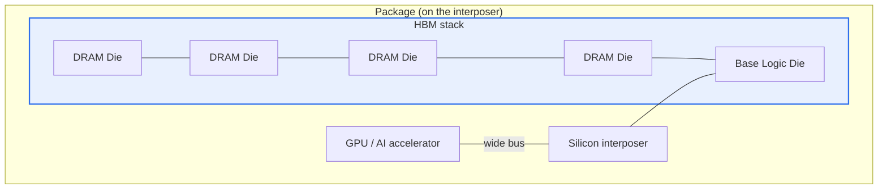

# High Bandwidth Memory (HBM)

## 1. Overview

### A. Definition
> Memory that stacks DRAM dies **vertically (3D Stacking)** and connects them with **TSVs (Through-Silicon Vias)** to realize **ultra-high bandwidth and low power** through a very wide I/O width (1024 bits or more). It is packaged together with the processor to relieve the memory bottleneck of AI, HPC, and GPUs.

The idea of HBM is to "**carry more at once (wider bus)** instead of **spinning the memory faster (higher frequency)**." Continuously raising the signal frequency sharply increases power and heat, but widening the bus can greatly increase total bandwidth even at a low clock. Stacking and TSVs are precisely the means that make this wide bus physically possible.

### B. Background and Necessity
As AI models and HPC computation have grown, the processing speed of the compute unit (GPU) has improved rapidly, but the speed of **carrying data from memory to the compute engine** has failed to keep up—the so-called **Memory Wall**—emerging as a bottleneck. No matter how fast the GPU is, if the needed data does not arrive in time, the compute engine sits idle. Conventional GDDR has limits in bus width and power, so 3D-stacked memory that can secure a wide I/O with short wiring was required, and the result is HBM.

## 2. Structure



The core of the structure is threefold. First, **TSVs** vertically penetrate and connect the stacked DRAM dies, so signals travel through short vertical paths instead of long wiring routed sideways. When wiring becomes shorter, resistance and parasitic components decrease, so **the signal is stable even at a lower voltage**, and this is the basis of low power. Second, such a vertically connected stack secures thousands of I/O pins to create an **ultra-wide bus of 1024 bits or more**. Third, the HBM stack and the GPU are placed side by side on a **silicon interposer** (2.5D packaging) and joined by the ultra-wide bus. Because an ordinary PCB cannot handle this many wires, an interposer capable of fine wiring is essential.

- **TSVs** vertically penetrate and connect stacked dies → short wiring, wide I/O
- **Interposer (2.5D)** places the GPU in close proximity → physical realization of a wide bus

## 3. Characteristics

| Item | Content | Principle (why) |
|---|---|---|
| **Ultra-high bandwidth** | Several times the bandwidth of GDDR | Wide bus width (1024 bits+) raises the total even at a low clock |
| **Low power** | Lower energy per bit | Short TSV wiring, low-voltage drive |
| **Compact form factor** | Area savings, close placement to the processor | Vertical stacking minimizes planar area |
| **High cost/heat** | Burden of unit cost, yield, heat dissipation | Complex 2.5D packaging, high thermal density of stacked dies |

In particular, as to why **heat** is HBM's greatest challenge: when multiple dies are stacked vertically, the heat of the lower dies must escape by passing through the upper ones, and a stacked structure tends to trap heat. As thermal density rises, performance and lifespan decline, so advanced packaging and thermal design become the core issue of mass production.

## 4. Bandwidth Trend by Generation (per stack, approximate)

```chart
{
  "type": "bar",
  "data": {
    "labels": ["HBM2", "HBM2E", "HBM3", "HBM3E"],
    "datasets": [{
      "label": "Bandwidth (GB/s, per stack)",
      "data": [307, 460, 819, 1230],
      "backgroundColor": ["#a9c5f5", "#7aa5f3", "#4d86ef", "#2f6fed"]
    }]
  },
  "options": {
    "plugins": { "legend": { "display": false }, "title": { "display": true, "text": "HBM Bandwidth by Generation (approximate)" } },
    "scales": { "y": { "title": { "display": true, "text": "GB/s" }, "beginAtZero": true } }
  }
}
```

The reason bandwidth jumps in steps as generations advance is that an increase in the number of stack layers (e.g., 8-high → 12-high) and an improvement in per-pin speed act together. Going from HBM2 to HBM3E, per-stack bandwidth increased about fourfold, which raises the throughput of exchanging ultra-large parameters with memory in AI training and inference by that much. However, the more layers are stacked, the greater the heat and yield burden mentioned earlier grows—a constraint on generational transitions.

## 5. Considerations and Implications
- **A core bottleneck component of AI semiconductors**: HBM substantially governs the performance of GPUs and NPUs, and supply capability is directly connected to AI-infrastructure competitiveness. In fact, HBM supply has become such a strategic component that it is cited as a bottleneck for the shipment of AI accelerators.
- **Evolution toward memory-centric computing**: Because data movement itself is the chief culprit of power and latency, the architecture is evolving toward moving less data, by combining with **PIM (Processing-in-Memory)**, which computes directly in memory, and **CXL**, which supports memory pooling.
- **The key to mass production is packaging and yield**: Because the difficulty of combining die stacking, TSVs, and the interposer is high, securing yield is difficult, and advanced-packaging capability becomes the source of competitive advantage.
- **Trade-off**: At the cost of ultra-high bandwidth and low power, unit cost, heat, and design complexity rise sharply, so it is intensively adopted in the AI/HPC domain where bandwidth governs performance, while GDDR is still used for general consumer products.

---

> **In one line**: HBM is memory that *3D-stacks DRAM with TSVs and places it in close proximity to the processor via an interposer* to realize ultra-high bandwidth and low power over an ultra-wide bus; it is a core component that relieves the **Memory Wall** of AI and HPC, with heat, yield, and packaging being the key to mass production, and it is expanding into PIM and CXL.
