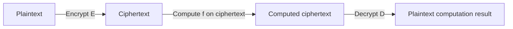

# Homomorphic Encryption

## 1. Overview

### A. Definition
> A cryptographic technique in which the result of **computing directly on ciphertext without decrypting it** becomes identical to encrypting the result of computing on the plaintext. Because data can be **processed while encrypted**, it can be analyzed and utilized without exposing the original to the processing party.

The name homomorphic encryption comes from **homomorphism** in algebra. It means that the encryption function "preserves and carries over" the operational structure of the plaintext space into the ciphertext space; because addition and multiplication in the plaintext correspond directly to the corresponding operations in the ciphertext, computation holds without decryption.

### B. Background and Necessity
Traditional cryptography protects data only at rest and in transit; because one **must decrypt in order to compute**, the original is exposed at the processing time (in use). The moment computation is outsourced to the cloud or externally, the data owner has no choice but to trust the processing party, and for sensitive data such as medical and financial data, this exposure itself becomes a regulatory and privacy risk. Homomorphic encryption breaks this dilemma of "**giving up protection in order to utilize**" and achieves **utilization and protection at the same time** by uploading data to the cloud in encrypted form, entrusting even the computation, and then decrypting only the result. For this reason, it draws attention as a fundamental technology of privacy-preserving data analysis.

## 2. Operating Principle

The core is the homomorphic property `Dec(f(Enc(m1), Enc(m2))) = f(m1, m2)`. When the data owner encrypts `m1, m2` and sends them to the server, the server performs `f` (addition, multiplication) between the ciphertexts without knowing the plaintext at all, and only the owner decrypts the result to obtain `f(m1, m2)`. Because any computation can ultimately be expressed as a combination of addition and multiplication (a Boolean/arithmetic circuit), if **both addition and multiplication are supported homomorphically**, in theory any function can be computed in ciphertext form. However, in lattice-based cryptography, **noise (error)** is mixed into the ciphertext for security, and as computation is repeated this noise accumulates; once it exceeds a certain limit, decryption becomes impossible. Managing this noise is the core challenge of implementing homomorphic encryption.

## 3. Types

It is divided into three stages according to the kind and number of supported operations, and this development is precisely the history of "how far the noise is controlled."

| Type | Supported operations | Representative schemes |
|---|---|---|
| **Partially homomorphic (PHE)** | **Only one kind**, addition **or** multiplication, unlimited | RSA (multiplication), Paillier (addition), ElGamal |
| **Somewhat homomorphic (SWHE)** | Both addition and multiplication, but a **limited number of times** | BGN |
| **Fully homomorphic (FHE)** | Arbitrary operations, **arbitrary number of times** | Gentry (2009), CKKS, BFV, BGV |

Partially homomorphic (PHE) supports only one kind of operation, so it is confined to specific uses such as electronic voting (summing votes with Paillier's addition). Somewhat homomorphic (SWHE) supports both operations but, due to the noise limit, allows only computations of shallow circuit depth. When Gentry proposed **Bootstrapping** in 2009—a technique that "resets" the noise inside a ciphertext by re-encryption without decrypting it—**fully homomorphic (FHE)**, which can compute infinitely without noise accumulation, was realized for the first time. Subsequently, schemes such as CKKS, which is strong at approximate real-number computation, emerged and became more useful for machine-learning inference.

## 4. Pros and Cons

Homomorphic encryption's powerful privacy is traded for enormous computational cost. Understanding this trade-off is the starting point of practical application.

| Pros | Cons |
|---|---|
| Analysis in encrypted form → original not exposed, strong privacy | **Very large computation/performance burden** (FHE is thousands to tens of thousands of times that of plaintext) |
| Safely perform cloud/external outsourced computation | **Ciphertext expansion** (sharp size increase), noise management needed |
| Response to the data-related laws and privacy regulations (an alternative to anonymization) | High implementation difficulty, standardization in progress |

## 5. Applications and Implications
Homomorphic encryption is a core of **PETs (Privacy-Enhancing Technologies)** and is complementary to **MPC (Multi-Party Computation)**, in which multiple institutions jointly compute without exposing their own data, and **Federated Learning**, which trains only the model without gathering the originals. Concretely, it is applied to statistics computation in encrypted form, machine-learning inference on ciphertext (e.g., a scenario where a hospital encrypts patient data and receives only diagnostic-support results from cloud AI), and privacy-preserving credit scoring in the financial sector. The biggest obstacle, performance, is being rapidly improved by **GPU/dedicated-hardware acceleration** and the development of open-source libraries such as SEAL (Microsoft), HElib, and OpenFHE. From an advanced-professional perspective, rather than viewing homomorphic encryption as an all-purpose solution, it is realistic to **apply it selectively to areas with high sensitivity and low computation frequency** in view of latency and cost, and to design the overall architecture in combination with MPC, federated learning, and differential privacy.

---

> **In one line**: Homomorphic encryption is a technique that enables *computation in ciphertext form without decryption*; it evolved through PHE, SWHE, and FHE (with FHE realized via bootstrapping), and although its performance burden is large, it is a core PET technology that enables privacy-preserving data utilization in the age of the cloud and AI.
