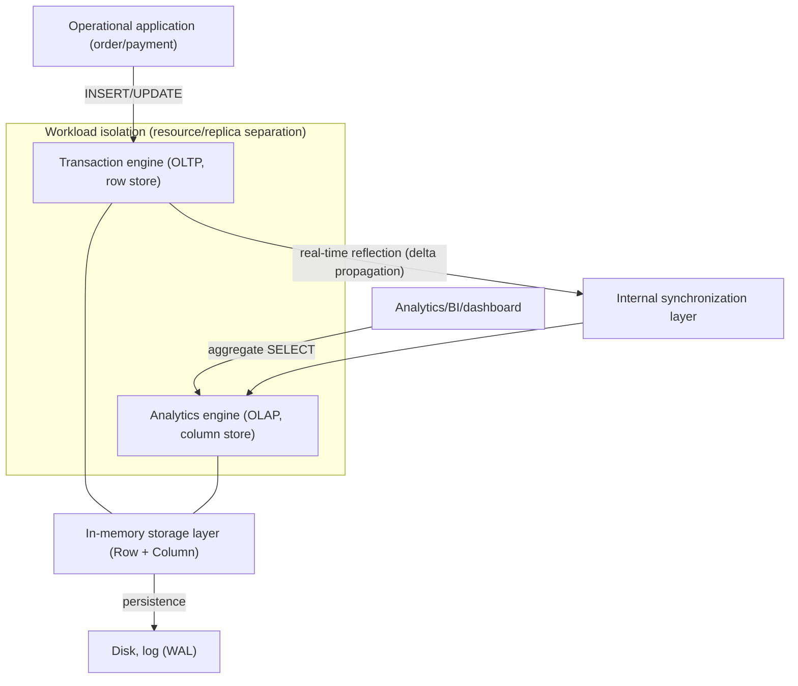
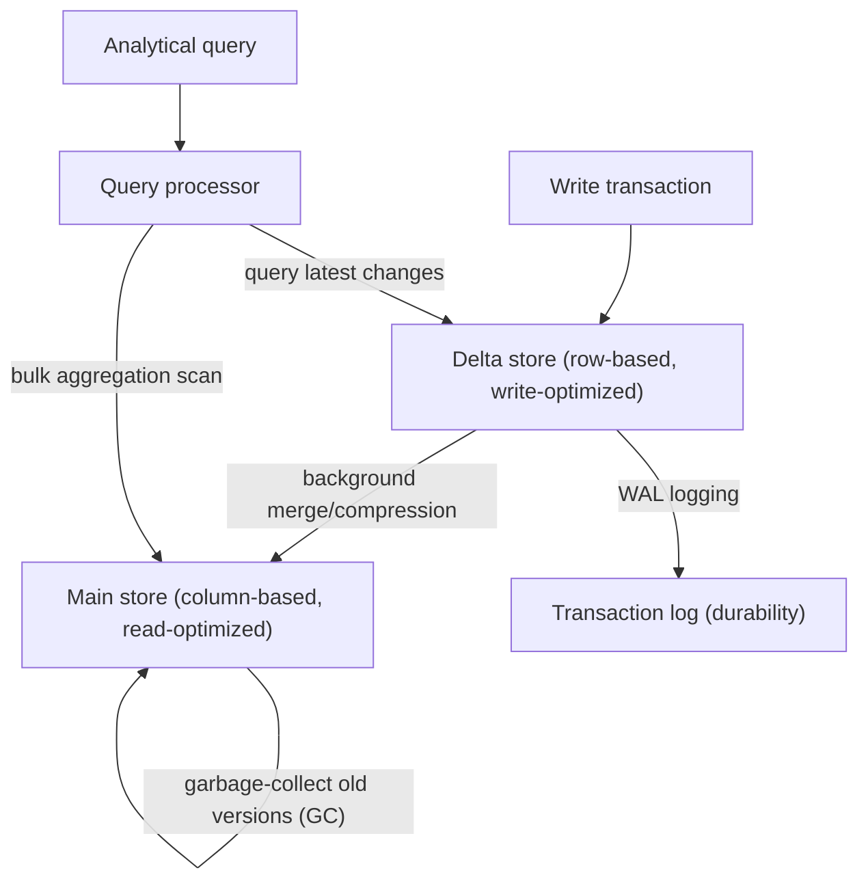

# HTAP (Hybrid Transactional/Analytical Processing)

## 1. Overview

> **HTAP (Hybrid Transactional/Analytical Processing)** is a data architecture that performs transaction processing (OLTP) and analytical processing (OLAP) simultaneously in a single database system without a separate ETL transfer, providing near-real-time analysis on operational data that has just occurred. Coined by Gartner in 2014, the concept aims for "in-memory-based integrated processing that dismantles the boundary between operations and analytics."

Traditionally, an enterprise's data processing was divided into two worlds with opposing purposes.
On one side is the **OLTP (Online Transaction Processing)** world, which accurately handles short, frequent write transactions such as ordering, payment, and inventory updates, characterized by normalized row-based storage and strong consistency (ACID).
On the other side is the **OLAP (Online Analytical Processing)** world, which reads trends by scanning and aggregating hundreds of millions of rows, characterized by column-based storage and large-scale parallel reads.
Because these two differ fundamentally in data structure, indexing, and resource-usage patterns, running them together in a single engine eats away at each other's performance.

So for the past several decades, the standard solution was **separation and transfer**.
Data from the operational DB was extracted, transformed, and loaded (ETL) into a data warehouse (DW) via nightly batches, and analysis was performed on the DW.
However, this structure carries two essential limitations.
First, a **data-freshness lag**—if the batch cycle is daily, the analysis result always looks at a past that is a day old.
Second, **pipeline complexity and cost**—a separate store, ETL tools, dual schemas, and consistency verification all remain as operational burdens.
As requirements grew to "judge immediately with data from this very moment"—such as real-time personalized recommendation, fraud detection (FDS), and dynamic pricing—this lag and complexity became a business bottleneck.

HTAP fills precisely this gap.
In an essay answer, HTAP should not be reduced to simply "combining OLTP and OLAP"; it must be described along three axes: (1) the **technical foundation** of in-memory computing and a column/row hybrid store, (2) the **core design challenges** of workload isolation and data freshness, and (3) the **value proposition** of architectural simplification through eliminating ETL.

### A. Background and Necessity

First, the **demand for real-time decision-making** is decisive.
In e-commerce, to change recommendations reflecting a customer's behavior immediately after adding something to the cart, or for a card company to block a fraudulent transaction by comparing it against past patterns the moment an authorization request arrives, the lag between data occurrence and analysis must be on the order of seconds.
A day-late DW analysis cannot satisfy such requirements.

Second, the **evolution of hardware** made HTAP feasible.
In the past, memory was expensive and small, so large volumes of data could not be handled in memory, but with the spread of large-capacity DRAM, many cores, SIMD vector operations, and NVMe, the hardware foundation was laid to place terabytes of data in memory and handle transactions and analytics together.
SAP HANA (2011) opened this trend with an in-memory column store.

Third, the demand to **reduce the total cost of ownership (TCO) of the data pipeline**.
An ETL pipeline continuously consumes personnel and cost for development, operation, and failure response.
Integrating the operational and analytical systems into one makes the transfer layer itself disappear, so the architecture becomes simpler, the burden of consistency verification decreases, and storage redundancy is reduced.

## 2. Overall HTAP Architecture

An HTAP system has a structure in which a transaction engine and an analytics engine coexist on the same data, isolated so as not to invade each other's resources.
The core is to **accept writes quickly in row form and process reads/aggregations quickly in column form**, while the system automatically synchronizes between the two representations.

In the structure above, the operational application's writes are quickly accepted by the transaction engine in row form, and analytical queries are bulk-scanned by the analytics engine in column form.
The two engines logically see the same data, but physically maintain representations optimized for each, and the internal synchronization layer propagates transaction results to the analytics side without lag.
The key is that this propagation must be **isolated so that the analytical load does not shake the transaction latency**, and to this end methods such as separating resource scheduling or placing an analytics-dedicated replica are used.

### A. Detailed Structure of Data Flow and Delta Merge

The storage internals of HTAP are usually divided into a **write-optimized delta store (row-based)** and a **read-optimized main store (column-based)**.
New transactions are first quickly recorded row by row in the small delta area, and later, in the background, compressed and sorted into column form and merged into the main store.
Analytical queries look at the main store and the delta store together to always reflect the latest state.

The reason this structure matters is that column storage is excellent for bulk aggregation but inefficient for frequent updates of individual rows.
Delta-main separation is a typical trade-off-resolution technique that satisfies the conflicting requirements of "write cheaply as rows, read fast as columns" simultaneously by separating them along the time axis.
The merge cycle and delta size are key performance-tuning parameters; if the merge is late, the delta bloats and analytical queries slow down, and if it is too frequent, the merge cost burdens the transactions.

### B. HTAP Implementation Architecture Types

The way HTAP is implemented is largely divided into two branches depending on whether the data is kept in a single storage engine or separated.
This distinction determines the trade-off between freshness and isolation when choosing an architecture, so it must be pointed out in an answer.

The **single-store / unified approach** keeps row and column representations together within a single storage engine (SAP HANA, Oracle In-Memory, MemSQL/SingleStore).
Because the data is in one place, freshness is highest and there is no lag, but because transactions and analytics contend for the same resources, sophisticated isolation is essential.

The **dual-store / disaggregated approach** physically separates row-based transaction nodes and column-based analytics nodes and synchronizes them with internal replication (Raft, etc.) (TiDB's TiKV+TiFlash, Google AlloyDB).
Because the analytics node is separate, isolation is excellent and transaction latency is stable, but a slight lag arises in replication propagation, so freshness is a bit lower than the single-store approach.

| Category | Single-store | Dual-store |
|------|------------------------|----------------------|
| Storage structure | Row+column coexist in one engine | Row node and column node physically separated |
| Data freshness | Very high (near-zero lag) | High (replication lag exists) |
| Workload isolation | Logical isolation via resource scheduling | Physical isolation via node separation |
| Scalability | Vertical-scaling-centric | Easy horizontal scaling |
| Representative products | SAP HANA, SingleStore, Oracle In-Memory | TiDB, Google AlloyDB, ClickHouse+OLTP |

## 3. Core Technical Elements

The technologies that underpin HTAP span hardware utilization, storage structure, and concurrency control.
Each element solves, from a different angle, the single problem of "how to make the conflicting workloads of transactions and analytics coexist in one system."

First, **in-memory computing**.
Keeping data resident in main memory removes the disk-I/O bottleneck, and placing column data in a CPU-cache-friendly way processes multiple values at once with SIMD vector operations.
Access speed hundreds to thousands of times faster than disk creates the performance headroom to handle transactions and analytics at the same time.

Second, a **hybrid row/column store**.
Row storage is optimal for transactions that "read and write all columns of one order together," and column storage is optimal for analytics that "aggregate only a specific column across hundreds of millions of rows."
HTAP maintains both representations and automatically selects according to the query characteristics, and applies dictionary encoding and run-length compression to the column store to save memory and accelerate scans.

Third, **MVCC (Multi-Version Concurrency Control) and snapshot isolation**.
Because analytical queries usually run for a long time, if they collide with concurrently progressing write transactions via locks, they block each other.
MVCC provides each transaction a consistent snapshot so that writes proceed without blocking even while analytics is reading, making the coexistence of the two workloads possible.

Fourth, **resource isolation and workload management**.
If an analytical query monopolizes CPU and memory, the response of a payment transaction is shaken.
One separates CPU/memory limits with resource groups, or places an analytics-dedicated read replica for physical isolation, to guarantee the transaction SLA.

## 4. Comparison — Differences from the Lambda Architecture and Traditional DW

To understand HTAP's standing, one must contrast it with existing real-time-analytics approaches.
In the past, to obtain real-time responsiveness and accuracy at the same time, the **Lambda Architecture** was used—processing the accurate past with a batch layer and approximate real-time with a speed layer, and merging the two at a serving layer.
However, Lambda's fundamental weakness was the great complexity of having to maintain two code bases, batch and stream, in duplicate.

HTAP removes this dual structure itself.
Because transactions and analytics are handled in the same data and the same engine, no separate stream pipeline or result-merging logic is needed.
The reason this difference arises is that HTAP "analyzes where the data is" instead of "moving the data to analyze it," and in practice this has the implication that pipeline failure points decrease and metric-consistency problems disappear.

| Item | Traditional OLTP+DW (ETL) | Lambda architecture | HTAP |
|------|-------------------|----------------|------|
| Data freshness | Hours-to-days lag | Approximate real-time | Real-time (within seconds) |
| Architectural complexity | Medium (ETL pipeline) | High (dual code base) | Low (single engine) |
| Storage redundancy | High (operations+DW) | High | Low |
| Analytical accuracy | High | Requires batch correction | High |
| Main use | Structured periodic reports | Stream+batch integration | Real-time operational analysis |

However, HTAP is not all-powerful.
Complex multidimensional analysis over petabyte-scale long-term history, and enterprise-wide data integration spanning diverse sources, are still better served by a data warehouse or lakehouse.
HTAP's sweet spot is "real-time to near-real-time analysis on operational data," and it is right to see it in a complementary relationship with large-scale historical analysis.

## 5. Industry Application Cases

**Financial fraud detection (FDS)** is representative.
Domestic and international card companies must, within tens of milliseconds of an authorization request arriving, aggregate and compare the recent transaction patterns, region, and amount of the card in question to judge whether it is fraudulent.
In the traditional structure, the operational DB and analytics DB were separated, making it hard to immediately reflect a "just-occurred transaction" into analysis, but HTAP handles the authorization transaction and pattern analysis in the same engine, enabling real-time blocking.

**Real-time personalization in e-commerce** is another.
Alibaba had to process hundreds of thousands of orders per second during sale peaks while simultaneously aggregating inventory, demand, and recommendations in real time, and to this end introduced its own HTAP database to integrate order transactions and analytics.
The moment an order occurs, its data is reflected in the recommendation and inventory dashboards, responding to the sales flow without batch lag.

In **manufacturing/logistics operational analysis**, S/4HANA based on SAP HANA is widely used.
In the past, reports were pulled from a separate BW (Business Warehouse) apart from the ERP operational system, but with in-memory HTAP integration, cases are reported of month-end closing reports being shortened from hours to minutes.
Because operational transactions and management analysis share a single set of the latest data, inventory, cost, and sales are viewed together in real time.

## 6. Advanced — Recent Trends and Standards Changes

The HTAP concept has recently been expanding into the trends of **"Zero-ETL"** and **lakehouse real-time enablement**.
AWS announced a Zero-ETL integration that connects Aurora (OLTP) and Redshift (OLAP) with automatic replication, letting users analyze operational data in near-real-time without building a pipeline themselves.
Unlike single-engine HTAP, this is an approach of "connecting different specialized engines without transfer," reinterpreting HTAP's value (freshness, simplification) as a cloud managed service.

Also, **distributed HTAP** is maturing centered on open source.
TiDB synchronizes the row store TiKV and the column store TiFlash via Raft consensus, implementing HTAP in a horizontally scalable distributed environment.
Google AlloyDB (PostgreSQL-compatible) embeds a columnar engine and has stated that it accelerates analytical queries by up to tens of times, and the SingleStore and ClickHouse families also compete in the real-time-analytics market.

Meanwhile, **combination with LLMs and vector search** has recently drawn attention.
Attempts to handle real-time embedding and similarity search on operational data in the same engine (HTAP+vector) are increasing, and this leads in the direction of raising data freshness in real-time recommendation and RAG pipelines.
However, because this area is still being standardized, in an answer it is safer to describe it as a direction rather than assert "a particular product's performance figures."

## 7. Considerations and Implications

First, **workload isolation and SLA guarantees are the top design challenge**.
HTAP's greatest risk is that a heavy analytical query infringes on the response time of core transactions such as payment and ordering.
One must always have isolation means such as resource groups, priority scheduling, and analytics-dedicated replicas, and continuously monitor the transaction-latency SLA.

Second, **the trade-off between freshness and isolation** must be chosen according to workload characteristics.
FDS, which needs latency near zero, favors the single-store approach, while a large-scale payment system where transaction stability is absolute favors the replication-based dual-store approach.
Rather than "everything in real time," one must first define what level of freshness the business actually needs.

Third, **the effect relative to cost and resources (TCO) must be evaluated coolly**.
In-memory HTAP demands large-capacity memory, so infrastructure cost is high, and not all analysis requires real time.
It is realistic to entrust periodic reports and long-term historical analysis to a low-cost DW/lakehouse and apply HTAP selectively only to workloads where real-time responsiveness is core—a hybrid strategy.

Fourth, **a linkage/transition strategy with existing architecture** is needed.
For an organization that already has a DW, ETL, and BI built, a full transition to HTAP is unrealistic; a coexistence design is desirable that gradually adopts (the Strangler approach) starting from work that needs real-time analysis, while keeping the DW as the enterprise integration/governance hub.

Fifth, **do not miss data governance and consistency verification**.
Because operations and analytics share the same data, one must control so that analysis-purpose access permissions, masking, and auditing do not conflict with operational-system security, and periodically verify that the subtle inconsistency caused by delta-main merge lag does not affect metrics.

## References

- Gartner, "Hybrid Transaction/Analytical Processing Will Foster Opportunities for Dramatic Business Innovation" (2014): https://www.gartner.com/en/documents/2657815
- SAP HANA In-Memory Platform overview: https://www.sap.com/products/technology-platform/hana.html
- TiDB HTAP architecture (TiKV, TiFlash) documentation: https://docs.pingcap.com/tidb/stable/tidb-storage
- Google Cloud AlloyDB for PostgreSQL: https://cloud.google.com/alloydb
- AWS Zero-ETL integration overview: https://aws.amazon.com/what-is/zero-etl/

---

> **In one line**: HTAP is an architecture that, based on in-memory, row/column hybrid storage and workload isolation, processes OLTP and OLAP in a single engine without ETL to enable real-time analysis on operational data; the key is to apply it selectively according to the workload, balancing the trade-offs of freshness, isolation, and cost.
