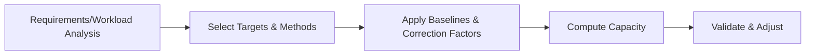

# Information System Hardware Sizing Guidelines (TTAK.KO-10.0292/R3)

## 1. Overview

### a. Definition
> A TTA standard guideline (revised to R3 in December 2023) for **objectively and quantitatively sizing hardware capacity such as servers, storage, and networks based on workload and performance metrics** when building an information system.

Sizing is the activity of deciding "how much equipment of what performance level is needed" **on a documented basis**. Relying solely on experience or vendor proposals blurs accountability for the decision, whereas this guideline standardizes a common calculation procedure and performance metrics (tpmC, etc.) so that different vendors, auditors, and contracting agencies can produce **verifiable evidence derived the same way**.

### b. Background and Necessity
Hardware sizing can fail in both directions. **Over-sizing** buys more equipment than needed, wasting budget, floor space, and power, while **under-sizing** leads to performance degradation or outages during peaks, undermining service reliability. Especially in **public and large-scale projects** funded by taxpayers, one must objectively justify "why this much equipment is needed" during audits and budget review. The standard guideline serves as the common yardstick that makes this justification possible, allowing the validity of sizing results to be verified after the fact.

### c. Sizing Targets
Sizing targets are divided into **servers (WAS/DB/AP)**, **storage and backup**, **networks (lines and switches)**, and **security appliances**. Because each target has a different load profile, the metrics differ too: servers are sized around throughput (TPS, tpmC), storage around data growth and IOPS, and networks around bandwidth.

## 2. Sizing Procedure

The logic of the procedure is to **"define demand first, then divide that demand by the per-unit performance of equipment."** First, **workload analysis** identifies concurrent users, transactions (TPS), data volume, and the **peak (maximum load)** point in time. Because sizing must withstand the peak rather than the average, identifying the peak is especially important. Next, the **sizing method** for each target is selected, **correction factors** such as performance, headroom, redundancy, and target availability are applied, capacity is **computed**, and finally the result is **validated and adjusted** through benchmarks and feasibility checks.

| Stage | Content |
|---|---|
| Workload analysis | Identify concurrent users, transactions (TPS), data volume, peak |
| Method selection | Determine sizing method per target (quantitative, reference) |
| Apply corrections | Reflect performance, headroom, redundancy, and availability factors |
| Compute & validate | Calculate capacity, then validate through feasibility and benchmarks |

## 3. Sizing Methods

There are broadly three sizing methods. The **numeric (quantitative) approach** calculates using **standard performance metrics** such as TPC-C's tpmC, TPC's OPS, and SPEC's SPECint; its clear basis makes it suitable for large new systems. The **reference-model approach** compares and infers from measured values or standard configurations of similar existing systems, and is used when deriving new metrics is difficult or supplementary validation is needed. On top of these, **corrections and headroom** are commonly applied to absorb real-world uncertainty.

| Method | Description |
|---|---|
| Numeric (quantitative) | Calculate using standard performance metrics such as tpmC, OPS, SPECint |
| Reference model | Compare and infer against cases of similar systems and standard configurations |
| Correction & headroom | Reflect peak ratio, growth rate, redundancy, and target availability |

The skeleton of the calculation formula is **required performance = baseline transaction volume × peak ratio × headroom factor ÷ per-unit equipment performance**. For example, if the normal per-second throughput is taken as the baseline, load surges threefold at peak (peak ratio 3), and CPU utilization is capped at 70% leaving 30% headroom (headroom factor about 1.43), the performance that must actually be secured exceeds four times the baseline. Multiplying these factors explicitly is what makes the sizing basis transparent.

## 4. Considerations

Sizing must cover not just a snapshot of the present but also **the future and failure situations**. Failing to reflect data and user growth over the next three to five years forces early expansion, and omitting redundancy and disaster-recovery capacity leads to collapse during a failure.

| Category | Content |
|---|---|
| Peak & growth | Reflect peak load and headroom for expansion over the next 3–5 years |
| Virtualization/cloud | Reflect characteristics of resource-sharing and auto-scaling environments |
| Availability | Secure redundancy (N+1) and disaster-recovery (DR) capacity |
| Validation | Substantiate sizing figures through benchmarks (BMT) and load tests |

## 5. Implications
From a professional engineer's perspective, the notable change is that the **shift to cloud** is transforming the sizing paradigm. In on-demand, auto-scaling environments, there is no need to buy all equipment in advance to match the peak; capacity can be increased when needed, so the center of gravity moves from "fixed provisioning for the peak" to "**elastic provisioning + cost optimization (FinOps)**." Even so, the sizing guideline remains valid. Auto-scaling still requires workload-based quantitative evidence to set minimum/maximum capacity and budget, and cloud cost forecasting and reserved-instance sizing decisions also stand on sizing logic. In other words, the guideline continues to be used across both on-premises and cloud as the **objective basis for initial capacity and cost estimation**.

---

> **In one line**: TTAK.KO-10.0292/R3 is a standard guideline that objectively sizes HW capacity based on performance metrics such as tpmC through the procedure *workload analysis → method selection → correction application → computation and validation*, preventing over- and under-sizing, providing an audit basis for public projects, and remaining valid as the reference for initial capacity and cost estimation even in the cloud era.
