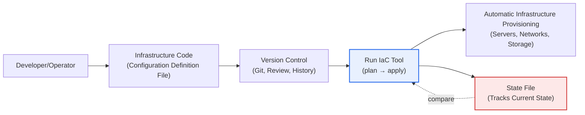
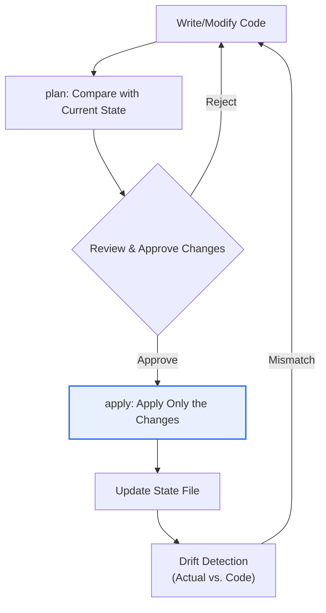

# Infrastructure as Code (IaC)

## 1. Overview

### a. Definition
> **IaC (Infrastructure as Code)** is an approach that **declares the desired state of IT infrastructure — servers, networks, storage, security policies, and so on — as code (configuration files) and executes that code to automatically provision, change, and manage the infrastructure**. It replaces manual configuration in a console with version-controllable code.

The essence of IaC is to **"treat infrastructure like software."** In the past, when adding servers or changing firewall rules, an operator clicked and typed commands one by one in a management console. This approach was slow and error-prone, and above all it produced a state in which no one knew precisely "why this server is configured differently from that one." Over time, the accumulated traces of small manual fixes cause the actual infrastructure to diverge from documentation and intent — a phenomenon called **configuration drift** — which is a representative operational risk that makes tracing the cause of failures and recovering from them difficult.

IaC declares the desired state of infrastructure as code and executes that code to build the infrastructure. As a result, the infrastructure is **documented as code**, version tracking, code review, and reuse become possible through configuration management like Git, and development, test, and production environments can be **reproduced identically** with the same code. Much of the classic "it works on my machine" problem comes from differences in environment configuration, and IaC eliminates the difference by fixing that configuration itself as code. Combined with cloud APIs, it becomes possible to configure hundreds of servers identically in minutes and to reclaim them with a single line of code when they are no longer needed. In short, IaC is not merely an automation tool but a paradigm shift that turns infrastructure operations from a "manual craft" into a "**verifiable engineering discipline**."

### b. Background and Necessity
Three pressures made IaC essential. First, **the elasticity of the cloud**. The cloud made it possible to instantly scale resources up and down via API, but it is impossible for humans to keep up with this flexibility by hand. Without automated definitions, elasticity becomes chaos instead. Second, **the explosion in scale and change frequency driven by microservices and containers**. In an environment where hundreds of services each require different infrastructure and are deployed multiple times a day, manual management cannot handle the speed, consistency, and reproducibility required. Third, **DevOps culture**. To break down the boundary between development and operations and automate deployment, infrastructure too must be able to ride the pipeline like application code. These three pressures combined to make IaC a fundamental skill of cloud-native operations.

## 2. How It Works: Declarative vs. Imperative

There are two approaches to IaC, and the difference between them lies in **"what is being described."** The **declarative** approach describes the "desired end state (what)," and the tool compares it with the current state and applies only the changes needed to reach that state (Terraform, CloudFormation, Pulumi). The user only declares that "three servers must exist with this configuration," and the tool computes the procedure of "since two exist now, create one more." The **imperative** approach describes the procedure of "what to do and in what order (how)" (traditional shell scripts, and Ansible playbooks from some viewpoints).

There are clear reasons why the declarative approach is generally preferred. Because it tracks the current state, the declarative approach naturally guarantees **idempotency** — running the same code multiple times yields the same result. Imperative scripts tend to produce side effects, such as creating two more servers when run twice. The declarative approach can also show the difference (diff) between "current state → desired state" in advance (Terraform's `plan`), creating a safety mechanism to review and approve what will change before applying. That said, the boundary between tools is not absolute. Ansible describes procedures but is often used close to declaratively by designing each task to be idempotent, so in practice the two characters are mixed.

| Approach | What Is Described | Characteristics | Representative Tools |
|---|---|---|---|
| **Declarative** | Desired end state | Idempotency, state tracking, diff review | Terraform, CloudFormation, Pulumi |
| **Imperative** | Procedure to perform | Fine-grained control, needs side-effect management | Shell scripts, Ansible (depending on view) |

Meanwhile, provisioning (creating infrastructure) and configuration management (installation and configuration) operate at different layers. Terraform is strong at provisioning that "creates" resources such as servers and networks, while Ansible, Chef, and Puppet are strong at configuration management that "configures" software on the created servers, so in practice the two are often combined.

### Tool Ecosystem and Selection Criteria
Tool selection should be judged not by "which is superior" but by "which fits the organization's cloud strategy and staff capabilities." **Terraform** is a declarative standard that is not locked to a particular cloud (multi-cloud) and has a broad provider ecosystem, but requires separate state management. **CloudFormation** is specialized for AWS and offers the convenience of the service managing state, but has low portability. **Pulumi** describes infrastructure in general-purpose programming languages such as Python and TypeScript, making it developer-friendly but bringing language and runtime complexity. **Ansible** performs configuration management over SSH without an agent (agentless), giving it a low barrier to entry. Since each tool makes different trade-offs in portability, learning curve, and state management, it is realistic to choose based on the cloud already in use and the team's language proficiency.

## 3. State Management and Execution Flow

The heart of declarative IaC is **state**. The tool must compare "the state the code wants" with "the current state of the actual infrastructure" and manipulate only the difference, and to do so it maintains a state file that records the current state. Because the state file is the map of the actual infrastructure, if it is corrupted or diverges from reality, the tool can make wrong decisions (creating a resource that already exists, or deleting a needed resource). Therefore, it is an operational fundamental to place the state file in a remote store that the team can share and lock (for example, object storage plus a lock) and prevent state corruption from two people running apply at the same time.

Execution usually follows the flow of **plan → review and approve → apply**. In the `plan` stage, the tool presents a human-readable change plan such as "create this server anew, change that rule, delete this volume." Because deleting or recreating infrastructure can directly cause service outages, this prior review is the decisive gate that prevents accidents. After approval, `apply` reflects only the changes and updates the state. During operation, someone may manually change resources in the console, causing drift where the code and reality diverge, so periodically detecting this and reverting to code is a necessary management practice.

## 4. Expected Effects and Practical Application

The effect of IaC is not simply "it becomes easier"; it manifests along several axes that raise the organization's operational maturity. Each effect in the table below should be understood as a result derived from the principles of "state, idempotency, and configuration management" explained above.

| Effect | Content | Underlying Principle |
|---|---|---|
| **Consistency & reproducibility** | Identical configuration across environments with the same code, eliminating drift | State tracking & idempotency |
| **Speed & automation** | Rapid provisioning and reclamation of large-scale infrastructure | Cloud API + declarative |
| **Version control & collaboration** | Code review, history tracking, rollback possible | Configuration management (Git) |
| **Documentation** | The code itself is the latest infrastructure specification | Declarative definition |
| **Cost optimization** | Reclaim unused resources via code, modularize for reuse | Automation + reuse |

Looking at concrete cases: first, a large-scale service company reuses existing infrastructure code when expanding a service to a new region, **replicating an environment made up of hundreds of resources within a few hours**. Done by hand, this work would take weeks and cause failures due to subtle configuration differences between regions. Second, in a disaster recovery (DR) scenario, the IaC code becomes the "recovery runbook" itself, shortening recovery time (RTO) by rebuilding identical infrastructure as code in another region when a disaster occurs. Third, it is common for development teams to create feature-isolated test environments as code when needed and automatically delete them after testing, greatly reducing the cost of idle resources that were previously kept running at all times. Thus the value of IaC stands out more in the phases of **repetition, reproduction, and reclamation** than in the initial automation.

Viewed at the organizational level, IaC transforms infrastructure operations that depended on individuals' expertise into a team asset. As the "tacit knowledge of configuration" known only to a particular person is made explicit in code, the structure and intent of the infrastructure can be read directly from the code even during staff turnover or on-call response. In addition, from an audit perspective, who changed what, when, and why is recorded in the configuration-management history, making regulatory and compliance response easier. This is an especially important benefit in industries with strict change control, such as finance and the public sector.

## 5. Deep Dive — Evolution to GitOps and Security (Policy as Code)

The latest trend in IaC is expansion into **GitOps**. GitOps is the principle of "treating the Git repository as the Single Source of Truth for the state of infrastructure and applications." Instead of an operator running tools directly, **once a change is merged into Git, an automation agent continuously synchronizes that declaration to the actual cluster** (for example, Argo CD and Flux in Kubernetes environments). This approach has three strengths. All changes are made via Pull Request, so review, approval, and audit trails are woven into the standard development workflow; when the actual state deviates from the Git declaration, the agent automatically reverts it (self-healing), blocking drift at the source; and rollback becomes as simple as "reverting in Git."

Another axis is **codifying security and governance**. As infrastructure becomes code, automatically verifying whether that code obeys organizational policy also becomes possible as code. With **Policy as Code (for example, OPA/Rego, Sentinel)**, rules such as "no publicly open storage" and "no deployment of unencrypted volumes" are enforced in the pipeline, and **IaC static scanning** tools like tfsec and Checkov catch misconfigured security settings before deployment. However, if access keys or passwords are hardcoded into infrastructure code, they remain permanently in the configuration-management history and become a serious leak, so the principle of keeping secrets outside the code (in a secret-management system such as Vault) must always accompany it. In this way, IaC starts from "automation" and broadens its scope to "GitOps (operating model)" and "Policy as Code (governance)," establishing itself as the foundation of cloud-native operations.

The differences between traditional IaC (running tools directly) and GitOps can be summarized as follows.

| Category | Traditional IaC | GitOps |
|---|---|---|
| Change trigger | Operator runs tool directly (push) | Git merge → agent syncs (pull) |
| Source of truth | Code + state file | Git repository |
| Drift handling | Periodic detection, manual adjustment | Automatic detection, self-healing |
| Audit trail | Execution logs | Pull Request history |

### Expected Exam Direction and Answer Composition Strategy
On professional engineer exams, IaC tends to be tested in connection with cloud, DevOps, and containers rather than as a standalone topic. When composing an answer, it helps to keep the following axes in mind.

- **Concept and necessity**: connect the limits of configuration drift and manual work to IaC's definition and background.
- **Approach comparison**: describe declarative vs. imperative down to the "reasons" of idempotency and state management.
- **Working principle**: present plan → review → apply and the role of the state file with a diagram.
- **Related technologies**: expand into the relationships with DevOps, CI/CD, GitOps, containers (Kubernetes), and platform engineering.
- **Security and governance**: address secret management, Policy as Code, and IaC scanning from a risk-management perspective.
- **Conclusion**: wrap up with an adoption strategy (incremental, modular), organizational maturity, and outlook (Everything as Code).

## 6. Considerations and Implications (Professional Engineer's Perspective)

1. **State management is the Achilles' heel of IaC operations.** Since every decision of a declarative tool is based on the state file, remote storage, locking, backup, and encryption of the state are not optional but mandatory. The state file itself may contain sensitive information, so access control and encryption must be designed together, and the operating system must be built on the premise that a broken state endangers the entire infrastructure.

2. **A security perspective of "code equals authority" is needed.** IaC grants code the powerful authority to change infrastructure automatically. Therefore, code review, the principle of least privilege, secret separation, Policy as Code, and IaC scanning must be built into the pipeline so that faulty code or a hijacked pipeline does not spread into a large-scale incident.

3. **An incremental adoption and modularization strategy decides success or failure.** It is difficult to migrate existing manual infrastructure to code all at once. A phased approach is realistic: managing new resources with IaC first, standardizing recurring configurations into reusable modules, and growing a team-wide culture of code review and testing together. The organization's operational maturity matters more than the introduction of the tool itself.

4. **Drift management and change discipline are the core of sustained operation.** It is difficult to completely prevent emergency manual changes in the console, but leaving them unattended breaks IaC's reproducibility. The benefits of IaC persist only when drift is periodically detected and corrected and changes are, in principle, disciplined to go through code (a PR in the case of GitOps).

5. **Outlook: the standard foundation of cloud-native operations.** IaC has already become the common foundation of DevOps, GitOps, and platform engineering (internal developer platforms, IDP). It is expected to expand further into "Everything as Code," managing policy, security, and cost as code, evolving in a direction that raises the reliability, auditability, and cost efficiency of infrastructure operations together.

## References
- HashiCorp — What is Infrastructure as Code?: https://developer.hashicorp.com/terraform/intro
- AWS — Infrastructure as Code: https://aws.amazon.com/what-is/iac/
- OpenGitOps Principles: https://opengitops.dev/
- Open Policy Agent (OPA): https://www.openpolicyagent.org/

---

> **In one line**: IaC is an approach that *declares the desired state of infrastructure as code to automatically provision and manage it*, comes in declarative (idempotency, state tracking) and imperative forms, provides consistency, reproducibility, speed, version control, and cost optimization, and — equipped with state management and security (secret separation, Policy as Code) — is the standard foundation of cloud-native operations that extends to GitOps and platform engineering.
