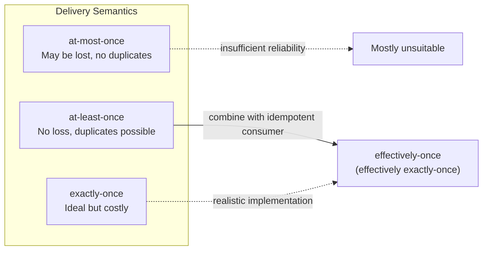
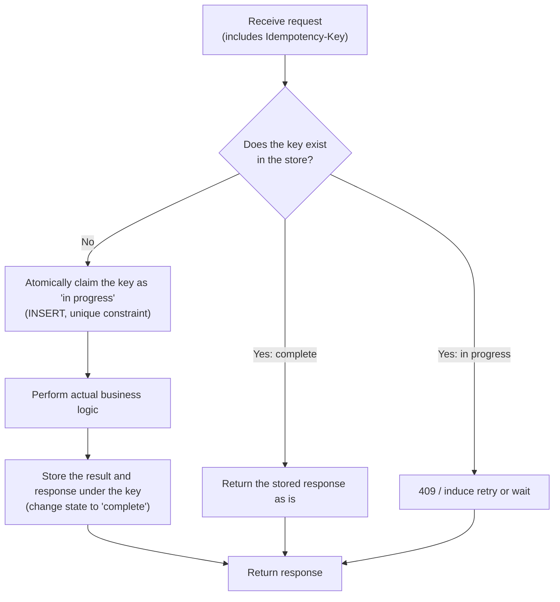

# Idempotency Design and Distributed System Reliability

## 1. Overview

### a. Definition

> **Idempotency** refers to the property whereby performing the same operation once or repeatedly multiple times does not change the system's final state and observable result. Mathematically, it is equivalent to a function f satisfying f(f(x)) = f(x).

Idempotency was originally a concept in algebra referring to the property that repeatedly applying an operation to some element does not change the value.
In software, this concept was extended to a stability property: "no matter how many times a request is sent, the side effect is reflected only once."
For example, the operation "set the account balance to 100,000 won" is idempotent because the result is the same no matter how many times it runs, but the operation "withdraw 10,000 won from the account" is not idempotent because the balance decreases with each execution.

Idempotency is often confused with "safety," but the two must be distinguished.
A safe operation (for example, a query) does not change state at all, so it is automatically idempotent, but an idempotent operation is not necessarily safe.
For instance, the operation "delete a resource" changes state (not safe), but running it twice yields the same final state of the resource not existing, so it is idempotent.
Thus idempotency is defined not by "the presence or absence of side effects" but by "the effect of repetition on the final state."

### b. Background and Necessity

The background to idempotency emerging as a core principle of distributed system design is the uncertainty of networks.
In a distributed environment, when a client sends a request to a server and does not receive a response, the client cannot distinguish between "the request failed to reach the server" and "the server processed it but the response was lost."
This is precisely the fundamental uncertainty formalized as the **Two Generals' Problem**, which no communication protocol can fully resolve.
Therefore the client has no choice but to treat it as a failure and retry, but if the original request was already processed, the retry causes duplicate processing.

This problem is especially fatal in systems where money changes hands.
For example, in online payments, if the user presses the "Pay" button and the response is delayed by more than three seconds, the user refreshes or presses the button again.
Without idempotency guarantees, a double charge occurs in which the same order is paid twice, leading directly to refund-processing costs and a decline in customer trust.
In fact, major payment gateways such as Stripe and PayPal adopt a client-issued Idempotency-Key as a required or recommended header to structurally prevent this problem.

The spread of message-broker-based asynchronous architectures also raised the importance of idempotency.
Message systems such as Kafka, RabbitMQ, and AWS SQS mostly adopt **at-least-once delivery** as the default guarantee for performance and availability.
This means that instead of being lost, messages may be delivered more than once, so if the consumer is not designed to be idempotent, the same event is processed multiple times and data consistency breaks.
In other words, idempotency is the practical key that realizes the ideal of "exactly-once" through the real-world combination of "at-least-once + idempotent consumer."

### c. Objectives and Scope of Application

The goals of idempotency design are, first, securing retry safety (safely retrying on network failure); second, neutralizing duplicate requests and duplicate messages; third, stabilizing reprocessing during failure recovery; and fourth, protecting the user experience (preventing double charges and duplicate orders).
The scope of application spans write operations of REST/gRPC APIs, message consumers, batch reprocessing jobs, compensating processing of distributed transactions, and state-changing domains such as payment, settlement, and inventory decrement.
Conversely, operations that have no side effects or are already idempotent, such as pure queries or streaming aggregation, carry little extra design burden.

## 2. Types of Idempotency and Criteria for Judgment

### a. Idempotency of the Operation Itself

The most desirable form is when the definition of the operation itself is idempotent.
"Setting a field value to X (SET)" or "adding an element to a set (idempotent set operation)" yields the same result upon repetition.
In databases, using `INSERT ... ON CONFLICT DO UPDATE` (UPSERT) or conditional updates naturally composes an idempotent write.
By contrast, relative operations such as "increment a counter (INCREMENT)," "decrement a balance," or "append to a list" are inherently non-idempotent, so they require a separate duplicate-prevention mechanism.

This distinction is very important at the API design stage.
If possible, redesigning a relative operation into an absolute operation is the fundamental solution.
For example, instead of a request to "decrease inventory by 3," changing it to a conditional absolute operation (Compare-And-Set) such as "set inventory to 47, but only if the current value is 50" ensures that a retry does not apply twice because the condition no longer holds.
Securing idempotency at the level of domain modeling in this way can reduce complexity at the infrastructure layer.

### b. Idempotency Conventions of HTTP Methods

The web standard (RFC 9110) clearly specifies the idempotency and safety of each HTTP method.
Because this convention is the basis on which proxies, caches, browsers, and client libraries decide whether to automatically retry a failed request, API designers must comply with it accurately.
The table below summarizes the properties of the main methods, and "why" each property is specified that way is explained by the repeated effect of side effects.

| Method | Safe | Idempotent | Description |
|--------|:---:|:---:|------|
| GET | O | O | Only queries, so no state change |
| HEAD | O | O | Queries only headers |
| PUT | X | O | Full replacement (SET semantics), so the same state upon repetition |
| DELETE | X | O | Repeated deletion converges to the "not present" state |
| POST | X | X | Resource creation (append semantics) — duplicate creation upon repetition |
| PATCH | X | △ | Depends on implementation (absolute update is idempotent, relative update is not) |

Here, that POST is specified as non-idempotent is the core practical challenge.
This is because most "creation" operations such as order creation, payment requests, and comment posting are implemented as POST.
Therefore, to make POST idempotent, the protocol convention alone is insufficient, and an application-layer mechanism such as the idempotency key described later must be introduced.
The reason PATCH is conditional (△) is likewise that specifying an absolute value like `{"balance": 100}` is idempotent, whereas specifying an increment like `{"balance": "+10"}` is not.

### c. The Relationship Between Delivery Semantics and Idempotency

Message delivery guarantees are broadly divided into three, and idempotency plays the role of a bridge that raises "at-least-once" to a practical "exactly-once."

As the figure shows, pure "exactly-once" delivery is extremely expensive (two-phase commit, etc.) or nearly impossible in a distributed environment.
So most mature systems achieve the effect of effectively-once through the combination of "at-least-once delivery + idempotent consumer."
For example, Kafka provides producer-side idempotency (enable.idempotence) and a transaction feature, but when the consumer application produces side effects on external systems (a DB, a payment API), idempotent handling at the consumer level is ultimately needed.
This is the point where the misconception that "the infrastructure guarantees idempotency on our behalf" breaks down: the moment side effects cross the boundary, the application takes responsibility.

## 3. Implementation Architecture and Procedure

### a. Idempotency-Key-Based Processing

The standard way to make an inherently non-idempotent operation like POST idempotent is for the client to assign a unique idempotency key to each request, and for the server to judge duplicates based on this key.
For a logically "same attempt," the client keeps the same key even on retry, and for a "new attempt" it issues a new key (for example, UUID v4).
The server records the key and processing result in a store, and when the same key arrives again, it skips the actual processing and returns the stored result as is.

Below is a typical flow of idempotency-key processing.

What is decisively important in this flow is that the "key claim" must be atomic.
In a race condition where two identical-key requests arrive almost simultaneously, a database unique constraint or `INSERT ... ON CONFLICT` must ensure that only one succeeds in claiming.
The request that fails to claim waits for the in-progress processing or responds with 409 Conflict, inducing the client to re-query shortly after.
Without this atomicity, concurrent duplicate requests all perform the actual logic and idempotency collapses.

Also, the stored keys and results cannot be kept indefinitely, so a retention period (TTL) is set.
Payment gateways typically set a TTL of 24 hours to several days, processing only retries within that period idempotently and treating later ones as new requests.
If the TTL is too short, a delayed retry risks duplicate processing, and if it is too long, storage cost and the chance of key collision grow, so the retention period must be balanced to the domain's retry characteristics.

### b. Deduplication Using Natural Keys and Business Keys

Even without a separate idempotency key, duplicates can be prevented by making a business-uniquely-required attribute a constraint.
For example, enforcing the rule "only one payment may exist for the same order number" with a unique index on the payment table (order_id UNIQUE) causes duplicate payment requests to be rejected at the database level.
For a message consumer as well, idempotency is secured by uniquely recording the message's unique ID (event_id) in a "processing-complete log" table and skipping it if it already exists.

This approach has the advantage of simplicity, as it can be implemented with only the constraints of the existing data model, without separate infrastructure.
However, when side effects span multiple stores or external systems, a single unique constraint alone cannot protect the whole.
In such cases, a separate idempotency store that records processing state and patterns such as the transactional outbox that bundle side effects into a single local transaction must be used together.

### c. Idempotent Consumers and Reprocessing Stabilization

In an asynchronous pipeline, the consumer must first check "have I already processed this message?" and then perform the side effect.
The most robust form is to commit the storage producing the side effect and the "processing-complete marker" within the same transaction.
For example, if inventory decrement and event_id recording are bundled into a single DB transaction, then even if a failure occurs after processing but before the response (ack) and the message is redelivered, the second processing skips it due to the duplicate event_id.
At this point, if the side-effect storage and the completion marker are in different transactions, a failure in between causes the side effect to be reflected while the completion marker is not, producing a duplicate upon reprocessing, so setting the atomicity boundary is key.

## 4. Comparison with Similar Concepts

Idempotency is used together with several consistency-related concepts, so the differences must be made clear.
The table below is a comparison, with sentences added on the reasons for the differences and their practical implications.

| Category | Focus | Effect Upon Repetition | Representative Techniques |
|------|------|------|-----------|
| Idempotency | Same final state upon repeated execution | Reflected only once | Idempotency key, UPSERT |
| Atomicity | All-or-nothing of an operation | Prevent partial reflection | Transaction, 2PC |
| Consistency | Maintaining rules and invariants | — | Constraints, validation |
| Exactly-once | Controlling delivery/processing count | Processed exactly once | At-least-once + idempotent |

Idempotency and atomicity are often mentioned together but solve different problems.
Atomicity deals with "does one operation complete without an intermediate state," while idempotency deals with "may a completed operation be repeated multiple times."
In practice the two must be combined for safety: for example, bundling idempotency-key claiming and business processing into a single transaction (atomicity) so that there are no duplicates even on retry (idempotency).

"Exactly-once" is an ideal goal but, as explained earlier, costly to achieve purely.
Therefore, in practice the phrase "supports exactly-once" should accurately be interpreted as "wrapping at-least-once delivery with idempotent processing to produce the effect of once in practice."
Failing to understand this interpretive difference makes it easy to mistakenly believe that duplicates will disappear through infrastructure settings alone.

## 5. Deep Dive: Practical Application Cases and Recent Trends

### a. Standardization of Idempotency Keys in Payment Gateways

Since around 2017, Stripe has introduced the `Idempotency-Key` header on all write APIs so that when a client generates and passes a UUID, retries caused by network errors do not lead to duplicate charges.
According to Stripe's public documentation, this key is retained for 24 hours by default, and re-requesting with the same key reproduces the initial response (including the HTTP status code) as is.
Thanks to this design, client SDKs can safely retry with exponential backoff on 5xx errors or timeouts, and the server guarantees exactly-once reflection of the payment.
In domestic PG companies and open banking, as well as in payment integrations of Toss, KakaoPay, and others, duplicate prevention based on a transaction unique number (transaction ID) works on essentially the same principle.

### b. Strengthened Idempotency Support in Cloud and Messaging Platforms

Apache Kafka has provided producer idempotency (`enable.idempotence=true`) and a transaction API since version 0.11, eliminating message duplication caused by broker retries via producer sequence numbers.
AWS guarantees at-least-once delivery for standard SQS queues, while FIFO queues have a five-minute deduplication window supporting message-ID-based deduplication.
As serverless and event-driven architectures spread through 2023–2024, framework support that caches function execution results based on a key to prevent re-execution — like the AWS Lambda idempotency utility (Powertools Idempotency) — is also being standardized.
However, since such infrastructure features are generally valid only within their own platform boundary, idempotency at the moment side effects cross over to external payment/settlement systems still remains the application's responsibility.

### c. Expected Exam Direction and Answer Composition Strategy

From the perspective of the Professional Engineer of Information Management, idempotency is more likely to be tested as a sub-element of "measures to secure the reliability of distributed transactions and microservices" than as a standalone term explanation.
In an answer, a persuasive composition is: (1) first establish the definition of idempotency and its distinction from safety and atomicity, (2) present the problem situation (duplicate requests, duplicate messages) grounded in HTTP method conventions and delivery semantics, (3) develop the implementation layers of idempotency key, natural key, and idempotent consumer with diagrams, and (4) support the effectiveness with payment and messaging cases.
In particular, mentioning the connection with "retry, timeout, circuit breaker, and outbox pattern" makes it a deep answer that encompasses the whole of resilience design.

## 6. Considerations and Implications

First, **idempotency must be designed as the responsibility of the domain and application layer, not the infrastructure.** Deduplication provided by message brokers or the cloud is valid only within their own boundary, and the moment side effects extend to external systems (payment, settlement, email sending), the application must directly manage the idempotency key and processing state. When reviewing architecture, a strategy is needed to identify the "boundary of side effects" and place an idempotency mechanism at each such point.

Second, **the trade-off between idempotency and performance/storage cost must be managed.** Storing and looking up the key and result for every request incurs additional latency and storage load. In high-traffic APIs, one should layer an in-memory cache (Redis) and a persistent store, control storage cost with TTL and partitioning, and set the retention period to the domain's characteristics so that delayed requests past the retry validity period are not processed as duplicates.

Third, **securing concurrency and atomicity decides the success or failure of idempotency.** In the race condition of parallel requests with the same key, if the key claim is not atomic, idempotency collapses. Choose an atomic claiming mechanism suited to the domain among unique constraints, conditional INSERT, and distributed locks, and design so that side effects and the completion marker are bundled into a single transaction boundary. At this point, combination with the transactional outbox pattern and the saga pattern is naturally required.

Fourth, **it must be approached from the viewpoint of integration with resilience patterns.** Idempotency is the premise that makes retry safe, and only when designed together with timeout, exponential backoff, and circuit breaker does it form a complete failure-handling system. Introducing retries without securing idempotency instead amplifies duplicate side effects, so the two techniques must always be reviewed as a pair.

Fifth, **idempotency must be verified through observability and testing.** Idempotency failures do not surface in normal flows and appear only in retry and failure situations, so actual behavior must be continuously verified through duplicate-request-injection tests (chaos testing) and monitoring of key-processing metrics (duplicate detection count, cache hit rate). Since code review alone easily misses race conditions, concurrency testing under load is especially important.

## References

- Stripe API Docs, "Idempotent requests": https://docs.stripe.com/api/idempotent_requests
- RFC 9110, "HTTP Semantics" (Method properties: Safe/Idempotent): https://www.rfc-editor.org/rfc/rfc9110
- Apache Kafka Documentation, "Idempotent Producer / Transactions": https://kafka.apache.org/documentation/#semantics
- AWS, "Amazon SQS FIFO queues — message deduplication": https://docs.aws.amazon.com/AWSSimpleQueueService/latest/SQSDeveloperGuide/FIFO-queues.html

---

> **In one line**: Idempotency is the property whereby performing the same operation multiple times does not change the final state; it is a core principle of distributed system reliability that neutralizes retries and duplicate messages in environments of network uncertainty and at-least-once delivery, and realizes "effectively exactly-once" through idempotency keys, natural keys, idempotent consumers, and atomic-claim design.
