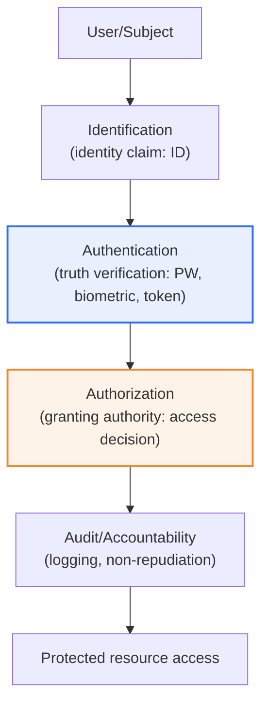
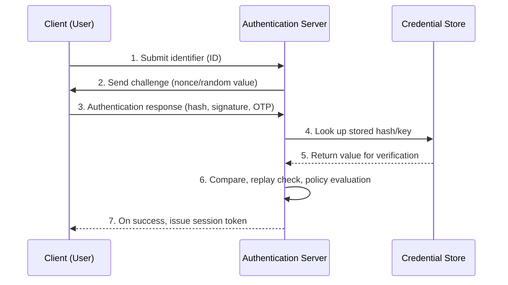

# Identification and Authentication

## 1. Overview

### a. Definition

> **Identification** is the act of claiming and distinguishing a subject to the system by saying "I am so-and-so," and **Authentication** is the act of **verifying that the claim is genuine**. If identification is stating one's identity, authentication is confirming that the identity is actually correct.

The core of distinguishing the two concepts is that **"a claim and a proof are different."** Identification is the stage where the user states who they are; typing an ID into a login window or presenting the employee number on a badge is representative. However, an ID is merely a name tag to uniquely specify the subject within the system (a unique identifier); it guarantees nothing about whether that person is really that person. This is because anyone can just as easily type in someone else's ID.

That is why authentication is needed. Authentication verifies "are you really that person" with **authentication factors** such as a password, biometric information, or a possession token. In a bank teller analogy, stating one's name is identification, and presenting an ID card to prove oneself is authentication. The two stages differ in their very outputs, in that the result of identification is "specifying the subject (who it is)" and the result of authentication is "a true/false judgment (whether it is correct)."

In addition to these two, there follow **Authorization**, which decides what an authenticated user can do, and **Accountability and Non-repudiation**, which prevent denial of an action. In this system, commonly called **AAA (Authentication, Authorization, Accounting)**, identification → authentication → authorization → audit (logging) forms the basic skeleton of Access Control. If identification is weak, the very target of authentication is blurred, and if authentication is weak, all authority judgments after authorization collapse, so the four stages must be understood as a single chain.

### b. Background and Necessity

The background for identification and authentication becoming the starting point of information security is the fundamental reason that unless you can specify "who" accesses a resource (data, system), you cannot protect any of confidentiality, integrity, or availability (CIA). If the accessing subject cannot be specified, neither granting authority nor tracing accountability when an incident occurs is possible. Initially, ID/password (ID/PW) alone was thought to be sufficient, but as passwords were exposed en masse through phishing, credential stuffing, and data breaches, the limits of single-factor authentication became clear.

In particular, as cloud, mobile, and remote work spread and access paths escaped the boundary of "inside the internal network," the premise "trust it because it's inside the network" collapsed. Accordingly, the **Zero Trust** paradigm, which re-verifies identity on every access, emerged, and identification and authentication were reassessed not as an incidental security procedure but as the central axis of architecture. Today, identification and authentication are understood not as "done once you pass" but as "a process of continuous verification."

### c. The Difference Between Personal Identification and User Authentication

| Category | Identification | Authentication |
|---|---|---|
| **Meaning** | Claim and distinguish identity | Verify the truth of the claim |
| **Core question** | "Who are you?" | "Are you really that person?" |
| **Input example** | ID, employee number, email | Password, fingerprint, OTP |
| **Output result** | Specifying the subject (unique identifier) | Confirming identity (true/false) |
| **Security strength** | Can be public (not secret) | Must be secret and verifiable |

As the table shows, an identifier is in principle "not a secret." An ID or email, even if exposed, does not by itself lead to account takeover. By contrast, an authentication factor is breached the moment it is exposed. Because of this difference, the management level of identifiers and of authentication credentials (encryption, storage method, transmission protection) must be fundamentally different. This is why a design that treats an identifier as an authentication means (for example, the practice of treating a resident registration number or phone number as authentication itself) is dangerous.

## 2. The Processing Flow of Identification, Authentication, and Authorization, and the Overall Structure

First we look at the overall structure of access control with a conceptual diagram, then explain the process by which an authentication request is handled in a detailed flow.

The structure diagram above shows the four gates that one access request passes through until it reaches the resource. Each gate takes the result of the previous stage as the premise of trust. If authentication does not pass, the authorization judgment is meaningless, and the subject information left in the audit log can be trusted only if identification and authentication are accurate. In other words, the security value of a later stage is subordinate to the accuracy of the earlier stage.

Next is a detailed flow of how an actual authentication request is verified at the server. It also expresses how mutual authentication and replay prevention intervene.

The core of this detailed flow is that verification is done with a challenge-response scheme **so that the plaintext password does not flow over the network**. The server throws a different nonce each time, and the client includes it in the response, so even if an attacker intercepts the response and replays it, the nonce differs and it fails. In the "policy evaluation" of step 6, beyond simple matching, context such as access location, device, and time is also considered. This is the point of contact with adaptive authentication, explained later.

## 3. Security Requirements for User Authentication

For an authentication system to be secure, not only the strength of individual factors but the entire system must simultaneously satisfy multiple requirements. The requirements are not independent of one another but operate complementarily.

| Requirement | Content | Representative Control |
|---|---|---|
| **Confidentiality** | Prevent exposure of authentication information (password) | Salted hash (bcrypt, Argon2), TLS |
| **Integrity** | Prevent forgery/tampering of authentication info and messages | MAC, digital signature |
| **Reuse prevention** | Defend against replay attacks | OTP, nonce, timestamp |
| **Mutual authentication** | Bidirectional verification of server and user | Server certificate, channel binding |
| **Strength** | Resistance to guessing and brute force | Complexity policy, MFA, account lockout |

**Confidentiality** must be protected in both storage and transmission phases. A password should be stored not as plaintext but with a per-account salt added and then hashed with a slow hash such as bcrypt, scrypt, or Argon2, so that even if leaked it withstands rainbow tables and mass cracking. The transmission segment is encrypted with TLS so that a man-in-the-middle (MITM) cannot see the plaintext. Cases where services that stored passwords with MD5 or plain SHA in the past were cracked after large breaches show that the storage method is the last line of defense of authentication security.

**Mutual authentication** is often overlooked but is the core of phishing defense. If only the user proves themselves and the server does not prove itself, a fake site can pose as the legitimate server and intercept the user's authentication information. HTTPS server certificate verification and FIDO2's domain binding (origin checking) enforce mutual authentication so that credentials do not work on a phishing site. **Reuse prevention** ensures that a once-used authentication response cannot be reused, a role played by the 30-second validity window of an OTP or by a nonce.

These requirements must not be satisfied only one at a time. For example, even using a strong password (strength) is meaningless if it is transmitted in plaintext (a violation of confidentiality), and even protecting confidentiality is breached by phishing if the server is not verified (a violation of mutual authentication). This is because security collapses at the weakest link.

## 4. The Four Types by Authentication Method and Multi-Factor Authentication

Authentication is divided into four factors according to "what one proves with." Because each type differs in principle, its strengths and weaknesses are also opposite, and this oppositeness is precisely the basis for combining them (MFA).

| Type | Basis | Example | Strength | Weakness |
|---|---|---|---|---|
| **Knowledge-based** | Something you know | Password, PIN | Simple to implement, low cost | Vulnerable to leak, guessing, reuse |
| **Possession-based** | Something you have | OTP, smart card, security key | Requires physical possession | Risk of loss, theft, cloning |
| **Biometric-based** | Something you are | Fingerprint, iris, face | Convenient, unique, cannot be lost | Cannot be changed, misrecognition (FAR/FRR) |
| **Behavior/location-based** | Something you do/location | Signature, typing, GPS | Can authenticate unobtrusively | Low accuracy, auxiliary use |

**Knowledge-based** is the oldest and most widely used but has many fundamental weaknesses. Passwords a person can remember are limited in complexity, are reused across multiple sites, and once one is leaked, other accounts are breached through credential stuffing. Statistically, the fact that a considerable share of large-scale account-takeover incidents originates from password reuse shows the inherent limit of this type.

**Possession-based** is strong against remote mass attacks because an attacker must secure the physical medium. An OTP creates a one-time value synchronized to time (TOTP) or an event (HOTP), neutralizing replay. However, SMS OTP is vulnerable to SIM swapping and relay phishing, so recently hardware security keys (FIDO2) and authentication apps are recommended. **Biometric-based** is convenient and carries no risk of loss, but has the fatal characteristic that, unlike a password, it cannot be "reissued" if leaked. That is why the method of not sending biometric information to the server but storing and matching it in a secure area within the device (for example, TEE or Secure Enclave) has become the standard.

Because the weaknesses of each type differ, **Multi-Factor Authentication (MFA)**, which combines different types, dramatically raises security. The key is that they are "different types." Requiring two passwords is still a single knowledge-based factor, so it is not MFA. Using a password (knowledge) and an OTP (possession) together means that even if the password is leaked, the attacker is blocked without the OTP device. In fact, MFA is reported to greatly block automated mass account-takeover attempts, which is why financial, public, and enterprise systems mandate MFA.

Meanwhile, when evaluating biometric authentication, two error rates must be considered together. The **False Acceptance Rate (FAR)** is the rate of wrongly accepting another person as the legitimate one and is directly linked to security risk, while the **False Rejection Rate (FRR)** is the rate of rejecting the legitimate person and is directly linked to usability. The two values are in a trade-off where tightening the threshold lowers one and raises the other, and the point at which they become equal is called the **Equal Error Rate (EER)**, used as a performance-comparison metric for biometric systems. It is common to adjust the threshold so that high-security environments lower FAR (stricter) and mass-market services lower FRR (more lenient), and this adjustment itself is a representative example showing the trade-off between security and convenience.

## 5. Deep Dive — Passwordless Authentication (Passkeys) and the Shift to Adaptive Authentication

The two biggest recent trends in authentication technology are as follows. One is the **passkey**, which eliminates knowledge-based authentication (passwords) altogether, and the other is **adaptive/risk-based authentication**, which dynamically adjusts authentication strength by reflecting context.

**Passkeys** are passwordless authentication based on the FIDO2/WebAuthn standard. The user's device creates a public/private key pair, keeping the private key in the device's secure area and registering only the public key with the server. At login, the server-sent challenge is signed with the private key and the server verifies it with the public key, so no "secret" that can be stolen and reused is stored on the server. Moreover, the signature is valid only on the registered domain (origin), so it does not work on a phishing site. In other words, a passkey has a structure where "there is no secret to leak, and phishing is blocked at the source," simultaneously solving the two fundamental problems of passwords (leak and phishing). As major platforms (operating systems, browsers) begin to support passkeys by default, their spread is accelerating.

**Adaptive authentication** is the idea of "not treating every access the same." Access from a usual device, location, and time zone passes with low friction, and when a login from a new country or an abnormal behavior pattern is detected, additional authentication (step-up) is required. This is judged in real time by scoring the access context (device fingerprint, IP reputation, behavior analysis) at the "policy evaluation" stage of the earlier flow. Combined with Zero Trust's principle of "verify explicitly," it is evolving in a direction that raises both security strength and user convenience at once.

The two trends are not mutually exclusive. If passkeys make the authentication factor itself strong and adaptive policies intelligently decide when to re-verify, "strong yet not cumbersome" authentication becomes possible. As actual expected exam directions, essay topics such as "a comparison of the security and usability of passkeys and existing MFA," "the role of identification and authentication in Zero Trust," and "storage and processing methods for protecting biometric information" may be addressed.

## 6. Considerations and Implications

From a professional engineer's perspective, the following must be comprehensively considered when designing and evaluating an identification and authentication system.

1. **Mandating MFA and factor-combination strategy.** Because a single factor (especially a password) is inherently vulnerable to leak and theft, different types must be combined so that even if one is breached, the account is protected. However, it is advantageous in terms of trade-offs to avoid weakened factors like SMS OTP and to select factors centered on hardware security keys, authentication apps, and passkeys.

2. **A roadmap for the transition from passwords to passkeys (FIDO2).** Overcoming the fundamental vulnerabilities of knowledge-based authentication (leak, reuse, phishing) requires migration to passkeys, but there are realistic constraints such as device loss, account recovery, and legacy-system compatibility. Therefore, rather than a full switch, a phased approach of "passkey first, reduce password fallback" and the design of a secure account-recovery procedure are key.

3. **Evolution toward context/risk-based adaptive authentication.** Adaptive authentication, which analyzes access location, device, and behavior and requires additional authentication only when risky, is a core implementation of Zero Trust. While balancing security and convenience, operational capability to continuously tune the thresholds of false positives (blocking legitimate users) and false negatives (letting attacks through) is also required.

4. **Protecting biometric information and privacy compliance.** Because biometric information cannot be changed, the damage from a leak is permanent. A design that processes it in the device's secure area without transmitting or storing the original to the server, and compliance with the sensitive-information handling requirements of the Personal Information Protection Act, are essential. A design that centrally stores biometric information in pursuit of convenience alone is risky in both regulatory and security terms.

5. **The principle of separating identifiers and authentication information.** The practice of also using publicly disclosed and reused identifiers such as resident registration numbers and phone numbers as an authentication means is dangerous. Identifiers must be managed clearly as public name tags and authentication information as secrets, and designed in a form that can be reissued in the event of an incident.

## References

- NIST SP 800-63 Digital Identity Guidelines — https://pages.nist.gov/800-63-3/
- FIDO Alliance, Passkeys / FIDO2 & WebAuthn — https://fidoalliance.org/passkeys/
- W3C, Web Authentication (WebAuthn) — https://www.w3.org/TR/webauthn-2/
- NIST, Zero Trust Architecture (SP 800-207) — https://csrc.nist.gov/pubs/sp/800/207/final

---

> **In one line**: Identification is *claiming identity (who it is)* and authentication is *verifying its truth (whether it is correct)*; together they form the access-control chain of identification → authentication → authorization → audit, and — through MFA that combines the four authentication factors of knowledge, possession, biometrics, and behavior — are evolving toward passkeys (FIDO2) that block leaks and phishing at the source and adaptive authentication that reflects context.
