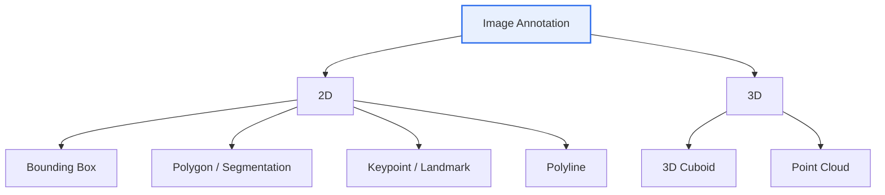

# Image Data Annotation

## 1. Overview

### a. Definition
> The task of **attaching ground-truth labels — objects, regions, attributes, and so on — to images** for the supervised learning of computer vision models.

Annotation is **the process of creating the textbook** from which a model learns "what the correct answer is." Because a supervised learning model reduces its prediction error against the correct answers given by humans, the labels become the reference point of learning. Therefore, the accuracy and consistency of annotation govern model performance no less than the algorithm itself.

### b. Background and Necessity
As the saying "Garbage In, Garbage Out" goes, model performance is directly governed by **label quality**. Even with the same algorithm, if the answers are inaccurate or vary because criteria differ from worker to worker, the model learns wrong patterns. In particular, as fields requiring **precise recognition** — autonomous driving (where misrecognizing a pedestrian leads directly to an accident), medical imaging (where missing a lesion leads directly to misdiagnosis), and defect inspection — expand, systematically securing large volumes of high-quality labels has become a core bottleneck in AI development.

## 2. Classification of Annotation Types

The key is to understand annotation types as **a trade-off between representational precision and cost**. Toward the top (bounding box), the work is fast and cheap but the shape representation is coarse; toward the bottom (segmentation, 3D), it is precise at the pixel/spatial unit but the work time and cost surge. Therefore, the principle is to choose the type according to the precision required by the target task.

## 3. Characteristics by Type

Each type corresponds to a different computer vision task. A **bounding box** is used for object detection, where one only needs to know "what is roughly where"; **polygon and semantic segmentation** are used for shape recognition and medical imaging, which require the exact outline and pixel boundary of the object. A **keypoint** is used for pose estimation and face recognition, where the positional relationship of joints and landmarks matters; a **polyline** for thin, long linear objects such as lanes; and a **3D cuboid / point cloud** for autonomous-driving LiDAR, which requires distance and depth.

| Type | Description | Representative Use |
|---|---|---|
| Bounding Box | Mark an object with a rectangle | Object detection |
| Polygon | Precisely mark the outline with a polygon | Shape recognition, instance segmentation |
| Semantic Segmentation | Pixel-level class classification | Road/background segmentation, medical imaging |
| Keypoint | Mark joint and landmark points | Pose estimation, face recognition |
| Polyline | Mark linear objects | Lanes, road boundaries |
| 3D Cuboid | Mark with a three-dimensional cuboid | Autonomous-driving LiDAR, depth perception |

For example, in autonomous driving, avoiding a collision with the car ahead requires knowing not only where the target is on the screen (box) but also **how many meters ahead** it is, so a LiDAR 3D cuboid is required. Thus type selection is determined by the physical requirements of the task.

## 4. Annotation Techniques

Manual labeling is accurate but has the fundamental limits of being slow and expensive, so techniques have evolved **in the direction of reducing human involvement**. However, since full automation carries the risk of error, the mainstream is currently **Human-in-the-loop**, where AI produces a draft and humans review it.

| Technique | Description |
|---|---|
| Manual | Humans label directly — accurate but high-cost, slow |
| Semi-auto | AI pre-predicts, then humans review and correct (HITL) |
| Auto-labeling | Automatically generated by a pre-trained model, then sample-verified |
| Active Learning | The model prioritizes labeling of samples it is uncertain about |

In particular, **active learning** is a key strategy for efficiency. Instead of labeling all data equally, it selects the samples **the model is most confused by (with low prediction confidence)** and prioritizes assigning them to humans for labeling. Because labor is concentrated on high-information data, greater performance improvement can be obtained with the same budget.

## 5. Considerations and Implications
From a professional engineer's perspective, the core is how to design **a balance between quality and efficiency**. On the quality side, consistency must be ensured through clear labeling guidelines, cross-validation, and measuring Inter-Annotator Agreement (IAA); on the efficiency side, cost must be lowered through semi-automation and active learning. Also, if a particular group is under- or over-represented in the data, the model learns bias, so **data bias** must be managed, and when personal information such as faces and license plates is included, **privacy (de-identification)** must be considered without fail. Recently, as automatic segmentation using foundation models such as SAM advances, there is a trend of the human role shifting from labeling to **review and quality management**.

---

> **In one line**: Image annotation is the task of assigning ground truth in forms such as *bounding boxes, polygons, segmentation, keypoints, and 3D* according to task precision; label quality governs model performance, quality and efficiency are pursued together via manual → semi-auto → active learning, and bias and privacy must be managed.
