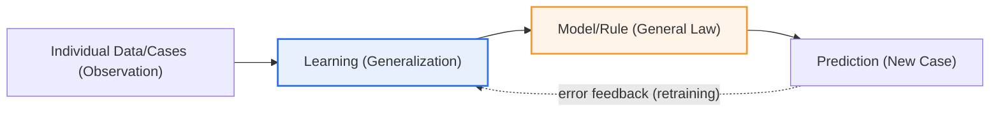
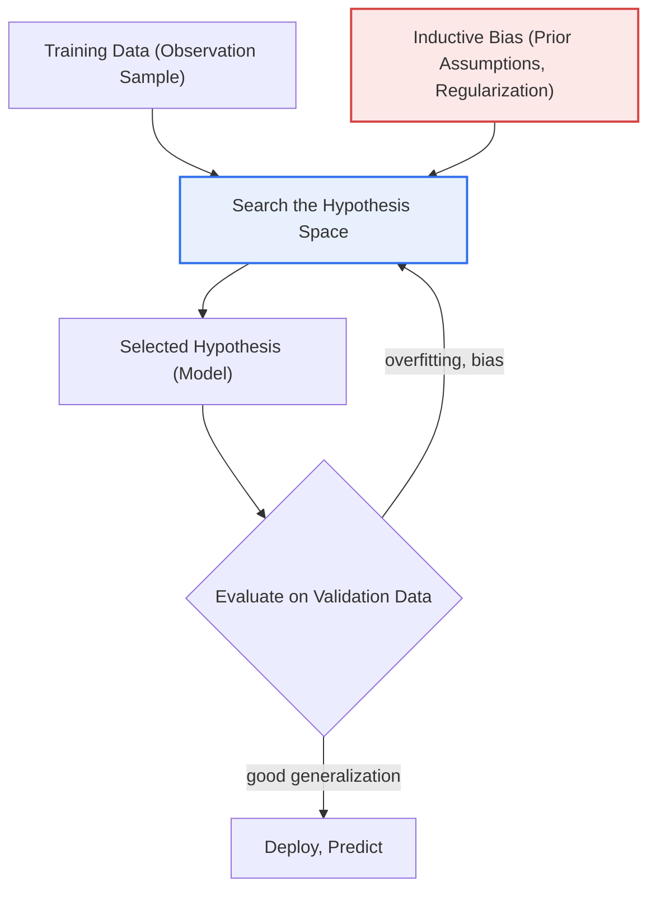

# Inductive Reasoning and Machine Learning

## 1. Overview

### a. Definition
> **Inductive reasoning** is a mode of inference that derives general rules and patterns from individual cases and observations, and **machine learning** is a technology that learns rules and models from data (cases); it is **essentially the automation and computationalization of inductive reasoning**.

The key to understanding the two concepts together is the insight that **"machine learning is inductive reasoning done by a computer."** Induction is the kind of thinking that draws a general law from concrete observations, as in "I saw 100 crows and they were all black → crows are black." This has the characteristics of being probabilistic and empirical rather than guaranteeing absolute truth (the next crow could be white). Machine learning works exactly the same way. It looks at a great many data points (cases), builds a model that generalizes the patterns and rules within them, and predicts new data. In short, just as a person learns rules from experience, a machine learns rules from data.

This correspondence is not a mere analogy but is mathematically supported by learning theory. In statistical learning theory, a learner chooses, from a finite sample of input-output pairs, a hypothesis that approximates an unknown target function — which coincides exactly with induction's definition of "estimating a general rule that governs infinite cases from finite observations." For example, a spam filter learns word, sender, and link patterns from hundreds of thousands of emails that people previously marked as "spam/legitimate," and classifies a new email it has never seen. It is a typical inductive process of establishing a rule (a classification boundary) from observations (labeled emails) and applying it to new cases.

Because of this inductive nature, a machine learning model can be wrong in situations not in the training data (generalization error) and has the limitation of inheriting the biases of the training data as they are. The intrinsic vulnerability of induction — "unable to imagine a white crow because one has only seen black crows" — reappears as the phenomenon of a model collapsing on minority cases and edge cases not present in the data. Therefore, when understanding machine learning, the essential evaluation criterion becomes not "how well it learned" but "**how well it generalizes to data it has never seen**."

### b. Background and Necessity
The limits of the rule-based approach gave rise to the need for machine learning (the inductive approach). Expert systems of the 1980s were a deductive method in which people hand-coded IF-THEN rules one by one, but for problems with many real-world exceptions and ambiguities (handwriting recognition, natural language understanding, image classification), writing out all the rules by hand was practically impossible. Conversely, data exploded through the internet, sensors, and mobile devices. The shift of "let machines induce rules from data rather than having people write them" is precisely the rise of machine learning, and the success of deep learning (ImageNet 2012) empirically demonstrated that this inductive paradigm overwhelms the rule-based one.

### c. Contrast with Deduction
Contrasted with induction is **deduction**. Deduction draws individual conclusions from general laws (major premise → minor premise → conclusion) and guarantees truth, but it does not create new knowledge that was not in the premises. "All humans are mortal; Socrates is human; therefore Socrates is mortal" is logically complete but does not discover a new law. If traditional rule-based AI (expert systems) is deductive, machine learning is inductive in discovering new rules from data. However, real intelligence moves between the two, and recent AI is heading toward combining them (neuro-symbolic).

## 2. The Correspondence Structure of Inductive Reasoning and Machine Learning

First we look at how the skeleton of induction — observation → generalization → prediction — overlaps one-to-one with the machine learning pipeline through an overall structure diagram.

Each stage of this flow corresponds exactly to the cognitive process of inductive reasoning. In the **observation (data collection)** stage, a person gathers many cases with their eyes and a machine collects labeled training data. Here it is the same that the number and diversity of observations determine the reliability of subsequent generalization. Just as the generalization of a person who has seen only three crows is dangerous, a model trained on scant, skewed data is also dangerous.

In the **generalization (learning)** stage, a person abstracts common patterns among observations, and a machine adjusts parameters to minimize a loss function. For example, linear regression finds the slope and intercept of the line that best passes through the observed points, which is the computational implementation of induction that "extracts one trend law from many cases." The gradient descent of a neural network repeatedly adjusts weights in the direction that reduces error, resembling the process by which a person refines rules through repeated trial and error.

In the **general law (model)** stage, the derived model corresponds to a person's "rule of thumb." However, whereas a person's rule of thumb is expressed in language, a machine's law is in the numerical form of millions of parameters, making it hard for a person to read directly (the root of the explainability problem). In the **prediction (application)** stage, this law is applied to new cases, and the cycle of feeding the prediction error back into learning to update the law (retraining) constitutes the self-correcting process of inductive knowledge.

| Inductive Reasoning | Machine Learning | Common Essence |
|---|---|---|
| Collect individual observations | Collect training data | The sample governs the reliability of the conclusion |
| Generalize patterns/rules | Model learning (parameter estimation) | Abstract finite cases → general rules |
| Derive a general law | Trained model | Explicit law vs. numerical parameters |
| Apply to new cases | Predict new data | Extrapolation to unobserved cases |
| Probabilistic, empirical (error possible) | Generalization error, bias possible | Cannot guarantee absolute truth |

## 3. The Internal Mechanism of Inductive Learning and Inductive Bias

To understand how a machine "picks out" a single rule from finite data, the concepts of hypothesis space and inductive bias are needed. Below is a detailed process diagram of how a learner combines data and bias to select a model.

The hypothesis space is the set of all candidate rules the learner can choose from. The problem is that there are countless rules explaining the same data. For example, a curve passing through three points could be a straight line, or a 2nd- or 10th-degree polynomial. Observation alone cannot determine which is correct, and this is **the problem of induction** that Hume pointed out. Therefore the learner must introduce additional assumptions beyond the data — that is, **inductive bias** — to narrow the candidates.

Inductive bias is prior knowledge about "which rule to prefer, other things being equal." A representative example is Occam's Razor, "prefer the simpler rule," which is implemented through regularization. For instance, L2 regularization keeps weights small, making a gentle curve preferred over a complex one. The "local connectivity and weight sharing" of a convolutional neural network (CNN) embeds the spatial bias that "an image is a composition of local patterns," and the structure of a recurrent neural network (RNN) embeds the sequential bias that "the data has a temporal order." The better the bias matches the problem structure, the better it generalizes even with little data.

Inductive bias is a double-edged sword. Without bias (no assumptions at all), the learner merely memorizes the training data wholesale and does no generalization to new data (the "No Free Lunch" theorem). Conversely, if the bias mismatches the problem, it generalizes in the wrong direction no matter how much data there is. Choosing the model, architecture, and regularization strength in practice ultimately amounts to choosing "what inductive bias is appropriate for this problem," and this is the core judgment of a data scientist.

The characteristics arising from this inductive nature can be summarized as follows.

| Characteristic | Content | Practical Implication |
|---|---|---|
| **Probabilistic** | Empirical estimate, not absolute truth | Present predictions with confidence intervals/probabilities |
| **Generalization error** | Can be wrong on data not in training (overfitting) | Constantly measure via cross-validation, holdout |
| **Data-dependent** | Data quantity, quality, and bias govern the result | Data quality management is the ceiling of model performance |
| **Inductive bias** | The model's assumed prior knowledge determines the generalization direction | Choose the model/regularization suited to the problem |

## 4. Successes and Failures of Induction Seen Through Cases

Comparing cases where inductive machine learning worked well and where it collapsed makes its essence clear. As a success case, **AlphaGo** induced patterns of "good moves" from 160,000 human game records and self-play data, beating a world champion without explicit rules of Go. It is a representative success of generalizing from data the "goodness of a move," which is hard for people to define in language.

As a failure case, the **AI recruiting system** that Amazon developed from 2014 to 2017 and then scrapped learned from ten years of past résumés of successful applicants, but because male applicants were overwhelmingly numerous in that data, it induced a rule that penalized résumés containing the word "women's." It solidified the data's bias directly into a law — a case where the limit of induction, "extracting rules only from what was observed," materialized as discrimination. Also, the failure of recognition in autonomous driving in nighttime, backlit, or anomalous-object situations (edge cases) that were rare in the training data likewise shows the inductive principle that extrapolation to unobserved cases is dangerous.

The practical implication of this contrast is clear. The performance ceiling of inductive machine learning is ultimately determined by the data, and "**there is no wisdom in the model that is not in the data.**" Therefore, securing representative data and checking for bias become tasks that take priority over tuning model accuracy.

## 5. Aspects of Induction Seen by Learning Type

The three branches of machine learning (supervised, unsupervised, reinforcement) are all induction, but "from what and to what one generalizes" differs. Distinguishing them makes the correspondence with inductive reasoning clearer.

**Supervised learning** induces the input→output mapping rule from pairs of inputs and correct answers (labels). It generalizes a classification boundary from labeled observations such as "these photos are cats, those photos are dogs," corresponding exactly to the supervised-learning kind of induction in which a person learns rules while looking at examples and answers together. Because the label is the "answer marker" of the observation, label quality determines the ceiling of generalization.

**Unsupervised learning** induces latent patterns solely from the structure, clusters, and distribution of data without correct answers. Clustering similar customer groups from unlabeled customer purchase histories is an example, resembling the concept-formation process in which a person categorizes commonalities among things on their own without explicit answers. Because there is no external criterion for what is the "correct pattern," interpreting the validity of a discovered rule is more difficult.

**Reinforcement learning** induces a "good action policy" from reward signals obtained through trial and error. It does not directly give answers but feeds back only the goodness or badness (reward) of results, so it is close to empirical induction in which a person acquires action rules through the successes and failures of experience. Its characteristic is that observations are generated not from static data but from the interaction of "action → result," and to that extent the balance of exploration and exploitation becomes key to generalization.

| Learning Type | Observation (Input) | Target of Generalization | Cognitive Correspondence |
|---|---|---|---|
| Supervised | Input + answer label | Input→output mapping | Learning from examples and answers |
| Unsupervised | Unlabeled data | Latent structure, clusters | Categorizing concepts on one's own |
| Reinforcement | Action, reward signal | Optimal action policy | Acquiring through trial and error |

## 6. Deep Dive — Recent Trends Trying to Overcome the Limits of Induction

Research to complement the limits of pure inductive machine learning (lack of explainability, data bias, edge-case vulnerability) forms a major recent trend in AI. First, **Neuro-Symbolic AI** combines inductive neural networks that learn from data with deductive symbolic reasoning that handles logic and rules, so that it learns from data yet reasons with rules a person can verify. This is an attempt to transplant into AI the scientific method of "form a hypothesis by induction and verify it by deduction."

Second, **RAG (Retrieval-Augmented Generation)** combines the inductive knowledge (learned parameters) of a large language model with external knowledge-base retrieval, correcting the hallucinations the model probabilistically fabricates with grounding documents. It is a structure that complements the limit that induction alone cannot ensure up-to-date, accurate facts, by presenting deductive grounding. Third, **foundation models and transfer learning** first induce general representations from vast data and then adapt (fine-tune) to a specific task with a small amount of data, mitigating induction's data dependence so that it generalizes well even from few observations. Fourth, **Explainable AI (XAI)** back-interprets the inductive law solidified as numerical parameters into grounds a person can understand, complementing the "black box" character of induction.

From a professional engineer's perspective, the common thread of these trends is "**making the probabilistic, opaque character of pure induction controllable through deductive rules, grounds, and explanations.**" That is, the direction of AI development is not to abandon induction but to raise reliability by combining induction and deduction.

## 7. Considerations and Implications (Professional Engineer's Perspective)

1. **Generalization is the ultimate goal and the essence of evaluation.** The success or failure of machine learning lies not in memorizing the training data but in generalization that applies well to new data, so it must be judged not by training accuracy but by validation/test performance, constantly measuring generalization error via cross-validation and holdout. Overfitting, with high training performance but low validation performance, is a signal that induction failed.
2. **Data bias equals model bias, and this is a governance task.** Because induction draws rules only from observed data, if the training data is biased, the model is too. Securing representative data, detecting and mitigating bias, and managing data provenance and label quality are premises of trust, and these are directly linked to AI ethics and fairness regulation (the EU AI Act, etc.).
3. **Inductive bias (model selection) is the architect's core judgment.** Which model, regularization, and architecture to use is the question of which prior assumptions to introduce. Selecting a bias suited to the problem structure (image → CNN, sequential → Transformer) generalizes well even with little data, meaning a bigger model is not always the answer.
4. **Secure reliability by combining induction and deduction.** Neuro-symbolic AI, RAG, and XAI, which combine knowledge and rules with inductive machine learning that learns from data, have emerged to complement the limits of induction (explainability, accuracy, hallucination). The more mission-critical the domain, the more one should aim for a verifiable hybrid structure over pure induction.
5. **Operations that make uncertainty explicit are needed.** Because inductive prediction is inherently probabilistic, one should provide confidence intervals and confidence together rather than presenting only point predictions, and design a human-in-the-loop that hands judgment to a person when confidence is low, controlling the ripple effect of errors.

---

> **In one line**: Machine learning is a technology that *automates and computationalizes the inductive reasoning of generalizing rules from data (cases)*, a probabilistic process that narrows the hypothesis space with inductive bias to select a model; by its nature it has the limits of generalization error, data bias, and opacity, so reliability must be complemented through cross-validation, data quality management, and the combination of induction and deduction (neuro-symbolic, RAG, XAI).
