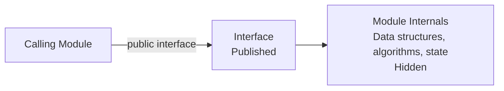

# Information Hiding

## 1. Overview

### a. Definition
> A software design principle that **hides a module's internal implementation details and data from the outside** and exposes only a well-defined interface, thereby lowering coupling between modules. Proposed by D.L. Parnas in a 1972 paper.

The starting point of information hiding is the question "**what shall we take as module boundaries?**" Parnas said to divide a system not by processing order (flowchart) but by **decisions likely to change (design secrets)**. If parts likely to change often (data structure representations, algorithms, external specifications, etc.) are locked inside a single module and that decision is hidden as a "secret," then even if that secret changes, other modules are unaffected. In other words, information hiding is not a mere access-restriction technique but **a module-decomposition strategy for localizing the ripple of change**.

### b. Necessity
The total cost of software arises more from change and maintenance than from development, and when modules know and depend on each other's internals, a fix in one place produces a **ripple effect** that breaks others in a chain. Information hiding makes each module interact only through its published interface, so that even if the internal implementation changes, **other modules need not be touched** as long as the interface is maintained. This raises module independence and maintainability, and by hiding a complex interior it realizes **abstraction**.

## 2. Conceptual Structure

The key is **separating interface and implementation into contract and execution**. The caller only needs to know **what (What)** the module guarantees (the interface's promise), and it need not — and must not — know **how (How)** it achieves it (internal data structures, algorithms). For example, if only the contract "returns a sorted list" is published, the caller is indifferent to whether quicksort or mergesort is used inside. Only when the caller does not know the internal implementation can that implementation be freely changed, so "not knowing" becomes, paradoxically, the source of flexibility.

## 3. The Relationship Between Information Hiding and Encapsulation

The two concepts are often confused but operate at different layers. **Information hiding is a design principle (the purpose) that decides "what to hide and why,"** and **encapsulation is an implementation technique (the means) that bundles data and the methods that handle it into one**. By bundling data inside an object with encapsulation and restricting access with `private`, the purpose of information hiding is actually realized. That is, one can discuss hiding even without encapsulation (module interface conventions, etc.), but in object orientation encapsulation is the representative means of achieving hiding. Understanding them as a purpose-means relationship makes the difference between the two clear.

| Category | Information Hiding | Encapsulation |
|---|---|---|
| Concept | Design principle of hiding implementation details (purpose) | Technique of bundling data + methods (means) |
| Focus | Access restriction, concealing secrets | Binding (bundling) |
| Relationship | Realized through encapsulation | A means that supports information hiding |
| Implementation example | `private`, module interface conventions | Classes, objects |

## 4. Implementation Techniques and Related Principles

Information hiding is concretized through techniques and principles at several layers. At the language level, **access modifiers** (`private`, `protected`) conceal the internals, and **interfaces/abstract classes** expose only the contract while separating the implementation. As design principles, the **Law of Demeter**, which keeps an object from reaching into the internals of unfamiliar objects; the **Open-Closed Principle (OCP)**, which is open to extension and closed to modification; and **Dependency Inversion (DIP)**, which depends on abstractions rather than concrete implementations, all border on hiding. These ultimately share the single orientation of "**hiding changeable details behind an abstraction.**"

| Category | Content |
|---|---|
| Access modifiers | Hide internals with private, protected |
| Interfaces/abstract classes | Expose only the contract, separate the implementation |
| Related principles | Encapsulation, abstraction, Law of Demeter, OCP, DIP |

## 5. Advantages and Effects

The effects of information hiding are interconnected. Because modules communicate only through interfaces, **coupling is lowered**, and because related functions and data gather in one module, **cohesion is raised**. With low coupling and high cohesion, one module can be modified or replaced independently, so **maintainability** rises, and a verified interface can be **reused** in many places. Also, by preventing the outside from directly touching internal data, one even gains the **integrity and security** effect of preventing erroneous state changes. In short, a single principle simultaneously improves several quality metrics.

| Effect | Description |
|---|---|
| Low coupling | Reduced inter-module dependence → independent modification |
| High cohesion | Related functions concentrated inside the module |
| Maintainability | Internal changes have no effect while the interface is maintained |
| Reusability & security | Reuse of verified interfaces, protection of internal data |

## 6. Considerations and Implications
- **A principle that runs across scales**: from a class's `private` to MSA service boundaries and open API design, the same principle of "hide the implementation, expose only the contract" runs throughout. In MSA, each service not directly sharing a DB but communicating only via API is also an extension of information hiding.
- **Interface stability is flexibility**: if the interface changes often, the benefit of hiding disappears, so it is important to stabilize the contract first through **interface-first design (API-first)**.
- **The cost of excessive hiding**: excessive layers of abstraction produce performance overhead and difficulty in debugging and tracing. One must distinguish "changeable secrets" worth hiding from those that are not and set an **appropriate level of abstraction**.

---

> **In one line**: Information hiding is a design principle that *hides changeable implementation details and exposes only the interface* to localize the ripple of change; the purpose of hiding is realized by the means of encapsulation, and through lowered coupling and improved maintainability it becomes the foundation of MSA and API design.
