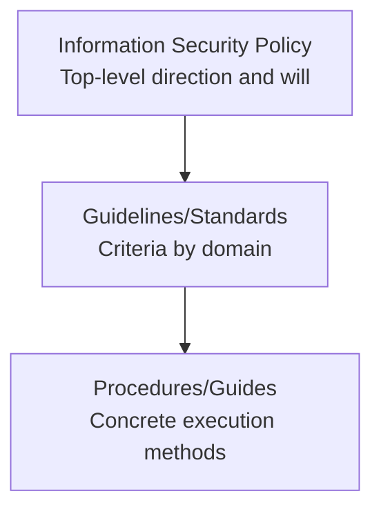
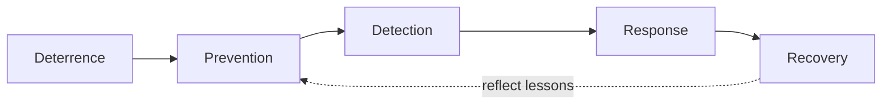

# Information Security Policy, Security Activities, and the Security Professional

## 1. Overview

### a. Definition
> The **top-level document that codifies top management's will and direction regarding information security**, serving as the apex from which guidelines, standards, and procedures are hierarchically derived to govern the security activities of the entire organization.

### b. Background and Necessity
As an organization grows and its information assets increase, security controls cannot be left to individual discretion or to the practices of a handful of staff. If each department grants access rights by different criteria and incident response is improvised, gaps open in the controls. That is why an information security policy pins down **consistent security criteria and a system of accountability** in a document that all members must follow. Moreover, since laws and certifications such as ISMS-P and the Personal Information Protection Act mandate establishing a policy, the policy is also the starting point of **compliance** and **risk management**. Without a policy, accountability is unclear when an incident occurs and it is hard to secure external trust.

## 2. The Concept and Hierarchy of the Information Security Policy

The policy documents have a pyramid structure that becomes more detailed as one descends from **abstract direction (policy) → concrete execution (procedures)**. The top-level **policy** holds the principles and management will of "this is how we protect information" and rarely changes. Below it, the **guidelines and standards** set criteria by domain such as access control, encryption, and passwords, and the lowest **procedures and guides** stipulate practical steps such as "how to issue an account on this system," updated often as circumstances change. The reason for dividing into layers this way is to **separate the scope of the impact of change** so that the top-level principles are not shaken by frequently changing detailed procedures.

| Item | Content |
|---|---|
| Definition | Top-level document codifying the will and direction of information security |
| Hierarchy | Policy → guidelines/standards → procedures/guides |
| Requirements | Management approval and support, enterprise-wide application, periodic review and update |
| Contents | Purpose and scope, roles and responsibilities, compliance and penalties, security principles |

For a policy to have effect, **official management approval and support** are essential. A policy entails budget, personnel, and organizational authority, which only management can allocate. Also, because the threat environment continually changes, it must be **periodically reviewed and updated** at least once a year.

## 3. Activities by Security Timing (Security Action Cycle)

Security should be seen not as a one-time measure but as a cycle that encompasses **before, during, and after** based on the point of incident occurrence. The reason this perspective matters is the reality that no matter how much prevention is strengthened, breaches cannot be blocked 100%. Therefore, one must not invest only in prevention but distribute resources across detection, response, and recovery as well.

- **Deterrence**: notifying of penalty provisions and the fact of monitoring to psychologically deter the very attempt at attack or insider violation. It is the lowest-cost control.
- **Prevention**: blocking breaches in advance through access control, encryption, and security education. The most ideal but cannot be perfect.
- **Detection**: quickly discovering breaches that have already occurred through IDS, SIEM, and log monitoring. The line of defense after prevention has been breached.
- **Response**: on confirming a breach, isolating, blocking, and investigating the cause to stop the spread of damage.
- **Recovery**: normalizing the system with backups, securing business continuity with BCP/DRP, and reflecting recurrence-prevention measures.

| Timing | Example Activities |
|---|---|
| Deterrence | Notify policy and penalties, announce monitoring |
| Prevention | Access control, encryption, education |
| Detection | IDS/SIEM, log monitoring |
| Response | Incident isolation, blocking, investigation |
| Recovery | Backup restoration, BCP, recurrence prevention |

## 4. The Role and Competencies of the Security Professional

The security professional (for example, a CISO or security officer) is the entity that actually designs and operates the above policy and activity cycle. In particular, security today is not completed by technology alone. Because one must communicate with management, legal, and PR during an incident and report to regulatory authorities, **technical, managerial, and soft competencies** are required together.

| Category | Competency |
|---|---|
| Role | Policy establishment, risk management, incident response, security operations/audit, awareness education |
| Technical competency | System, network, cryptography, and cloud security; digital forensics |
| Managerial competency | Governance and compliance (ISMS-P), risk management |
| Soft competency | Communication, professional ethics, continuous learning of the latest threats |

For example, when a ransomware incident occurs, the professional technically analyzes the infection path through forensics, managerially carries out reporting and notification procedures, and with soft competencies explains the situation to employees and conducts recurrence-prevention education.

## 5. Considerations and Implications
- **Success requirements**: a policy does not end with documentation. It has effect only when backed by **management will + enterprise-wide execution (education, inspection)**.
- **Balance and evolution**: while balancing technical, managerial, and physical security, it is evolving beyond the limits of perimeter-based defense toward **Zero Trust**, which "never trusts and always verifies."
- **Continuity**: security is not a one-off project but a continuous activity that keeps turning the **Action Cycle** from deterrence to recovery, and the policy must be continually updated with threat intelligence.

---

> **In one line**: An information security policy is the *top-level document codifying management will (policy → guidelines → procedures)* that establishes consistent security criteria; security activities are carried out as the cycle of *deterrence, prevention, detection, response, and recovery*, and the security professional designs and operates these with technical, managerial, and ethical competencies, evolving them toward Zero Trust.
