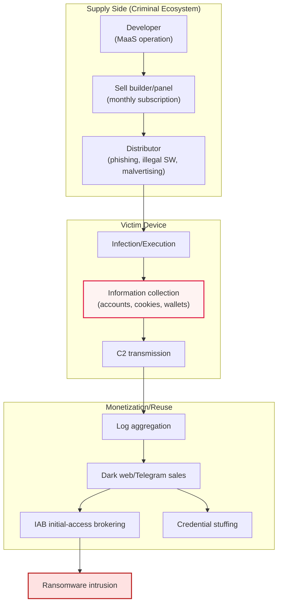
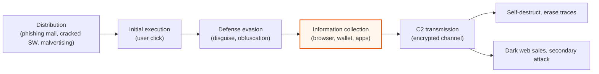

# InfoStealer

## 1. Overview

### a. Definition
> An infostealer is information-stealing malware that **covertly collects and exfiltrates sensitive data — accounts, passwords, session cookies, cryptocurrency wallets, autofill information, and so on — from an infected system** and transmits it to the attacker's server (C2). The stolen data is bundled into units called Logs and traded on dark web markets, or reused as raw material for secondary attacks such as account takeover and ransomware intrusion.

The fundamental character that distinguishes an infostealer from other malware is that it is "**theft, not destruction.**" Whereas ransomware encrypts files to cause immediate, visible damage and demand a ransom, an infostealer does the opposite: it infiltrates as quietly as possible, scrapes credentials, then erases its traces and disappears. Victims often do not perceive the fact of infection at all, and only after their account is taken over or the company system is infected with ransomware months later do they trace back that the initial cause was an infostealer. This "delayed damage" and "low visibility" make infostealers especially dangerous.

The second core point is that **Session Cookie theft** neutralizes the last line of defense of authentication systems. When a user logs in to a web service, the server stores a session token in a cookie in the browser to maintain the authenticated state. If an infostealer steals this cookie, the attacker can reproduce the "already logged-in session" as is, without knowing the victim's password or multi-factor authentication (MFA) code at all. In other words, even if strong authentication means such as MFA and passkeys are introduced, stealing the entire session issued after authentication skips the authentication procedure. For this reason, infostealers are frequently cited as "a realistic threat that bypasses MFA."

The third point is **its position in the criminal ecosystem**. Rather than being an end goal in itself, an infostealer is a "raw-material supplier" that supplies credentials needed for follow-up attacks in bulk, and a means of initial intrusion. Stolen corporate VPN and SSO accounts are sold to ransomware groups through IABs (Initial Access Brokers), and large volumes of personal accounts are used in credential stuffing. Recently, as it is sold in the form of Malware-as-a-Service (MaaS) via monthly subscription, even technically unskilled attackers can use it easily, greatly lowering the barrier to entry.

### b. Background and Necessity
Three environmental changes intertwine in the background of infostealers becoming industrialized. First, as the habit of saving IDs and passwords in browsers and applications became universal, a structure was created in which dozens or hundreds of credentials are concentrated on a single device. Second, as dark web markets and Telegram-based sales channels that buy and sell stolen information matured, a path for "monetizing stolen data" was established. Third, as the MaaS business model took hold, a sophisticated supply chain formed in which developers, distributors, and buyers divide the labor.

From a defensive standpoint, the reason infostealers must be treated as a separate topic is that traditional perimeter defense (firewalls, antivirus) alone struggles to respond. Infostealers often disguise themselves as normal processes and self-delete immediately after collection, so the detection window is short. Therefore, a multilayered strategy is required that encompasses not only infection prevention but also authentication strengthening "on the premise of theft" and post-breach leak monitoring.

### c. Key Characteristics
The technical characteristics of infostealers are summarized as follows. First, the collection targets are broad — they target browser-stored passwords, cookies, and autofill; email and messenger accounts; FTP/VPN/SSH settings; cryptocurrency wallet files; and even documents with specific file extensions.

Second, they have a short execution time (fire-and-forget) characteristic. Unlike resident backdoors, they do not linger long in the system; in many cases they run once, scrape and transmit information, then terminate and delete themselves. Because of this, the detectable time window is extremely short, so behavior-based EDR is more advantageous than signature-based antivirus.

Third, they are highly modular and combinable. They extend their functionality by combining with other malware such as clippers (covertly replacing a cryptocurrency remittance address with the attacker's), loaders (downloading additional payloads), and botnet clients. In other words, an infostealer infection does not end as a single event but can become a conduit for additional malware.

### d. Representative Families and Evolution
An infostealer is not one specific thing but a collective name for many families that constantly rise and fall. RedLine and META led the market for a long time but were weakened by a 2024 crackdown, and LummaC2 quickly filled that vacuum. Subsequently, Vidar, StealC, Rhadamanthys, Meduza, and others are also actively distributed, forming a highly fluid landscape where crackdown, re-emergence, and replacement repeat. Rather than chasing specific family names, defenders find it more sustainable to design a response system centered on the assets these commonly target — "credentials and sessions."

## 2. Overall Structure and Threat Flow

To understand the infostealer threat, one must look not only at individual malware behavior but at the overall structure of the criminal ecosystem surrounding it. The structure diagram below shows the cyclical loop that runs from development, distribution, collection, monetization, to secondary attack.

What is notable in the structure above is the **division of roles**. The developer who makes the malware, the distributor who subscribes and spreads it, the IAB who buys stolen logs and intrudes, and the group that ultimately runs the ransomware are each different entities. Because of this division of labor, taking down a specific malware family does not easily bring down the entire ecosystem. In fact, despite the international coordination targeting RedLine and META in October 2024 (Operation Magnus) and the LummaC2 crackdown in May 2025, the market showed the resilience of moving to substitute families and recovering within weeks.

## 3. Attack Procedure (Kill Chain)

Subdividing what happens on an individual infected device by stage is as follows.

### a. Distribution and Initial Execution
The initial intrusion of an infostealer mostly relies on social engineering that induces "the user's click." Representative paths are (1) phishing-mail attachments impersonating invoices, résumés, and contracts; (2) untrusted executables such as pirated software, game cheats, and cracks; and (3) malicious advertising (malvertising) that appears at the top of search results and fake download sites. Recently, the ClickFix method — which impersonates a legitimate site and induces the user to directly run a PowerShell command by saying "paste the command below for security verification" — is also spreading. The common point is that methods that **deceive human judgment** rather than exploiting technical vulnerabilities are the mainstream, which suggests that it is hard to block by technical controls alone and must be accompanied by user education.

### b. Defense Evasion and Information Collection
The executed infostealer uses evasion techniques such as disguising itself as a normal process, code obfuscation, and self-destruction after a short run to avoid antivirus and EDR detection. Then, in the core stage of information collection, it directly reads the credential database that the browser stored locally (for example, the Chromium-family `Login Data` and cookie store). The decisive point here is how it bypasses the browser's local encryption. Google introduced App-Bound Encryption in Chrome, tying the cookie store to a specific application so that other processes cannot decrypt it, raising the protection level; but attackers developed techniques to bypass it within weeks. According to security-industry reports, many families such as Lumma, Vidar, StealC, Rhadamanthys, and Meduza are known to have succeeded in bypassing App-Bound Encryption, exhibiting a "spear and shield" pattern in which defense and bypass repeat.

### c. C2 Transmission and Monetization
The collected data is compressed, encrypted, and transmitted to the attacker's C2 server. At this point, to evade detection, cases of abusing legitimate cloud services or the Telegram API as C2 channels are increasing, making it increasingly hard to distinguish maliciousness by traffic alone. Once transmission is complete, the malware deletes itself to erase its traces. The stolen data is organized into "Log" units and traded on dark web markets and Telegram channels at a level of a few to tens of dollars each, while high-value logs such as corporate VPN and administrator accounts are sold far more expensively through IABs.

## 4. Countermeasures (Security Officer's Perspective)

The core proposition of infostealer response is "**if infection cannot be blocked 100%, design so that damage does not spread even if theft occurs.**" Accordingly, a quadruple defense of prevention, authentication strengthening, detection, and post-incident management is built in layers.

| Category | Objective | Detailed Measures |
|---|---|---|
| **Prevention (block infection)** | Block initial intrusion | Block illegal SW and files of unknown origin, control attachments/macros, continuous phishing training, avoid saving passwords in browsers |
| **Authentication strengthening (neutralize theft)** | Make stolen credentials unusable | Transition to MFA/passkey (FIDO2), short session expiry, device binding, re-authentication, forced reset of leaked accounts |
| **Detection (early discovery)** | Catch infection/transmission | EDR/XDR anomaly detection, block C2 communication and abnormal outbound, monitor abnormal logins (location, device) |
| **Post-incident management (minimize damage)** | Contain spread | Principle of least privilege, credential vault and secret management (Secret Manager), dark web leak monitoring, incident response procedures (IR) |

The controls listed in the table are meaningful only when they operate **in a chain**, not individually. Even if prevention is breached, authentication strengthening neutralizes the stolen credentials; if even that is bypassed by session cookies, detection catches the abnormal login; and information that still leaks out is reset early through post-incident monitoring. In particular, on the premise of session-cookie theft, one must not be reassured by MFA introduction alone but must combine shortening session lifetimes, device binding, and continuous session re-verification.

One caution is that infostealer damage starts on a personal device and spreads to organizational assets. If, in a remote-work environment, an employee stored the company's SSO/VPN accounts on a personal PC and it is infected, an unmanaged device becomes the gateway to organizational breach. Therefore, BYOD/remote policies and endpoint hygiene management must not be left as a blind spot of the response.

## 5. Deep Dive — Recent Trends and Practical Implications

The infostealer threat expanded in both scale and sophistication over 2024–2025. According to industry reports, credentials stolen and distributed over the year 2025 were tallied at a scale of billions, and a considerable share of breach incidents was analyzed as being associated with credential theft (figures differ by research organization, so it is appropriate to understand them as trends). In terms of market structure, after RedLine and META were hit by Operation Magnus in October 2024, users moved to substitutes and LummaC2 rapidly rose; and even after Lumma was cracked down on in May 2025, it resumed activity within weeks — repeatedly confirming that **a crackdown is only a temporary disruption, not a permanent solution.**

A representative case of technical evolution is the Chrome App-Bound Encryption bypass mentioned earlier. When Google strengthened cookie-store protection, infostealer developers responded by stealing the browser's decryption key or borrowing the context of a legitimate process, and as a result situations were reported in which cookies leak again even in the latest Chrome. Another trend is that the collection targets are moving to the core of authentication, targeting even session tokens, 2FA backup codes, and password-manager databases. This means that accurate response is possible only when the defender tracks not only "what was leaked (the credential count)" but also "**through which malware family, and what (including sessions and 2FA) was leaked.**"

As expected exam directions (professional engineer's perspective), it is likely that essay questions will require: (1) the infostealer attack procedure (Kill Chain) and stage-by-stage control mapping; (2) the principle by which session-cookie theft bypasses MFA and session-management measures; (3) the MaaS ecosystem, dark web distribution structure, and the IAB-ransomware linkage; and (4) the design of a comprehensive response architecture combining Zero Trust, dark web monitoring, and EDR. When composing an answer, it is effective to take the perspective of "multilayered defense on the premise of theft" as the axis and describe prevention, authentication, detection, and post-incident management in an organically interwoven way.

## 6. Considerations and Implications (Professional Engineer's Perspective)

1. **Session-cookie theft bypasses MFA — defend the phase after authentication.** Even if strong authentication is introduced, it is neutralized if the entire session issued after authentication is stolen. One must extend the defense scope to "after authentication" by combining shortened session lifetimes, device binding (binding the token to the device), re-authentication triggers, and abnormal-login detection.
2. **Credential hygiene is the fundamental countermeasure.** Prohibiting password reuse, minimizing browser storage, transitioning to passkeys (FIDO2), and using a secret-management vault are core controls that suppress reuse and the spread of damage even when theft occurs. Improving user habits must accompany technical controls.
3. **An infostealer is not the terminus but initial intrusion (a gateway).** Because infection is the start of a kill chain leading to ransomware and account takeover, one must detect and block it early through EDR and dark web monitoring to cut the chain of damage. A system that constantly collects and utilizes indicators of compromise (IOCs) and leaked logs as threat intelligence is needed.
4. **Threats do not disappear through crackdowns alone — assume resilience.** Thanks to the MaaS division-of-labor structure, even if a specific family is cracked down on, the market quickly replaces it. To be sustainable, one must shift from responding to specific malware to structural defense based on Zero Trust, least privilege, and continuous monitoring.
5. **Personal devices become the gateway to organizational breach — redefine the perimeter.** Because company accounts stored on unmanaged devices in remote/BYOD environments become the starting point of a breach, one must eliminate management blind spots through endpoint hygiene management, Conditional Access, and SSO session control.

## References
- Recorded Future, "2025 Identity Threat Landscape Report: Inside the Infostealer Economy" — https://www.recordedfuture.com/blog/identity-trend-report-march-blog
- SpyCloud, "How Infostealer Malware Bypassed Chrome's App-Bound Cookie Encryption" — https://spycloud.com/blog/infostealers-bypass-new-chrome-security-feature/
- CSO Online, "Infostealer malware poses potent threat despite recent takedowns" — https://www.csoonline.com/article/3951147/infostealer-malware-poses-potent-threat-despite-recent-takedowns.html
- Deepstrike, "Infostealer Malware & Credential Theft Trends in 2025" — https://deepstrike.io/blog/infostealer-malware-credential-theft-2025

---

> **In one line**: An infostealer is information-stealing malware that *covertly exfiltrates sensitive information such as accounts, session cookies, and wallets*; it bypasses even MFA through session-cookie theft and, via the MaaS ecosystem, becomes the initial-intrusion gateway to ransomware and account takeover, so it must be countered with multilayered defense "on the premise of theft" — prevention, authentication strengthening, EDR detection, dark web monitoring — and credential hygiene.
