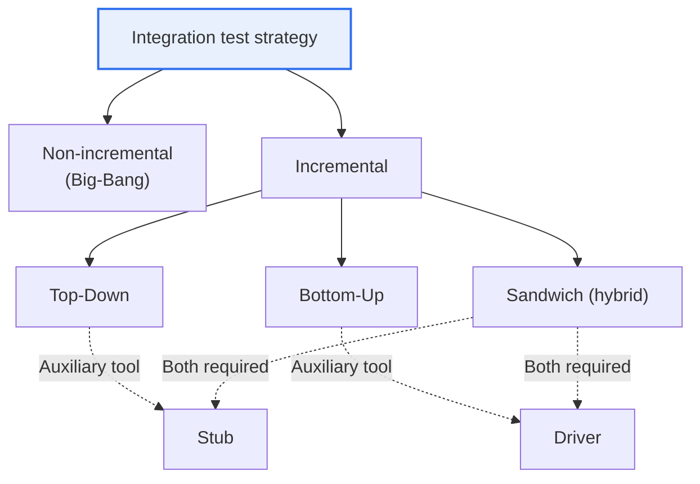
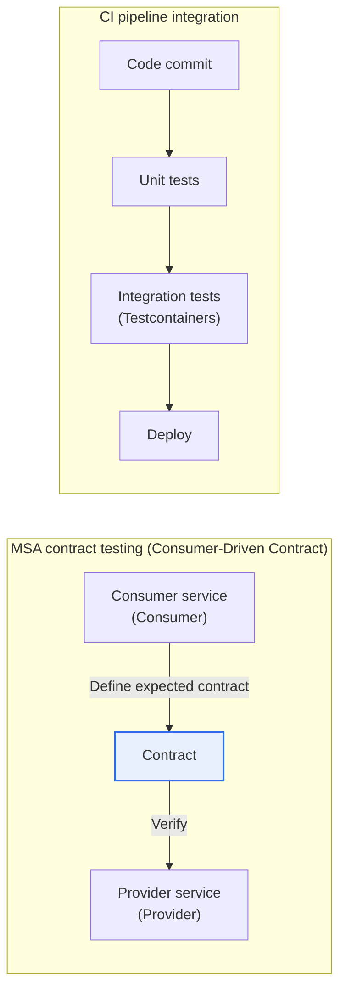

# Integration Test

## 1. Overview

### A. Definition
> A testing phase that verifies **whether the interfaces and interactions are correct according to the specification when unit-tested modules (components, services) are combined**. Its purpose is not to test the internal logic of individual modules, but to find defects arising at the 'boundary' — the data, call conventions and state transitions exchanged between modules.

The reason integration testing is necessary separately from unit testing lies in the nature of software composition: '**even if each part is sound, problems arise when they are assembled**.' Even if individual modules pass 100% of their own unit tests, errors occur once they are combined due to subtle mismatches in interface conventions, differences in data format, units or encoding, call order or timing (race conditions), and misaligned exception propagation paths. If unit testing is 'inspection of individual parts,' integration testing is 'inspection of the assembled state.' Just as a finished product goes out of alignment when assembly tolerances accumulate even though parts meet specifications, software defects are newly born at the points of combination.

The most common example is a mismatch in data contracts. If module A passes dates as a `YYYYMMDD` string but module B expects `YYYY-MM-DD`, each module passes its own unit tests, but they fail with a parsing error when combined. If A handles amounts as integers in 'won' while B handles them as floating-point in 'thousands of won,' the value is transmitted but a 1,000-fold error silently occurs, which is far more dangerous. Such defects surface only when the two modules are actually connected, so they cannot in principle be caught by unit tests.

From this perspective, integration testing should be understood not as a mere 'type of test' but as an **incremental verification activity** that assembles software into ever larger units. In the V-model, integration testing is placed as the verification activity corresponding to the architectural (structural) design phase, meaning that integration testing is the work of confirming 'whether modules mesh as designed.' Therefore, good integration tests are not written belatedly after code is complete; their verification method should be designed together at the time of interface design.

### B. Need and Background
It is a long-standing rule of thumb in software engineering that the later a defect is found, the more exponentially the cost of fixing it grows. Catching it in the requirements or design phase is cheap, but if an interface error is missed at the integration stage and found in system testing or operation, costs soar as root-cause tracking, regression testing and redeployment pile up. Integration testing acts as a breakwater that filters out defects ahead of this 'cost surge zone.'

In terms of background, the importance of integration testing has actually grown as systems evolved from monolithic to distributed and service-oriented. In the past, modules were combined through function calls within a single executable, but today 'combination across network boundaries' — REST/gRPC APIs, message queues, external SaaS integrations — dominates. As boundaries multiply, contract mismatches, partial failures and latency problems increase, so the difficulty and weight of integration verification have grown together.

## 2. Integration Approaches: Non-incremental vs. Incremental

Integration approaches diverge at the fundamental choice of 'combining modules all at once or step by step.' This choice is not a matter of taste; it is directly tied to the practical cost of **how quickly the cause can be isolated** when a defect occurs.

The **non-incremental (Big-Bang)** approach completes each module separately and then combines them all at once to test the whole. It has the advantages of a simple preparation procedure and requiring almost no auxiliary code such as drivers and stubs. However, when an error occurs after combination, isolating where the problem arose among the interactions of dozens of modules is extremely difficult. Defect A can mask defect B, and two defects can cancel each other out and distort symptoms. Big-Bang is therefore limited to small-scale situations with very few modules or combinations of already-verified libraries.

The **incremental** approach adds modules one (or a few) at a time and tests each time. Because problems surface in the newly added module, it gives the strong clue that 'what was just added is the cause,' making error isolation easy. In exchange, each step requires auxiliary code (stubs, drivers) that imitates modules not yet available, taking more time and effort. The reason the incremental approach is overwhelmingly preferred in practice is that the debugging cost of isolating defects far exceeds the cost of writing auxiliary code.

| Approach | Combination Method | Advantages | Disadvantages | Suitable Situations |
|---|---|---|---|---|
| **Non-incremental (Big-Bang)** | Combine all modules at once | Simple preparation, minimal auxiliary code | Hard to isolate causes, defects cancel out | Small scale with few modules |
| **Incremental** | Add modules step by step | Easy error isolation, early verification | Burden of writing stubs and drivers | Most real-world projects |

## 3. Top-Down and Bottom-Up

Incremental integration is divided into top-down and bottom-up depending on the direction from which combination begins. The fundamental difference between the two lies in the priority of '**what you want to be sure of first**.'

**Top-Down** starts from the top-level control module and combines downward along the call structure. In place of lower modules not yet completed, **Stubs** that return predetermined dummy responses are inserted. The strength of this approach is that the system's overall skeleton, control flow and main scenarios can be executed early in the project. Defects in high-level design or screen flow are found quickly, and a working skeleton can be demonstrated early to executives and customers. On the other hand, since lower modules responsible for actual computation and data processing continue to be replaced by stubs, verification of the truly important lower-level logic is pushed back, and there is the burden of building many realistic stubs.

**Bottom-Up** starts from the lowest utility and computation modules and combines upward. In place of upper modules not yet available, a **Driver** that calls the lower modules and feeds in test data is needed. Because this approach thoroughly verifies the low-level modules that form the system's foundation first, parts where reliability is key — such as DB access and calculation engines — can be solidly established. In exchange, the upper control logic governing the whole and user scenarios are executed only late in integration, so there is a risk that design-level defects are discovered late.

This difference matters in practice because the choice depends on where the project's risk lies. For projects with large UI/workflow risk, it is reasonable to establish the flow first with top-down; for projects where complex calculation and data integrity are key, it is reasonable to solidify the foundation first with bottom-up.

| Category | Top-Down | Bottom-Up |
|---|---|---|
| **Combination order** | Upper → lower | Lower → upper |
| **Auxiliary tool required** | Stub | Driver |
| **Verified first** | Control flow, overall skeleton | Foundational computation, data processing |
| **Advantages** | Early discovery of high-level design defects, early demo | Thorough verification of lower modules |
| **Disadvantages** | Many stubs when lower modules are incomplete | Upper-level defects found late |

## 4. Test Drivers and Test Stubs

The two auxiliary modules share the common trait of being 'fakes that imitate neighboring modules not yet available,' but their directions are exactly opposite. Precisely distinguishing these concepts is a key point frequently tested in integration testing questions.

A **test Driver** is a **'fake upper module' that substitutes for an upper module not yet built**. It actually calls the lower module, passes pre-prepared test data as arguments, and checks whether the return value matches expectations. Because bottom-up verifies from the bottom upward, there is not yet an upper module to call those lower ones, so a driver is essential. Today, the test runners of test frameworks such as JUnit and pytest effectively automate the role of the driver.

A **test Stub** is a **'fake lower module' that substitutes for a lower module not yet built**. In response to calls from the upper module, it returns a predetermined minimal dummy response (fixed value) without real logic. Because top-down verifies from the top downward, there is not yet a lower module for the upper module to call, so a stub fills that place. Stubs that evolved to return different values depending on the situation or to record whether they were called are **Test Doubles** such as Mocks and Fakes, which are widely used today when testing integrations with external payment and authentication APIs.

| Category | Test Driver | Test Stub |
|---|---|---|
| **Substitutes for** | Upper module ('fake upper') | Lower module ('fake lower') |
| **Behavior** | Calls lower module, inputs data, checks results | Returns dummy responses to calls |
| **Used in** | Bottom-Up | Top-Down |
| **Modern extension** | Test runner (JUnit/pytest) | Mock, Fake |

## 5. Comparison and Real-World Cases

The preceding approaches are not mutually exclusive, and in practice they are mixed according to risk. The representative example is **sandwich (hybrid) integration**, which proceeds top-down for the upper layers and bottom-up for the lower layers simultaneously, meeting at the middle layer. It has the advantage of shortening the schedule by verifying UI flow and foundational computation in parallel, but at the cost of building both drivers and stubs and making middle-layer integration complex. In other words, it is a choice that accepts a 'speed vs. complexity' trade-off.

As a concrete case, consider the 'order → payment → shipping' pipeline of a large e-commerce system. Since the payment gateway (external PG) cannot actually be charged every time, it is replaced by a stub (mock) that returns success/failure/timeout, and the order module proceeds with top-down integration against this stub. Conversely, lower modules such as inventory deduction and settlement calculation are solidified first bottom-up by injecting various boundary values (zero inventory, negative values, bulk orders) through drivers. Mixing directions this way makes it possible to safely verify external dependencies and core computation at the same time.

From a numerical perspective, too, the position of integration testing is clear. The widely cited 'test pyramid' recommends having many fast, cheap unit tests (e.g., around 70% of the total), integration tests in the middle layer (around 20%), and a few slow, expensive E2E (UI) tests at the top (around 10%). Having too few integration tests misses combination defects, while having too many lengthens execution time and slows CI, so the key is tuning this balance point to the team's situation.

## 6. Advanced Topic: Integration Testing in Modern Architectures

As MSA (microservice architecture) has become widespread, the center of gravity of integration testing has shifted from 'verifying function calls between modules' to '**verifying network contracts between services**.' When services grow to dozens or hundreds, it becomes practically impossible to spin up every combination simultaneously for testing, so techniques for independently verifying each service's interface have developed.

The representative one is **Contract Testing**, especially Consumer-Driven Contracts (CDC). When the API-consuming side defines a contract stating 'I expect this kind of response,' the provider side verifies in its own CI whether it satisfies that contract. Tools such as Pact automate this. The advantage of this approach is that, without spinning up the provider and consumer simultaneously, contract violations (e.g., deleted fields, changed types) are caught early before either side deploys, preventing 'broken deployments.'

Another axis is **reproducibility of the test environment**. In the past, shared integration test servers used by many people often had their state contaminated, frequently causing the problem of 'my test breaking because of someone else's test.' Today, with techniques such as Testcontainers that spin up real DBs and message brokers as containers on the fly and then discard them, integration tests run in a clean, production-like environment on every execution. As a result, permanently embedding integration tests in the CI pipeline (running automatically on every code change) to block regression defects early has become standard practice.

## 7. Considerations and Implications

1. **Make strategy subordinate to risk.** Top-down, bottom-up, Big-Bang and sandwich are not a matter of superiority but of situational fit. Choose top-down when UI/workflow risk is large, bottom-up when core computation and data integrity are critical, and sandwich when schedule pressure is high, while limiting Big-Bang — with its high cause-isolation cost — to small scale. Architects must design the integration order based on 'what must be confirmed first.'

2. **Design tests together at the time of interface design.** Since most integration defects come from data contract mismatches, a contract-first approach that finalizes API specs (OpenAPI/gRPC IDL) and contract tests before code blocks defects at the source. This elevates integration testing from 'something written later' to 'a design artifact.'

3. **Beware of overusing test doubles.** Replacing external dependencies with stubs and mocks makes tests fast and stable, but if the fakes diverge from reality, the illusion of 'passed but blew up in production' arises. A dual safeguard is needed: periodically verifying consistency between doubles and real services through contract testing, and supplementing critical paths with near-real integration such as Testcontainers.

4. **The key is balancing CI/CD pipeline embedding with execution time.** Automating integration tests to run on every commit catches regressions early, but as heavy integration tests multiply, the pipeline slows and development speed falls. Following the test pyramid principle, manage the scope and number of integration tests, and reduce feedback delay through parallel execution and selective execution (based on impact scope).

5. **Include partial failures and non-determinism of distributed environments in the verification scope.** In MSA, latency, timeouts, retries and partial failures are everyday occurrences, so operational stability can be secured only by confirming through integration tests not just the happy path but also resilience (circuit breakers, fallbacks) when dependent services are slow or fail.

## References
- ISTQB Foundation Level Syllabus — Integration Testing (https://www.istqb.org/)
- Martin Fowler, "Testing Strategies in a Microservice Architecture" (https://martinfowler.com/articles/microservice-testing/)
- Pact — Consumer-Driven Contract Testing (https://docs.pact.io/)
- Testcontainers official documentation (https://testcontainers.com/)

---

> **In one line**: Integration testing is the activity of verifying interface and interaction errors when modules are combined, choosing among *non-incremental (Big-Bang) and incremental (stubs for top-down, drivers for bottom-up)* strategies according to risk, and in the MSA era it has evolved into contract testing (CDC) and CI embedding (Testcontainers) to secure combination reliability in distributed environments.
