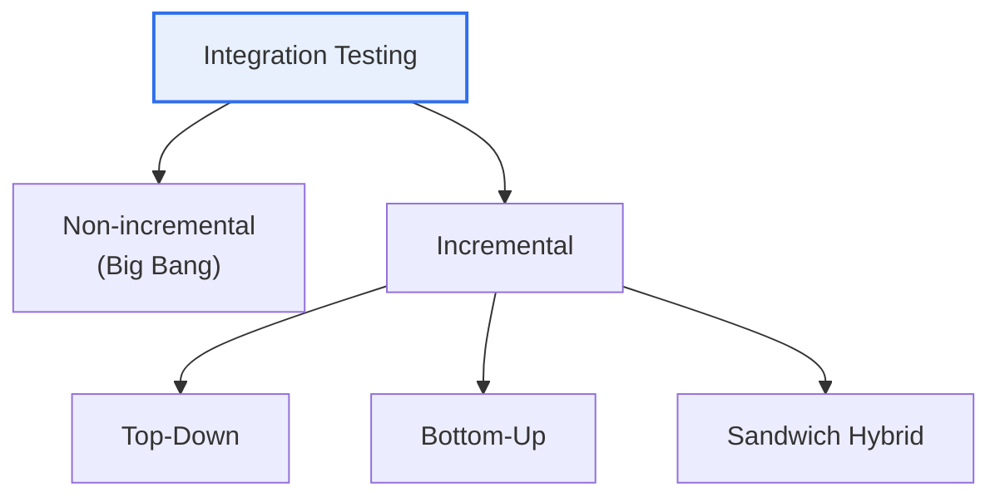

# Integration Testing

## 1. Overview

### a. Definition
> A test that verifies whether, when **modules that have completed unit testing are combined, their interfaces and interactions are correct**. Its purpose is to find errors that arise in data passing and interworking between modules.

The reason integration testing is absolutely necessary separately from unit testing is that "**even if each part is fine, problems arise when assembled.**" Even if individual modules perfectly pass their own tests, once combined they produce errors due to subtle mismatches in interface conventions, differences in data format or units, and problems of call order or timing. If unit testing is "part inspection," integration testing is "assembly inspection." For example, if module A passes a date as 'YYYYMMDD' while module B expects 'YYYY-MM-DD', each is fine individually, but they fail when combined. Such defects surface only when combined.

### b. Necessity
The later a defect is discovered, the greater the cost to fix. If an interface error between modules is not caught early at the integration stage, it is discovered in system testing or operation, where the cost surges — so systematic integration testing is essential.

## 2. Integration Approach: Non-incremental vs. Incremental

Integration approaches are divided by whether modules are combined all at once or in stages. **Non-incremental (Big Bang)** combines all modules at once and tests them; preparation is simple, but when an error occurs it is very hard to isolate which inter-module problem it is. **Incremental** adds modules one at a time and tests; it takes more time, but because problems surface in the newly added module, error isolation is easy. That is why the incremental approach is preferred in practice.

| Approach | Description | Characteristics |
|---|---|---|
| **Non-incremental (Big Bang)** | Combine all modules at once | Simple preparation, difficult to pinpoint cause |
| **Incremental** | Add modules in stages | Easy error isolation, time-consuming |

## 3. Top-Down vs. Bottom-Up

Incremental integration is divided into top-down and bottom-up by the direction of combination. **Top-Down** starts from the topmost module and combines downward, requiring a **Stub** that gives a fake response in place of a not-yet-completed lower module. It has the advantage of discovering control and design defects in the upper levels early. **Bottom-Up** starts from the lowest module and combines upward, requiring a **Driver** that calls the lower module in place of a not-yet-existing upper module. It has the advantage of thoroughly verifying lower modules.

| Category | Top-Down | Bottom-Up |
|---|---|---|
| **Order** | Upper → lower | Lower → upper |
| **Required tool** | Stub | Driver |
| **Advantage** | Early discovery of upper design defects | Thorough verification of lower modules |
| **Disadvantage** | Many stubs when lower is incomplete | Upper defects discovered late |

## 4. Test Driver and Test Stub

The difference between the two auxiliary modules is direction. A **Driver** is a "fake upper" that, in place of a not-yet-built upper module, calls a lower module, feeds test data, and checks the result. A **Stub** is a "fake lower" that, in place of a not-yet-built lower module, returns a minimal dummy response to the upper module's call. Bottom-up verifies from the lower, so it uses a driver; top-down verifies from the upper, so it uses a stub.

| Category | Test Driver | Test Stub |
|---|---|---|
| **Role** | A 'fake upper' that calls the lower | A 'fake lower' that responds to calls |
| **Used in** | Bottom-up | Top-down |
| **Function** | Input test data, check results | Return dummy response |

## 5. Considerations and Implications

1. **In practice, sandwich (hybrid) integration** is common. It proceeds top-down and bottom-up simultaneously and meets in the middle, taking the advantages of both but requiring both drivers and stubs.
2. **Build integration test automation into the CI pipeline.** Automatically run integration tests on every code change to catch regressions early.
3. **In MSA it extends to Contract Testing.** Inter-service API conventions are defined as contracts, and whether each service complies with them is verified independently, managing integration errors in a distributed environment.

---

> **In one line**: Integration testing verifies interface errors when modules are combined; it is performed with *non-incremental (Big Bang) and incremental (top-down, bottom-up)* approaches, using stubs for top-down and drivers for bottom-up, and in practice it advances into sandwich hybrid, CI automation, and contract testing.
