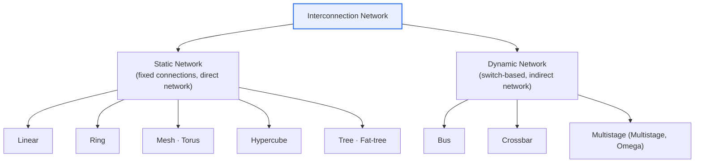
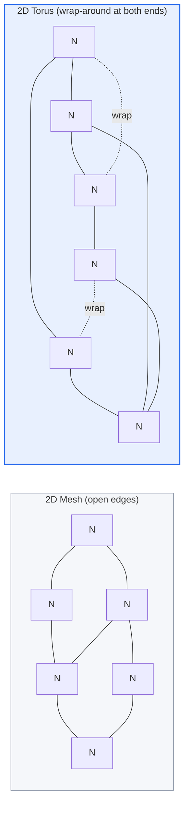

# Interconnection Networks in Parallel Processing Systems

## 1. Overview

### A. Concept

> An **interconnection network** is the **communication structure that links the many processors, memories, and nodes of a parallel processing system so they can exchange data**, and it is a core element that determines the performance of a parallel system. How nodes are connected (topology), how paths are decided (routing), and how switching is done are the three pillars of interconnection network design.

The fundamental reason an interconnection network makes or breaks parallel processing is that "**no matter how many processors there are, they are useless if they cannot exchange data with one another**." Parallel processing raises speed by having multiple processors divide up work and execute it simultaneously. Yet processors must constantly exchange data to cooperate. If this data exchange is slow or becomes a bottleneck, adding processors does not improve performance (communication overhead). As Amdahl's law states, the serial fraction and communication delay set the upper bound on the gains from parallelization, and the physical embodiment of that communication delay is precisely the interconnection network.

The interconnection network handles this processor-to-processor and processor-to-memory communication. Depending on how it is connected, communication speed (latency), concurrent communication capability (bandwidth), scalability, and cost vary greatly. Connecting everything directly is fast, but the number of connections explodes (a complete graph scales with the square of the node count), making cost and complexity unmanageable; connecting everything via a single bus is simple but creates a bottleneck as all communication contends for one path. Thus a variety of connection structures (topologies) that balance performance, cost, and scalability have been devised. Interconnection network design comes down to how to strike this trade-off. Today the same problem recurs identically—differing only in scale—across supercomputers, GPU clusters, and even inside chips (NoC, Network-on-Chip).

### B. Evaluation Factors

The performance of an interconnection network is assessed by several quantitative metrics. Because these metrics conflict with one another, understanding that maximizing one worsens another is the starting point of design.

| Metric | Definition | Meaning |
|---|---|---|
| **Latency** | Time taken to deliver data between nodes | Responsiveness. Increases with distance |
| **Bandwidth** | Amount of data transferred per unit time | Throughput |
| **Diameter** | Shortest distance (hop count) between the two farthest nodes | Upper bound on worst-case latency |
| **Bisection BW** | Number of links cut when the network is split in half | Global communication capability / bottleneck measure |
| **Degree** | Number of links a node has | Hardware cost / pin count |
| **Fault tolerance** | Whether alternate paths exist when links/nodes fail | Reliability |

**Diameter** indicates how many hops communication traverses in the worst case, so it defines the upper bound on latency. A smaller diameter is better, but reducing it requires attaching more links to each node, which raises the degree (cost). **Bisection bandwidth** is the number of links joining the two halves when the network is split in two, and it determines the practical bottleneck in communication where data is globally shuffled (e.g., matrix transpose, all-to-all). A large bisection bandwidth is strong for global communication but again increases cost by requiring more links and wiring. In short, a good interconnection network pursues "small diameter, large bisection bandwidth, and low degree" simultaneously, but since all three cannot be satisfied at once, one compromises according to application characteristics.

## 2. Types of Interconnection Networks

Interconnection networks are divided into **static networks (direct networks)** with fixed connections and **dynamic networks (indirect networks)** that change connections on the fly via switches. In a static network, nodes are joined directly by links, which is advantageous for scientific computing with regular communication patterns; in a dynamic network, any two nodes are connected through switches, which is flexible but the switches themselves become a source of cost and latency.

| Type | Example | Diameter | Characteristics |
|---|---|---|---|
| **Bus (dynamic)** | Shared bus | 1 | Simple, low-cost; bottleneck, scalability limit |
| **Crossbar (dynamic)** | Grid switch | 1 | Full connectivity, high performance; cost O(n²) |
| **Multistage (dynamic)** | Omega network | log n | Compromise between bus and crossbar |
| **Ring (static)** | Circular connection | n/2 | Simple; large diameter |
| **Mesh (static)** | 2D grid | about 2√n | Excellent scalability, efficient local communication |
| **Torus (static)** | Grid + wrap | about √n | Shorter distance than mesh, symmetric |
| **Hypercube (static)** | n-dimensional cube | log₂ n | Short diameter, increasing degree |

**A. Bus and Crossbar — the two extremes.** The bus is the simplest structure, attaching all nodes to a single shared medium. With only one wire it is cheap and has a diameter of 1, but since only one pair can communicate at a time, it becomes a bottleneck as soon as nodes increase. Conversely, the crossbar fully connects all inputs and outputs through a grid switch, so any pair of nodes can communicate simultaneously without collision. Its performance is ideal, but the number of switches grows with the square of the node count (O(n²)), making its cost unmanageable for large-scale systems. These two are the extremes of "cheap and slow" and "expensive and fast," and the remaining topologies generally sit somewhere between them.

**B. Multistage Interconnection Networks (MIN) — the compromise.** Multistage networks like the Omega network stack log n stages of small switches (typically 2×2), lowering the crossbar's O(n²) cost to O(n log n) while gaining far better concurrency than a bus. However, blocking—where internal paths overlap—can occur under certain communication patterns, so achieving full non-blocking behavior requires more complex structures such as Clos/Benes. This is a typical example of the trade-off that "reducing cost creates the risk of contention."

**C. Grid family (mesh, torus, hypercube) — scalability-oriented.** Large-scale parallel computers prefer static networks that join nodes in a regular grid. Because the wiring is local (neighbor-to-neighbor), it is physically easy to implement, and nodes can be added while maintaining the structure. The representatives of this family are the mesh, torus, and hypercube, and the next section examines the torus in detail.

## 3. Detailed Look at the Torus Structure

A **torus** is a structure formed by connecting the two ends (edges) of a grid-shaped **mesh** together into a loop (wrap-around) form. A mesh connects nodes in a grid and thus scales well, but its edge nodes are connected on only one side, so communication distances grow long and load becomes skewed to one side. The diameter of an n×n mesh is about 2(n−1), so worst-case latency grows sharply as scale increases. The torus remedies this drawback by joining the two ends.

| Category | Mesh | Torus |
|---|---|---|
| **Structure** | Grid type (open edges) | Grid + ends connected (loop) |
| **Diameter** | about 2(n−1) | about n (half the level) |
| **Communication distance** | Long at edges | Shorter average distance (symmetric) |
| **Symmetry** | Asymmetric | Symmetric (even load) |
| **Wiring** | Simple | Somewhat complex due to wrap links |

The reasons the torus is superior to the mesh can be organized into three. First, **diameter reduction**. Because wrap-around links connect edges to the opposite side, even the worst case can be reached in half the grid distance, so the diameter is reduced roughly by half. This is a direct performance gain in latency-sensitive communication. Second, **symmetric load distribution**. In a mesh, edge and center nodes have different numbers of connections, so traffic is imbalanced; in a torus, every node has the same number of connections (four in two dimensions), so no node becomes a particular bottleneck. Third, **good bisection bandwidth**. Thanks to the symmetric structure, the number of cut links stays even wherever the network is split, making it strong for global communication.

Because of these characteristics, the torus is widely used in large-scale parallel computers and supercomputers. Concretely, IBM Blue Gene/L and /P adopted a 3D torus and Blue Gene/Q a 5D torus, Cray's SeaStar/Gemini interconnects are also 3D torus-based, and Japan's K computer and its successor Fugaku used the Tofu interconnect, a 6D mesh/torus. Raising the dimension (generalizing to a k-ary n-cube) reduces the diameter further at the same node count, but with the trade-off of increased per-node links and wiring complexity. However, since wrap-around wiring physically requires long cables reaching to the opposite side, actual implementations also use a technique of folding the node layout to equalize cable lengths.

## 4. Comparison with Hypercube and Fat-tree

To understand the torus's position, it is useful to compare it with the hypercube and fat-tree. These three structures are representative topologies that compete and coexist in large-scale systems.

The **hypercube** is an n-dimensional cube; for 2ⁿ nodes, its diameter is only log₂(2ⁿ)=n, so it is very short. This is advantageous for applications with frequent global communication. However, because the per-node degree is n and grows together with the node count, hardware expansion becomes difficult as scale grows, since ports must keep being added to each node. That is, the hypercube is a structure with "small diameter but large degree."

By contrast, the torus fixes the dimension n and only increases the size k of each dimension (k-ary n-cube), so the per-node degree stays constant at 2n. In return, the diameter is larger than the hypercube's. Ultimately, **the torus is a structure that "gains scalability by keeping the degree constant" at the cost of somewhat sacrificing diameter**, while the hypercube is the opposite. The ability to fix the per-node port count in ultra-large systems reaching tens of thousands to hundreds of thousands of nodes is the practical reason the torus is widely adopted in supercomputers.

The **fat-tree** is a structure that thickens link bandwidth toward the top of a tree structure to eliminate upper-level bottlenecks, and today it is used almost as a standard in the InfiniBand networks of data centers and HPC clusters. The fat-tree has the advantage of providing uniform bandwidth (full bisection) for any pair of nodes, making it insensitive to communication patterns, so it suits general-purpose clusters with irregular communication. The torus, on the other hand, is strong for regularized scientific computing with much neighbor communication. In other words, "torus for regular local communication, fat-tree for irregular global communication" is roughly the selection criterion.

## 5. Deeper Dive — Extension to AI and Data Centers

The interconnection network is no longer the exclusive domain of supercomputers; today it has emerged as a factor that decides the success of large-scale AI training infrastructure. When training a huge model with thousands of GPUs, all-reduce communication that sums the gradients of every GPU occurs at each step, and the efficiency of this collective communication directly governs training speed. If communication is slow, expensive GPUs sit idle waiting for data, so interconnect design determines overall cost efficiency.

In this context, the topology concepts seen earlier are reproduced as they are. NVIDIA's NVLink/NVSwitch bundle GPUs in near-crossbar full connectivity to provide high-bandwidth communication within a node, and use InfiniBand fat-trees or torus-type topologies between nodes. Google's TPU Pod explicitly connects chips in a 2D/3D torus, implementing all-reduce optimized for high-speed neighbor communication. That is, the classic principle that "a torus is advantageous for regular workloads with much local communication" applies directly to AI training.

The same problem also recurs inside chips. In multi-core and many-core processors, the **Network-on-Chip (NoC)** that connects tens to hundreds of cores generally adopts a 2D mesh or torus topology. This is because a structure that scales with local wiring is needed under chip area and power constraints. In this way, the interconnection network is a universal principle of parallel computing that handles the same trade-off (diameter, bandwidth, degree, cost)—differing only in scale—from supercomputers to data centers to inside chips. [[multi-gpu]]

## 6. Considerations and Implications (Professional Engineer's Perspective)

1. **Balancing performance, cost, and scalability is the crux of design.** A crossbar is fast but expensive at O(n²), and a bus is cheap but has a bottleneck, so one must choose a topology matched to system scale and communication pattern. Since diameter, bisection bandwidth, and degree conflict with one another, the problem should be approached not as a single optimal solution but as a choice governed by an objective function (maximizing performance under cost constraints).

2. **Consistency with the communication pattern matters.** If local communication (neighbor grid operations) is frequent, a mesh or torus is advantageous; if global/irregular communication is frequent, a hypercube or fat-tree is advantageous. Effective performance emerges only when the topology is matched by profiling the application's data-exchange characteristics (stencil operations, all-to-all, all-reduce).

3. **Routing and fault tolerance must be designed together.** Not just topology but the path-decision algorithm (e.g., dimension-order routing), deadlock avoidance (virtual channels), and detour paths for link failures must be in place for a large-scale system to operate stably. The more nodes there are, the higher the probability of component failure, so fault tolerance is a necessity rather than a choice.

4. **Its importance is growing with large-scale AI training infrastructure.** As the collective-communication efficiency of GPU clusters governs training cost, a hierarchical combination of torus (TPU Pod), fat-tree (InfiniBand), and full connectivity (NVLink) is becoming standard. Under the recognition that the interconnect is AI competitiveness itself, computation-communication overlap and topology-aware collective-communication algorithms become key optimization targets.

5. **Linkage with physical technologies such as optical interconnects and chiplets is the outlook.** To overcome inter-node distance and power limits, silicon photonics (optical interconnects) and chiplet-based packaging are emerging, and these are expected to relax the physical implementation limits of interconnection networks, enabling larger bisection bandwidth and lower latency.

## References

- Oregon State Univ., "Interconnection Networks: Direct/Indirect, Shared Memory" lecture material — https://web.engr.oregonstate.edu/~bose/cs572/InterconnectionNetworks.ppt
- "Fully twisted torus interconnection network for parallel systems", Discover Computing (Springer, 2025) — https://link.springer.com/article/10.1007/s10791-025-09891-w

---

> **In one line**: An interconnection network is the *communication structure that connects the processors and memory of a parallel system*, governing performance amid the trade-offs of diameter, bandwidth, and degree; it includes the bus, crossbar, mesh, hypercube, and fat-tree, and the torus—joining the two ends of a mesh to halve the diameter and distribute load symmetrically—is widely used in large-scale parallel processing such as supercomputers and TPU Pods.
