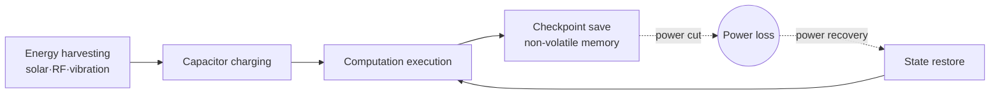

# Intermittent Computing

## 1. Overview

### A. Definition
> An ultra-low-power computing approach in which a device that operates without a battery, solely on ambient **energy harvesting**, **preserves and restores computational state to carry work forward without interruption** even in an environment where power is supplied and cut off unstably.

An ordinary computer loses all of its RAM state when power is cut and must start over from the beginning. Intermittent computing **assumes as the normal condition that power is repeatedly cut off and turned back on**, saves the computational progress up to the instant before the power loss, and, when power returns, resumes execution from that point. In other words, it is a computing paradigm that "treats power loss as everyday rather than exceptional."

### B. Background and Necessity
As billions of ultra-small IoT sensors proliferate, the **limits of battery replacement, disposal, and lifetime** have become a real obstacle. For a sensor embedded inside a structure or attached to a human body, swapping the battery is itself impossible or uneconomical. As an alternative, harvesting ambient energy such as solar, RF, vibration, or heat allows quasi-permanent operation without a battery, but such harvested energy is inherently **intermittent and irregular**, so power can be cut at any time. Therefore a technique that lets computation run to completion even amid frequent power loss is essential, and this is the reason intermittent computing exists.

## 2. Operating Principle

The essence of the operation is a cycle of **harvest → accumulate → execute → save → restore**. Faint harvested energy is gathered in a capacitor, and once a certain voltage is reached, computation runs; meanwhile the computational state (registers, variables) is **saved as a checkpoint in non-volatile memory**. When power is cut, volatile data is lost but the checkpoint remains, so when power recovers, the state is restored from the last checkpoint and continues. The crux is "**when and how often to save**." Saving frequently reduces losses at power loss but slows progress with save overhead, while saving rarely requires re-executing much work at each power loss.

## 3. Key Technical Elements

Each element, on the premise of power loss, shares the single goal of "how to safely keep and restore state."

| Element | Description |
|---|---|
| **Energy harvesting** | Collect and store ambient energy such as solar, RF, heat, vibration |
| **Non-volatile memory (NVM)** | FRAM, MRAM, etc., preserving state even when power is cut |
| **Checkpointing** | Periodically/adaptively save intermediate computational state to NVM |
| **Idempotency** | Guarantee that results do not change even if re-executed |
| **Power-aware scheduling** | Split and execute tasks according to available energy |

There is a particular reason **idempotency** is important. If power is lost after a checkpoint, the code re-executes from that point, and if there was an operation in between that changes external state (e.g., incrementing a sensor counter, transmitting a communication), **re-execution causes the same side effect to happen twice**, corrupting data. So one must design idempotently so results stay consistent under re-execution, or handle state updates atomically.

## 4. Key Issues

| Issue | Content |
|---|---|
| **Forward Progress** | Balance between checkpoint overhead and re-execution loss |
| **Consistency** | Prevent memory inconsistency at power loss (non-atomic updates) |
| **Performance** | Processing delay due to frequent save/restore |
| **Debugging** | Difficulty reproducing and verifying errors due to non-deterministic power loss |

The most fundamental issue is **forward progress**. If the distance between two checkpoints is longer than the interval executable with the energy held in the capacitor, power may be lost before that interval completes every time, falling into a **non-progressing state that can never move forward**. So splitting tasks into sizes that can definitely run to completion on the available energy is the core of the design.

## 5. Application Areas

| Area | Use |
|---|---|
| **Battery-less IoT** | Environment/structure monitoring sensors (bridge cracks, indoor air quality, etc.) |
| **Wearable / health** | Ultra-low-power biosensors such as body temperature and heart rate |
| **Edge AI** | Ultra-low-power on-device inference combined with TinyML |

For example, a vibration-harvesting sensor embedded in a bridge gathers power from minute vibrations in normal times, measures and stores crack data, and transmits wirelessly only when power is sufficient. The goal is to operate throughout the structure's lifetime without battery replacement.

## 6. Considerations and Implications
The key to performance is **checkpointing optimization**; instead of saving the entire state every time, differential checkpointing that saves only the changes, and adaptive techniques that adjust the save timing according to the remaining energy, are actively researched. Intermittent computing is significant in that it realizes **sustainable (green), maintenance-less computing** that eliminates battery waste and minimizes maintenance. From a professional engineer's perspective, the advancement of low-power NVM such as FRAM and ultra-low-power MCUs, together with runtime/compiler support that frees developers from worrying about power loss, is the key to commercialization, and combined with TinyML it is expanding into "sensors that judge for themselves without power."

---

> **In one line**: Intermittent computing is ultra-low-power computing that assumes *intermittent power based on energy harvesting* as the normal condition and, using **checkpointing, non-volatile memory, and idempotency**, preserves and restores state to run work to completion; forward progress and consistency are the key challenges, and it is used in battery-less IoT and edge AI.
