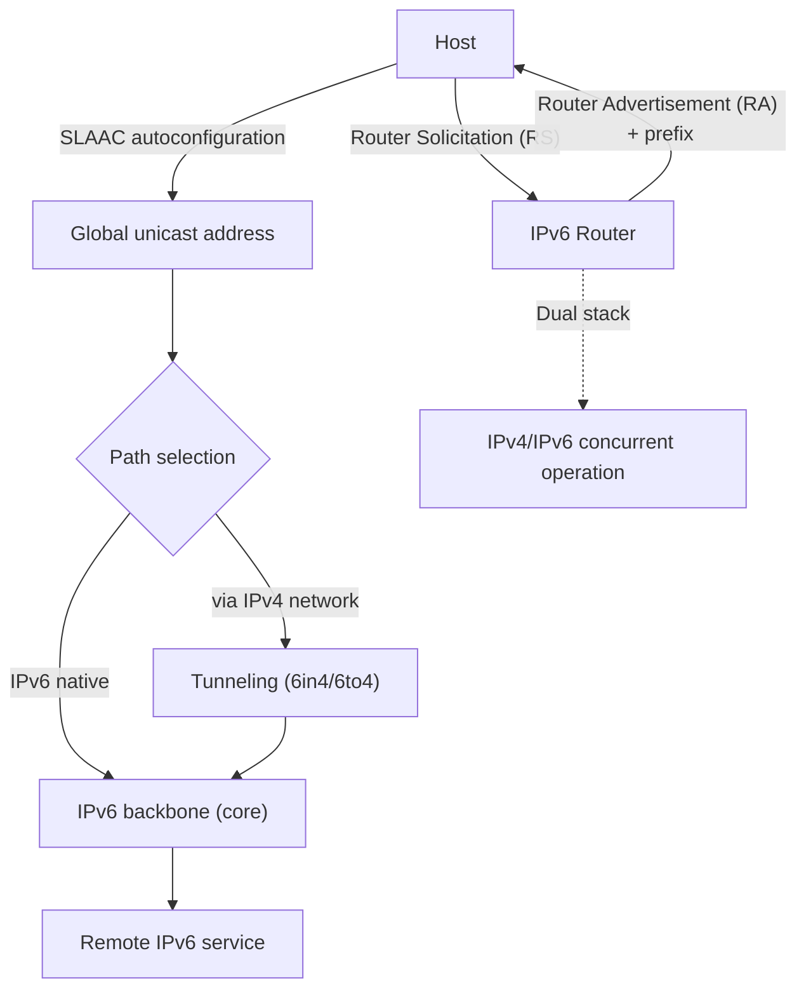
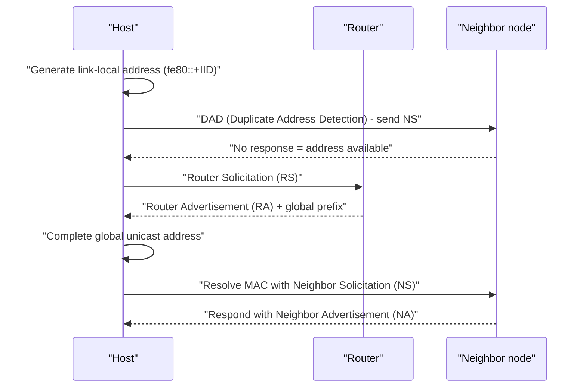

# IPv6 and IPv4→IPv6 Transition Technologies

## 1. Overview

> **IPv6 (Internet Protocol version 6)** is the next-generation, 128-bit internet protocol standardized by the IETF as RFC 8200 (2017, formerly RFC 2460) to fundamentally resolve the exhaustion of the existing 32-bit IPv4 addresses; through an expanded address space, a simplified header, built-in security, and automatic address configuration (SLAAC), it supports large-scale connectivity environments.

The fundamental background to IPv6's emergence is **IPv4 address exhaustion**. IPv4 provides only about 4.3 billion (2³²) addresses; at the internet's early design, this was considered sufficient, but it hit a limit with the explosion of PCs, smartphones, and IoT devices. In fact, IANA's top-level IPv4 address pool was depleted in February 2011, and among the Regional Internet Registries (RIR), APNIC (Asia-Pacific), RIPE (Europe), and ARIN (North America) sequentially halted new allocations for all practical purposes. Meanwhile, NAT (Network Address Translation) and CIDR were used as stopgaps to delay the exhaustion point, but NAT undermined the End-to-End communication principle and produced structural side effects that constrained P2P, VoIP, and server hosting.

The second background is **new demands on network performance, scalability, and security**. The IPv4 header imposed a large routing burden due to variable-length option fields and checksum recomputation and fragmentation handling at routers. IPv6, with its 40-byte fixed header, separation of options into extension headers, and a design that prohibits router fragmentation, reduced the processing burden on core routers. It also defined (recommended) IPsec as a standard component, laying the foundation for secure communication at the protocol level, and it is establishing itself as essential infrastructure in environments—such as the Internet of Things, 5G, and smart cities—that must assign unique addresses to vast numbers of devices. From a professional engineer's perspective, IPv6 should be understood not as a mere "address extension" but as an architectural transition that encompasses **addressing, routing, security, mobility, and automation**.

The third background is the **restoration of End-to-End connectivity**. NAT in the IPv4 era made many devices share a single public address, delaying address exhaustion, but it made it impossible to reach an internal device directly from the outside, hindering P2P, real-time communication, and home server operation, and forcing applications to introduce complex auxiliary mechanisms such as STUN/TURN to work around it. IPv6 can assign a public address to every device, restoring the internet's original End-to-End principle, and this becomes the foundation for services—such as IoT, 5G, and real-time collaboration—where direct device-to-device communication matters. However, the consideration that End-to-End reachability widens the security attack surface, and thus must be paralleled with firewall policy, should be borne in mind together.

The key features of IPv6, summarized first, are as follows.

| Category | IPv4 | IPv6 |
|------|------|------|
| Address length | 32-bit (about 4.3 billion) | 128-bit (about 3.4×10³⁸) |
| Notation | Dotted decimal (192.0.2.1) | Colon hexadecimal (2001:db8::1) |
| Header | Variable (20–60B), checksum present | Fixed 40B, no checksum |
| Fragmentation | Both router and sender | Sending end only (PMTUD) |
| Address autoconfiguration | DHCP required | SLAAC built-in + DHCPv6 |
| Security | Separate (IPsec optional) | IPsec integrated design |
| Broadcast | Present | Absent (replaced by multicast/anycast) |

## 2. Overall IPv6 Structure and Address Scheme

Below is a conceptual diagram showing the overall structure of an IPv6-enabled network. A device receives a prefix through a Router Advertisement (RA), configures its own address, and communicates with the IPv6 backbone through dual-stack segments and tunnels.

**A. Address notation and types.** An IPv6 address is written as hexadecimal, dividing the 128 bits into eight groups of 16 bits each separated by colons (e.g., `2001:0db8:0000:0000:0000:0000:0000:0001`). Leading zeros in each group are omitted, and a run of zero groups can be compressed once with `::`, so the above address abbreviates to `2001:db8::1`. Addresses are divided by purpose into **unicast (1:1), multicast (1:many, ff00::/8), and anycast (to the nearest one)**, and IPv4's broadcast is abolished, with multicast replacing that role. Thanks to this design, needless broadcast storms disappear and link efficiency improves.

**B. Address scope.** Unicast is further divided into **global unicast (2000::/3, subject to public routing)**, **link-local (fe80::/10, valid only within the same link)**, and **unique local (fc00::/7, for private networks)**. In particular, a link-local address is automatically generated when an interface is activated and serves as the default channel for neighbor discovery and router communication. For example, when a router is rebooted on an intranet, each interface immediately secures an address starting with `fe80::` without any separate configuration and begins initial communication—a practical advantage contrasting with IPv4, where one had to wait for a DHCP server response.

**C. The principle of header simplification.** The IPv6 header is a fixed 40 bytes and reduces IPv4's 13 fields—such as checksum, header length, and identifier—to 8. The reason a router need not recompute the checksum at every hop is that the upper layer (TCP/UDP) and link layer already perform error detection, so the redundant check at the IP layer is removed to secure performance. Instead, options are separated into **extension headers (Hop-by-Hop, Routing, Fragment, IPsec, etc.)** and inserted only when needed in a chain form. This realizes a "localization of burden" in which ordinary packets are processed quickly with a minimal header, and only packets that need special functions pay the extra cost.

For reference, the main fields of the IPv6 base header (40 bytes) are composed as follows.

| Field | Size | Role |
|------|------|------|
| Version | 4 bits | Protocol version (=6) |
| Traffic Class | 8 bits | Priority / DSCP (QoS) |
| Flow Label | 20 bits | Identify same flow / pin path |
| Payload Length | 16 bits | Length of payload + extension headers |
| Next Header | 8 bits | Next extension header / upper protocol |
| Hop Limit | 8 bits | Corresponds to IPv4 TTL (hop limit) |
| Source/Destination | 128 bits each | Source/destination address |

Also, a **Flow Label (20 bits)** field is newly introduced in the IPv6 header, allowing a router to identify packets belonging to the same flow without deep inspection and process them over the same path and same QoS. For example, assigning a single flow label to real-time video conferencing traffic lets core routers recognize it as a latency-sensitive flow and prioritize it without re-analyzing the 5-tuple for each packet, simultaneously raising routing efficiency and QoS precision in large-scale traffic environments.

**D. The shift of fragmentation handling.** In IPv4, any router along the path would cut a packet if it was larger than the link MTU and forward it, but this caused core-router load and reassembly vulnerabilities (Teardrop, etc.). IPv6 **prohibits fragmentation at intermediate routers** and changes it so that only the sending end learns the minimum MTU of the entire path via **Path MTU Discovery (PMTUD)** and sends at an appropriate size in advance. This design lightens routers, but it produces the side effect that communication halts if the ICMPv6 "Packet Too Big" message on which PMTUD depends is blocked at a firewall, so in practice policies must be designed carefully so that ICMPv6 is not indiscriminately blocked.

**E. The reality of address planning.** With IPv6, addresses are so vast that systematic planning is actually important. Typically an organization is allocated a **/48** (65,536 /64 subnets) from an ISP and hierarchically divides **/56** or **/64** by department, branch, or purpose. For example, assigning `2001:db8:aced::/48` to headquarters and partitioning floors and departments as `2001:db8:aced:0010::/64`, `2001:db8:aced:0020::/64`, and so on, lets one identify location and purpose just by looking at the prefix, simplifying route summarization and security-policy application. Unlike the IPv4 practice of finely splitting subnets to conserve addresses, best practice with IPv6 is to use /64 generously per subnet while expressing structure with the higher-order bits.

## 3. Autoconfiguration and Neighbor Discovery Process

A representative advance of IPv6 is **SLAAC (Stateless Address Autoconfiguration, RFC 4862)**, in which a device creates its own address without a server. Below is a detailed flow diagram showing the procedure from a device's boot to reaching a communication-ready state.

**A. Link-local generation and DAD.** A device first combines an Interface Identifier (IID) to create a link-local address, then checks with **DAD (Duplicate Address Detection)** whether the same address exists on the same link. If there is no response, it judges uniqueness to be guaranteed and confirms the address. This is more preventive than IPv4's way of discovering IP collisions after the fact. Early on, the IID was generated from the MAC-based EUI-64, but due to the privacy problem that an exposed MAC enables device tracking, the **RFC 8981 (temporary addresses)** and **RFC 7217 (stable random IID)** methods were introduced, and current smartphones and PCs also use periodically changing temporary addresses.

**B. Prefix reception based on Router Advertisement (RA).** When a device sends an RS, the router informs it via RA of the **network prefix (/64 by convention)** and default gateway information. The device completes its global address by appending its IID to the prefix. Depending on the RA's M/O flags, it operates in one of pure SLAAC, DHCPv6-parallel (address by SLAAC, additional info such as DNS by DHCPv6), or stateful DHCPv6. In actual carrier and enterprise networks, SLAAC alone is insufficient due to address-tracking and audit requirements, so a hybrid configuration running DHCPv6 in parallel is common.

**C. NDP replacing ARP.** IPv4's ARP, ICMP redirect, and router discovery functions are unified in IPv6 into **NDP (Neighbor Discovery Protocol, based on ICMPv6)**. It resolves MAC addresses with NS (Neighbor Solicitation)/NA (Neighbor Advertisement), and since it uses multicast, its load is lower than ARP, which flooded the entire link with broadcasts. However, NDP has weak authentication and is exposed to threats such as **NS/NA spoofing and RA spoofing (fake router advertisements)**, so it must be supplemented with switch features such as **RA Guard, ND Inspection, and SEND (Secure Neighbor Discovery)**.

**D. Division of roles between SLAAC and DHCPv6.** SLAAC distributes addresses without a server, so its management burden is low, but it has the weakness that it is hard to centrally manage and audit "which device used which address when." For this reason, in enterprise and public environments where security and compliance matter, one adopts **stateful DHCPv6** to centrally allocate and record addresses, or a compromise that keeps addresses via SLAAC while distributing only additional info such as DNS and NTP via **stateless DHCPv6**. In fact, on internal financial-sector networks it is common to mandate leaving DHCPv6 logs due to device traceability and incident-response (forensics) requirements, which shows that IPv6 design is a matter of balancing technical convenience against operational and audit demands.

## 4. Comparison of IPv4→IPv6 Transition Technologies

Because IPv4 and IPv6 have different header structures and do not directly interoperate, **transition technologies** become key in the reality where the two systems coexist for a long time. Transition methods are broadly divided into dual stack, tunneling, and address translation, each with a different application context.

| Method | Principle | Advantages | Disadvantages / implications |
|------|------|------|-----------|
| Dual Stack | Devices/routers carry IPv4/IPv6 simultaneously | High compatibility, easy gradual transition | Burden of operating/managing two address systems at once; IPv4 addresses still needed |
| Tunneling (6in4·6to4·6rd·ISATAP) | Encapsulate IPv6 packets in IPv4 | Connect IPv6 islands over existing IPv4 networks | Encapsulation overhead / MTU issues, end-to-end delay |
| Translation (NAT64/DNS64·464XLAT) | Translate addresses/DNS so IPv6 devices communicate with IPv4 servers | Access IPv4 resources from an IPv6-only network | State-keeping burden, some apps (IP literals) incompatible |

**A. The practical meaning of dual stack.** In dual stack, a single device handles both IPv4 and IPv6, so it can respond regardless of which system the counterpart uses. Browsers reduce user-perceived latency by trying IPv6 and IPv4 connections in parallel with the **Happy Eyeballs (RFC 8305)** algorithm and adopting whichever is faster. However, dual stack still needs IPv4 addresses and requires maintaining firewall and monitoring policies in duplicate, so it has the limitation of being a transitional solution for the migration period.

**B. The trade-off between tunneling and translation.** Tunneling passes IPv6 traffic through while leaving the IPv4 infrastructure intact, but encapsulation reduces the MTU, causing fragmentation and Path MTU Discovery issues. On the other hand, NAT64/DNS64 and the 464XLAT that supplements it are widely used in mobile networks. In fact, the **LTE/5G mobile cores of T-Mobile US and domestic carriers** operate an "IPv6-only + translation" structure that assigns only IPv6 to devices and translates IPv4 services via 464XLAT for access, a representative industry application that dramatically reduces the IPv4 addresses to be managed.

**C. Domestic adoption status (trend).** According to statistics from the Ministry of Science and ICT and KISA, domestic IPv6 commercialization has steadily expanded centered on the three mobile carriers, and there is a tendency for the share of IPv6 usage in wireless (mobile) traffic to outpace that in wired traffic. However, since detailed figures fluctuate over time, it is advisable to check the latest data such as KISA IPv6 statistics when making policy and investment decisions. As a global indicator, Google's IPv6 adoption statistics are widely cited, and the global average adoption rate is reported to have risen to around 40% (with variation by time point).

**D. Summary of selection criteria.** The three methods are not mutually exclusive and are combined hierarchically. An organization's internal network transitions gradually with dual stack; tunneling is used when connecting remote IPv6 islands beyond the IPv4 infrastructure; and NAT64/464XLAT is used in mobile and cloud environments that assign only IPv6 to devices. The key selection criteria are ① the headroom of held IPv4 addresses, ② the IPv6-support maturity of legacy applications, ③ end-to-end performance (whether tunnel overhead is acceptable), and ④ the level of security and audit requirements, and quantifying these four axes to place methods is the essence of transition design.

## 5. Deeper Dive: Security and Mobility Perspectives and Expected Exam Directions

**A. The two-sidedness of IPv6 security.** IPv6 integrates IPsec by design, but this does not immediately mean "IPv6 is safe." Thanks to the vast address space, indiscriminate port scanning has become difficult, but IPv6-specific threats exist, such as the aforementioned **RA spoofing, NDP cache exhaustion attacks, firewall bypass exploiting extension headers, and detection evasion through tunnels**. In particular, in a dual-stack environment, hardening only IPv4 policy while neglecting the IPv6 path creates a "hidden passage" and a security blind spot. Therefore, when introducing IPv6, the principle is to apply firewalls, IPS, and log collection to IPv6 in duplicate at a level equivalent to IPv4.

Representative IPv6-specific threats and countermeasures are summarized as follows.

| Threat | Principle | Countermeasure |
|------|------|------|
| RA spoofing | Intercept traffic with fake router advertisements | RA Guard, SEND |
| NDP cache exhaustion | Exhaust neighbor cache with mass NS (DoS) | ND rate limit, ND Inspection |
| Extension header abuse | Bypass firewall with multi-level extension headers | Extension header inspection/filtering |
| Tunnel concealment | Evade detection via 6to4/Teredo tunnels | Block/monitor unnecessary tunnels |

**B. Mobility and IoT extension.** Mobile IPv6 is designed so a device keeps its home address even when it moves between networks, and with vast addresses it can directly assign a public address to each IoT sensor, restoring end-to-end communication. In low-power wireless environments, **6LoWPAN (RFC 6282)**, which compresses IPv6 headers, is used and has established itself as the standard stack for smart homes and industrial IoT. This is also why IPv6 is pointed to as the base protocol for 5G, smart cities, and vehicle communication (V2X).

**C. Cloud-native and IPv6.** IPv6 is also rising in container orchestration environments. Kubernetes assigns a unique IP to each pod, and in large clusters, private IPv4 (RFC 1918) addresses face collision and exhaustion problems in overlay networks and multi-cluster interconnection. Kubernetes **dual stack (stabilized in v1.21+)** assigns both IPv4 and IPv6 to pods and services to alleviate this, and an IPv6-only cluster enables practically unlimited pod expansion without address collisions. This is evidence that IPv6 has real value not only in legacy communication networks but also in the latest platform infrastructure.

**D. Expected exam directions and answer strategy.** In the professional engineer exam, IPv6 is frequently asked in the forms of ① comparison of header and address schemes with IPv4, ② explanation of the SLAAC/NDP operating procedure, ③ comparison of transition technologies (dual stack, tunneling, NAT64) and selection criteria, and ④ IPv6 security threats and countermeasures. When writing an answer, arguing "why that design was chosen (balance of performance, scalability, and security)" and "what transition strategy an organization should choose (considering existing assets, cost, and security maturity)" is the high-scoring point rather than simple enumeration. In particular, for a transition-technology question, comparing dual stack, tunneling, and translation in a table and then presenting selection logic according to the organizational situation (legacy assets, address headroom, security maturity) in the conclusion is what differentiates the answer.

## 6. Considerations and Implications

- **Choice of transition strategy (trade-off):** A new greenfield network is better designed IPv6-first (IPv6-only + NAT64) to reduce management complexity, but an organization with many legacy assets needs the realistic compromise of a gradual transition with dual stack. The operating cost until full transition (maintaining dual policies) must be estimated from a total cost of ownership (TCO) perspective.
- **Securing security parity:** Apply firewalls, IPS, and SIEM logging to the IPv6 path identically to IPv4, and control link-layer threats with RA Guard, DHCPv6 Snooping, and SEND. The most dangerous stance is the neglect of "we don't use IPv6 yet, so it's fine."
- **Addressing plan and governance:** Establish a hierarchical prefix-allocation policy for /48, /56, /64, etc. in advance to prevent address waste and routing-table bloat, and document it as an organizational standard to secure auditability and traceability.
- **Application and operational maturity:** Register DNS AAAA records, verify applications' handling of IPv6 literals, and check whether monitoring tools support IPv6 in advance, while also cleaning up technical debt such as hardcoded IP addresses and IPv4-only logic.
- **Outlook and related technologies:** IPv6 is expected to spread in combination with the 5G SA core, large-scale IoT, cloud-native (Kubernetes dual stack), and Zero Trust (unique per-device identification), so it is desirable for organizations to reflect IPv6 as a constant of the infrastructure roadmap rather than as an individual project.
- **Risk management of gradual transition:** Because the transition does not finish at once and IPv4 and IPv6 coexist for years, apply it stepwise starting from a pilot domain and define rollback procedures and monitoring metrics (IPv6 traffic share, error rate) in advance to control transition risk. In particular, since IPv6 paths are used preferentially by Happy Eyeballs right after DNS AAAA registration, it is safer not to hastily expose AAAA before verifying IPv6-path quality.

## References

- RFC 8200, "Internet Protocol, Version 6 (IPv6) Specification" — https://www.rfc-editor.org/rfc/rfc8200
- RFC 4862, "IPv6 Stateless Address Autoconfiguration (SLAAC)" — https://www.rfc-editor.org/rfc/rfc4862
- RFC 4861, "Neighbor Discovery for IP version 6 (NDP)" — https://www.rfc-editor.org/rfc/rfc4861
- RFC 6146(NAT64)/RFC 6147(DNS64), RFC 8305(Happy Eyeballs v2)
- RFC 8981(temporary addresses)/RFC 7217(stable random IID), RFC 6282(6LoWPAN)
- KISA IPv6 statistics / adoption status — https://www.vsix.kr / Google IPv6 Statistics — https://www.google.com/intl/en/ipv6/statistics.html

---

> **In one line**: IPv6 is a next-generation protocol that resolves IPv4 exhaustion and the limits of scalability and security through 128-bit addresses, a fixed header, SLAAC/NDP, and integrated IPsec; it can be successfully introduced only when transition technologies such as dual stack, tunneling, and NAT64 are designed together with equivalent-level controls against IPv6-specific security threats.
