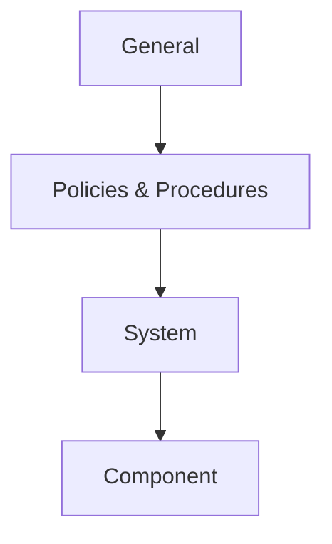

# ISA/IEC 62443 (Industrial Control System Security)

## 1. Overview

### A. Definition
> An international standard that hierarchically systematizes the roles and requirements of each stakeholder—Asset Owner, System Integrator, Product Supplier, etc.—in order to secure the cybersecurity of **Industrial Automation and Control Systems (IACS/ICS·OT)**.

ISA/IEC 62443 originally started as ISA-99 of the International Society of Automation (ISA) in the United States and was internationally standardized jointly with the International Electrotechnical Commission (IEC). Its core idea is to view security not as a single product feature but as a **lifecycle-perspective** problem for which the entire supply chain—**the asset owner's operation, the system integrator's design, and the product supplier's development**—is jointly responsible. That is, it is a framework that nails down, throughout the entire process of contracting, design, and operation, who bears which security responsibility and to what level (Security Level) it must be achieved—not merely buying one good firewall.

### B. Background and Necessity
Traditionally, OT environments such as power plants, refineries, and manufacturing lines were hardly considered for security, under the belief that they were physically separated (air-gapped) from external networks. However, **Stuxnet**, which destroyed Iran's centrifuges in 2010, demonstrated that penetration into even a closed network is possible via USB and internal networks, and afterward incidents leading to physical damage followed one after another, such as the Ukrainian power grid blackout (2015) and the furnace damage at a German steel mill. Whereas IT security worries about data leakage (confidentiality), OT incidents are fundamentally different in the nature of their risk in that they directly connect to **equipment destruction and loss of life**. As the premise of a closed network collapsed with the IT/OT convergence of smart factories and critical infrastructure, a **dedicated standard centered on availability and safety** that IT security standards (ISO 27001) alone could not cover became necessary, and 62443 became the de facto international reference for that.

## 2. Standard Structure (4 Layers)

62443's document set is divided into the above four layers, each targeting a different stakeholder. **General (1-x)** defines terms, concepts, and models, providing a common language for all subsequent documents. **Policies & Procedures (2-x)** mainly deals with the security program, patch management, and service-provider requirements that the **asset owner** must have in place. **System (3-x)** prescribes the security requirements (3-3) and risk assessment / zone design (3-2) that the **system integrator** must observe when designing and building a system. **Component (4-x)** sets the development lifecycle (4-1) and technical requirements (4-2) for the **product supplier** to securely develop individual products (PLCs, sensors, gateways). Because responsibility is thus separated by layer, a practical strength is that "whose scope of responsibility it was" can be judged on a contractual basis in the event of a security incident.

| Layer | Target stakeholder | Content |
|---|---|---|
| **General** | Common | Terms, concepts, models (common language) |
| **Policies & Procedures** | Asset owner | Security program, patch management, operating procedures |
| **System** | System integrator | System security requirements (SL), zone/conduit design |
| **Component** | Product supplier | Product development security lifecycle, technical requirements |

## 3. Core Concepts

62443's defense philosophy is implemented through several core concepts. The most foundational is **Zone & Conduit**, which divides the control network into **security zones (Zones)** by grouping assets with similar risk characteristics and forces inter-zone communication to pass only through **conduits (Conduits)**, the controlled paths. This is a **bulkhead** concept that keeps infection from spreading to an adjacent zone even if one zone is breached; for example, it separates the office network, control network, and safety instrumented system (SIS) into different zones. Each zone is assigned a **Security Level (SL 1–4)** target matched to the threat level, where SL 1 aims to block accidental breaches, SL 2 intentional attacks by low-resource actors, SL 3 mid-level specialized attacks, and SL 4 nation-state-level sophisticated attacks, with required controls strengthening as the level rises.

What renders this target into actual controls is the **7 Foundational Requirements (FR)**, to which all security requirements are ascribed. **Defense in Depth** is the principle running through all of this, overlapping defenses across multiple layers—physical, network, system, and component—rather than relying on any single control.

| Concept | Description |
|---|---|
| **Zone & Conduit** | Isolate assets into security zones (Zone); inter-zone communication only via controlled paths (Conduit) |
| **Security Level (SL 1–4)** | Target security grade by threat level (accidental → nation-state attack) |
| **7 Foundational Requirements (FR)** | ① Identification & authentication control ② Use control ③ System integrity ④ Data confidentiality ⑤ Restricted data flow ⑥ Timely response ⑦ Resource availability |
| **Defense in Depth** | Overlap defenses across physical, network, system, and component |

## 4. Differences from IT Security (Comparison)

The fundamental reason the security priorities of IT and OT diverge is **that the value of what is protected differs**. In IT, information (data) is the asset, so **confidentiality (C)**, preventing leakage, is the top priority; in OT, a halted process means immediate production loss or a safety incident, so **availability (A) and safety** are the top priorities. Thus "patch immediately upon discovering a vulnerability," a matter of course in IT, is actually risky in OT. A patch that requires rebooting a generating facility in operation can cause a process shutdown, so one waits until a maintenance window (shutdown window) or substitutes a compensating control (virtual patching). Also, IT equipment is replaced in 3–5 years, but control equipment is used for 20–30 years, so it is normal for already end-of-life (EoL) OS to remain in the field, and defenses must be designed on that premise.

| Category | IT | OT (62443) | Reason the difference arises |
|---|---|---|---|
| **Priority** | Confidentiality (C) | **Availability & safety (A·S)** | Incidents connect not to data leakage but directly to equipment destruction and loss of life |
| **Patching** | Rapid application | Cautious (shutdown risk) | Reboot causes process shutdown; maintenance window needed |
| **Lifetime** | 3–5 years | 20–30 years | Capital-goods nature of equipment; EoL OS ever-present |

## 5. Considerations and Implications (Professional Engineer's Perspective)
- **IT/OT convergence governance**: Since the premise of a closed network has collapsed, redefine the boundary of responsibility between the IT security team and the OT field team, and reflect zone partitioning and unidirectional gateways (data diodes) from the design stage when introducing smart factories.
- **Integration of Safety and Security**: If a safety instrumented system (SIS) is disabled by a cyberattack, the safety function itself collapses, so managing functional safety (IEC 61508/61511) together with 62443 is a key trend.
- **Supply chain security**: Require product-supplier certification (62443-4-1/4-2) as a procurement requirement to contractually enforce **Security by Design**, introducing only products with built-in security.
- **Linkage with critical-infrastructure protection**: It is used as the international reference for critical information and communications infrastructure protection and smart-factory security guides, serving as a baseline that satisfies regulatory compliance and substantive defense at the same time.

---

> **In one line**: ISA/IEC 62443 is an *international OT security standard that systematizes the responsibilities of asset owners, integrators, and suppliers into four layers*, presenting industrial control system security that—unlike IT—makes **availability and safety the top priority** through Zone/Conduit isolation, SL grades, the 7 Foundational Requirements, and defense in depth.
