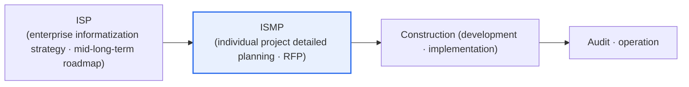
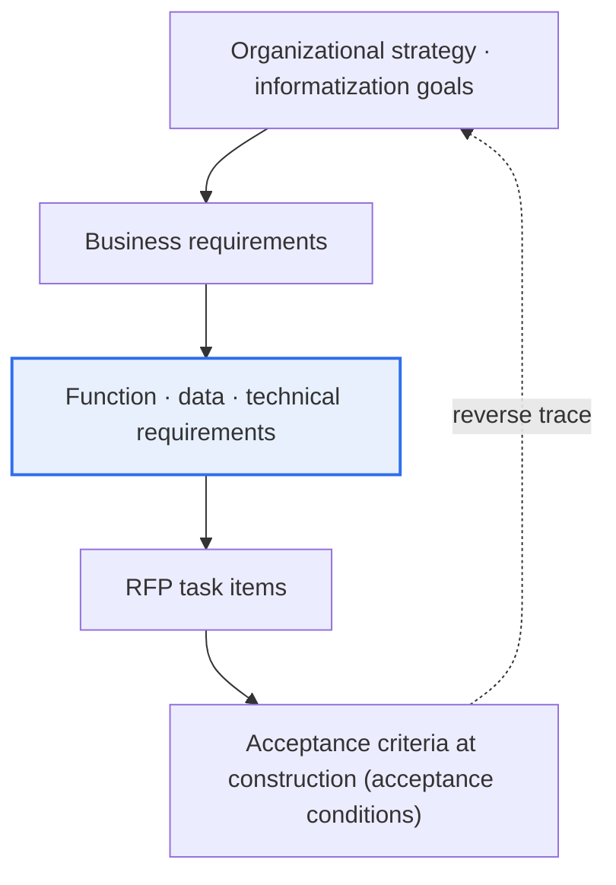

# Information System Master Plan (ISMP)

## 1. Overview

### A. Definition
> **ISMP (Information System Master Plan)** is the activity of **deriving, analyzing, and planning in detail the requirements of a specific information-system construction project before order placement (contracting)** in order to precisely establish the Request for Proposal (RFP) and the execution plan needed to place the order. Whereas the ISP, which addresses the organization's mid-to-long-term informatization strategy, decides "where to go," the ISMP is a detailed plan that **concretizes, at the level of an individual project and before order placement, "what to build and how."**

The fundamental background to ISMP's institutional adoption was the "**repeated failure of software projects ordered with ambiguous requirements**." Starting a project while requirements are unclear creates a vicious cycle in which requirements keep changing during development, scope changes accumulate, costs are exceeded, schedules slip, and quality degrades. Above all, because "what was agreed to be built" is not clearly written in the contract, disputes never cease between the client and the vendor over "this was originally in scope / no it wasn't."

ISMP solves this problem with the simple but powerful principle of **"analyzing and finalizing requirements sufficiently before order placement."** Just as one finalizes detailed blueprints and estimates and signs a construction contract before building a house, a software project can also greatly reduce project risk and raise order quality if what is to be built is concretized before the order is placed. Domestically, under the framework of the Software Promotion Act (formerly the Software Industry Promotion Act), ISMP or a requirements-detailing procedure has been recommended and applied to public informatization projects that are above a certain scale or whose requirements are complex enough to need advance planning. (Since the specific target criteria and monetary thresholds may change with revisions to the relevant notices and guidelines, one must check the latest regulations.)

### B. Background and Necessity
The risk of failure in an informatization project grows exponentially the more unclear its requirements are. In particular, large-scale and public projects have large budgets, many stakeholders, and great social impact, so if requirements are not finalized at the order stage, control itself becomes difficult. The experience of past public informatization projects failing in the pattern of "low-bid award followed by an explosion of scope changes" was the direct driver of ISMP's institutionalization.

The reasons ISMP is needed can be organized into three main points. First, **improving order quality**. An RFP with clear, verified requirements becomes the foundation for vendors to propose accurately and compete fairly. Second, **securing appropriate compensation**. Only when what is to be built is concretized can scale (function points, etc.) and cost be properly estimated, and this prevents the quality degradation and subcontracting exploitation caused by unreasonable low-bid orders. Third, **preventing disputes and clarifying responsibility**. Finalizing scope before contracting makes it clear that a "please do this too" demand during development is outside the contract scope, protecting both client and vendor. In short, ISMP is an advance investment that raises the very probability of project success through "properly prepared ordering" rather than "cheap, fast ordering."

## 2. Comparison with ISP

To understand ISMP accurately, one must clarify its relationship with the higher-level concept ISP (Information Strategy Planning). The two are not opposing concepts but form a **hierarchy running from strategy → project planning**. If ISP draws the big picture at the enterprise level of "which information systems our organization will build over the next 3–5 years and in what priority," ISMP takes one individual task out of that picture and details "what is needed to actually order this system."

The table below organizes the differences between the two activities. But rather than stopping at enumerating the table's items, it is important to understand 'why' these differences arise. ISP is a **strategy spanning multiple projects**, so its deliverable is a macroscopic plan centered on direction and priority; ISMP, by contrast, is **execution preparation for a single project**, so its deliverable is a requirements definition and RFP concrete enough to order that one project. That is, because the level of abstraction and the purpose differ, the level of detail and form of the deliverables differ.

| Category | ISP | ISMP |
|---|---|---|
| **Scope** | Enterprise-wide informatization strategy | Individual system construction project |
| **Purpose** | Decide mid-long-term informatization direction/priority | Finalize project requirements, detailed order planning |
| **Horizon** | 3–5 year roadmap (macro) | One specific project (micro, execution) |
| **Key deliverable** | Informatization master plan, implementation roadmap | Requirements definition, Request for Proposal (RFP) |
| **Relationship** | Higher-level strategy | Project plan that concretizes the ISP |

In practice, ISP and ISMP do not necessarily proceed only sequentially. When an individual project must be pushed forward urgently without an ISP, the ISMP may in effect partly double as a strategic review; conversely, if a well-established ISP exists, the ISMP can inherit its priorities and direction as-is and focus on requirements detailing. The key is to ensure that **strategy and ordering are connected consistently without a break**, and ISMP plays that connecting-link role.

## 3. Stage-by-Stage Activities and Deliverables

ISMP is a phased procedure that progressively concretizes requirements from initiation to order preparation. Each stage takes the deliverable of the preceding stage as input and makes the requirements more detailed, reaching an orderable-level RFP at the final stage. The flow diagram below shows the progression of the five stages.

**A. Project initiation and planning** stage decides the scope, promotion structure, schedule, and participating organizations of the ISMP effort itself. If this stage is deficient, the subsequent scope of analysis wavers, so it is important to clarify early the roles and decision-making structure of management, the field/business side, and the IT department. The deliverable is the ISMP execution plan.

**B. Establishing information system direction** stage analyzes the internal and external environment and the current-system status (As-Is), and establishes the target system's direction (To-Be) and target model. Here it prescribes how the organization's strategy and business goals should align with the information system, and if an ISP exists, it inherits that direction. The result of this stage becomes the compass for the subsequent requirements analysis.

**C. Business and technical requirements analysis** stage is the heart of ISMP. Through interviews with business staff, workshops, and analysis of current processes, business requirements are derived in detail, and the technical requirements to support them (performance, security, integration, data requirements, etc.) are analyzed together. Because how densely requirements are unearthed and verified at this stage decides the success or failure of the entire project, effort must be put into securing the completeness, consistency, and traceability of the requirements. The deliverable is the requirements analysis report.

**D. Defining information system structure and requirements** stage defines functions, data, and architecture (application, data, and technical structures) based on the analyzed requirements, and formalizes the requirements into an orderable-form definition. By assigning priority and acceptance criteria to each functional requirement, it clarifies what the vendor must implement and to what level. The deliverable is the requirements definition.

**E. Establishing the project implementation plan** stage estimates project scale (e.g., function-point-based sizing), cost, and duration based on the finalized requirements, decides the project-splitting and promotion strategy, and completes the Request for Proposal (RFP) and implementation plan encompassing all of these. This RFP becomes the baseline document for order placement and thereafter operates as the basis for proposal, contract, and construction.

| Stage | Detailed activity | Key deliverable |
|---|---|---|
| **Initiation · planning** | Define scope, promotion structure, schedule | ISMP execution plan |
| **Direction establishment** | Environment/current (As-Is) analysis, target model (To-Be) | Direction definition |
| **Requirements analysis** | Detailed derivation/verification of business/technical requirements | Requirements analysis report |
| **Structure · requirements definition** | Define functions/data/architecture, prioritization | Requirements definition |
| **Implementation plan** | Scale/cost estimation, write RFP/implementation plan | Request for Proposal (RFP), implementation plan |

### A. Securing Requirements Traceability
A practical principle running through the entire ISMP procedure is **requirements traceability**. The higher-level goals derived in direction establishment must connect without a break to the individual requirements of requirements analysis, then to the function/data items of structure and requirements definition, and finally to the task clauses of the RFP. Below is a detailed diagram showing this traceability chain.

Once this traceability chain is secured, one can at any time reverse-trace why a requirement is needed during development and from which higher-level goal it originated, which suppresses needless requirement expansion (scope creep) and clarifies acceptance criteria. Conversely, if traceability is broken, groundless requirements get mixed into the RFP, or truly necessary requirements are omitted, degrading order quality. This is why each ISMP deliverable must be managed not as a separate document but as one interconnected requirements system.

### B. Contrast of Failure and Success Cases

The value of ISMP becomes clear when contrasted with failure cases. In a typical public project ordered without finalizing requirements, additional demands from the business side pour in after initiation, and the scope swells greatly relative to the initial contract scope. For example, if the initial contract was for 100 functions but requirements grow to 150 during development, the vendor either takes on 50% more work without additional compensation or enters into a dispute with the client. At this point, if the requirements documentation that would be the basis is deficient, it is hard to pinpoint who is responsible, ultimately leading to quality degradation, delivery delays, and audit findings.

Conversely, a project that faithfully performs ISMP has already verified and finalized requirements at the time of order placement, so the vendor proposes accurately, the client evaluates fairly, and changes during development are controlled by a formal change-management procedure. Because requirements are clear, sizing becomes accurate, and accurate sizing leads to appropriate budgeting, preventing unreasonable low-bid orders. Practically, the key implication is that ISMP is not simply paperwork but a **risk-management activity that pre-settles project risk before order placement**.

ISMP also contributes to strengthening the client's internal capability. An ordering organization that has defined requirements on its own can maintain the initiative in the subsequent project management and audit stages without being dragged along by the vendor. That is, beyond a single project, ISMP becomes an occasion to raise the maturity (governance) with which an ordering agency controls informatization projects.

However, one must also practically bear in mind that ISMP is not a panacea. Over-finalizing requirements in advance makes it hard to reflect improvement opportunities discovered during development, so tension can arise with projects that require agile, iterative development. Therefore, while ISMP-style advance finalization suits large mission-critical systems with high requirements stability, projects with great uncertainty need to design flexibility together—such as specifying room for change management and priority adjustment in the RFP. Understanding ISMP not as "a procedure to freeze requirements" but as "a procedure that finalizes core requirements while making change controllable" is the mature application.

## 5. Deeper Dive — Linkage with Requirements Engineering and Past Exams, and Answer Composition Strategy

ISMP can essentially be seen as **the institutionalization of Requirements Engineering at the order stage**. The requirements-engineering procedures of elicitation, analysis, specification, and verification correspond directly to each stage of ISMP, and the quality attributes of requirements—completeness, consistency, traceability, and verifiability—become the quality criteria for ISMP deliverables. Therefore, in an answer, weaving ISMP together with adjacent topics such as requirements engineering, RFP, function-point (FP)-based sizing, and SLA brings out depth.

From a past-exam-linkage perspective, ISMP is frequently asked together with ISP, RFP, software project cost estimation, and public SW project systems (task deliberation committees, requirements detailing, etc.). Recent public SW project management systems have been revised in the direction of strengthening control of scope changes and guaranteeing appropriate compensation (operation of task deliberation committees, the trend toward mandating requirements detailing, etc.), and ISMP stands as a representative means of the "prepared ordering" that such systems aim for. Since specific system names, effective dates, and application criteria are continuously revised, in an answer it is safe to describe mainly the broad direction and avoid citing definitive figures.

As an answer composition strategy, an effective structure is: ① in the overview, clearly clarify 'the distinction from ISP' to imprint conceptual understanding on the grader; ② in the body, present the 5-stage procedure and deliverables together with conceptual diagrams while emphasizing the flow of 'requirement concretization' at each stage; ③ expand to linkage with ISP, RFP, and sizing; and ④ conclude with implications from the professional engineer's perspective of order quality, appropriate compensation, and dispute prevention.

## 6. Considerations and Implications

1. **Detailing requirements before order placement fundamentally prevents scope changes and disputes.** ISMP's core value lies in finalizing "what to build" before the project starts, structurally reducing the explosion of scope changes during development and client–vendor disputes. This is the textbook of risk management in that it is advance prevention rather than after-the-fact control.

2. **Accurate scale/cost estimation secures appropriate compensation.** Only when requirements are clear can scale be properly estimated by function points and the like, and this prevents quality degradation and subcontracting deficiencies caused by unreasonable low-bid orders. ISMP provides the basis that enables "fair-value ordering" rather than "cheap ordering."

3. **Linking ISP–ISMP–construction–audit secures consistency.** Informatization investment aligns with the organization's strategic goals only when the flow from enterprise strategy (ISP) to individual project planning (ISMP) and again to construction, audit, and operation is consistent. ISMP is the connecting link that bridges the gap between strategy and execution.

4. **It raises both the requirements-definition capability and governance maturity of the ordering agency.** Beyond producing documents, ISMP becomes an occasion to grow the ordering organization's capability to control requirements itself and lead the project. Only when this capability accumulates does a healthy ordering ecosystem, not dependent on the vendor, form in subsequent projects as well.

5. **Continuous alignment with changes in systems and environment is needed.** Since public SW project systems continue to evolve toward controlling scope changes and guaranteeing appropriate compensation, ISMP deliverables and procedures must also be continuously aligned with the latest laws, notices, and guidelines to maintain effectiveness.

## References
- Ministry of Science and ICT, Software Promotion Act and subordinate notices (guidelines related to software projects) — https://www.law.go.kr/
- National Information Society Agency (NIA), guidance and guides related to informatization projects — https://www.nia.or.kr/

---

> **In one line**: ISMP is the activity of *detailed planning of an individual information-system project's requirements before order placement*; through the five stages of initiation → direction → requirements analysis → structure definition → implementation plan, it progressively concretizes requirements to produce an RFP and requirements definition, preventing scope changes and disputes and securing appropriate compensation and order quality.
