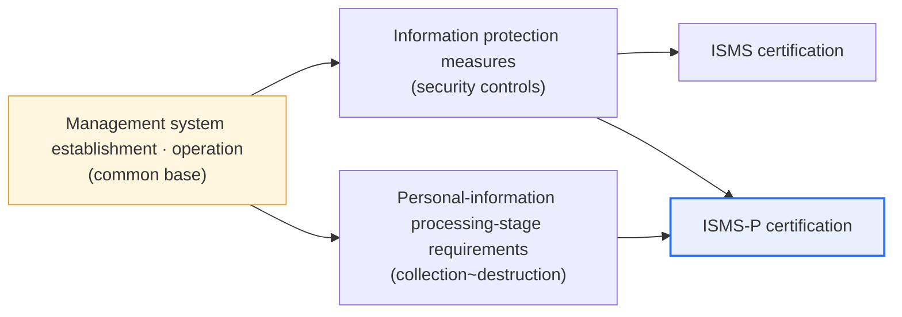

# Information Security and Personal Information Protection Management System (ISMS / ISMS-P)

## 1. Overview

### A. Definition
> **ISMS (Information Security Management System)** is a certification in which a third-party review body objectively verifies that an organization has established and is operating a management system to protect the confidentiality, integrity, and availability of information assets. **ISMS-P** is a certification that additionally integrates the lifecycle requirements of **Personal information** processing, operated by the Korea Internet & Security Agency (KISA) and the Personal Information Protection Commission.

The essential purpose of a certification system is to compel and verify that an organization equips security as a "**system that is continuously managed, not a one-off measure**." Buying a single firewall does not make one safe; real security is achieved only when a **PDCA cycle**—establishing policy (Plan), executing it (Do), inspecting it (Check), and improving it (Act)—takes root in the organizational culture. Certification is the device by which a third-party review body confirms from an external viewpoint whether this management system actually operates. ISMS suits organizations that handle only information, while ISMS-P—which also verifies personal-information processing requirements—suits organizations that process personal information in bulk.

The point to emphasize here is that certification looks not at "whether a bundle of documents was produced" but at "**whether the procedures to identify and control risk are alive and moving**." So a certification review confirms not only policy documents but also operational evidence such as actual access-authorization records, log-inspection history, and incident-response drill results. This is why it is called a "management system" certification rather than a mere credential.

### B. Background and Necessity
As personal-information leaks and hacking incidents came to directly determine a company's survival and social trust, the recognition grew that voluntary security efforts alone cannot bear society-wide risk. Because a single incident at a large service handling millions of people's personal information produces social repercussions beyond individual user harm, management-system certification became a **legal obligation** for operators above a certain scale. That is, certification is a means of simultaneously achieving external trust (a marketing effect) and regulatory compliance (a legal effect).

Another background is the **integration** of certification systems. In the past, information security (ISMS) and personal-information protection (PIMS/PIPL) were operated as separate certifications, so organizations had to undergo similar, overlapping reviews. To reduce this burden, ISMS-P, which bundled the two systems into one, was launched in 2018, and organizations came to choose ISMS or ISMS-P according to their processing characteristics.

## 2. The Relationship and Difference Between ISMS and ISMS-P

Seeing the relationship of the two certifications structurally first, ISMS-P is the broader certification that **includes** ISMS. Understanding that it is an inclusion relationship, layering the personal-information domain on top of the common base, is the starting point for distinguishing the two systems.

The two certifications share the common base of "management system establishment and operation," but diverge in **the object of protection and the scope of inspection**. ISMS verifies whether security controls over information assets in general—that is, access control, encryption, physical security, incident response, and so on—work properly. The focus is the safety of the "vessels that hold information," such as servers, networks, personnel, and physical facilities.

ISMS-P, by contrast, additionally inspects the requirements across the entire processing lifecycle of personal information: **collection → use/provision → storage → destruction**. For example, it confirms whether consent was lawfully obtained at the collection stage, whether entrustment/third-party provision procedures are in place at the provision stage, and whether personal information past its retention period was actually erased at the destruction stage. That is, on top of the "safety of the vessel (ISMS)," ISMS-P also looks at "whether the contents—the personal information held in the vessel—are handled lawfully throughout the whole process (the P domain)."

The implication of this difference in practice is clear. An infrastructure or B2B organization that handles almost no personal information is sufficiently covered by ISMS alone, but commerce, platform, and fintech companies that process member personal information in bulk find ISMS-P essentially mandatory. If one takes only ISMS and leaves out the personal-information domain, the personal-information processing procedures—the greatest legal risk—remain unverified.

Also, the trust signal that the certification mark gives users differs. For a service that handles personal information, an "ISMS-P certified" mark is read as an external promise to process personal information lawfully, not just security, so the more consumer-facing the service, the greater the marketing and trust effect of a certification that includes the P domain. Conversely, there are not a few cases where an organization, having hastily obtained only ISMS to meet an obligation, later expands to ISMS-P when personal-information regulatory issues belatedly arise. When first designing certification, deciding the certification scope while considering the organization's personal-information processing volume and growth direction is the way to reduce rework.

| Category | ISMS | ISMS-P |
|---|---|---|
| **Object of protection** | Information assets (security) | Information assets + **personal information** |
| **Certification scope** | Management system + information protection measures | + Personal-information processing-stage requirements |
| **Inspection focus** | Security controls (access, encryption, physical) | Security + personal-information lifecycle (collection~destruction) |
| **Certification mark** | ISMS | ISMS-P |
| **Suitable organization** | Information-protection-centered, small personal information | Bulk personal-information processing (commerce, platforms, etc.) |

## 3. Composition of the Certification Criteria (3 Domains)

The ISMS-P certification criteria (based on the 2023.11 revision) are broadly composed of three domains, and ISMS targets the first two of these. Understanding "what and why" each domain looks at reveals the logical structure of the certification.

**A. Management system establishment and operation (16 criteria).** This domain looks at the 'skeleton' of security. From management participation and organizational composition, to information-asset identification and risk assessment, to protective-measure implementation and follow-up management, it verifies whether the PDCA cycle has taken root in the organization. No matter how many tools one buys, without a procedure to assess risk and decide measures it cannot be called a management system, so this domain sits above all controls.

**B. Protective-measure requirements (64 criteria).** This domain corresponds to the concrete 'muscles.' It inspects item by item the actual implementation of security controls—policy/organization/human security, external-party/physical security, authentication and privilege management, access control, encryption, information-system introduction/development security, system/service operation security, incident prevention/response, and disaster recovery. It broadly spans from technical controls such as access control and encryption to managerial controls such as human security.

**C. Personal-information processing-stage requirements (21 criteria).** This domain, applied only to ISMS-P, follows the personal-information lifecycle and confirms protective measures at collection, protective measures during retention/use, protective measures at provision, protective measures at destruction, and protection of data subjects' rights. If the first two domains are "security in general," this domain is different in nature in that it looks at "the lawfulness peculiar to personal information."

The review of this domain digs deep into the **lawfulness of procedures** rather than technical controls. For example, at the collection stage it looks at whether mandatory and optional consent are distinguished and whether the principle of minimal collection is observed; at the provision stage it confirms whether management and supervision of the trustee is done upon entrustment and whether separate consent/notification exists upon transfer abroad. At the destruction stage it verifies with actual logs whether personal information past its retention period is deleted in an unrecoverable manner. Because it looks not at a document saying "consent was obtained" but at "whether lawfully obtained consent is upheld throughout the entire processing process," this domain is also the part with the greatest preparation burden for organizations that handle personal information.

Summing the three domains, the certification criteria total **101 (16+64+21)**, and each criterion comes with numerous detailed inspection items. However, since the number of items may be adjusted depending on the revision point, the principle in an actual review is to check the latest notice and guidance.

## 4. ISMS Mandatory Targets and Certification Procedure

### A. Criteria for Mandatory Targets
Under Article 47(2) of the "Act on Promotion of Information and Communications Network Utilization and Information Protection, etc. (Network Act)" and Article 49 of its Enforcement Decree, information and communications service providers that meet certain requirements are **obligated** to obtain ISMS certification. The reason mandatory targets are set by scale criteria is that the more information and users one handles, the greater the social repercussions in an incident, so it cannot be left to voluntary discretion. This reflects the proportionality principle of "stronger regulation where the risk is greater."

Specifically, the targets are: ① **key telecommunications operators (ISPs)** that provide information and communications network services in Seoul and all metropolitan cities, ② **Internet Data Center (IDC)** operators, ③ operators with information and communications service sector revenue of **10 billion won or more** in the previous year, or a **daily average of 1 million or more users** over the immediately preceding three months as of the end of the previous year, and ④ tertiary general hospitals, universities, etc. with revenue/receipts of **150 billion won or more**. For example, an online service whose membership surged past a daily average of 1 million users becomes a mandatory target from that point and must prepare for certification.

| Target type | Criterion (example) |
|---|---|
| **Key telecommunications operator (ISP)** | Provides information and communications network services in Seoul and all metropolitan cities |
| **Internet Data Center (IDC)** | Operator providing data center services |
| **Revenue/user scale** | Information and communications service revenue 10 billion won↑ or daily average 1 million users↑ |
| **Hospitals/universities** | Tertiary general hospitals/universities with revenue/receipts of 150 billion won or more |

Since a mandatory target that does not obtain certification may be fined under the Network Act, it is practically important for growing companies near the scale thresholds to establish a certification preparation roadmap in advance.

### B. Certification Procedure and Maintenance
Certification goes through the procedure of **application → review (documentation/on-site) → deficiency remediation → certification committee deliberation → certificate issuance** for the aforementioned control items. The review confirms not only the existence of policy documents but also actual operational evidence (authorization records, logs, drill results, etc.) to filter out formal preparation.

The important thing is that certification is not one-off. The certificate is valid for 3 years, during which a **follow-up review every year** checks whether the management system is continuously operated, and **a renewal review every 3 years** re-certifies. This periodic review structure itself institutionally embodies the PDCA philosophy that "security must be maintained and improved."

A follow-up review is narrower in scope than the initial review but is by no means a formality. Because it confirms with operational evidence whether the management system actually ran over the past year, an organization that obtained certification only to neglect operation has deficiencies exposed in the follow-up review. For example, if risk assessment was not renewed annually, if there is no record of revoking a departed employee's access privileges, or if an intrusion-incident response drill was never conducted even once, these are pointed out as deficiencies. That is, the whole organization must understand that certification is not "pass once and done" but "a state that must be maintained throughout the 3 years."

If a deficiency is found, the organization must carry out remediation within the set period and submit the results as evidence, and if a serious deficiency is not resolved, the certification may even be revoked. Therefore, systematizing post-acquisition operational governance (periodic risk assessment, privilege review, log inspection, mock drills) is as important a practical task as obtaining certification.

## 5. Deeper Dive: Linkage with Other Certification Systems and Latest Trends

ISMS-P gains practical value when understood from the perspective of **linkage and mutual recognition** with other domestic and international certifications and regulations. Representatively, it overlaps substantially in control items with **CSAP (Cloud Service Assurance Program)**, the cloud service security certification, so a cloud operator that holds ISMS-P can reduce the burden of CSAP compliance. For operators aiming to enter the public cloud market, control mapping between the two certifications leads to real cost savings.

This linkage is far more efficient if a crosswalk mapping control items 1:1 is prepared in advance. For example, mapping ISMS-P's access-control and encryption items to the ISO/IEC 27001 Annex A controls in advance lets one satisfy both certifications' requirements with a single evidence collection, greatly reducing the review-preparation effort.

Internationally, it is similar in structure and controls to **ISO/IEC 27001**, the international information security standard. Because ISMS-P's management-system and protective-measure domains correspond to ISO/IEC 27001's management-system requirements and Annex A controls, a company doing global business prepares both certifications together to simultaneously achieve domestic regulatory compliance and overseas trust. However, the difference is that ISMS-P additionally contains the personal-information processing-stage requirements—a domain peculiar to domestic law—so ISO/IEC 27001 alone cannot fully satisfy domestic personal-information regulations.

As for latest trends, one can cite that the ISMS-P certification criteria were revised in line with the 2023 revision of the Personal Information Protection Act and its Enforcement Decree. It is a flow that reflects the strengthening of data-subject rights, responses to automated decisions, and the growing complexity of personal-information processing with the spread of MyData and AI services, and the certification criteria are also continuously updated to match these changes. Therefore, when writing an answer, rather than asserting a specific number of items, one should take the attitude of using the latest notice as the basis on the premise that "it is adjusted with revisions."

The spread of AI services throws up especially new issues from the personal-information processing perspective. Large language models and recommendation systems may include personal information in training data, and automated profiling may render decisions unfavorable to a data subject, so principles such as collection lawfulness, purpose limitation, and the right to demand explanation must be applied more elaborately. Management-system certification is also evolving in the direction of capturing how personal information flows and is controlled in such new-technology environments, and it is desirable for organizations to include the data flow of AI pipelines in the scope of asset identification and risk assessment during certification preparation.

Also, with the rise of supply-chain and cloud risk, the weight of **external-party security** controls—including trustees and cloud operators, not just one's own systems—is growing. As the structure of entrusting personal-information processing to outside parties becomes common, understanding trustee management/supervision, sub-entrustment control, and the cloud shared-responsibility model has emerged as an important axis of certification preparation.

## 6. Considerations and Implications (Professional Engineer's Perspective)

1. **Certification is a means, not an end.** Since the essence is not obtaining the certificate itself but a substantive improvement in the security level, if one stops at formal document preparation only to pass the review ("paperwork security"), the management system will not work when an incident occurs. Controls must be woven into everyday procedures so operational evidence stays alive.

2. **For an organization with a large share of personal information, integrated management via ISMS-P is efficient.** Managing security and personal-information protection as one system reduces duplication in policy, organization, and review and raises consistency. Conversely, an infrastructure organization that handles almost no personal information need not unreasonably get certified for the P domain too, so choosing the certification that fits the processing characteristics is important.

3. **Optimize certification burden and cost with a linkage strategy with other certification systems.** By mapping control items with CSAP for cloud and ISO/IEC 27001 for global, and mutually recognizing and reusing them, one can reduce duplicate reviews and secure domestic and overseas trust at the same time. Preparing a control-mapping table in advance is the practical key.

4. **Managing scale thresholds and preemptively judging mandatory-target status are needed.** Growing companies whose revenue and user counts approach the mandatory criteria (10 billion won, 1 million people, etc.) must secure a certification preparation roadmap and budget in advance so as not to suffer fines and reputational risk from a hasty response after reaching the threshold.

5. **Internalize a revision-response and continuous-improvement system.** Since the Personal Information Protection Act and certification criteria are periodically revised in line with environmental changes such as AI and MyData, continuous operational governance—tracking the latest notices and guidance and using follow-up and renewal reviews as opportunities to improve the management system—is required.

## References
- ISMS-P Certification System Guide (KISA): https://isms.kisa.or.kr/main/ispims/target/
- ISMS-P Certification Criteria Guide (Personal Information Protection Commission, 2023.11): https://www.privacy.go.kr/front/bbs/bbsView.do?bbsNo=BBSMSTR_000000000049&bbscttNo=20677
- Network Act (Korea Law Information Center): https://www.law.go.kr/

---

> **In one line**: ISMS is the information security management system certification, and ISMS-P is an integrated certification (an inclusion relationship) that adds personal-information processing-stage requirements from collection to destruction; the certification criteria comprise three domains—management system establishment/operation (16) + protective measures (64) + personal-information processing stages (21)—operators meeting criteria such as 10 billion won in revenue and 1 million users under the Network Act are obligated to have ISMS, and the essence of certification is a substantive improvement in the security level based on PDCA.
