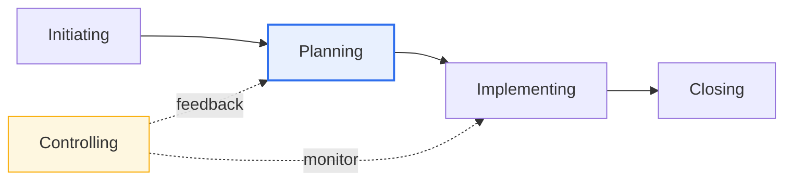
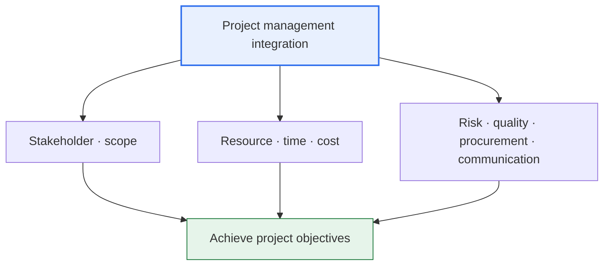

# ISO 21500 (Guidance on Project Management)

## 1. Overview

### A. Definition
> An **international standard guide** on project management that presents the concepts, processes, and terminology of project management applicable regardless of organization, industry, or project size. Its starting point is that the International Organization for Standardization (ISO) established, as a neutral international standard, a process structure similar to PMBOK, the body of knowledge of the US-based PMI.

The fundamental reason ISO 21500 is needed is to provide "**a common international language and reference for project management**." If each organization's project-management method and terminology differ, global collaboration, performance evaluation, knowledge sharing, and auditing/certification all become difficult. Although a particular country's or body's methodology (representatively, PMI's PMBOK in the US) was in fact widely used, it was ultimately one organization's body of knowledge. Out of the need to establish this as a neutral international standard not subordinate to any specific organization, ISO 21500:2012 "Guidance on project management" was enacted in 2012.

The object ISO 21500 addresses is the one-time, temporary effort called a 'project.' Unlike standardized, repetitive work (operations), a project is an activity that produces a unique deliverable within a set period and budget, so uncertainty and change exist as constants. That the standard emphasizes the feedback loop of control-and-planning and risk management as core elements is also to cope with this essential uncertainty of projects.

The point to note here is the nature of this standard as '**guidance, not a methodology**.' That is, it is not a prescription that says "use this tool in this order," but a common framework that says "project management has such-and-such concepts and processes, understand it this way." Therefore, organizations use it as a reference against which to check and supplement the consistency of their own methodology (e.g., an in-house PM standard, PRINCE2, agile) in light of the common frame of ISO 21500. Providing a common foundation that lets different countries and organizations understand and communicate about projects with the 'same map' is the essential value of this standard.

### B. Background and Necessity
As the enlargement and internationalization of projects sharply increased cases where multinational teams and partners participate together in a single project, the need grew for an international standard by which each organization's methodology could be compatible and quality assured. For example, in a large infrastructure project where the client, designer, contractor, and supervisor are each in different countries, if the procedures and terminology of initiation, planning, and control are not unified, the communication cost of schedule, cost, and risk management explodes. ISO 21500 becomes the foundation for collaboration and governance by providing these heterogeneous participants with a common reference. This family of standards was subsequently reorganized on a large scale over 2020–2021, which is covered in the later deep-dive section.

Also, standardization gives internal benefits to an organization. If project-management capability depends on the tacit knowledge of a particular star manager, management quality plunges when that person leaves. Internalizing a common standard such as ISO 21500 accumulates project management as the organization's explicit knowledge and process asset rather than as individual prowess, maintaining consistent quality regardless of personnel turnover and shortening the learning curve for new staff. This is why standards are demanded not only for external collaboration but also from the aspect of the organization's internal sustainability.

## 2. Composition Model (Process Groups × Subject Groups)

ISO 21500 (2012) organizes a project along two orthogonal axes. This '2D matrix' structure is the core part that shares its conception with PMBOK.

The first axis is the **Process Groups**, the five stages (initiating, planning, implementing, controlling, closing) a project passes through over the flow of time. These five do not proceed only sequentially but interact. In particular, **Controlling** runs in parallel with implementing, monitoring the difference between plan and actual, and when a deviation occurs, it forms a **feedback loop** that returns to planning to update the plan. Thanks to this feedback structure, a project can reflect changes arising in progress in a controlled way, rather than rigidly adhering to the initial plan.

The second axis is the **Subject Groups (subject areas)**, which bundle the knowledge areas that must be managed in a project. It is composed of ten areas: Integration, Stakeholder, Scope, Resource, Time, Cost, Risk, Quality, Procurement, and Communication. Each subject group is managed throughout the project's entire life, and an individual process is located at the point where a 'process group (when)' and a 'subject group (what)' intersect. For example, 'cost estimation' is a process placed at the intersection of Planning (process group) × Cost (subject group).

As the above subject-group detail diagram shows, **integration management** plays the central-axis role of coordinating and connecting the other nine areas. No matter how well an individual area is managed, if they conflict with one another (e.g., the clash of schedule compression and cost reduction), the project fails, so integration management adjusts overall balance and priorities to converge them on a single goal. Understanding it as a structure in which stakeholder/scope define 'what and why we do,' resource/time/cost handle 'how and at what cost,' and risk/quality/procurement/communication support 'how to complete it stably' clarifies the relationships among the areas.

| Process group | Key activity |
|---|---|
| **Initiating** | Start project/phase, define objectives/project charter |
| **Planning** | Establish detailed plans for scope, schedule, cost, etc. |
| **Implementing** | Perform work per plan, produce deliverables |
| **Controlling** | Monitor progress, analyze deviation, change/corrective action |
| **Closing** | Formal acceptance/closure, organize lessons learned |

| Subject group bundle | Included areas |
|---|---|
| **Definition · integration** | Integration, stakeholder, scope |
| **Constraints (the big 3)** | Resource, time (schedule), cost |
| **Quality · uncertainty · communication** | Risk, quality, procurement, communication |

The practical implication of this matrix structure lies in being able to **survey the management areas without omission or overlap (MECE)**. At each stage (process group), the project manager can go through the ten subject groups like a checklist and structurally confirm, for example in the implementation stage, "Is the risk response being updated? Is stakeholder communication sufficient?" This has the effect of raising the management quality across the organization by converting project management—which used to depend on the manager's experience or intuition—into a standardized check frame. However, the standard does not prescribe that 'all projects must manage the ten areas with the same intensity.' For small-scale, low-risk projects, **tailoring** that simplifies procurement, program linkage, and the like is actually recommended, and the judgment of this tailoring is the point where the manager's expertise is exercised.

## 3. Comparison with PMBOK (Reasons for the Difference and Implications)

| Category | ISO 21500 | PMBOK Guide (PMI) |
|---|---|---|
| **Nature** | International standard (neutral guide) | A specific association's body of knowledge |
| **Level of detail** | Concept/framework-centered (concise) | Rich in detailed techniques, tools, deliverables (ITTO) |
| **Use** | Standard reference/consistency/certification base | Practical execution methodology/qualification (PMP) base |
| **Revision direction** | Expanding to governance/portfolio (21502, etc.) | Shift from processes → principles/performance domains |

The difference between the two documents arises not from superiority but from a **difference in orientation**. If ISO 21500 focuses on concisely presenting the framework of 'what must be managed' as a neutral international standard, PMBOK extensively addresses the concrete tools, techniques, and deliverables (inputs, tools, outputs; ITTO) of 'how to manage.' For this reason, ISO 21500 has a strength in the 'ruler' role of checking the consistency of an organizational methodology, and PMBOK in the 'execution manual' role that practitioners refer to.

In practice, the two are used together complementarily rather than as competitors. That is, the broad frame and terminology of the organizational standard are aligned with ISO 21500 (and the successor 21502) to secure international consistency, while the detailed execution techniques of individual processes are taken from PMBOK. In fact, since the process-group names and knowledge areas of the two documents correspond considerably, a practitioner familiar with one has little difficulty understanding the other, which also makes parallel use easy.

The fundamental reason the difference arises is that the 'enacting body and purpose' of the two documents differ. Since ISO is an organization that makes standards by the consensus of various national standards bodies, it inevitably stays at the level of greatest-common-denominator consensus on concepts and processes rather than prescribing specific tools and techniques. PMI, by contrast, is a professional association that also runs practitioner qualifications (PMP) and education businesses, so it has extensively accumulated detailed tools, deliverables, and glossaries that practitioners can use right away. Understanding this structural difference naturally explains why ISO 21500 is a 'concise reference' and PMBOK a 'thick practical book.'

Meanwhile, PMBOK also shifted greatly in its 7th edition in 2021 from the existing process/knowledge-area focus to a focus on **principles and performance domains**, evolving in a direction that encompasses agile and hybrid. That is, in that both the ISO line and PMBOK are moving their center of gravity from 'enumerating procedures' to 'value, principles, and governance,' the evolution directions of the two standards show a converging pattern.

## 4. Evolution of the Standard Family (Deep Dive — 2020–2021 Revision)

The ISO 21500 line was greatly reorganized over 2020–2021, and from a professional engineer's perspective, accurately understanding this change is important. The key is that **the detailed guidance on project management was transferred from ISO 21500 to the new standard ISO 21502, and ISO 21500 itself was redefined as a higher-level 'Context and concepts' document**.

Specifically, **ISO 21502:2020** ("Project, programme and portfolio management — Guidance on project management") became the main reference standard replacing the project-management practical guidance that the 2012 edition of ISO 21500 had handled. In contrast, **ISO 21500:2021** was redefined as "Project, programme and portfolio management — Context and concepts," becoming an 'umbrella' standard that provides the context, concepts, and terminology of the overall management system encompassing not only projects but also **programmes and portfolios**, along with a higher-level overview of the related standard family (21502, 21503, 21504, 21505, etc.) created by ISO/TC 258.

Two currents lie behind this reorganization. First, as strategic alignment at the **programme (a bundle of related projects) and portfolio (an enterprise-wide investment set)** level—beyond individual projects—grew important, the standard broadened its view from single-project management to enterprise-wide project governance. Second, the 2020s revisions emphasize **governance, sustainability, and benefits realization**, shifting the focus, beyond mere procedural compliance, to whether a project actually creates value for the organization. However, since domestic and overseas organizations, textbooks, and past exams still often refer to 'ISO 21500' by the 2012 edition's 5-process-group model, when writing an answer it is safe to describe by distinguishing "the 2012-edition process model" from "the 2020–2021 reorganization (transfer to 21502, ISO 21500's shift to context/concepts)."

## 5. Application Cases

How the ISO 21500 line is actually used is concretized by organization type.

**Case 1 — Multinational EPC (plant construction) project.** In a large plant project where the client (Middle East), designer (Europe), and contractor (Asia) collaborate, the PM terminology and procedures of the participating organizations differ. In this case, specifying ISO 21500/21502 as the project-management reference in the contract aligns the stage definitions of initiation, planning, control, and closing and the risk, procurement, and quality management processes on common criteria. For example, unifying the procedure and approval gates of 'change control' according to the standard greatly reduces the communication cost of change requests and approvals between different organizations.

**Case 2 — Public-institution informatization project PMO.** In a large domestic public informatization project, the PMO must integrate and manage the deliverables and schedules of multiple vendors. Taking the process-group/subject-group matrix of ISO 21500 as the reference for the project-management system lets one check 'what to manage and when' with a common frame even if each vendor's methodology differs. In particular, it quantitatively manages schedule/cost deviations by combining the 'monitor-feedback' loop of the control process with practical techniques (PMBOK) such as EVM (Earned Value Management).

**Case 3 — Improving organizational PM maturity.** When a company with no or an unsystematic in-house PM standard maps its own processes against ISO 21500 as a reference, missing management areas (e.g., stakeholder management, risk management) are revealed. Supplementing these to refurbish the in-house standard, and further expanding to the programme and portfolio level (ISO 21503/21504), lets one build an enterprise-wide project governance system in stages.

The common point of the three cases is that ISO 21500 does not replace an 'execution methodology' but plays a 'reference role' that aligns different methodologies and organizations onto one common coordinate system.

## 6. Considerations and Implications (Professional Engineer's Perspective)

1. **It is a means of securing consistency as an international common reference.** If an organization's own PM methodology diverges from the international standard, friction arises in multinational collaboration, auditing, and certification. Mapping and checking one's own standard's processes, terminology, and deliverables against ISO 21500/21502 is the first step of practical application.

2. **It must be combined complementarily with practical methodologies such as PMBOK.** Concrete execution is hard with the standard's framework (ISO) alone, and international consistency/neutrality is weak with a methodology (PMBOK, PRINCE2) alone. A hybrid strategy that takes the broad frame from ISO and the detailed techniques from a methodology secures both systematicity and executability.

3. **The evolution toward a governance/portfolio/value focus must be reflected.** The 2020–2021 revision emphasizes programme and portfolio governance and benefits realization beyond project-unit control. PMO and strategic-planning departments must hierarchically link individual project management (21502) and the enterprise-wide overview (ISO 21500 concepts, 21503/21504) to manage investment priorities and strategic alignment.

4. **Grafting with agile/hybrid environments is a challenge.** The original standard assumes traditional (predictive) projects, but actual SW and digital projects are often performed in agile/hybrid ways. The ability to reinterpret the standard's concepts consistently with agile practices—such as interpreting the 'control-planning feedback' of the process group as an iterative cycle (sprint)—is required.

5. **One must note that standard compliance itself is not the goal.** A standard is merely a common language and reference; it does not guarantee project success. Tailoring and applying the standard to fit the organization's maturity (e.g., a maturity model such as OPM3) and situation (project scale, risk) is the core judgment from a professional engineer's perspective.

## References
- ISO 21500:2021 — Project, programme and portfolio management — Context and concepts — https://www.iso.org/standard/75704.html
- ISO 21502:2020 — Project, programme and portfolio management — Guidance on project management — https://www.iso.org/standard/74947.html

---

> **In one line**: ISO 21500 is an international standard guide for project management (2012) composed of the process groups of *initiating, planning, implementing, controlling, and closing* and subject groups such as integration, scope, resource, and risk; it is used complementarily with PMBOK's practical techniques, and in the 2020–2021 revision the practical guidance was transferred to ISO 21502 while ISO 21500 was reorganized into a 'context and concepts' standard encompassing programmes and portfolios, strengthening governance and sustainability.
