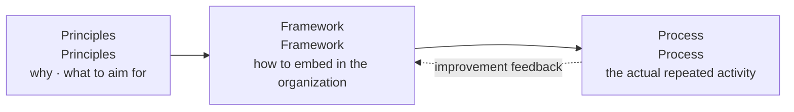

# ISO 31000 (Risk Management)

## 1. Overview

### A. Definition
> An international standard (ISO 31000:2018) that presents the **Principles, Framework, and Process** for systematically managing **the effect that the uncertainty (risk) an organization faces has on the achievement of its objectives**. It is a general-purpose guideline applicable regardless of industry, size, or sector.

In ISO 31000, risk is defined not as a mere 'danger' but as the "**effect of uncertainty on objectives**." The reason this definition matters is that it makes one see risk not only as a threat that causes loss but also as an **opportunity** that can raise performance. That is, risk management is elevated beyond a defensive activity that prevents bad things, to a management activity that **creates and protects value** amid uncertainty.

### B. Background and Necessity
In the past, an organization's risk management was **fragmented (siloed) by department**—finance, safety, information security, and so on. As a result, the same risk was addressed redundantly, or a blind spot arose where no one took responsibility for risks straddling departmental boundaries. Also, since risk response was centered on **after-the-fact response**, occurring only after an incident, it magnified losses. ISO 31000 aims to integrate this enterprise-wide and **internalize risk management into the strategy and decision-making process** so the whole organization handles uncertainty by consistent criteria. Its necessity is great in that it provides an internationally accepted common language and skeleton to organizations seeking to introduce enterprise risk management (ERM).

## 2. The Three Components

The structure of ISO 31000 becomes clear when understood as a three-layer structure of "**why (principles) → how to embed (framework) → what to execute (process)**." The three elements are not a hierarchy but a mutually supporting relationship, and the results of process execution feed back again into framework improvement.

- **Principles**: Prescribe the values and qualities that risk management should aim for. The core is **the creation and protection of value**, and for this, management must be **integrated, structured, customized, and inclusive**, based on the best available information while considering human and cultural factors, and **continually improved**. The principles serve as the criterion for judging "what good risk management is."
- **Framework**: The support system that actually roots the principles in the organization; centered on **leadership and commitment (management involvement)**, it is composed of the PDCA cycle of **integration → design → implementation → evaluation → improvement**. It ensures that risk management is constantly integrated into governance rather than being a one-off event.
- **Process**: The activity that practitioners repeatedly perform; centered on risk assessment, it is detailed in Chapter 3 below.

## 3. The Risk Management Process

The process is a sequential procedure and, at the same time, has an **iterative** structure in which communication and monitoring wrap around the entire process and it returns to a previous stage when necessary.

- **Scope, Context, Criteria**: Set the scope of what is managed, grasp the organization's internal/external context (regulation, market, stakeholders, organizational culture), and define in advance **what level of risk to accept (risk criteria, risk tolerance)**. Without these criteria, the subsequent 'evaluation' wavers with subjective judgment.
- **Risk Assessment**: Divided into three steps. **Identification** derives without omission the risks that can threaten or promote objectives, **Analysis** estimates each risk's likelihood and impact qualitatively/quantitatively, and **Evaluation** compares the analysis results with the previously set criteria to decide response priorities.
- **Risk Treatment**: For high-priority risks, select a strategy among **avoidance (stopping the activity), reduction (strengthening controls), transfer (insurance/outsourcing), and acceptance (tolerance)**. Multiple responses are combined for a single risk, and the **residual risk** remaining after the response is assessed again.
- **Monitoring & Review**: Since the risk environment changes, the effectiveness of controls and the level of risk are continuously monitored and re-evaluated.
- **Communication & Recording (Communication, consultation, recording and reporting)**: Throughout all stages, communicate with stakeholders and document the basis to secure accountability and learning.

| Stage | Key activity | Output/criteria |
|---|---|---|
| Scope, context, criteria | Context analysis, define tolerance | Risk criteria |
| Risk assessment | Identification → analysis → evaluation | Risk grade/priority |
| Risk treatment | Avoidance, reduction, transfer, acceptance | Response plan/residual risk |
| Monitoring & review | Constant monitoring, re-evaluation | Control effectiveness |
| Communication & recording | Communication, documentation | Risk register |

## 4. Comparison of Related Standards

Risk-related standards differ in purpose and focus, so they are used complementarily rather than mutually exclusively. If ISO 31000 provides a **general-purpose skeleton**, COSO ERM starts from the financial-reporting and internal-control context of US-based listed companies and emphasizes **linkage with strategy and performance**, while ISO 27005 specializes that skeleton in the **information security (ISMS)** domain and concretizes it on an asset/threat/vulnerability basis. That is, an information-security organization combines them by taking detailed methods from 27005 and aligning enterprise-wide consistency with 31000.

| Standard | Focus | Nature |
|---|---|---|
| **ISO 31000** | General-purpose risk management guideline | Non-certification (guide) |
| **COSO ERM** | Enterprise risk, strategy, internal control | Framework |
| **ISO 27005** | Information security risk management | ISMS-specialized |

For example, when a certain manufacturing company introduces a new smart factory, a practical combination is to identify the risks of 'equipment malfunction, supply-chain disruption, cyber intrusion' together with the ISO 31000 process, deepen the cyber-intrusion part with ISO 27005's asset/threat analysis, and report the financial impact to the board from the COSO ERM perspective.

## 5. Considerations and Implications
- **Guide, not certification**: Since ISO 31000 is not a requirements standard for obtaining certification but a **guide**, it must be tailored and applied to fit the organizational situation, and one must take care not to stop at formal documentation.
- **Integration with governance and strategy**: Leaving risk management as a separate department's task fails. Effectiveness arises only when it is woven into the decision-making, budget, and performance-management processes.
- **Trade-off**: Strengthening controls reduces risk but sacrifices cost and agility. Clarifying the tolerance level to avoid both over- and under-control is the key balance.
- **Linkage and outlook**: It links with ISMS (ISO 27001), BCP, and project risk management (PMBOK), and recently its application scope is expanding to new types of uncertainty such as **supply-chain, ESG, and AI risk**.

---

> **In one line**: ISO 31000 is a general-purpose risk management international standard composed of *principles, framework, and process* that, through the iterative process of context/criteria setting → risk assessment (identification, analysis, evaluation) → treatment → monitoring, provides an enterprise-wide skeleton for managing uncertainty as both a threat and an opportunity.
