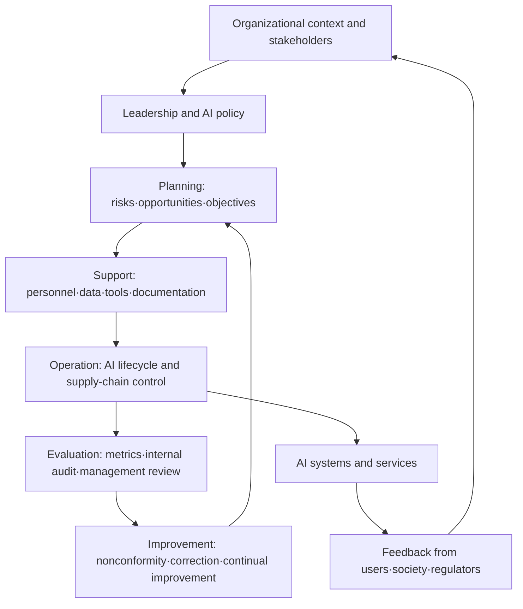
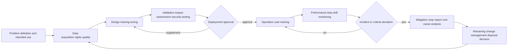

# ISO/IEC 42001:2023 Artificial Intelligence Management System (AIMS)

## 1. Overview

> **ISO/IEC 42001** is an international standard that requires an organization to establish, implement, maintain, and continually improve an Artificial Intelligence Management System (AIMS) in order to responsibly develop, provide, and use artificial intelligence systems.

As generative AI and machine learning have been incorporated into organizational decision-making—customer screening, medical assistance, manufacturing quality inspection, public services, and so on—model accuracy alone has become insufficient to explain the quality of a system. For the same model, the actual risk and social impact differ depending on which data was used, who approved its use, and whether it can be stopped when an error occurs. Therefore, a system that manages the technical performance of AI together with the organization's responsibility, procedures, and oversight is needed.

ISO/IEC 42001:2023 is a management-system standard that responds to this need. Rather than a standard that sets the performance criteria of a specific algorithm or product, its core is that it is a higher-level governance system that identifies AI-related risks and opportunities in the organization's context and connects policies, objectives, processes, and evidence. An organization must manage the entire AI lifecycle, including not only developers but also the procurement department, business users, and legal/privacy/security personnel.

According to ISO's official description, this standard targets organizations that develop, provide, or use AI-based products or services, and it can be applied regardless of industry sector or organization size. The standard is the 1st edition, published in December 2023, and is handled by ISO/IEC JTC 1/SC 42. Thus not only the in-house models of large enterprises but also the business processes of small and medium enterprises that call external APIs can be within its scope.

## 2. Background and Necessity

### 2.1 The Organizational Nature of AI Risk

In traditional software, requirements and code are relatively directly connected, but in learning-based AI, the data distribution and training process affect the results. If data changes during operation, accuracy can degrade, and even if average accuracy is high, errors can be concentrated on a specific group in a disadvantageous way. This problem does not end with defect fixing at the testing stage and requires post-deployment monitoring and a retraining policy.

Also, AI risk is not isolated in a single department. The lawfulness of data collection is a privacy and legal matter, model explainability is a planning/UX matter, and change notification of a supplier's model is a procurement and contract matter. Even if an operator did not build the model themselves, they can disadvantage a customer by using the results. AIMS binds this dispersed responsibility with the organization's policies, roles, and decision records.

### 2.2 Why Standardization Is Needed

First, one must be able to grasp the current status of AI use. If an organization does not know which models and data are used in which department, there is no starting point for risk assessment or incident response. Second, the criteria for responsible use must be connected to business objectives. Merely declaring the principles of fairness, transparency, and safety does not create approval criteria and measurement metrics.

Third, the supply chain and third-party models must be controlled. When using an external LLM or cloud AI, it is hard to fully verify the model internals, but the range of prohibited data input, log retention, change notification, incident reporting, and sub-entrustment conditions can be managed through contracts and operating procedures. Fourth, audit and improvement must be possible. More important than the fact that a policy was made is the evidence that risk was actually assessed and corrective actions completed.

## 3. The Concept and Overall Structure of AIMS

### 3.1 AIMS as a Management System

AIMS is not a separate security product that wraps a single AI model. It is a management system that sets AI-related policies and objectives considering the organization's purpose and stakeholders, and operates the processes to achieve those objectives. Therefore, while technical documents such as model cards and datasheets are important, management elements such as approving authorities, risk-acceptance criteria, internal audits, and management reviews are equally important.

In the following structure, the outermost organizational context determines the scope of application and the risk-acceptance level. Within it, leadership grants policies and roles, and the planning stage sets risks/opportunities and objectives. The implementation stage performs data/model/operation controls, and the check stage confirms results with metrics and audits.

### 3.2 PDCA and Accountability

ISO/IEC 42001, like other management-system standards, uses the Plan-Do-Check-Act cycle. In Plan, it sets AI's purpose, stakeholders, risk sources, opportunities, objectives, and treatment plan. Here the organization must decide not only what to automate but also what not to automate.

In Do, it converts policy into actual processes. Data acquisition and quality management, model development and validation, deployment approval, user training, incident handling, and external-supplier management are included here. In Check, it confirms not only model performance but also fairness, explainability, safety, privacy, security, complaints, and incident trends at set intervals.

In Act, it analyzes the causes of nonconformities and performs corrective actions. Finding root causes—such as data bias, missing approval procedures, or absence of monitoring metrics—is more important than simply retraining the problematic model. Improvement results are again reflected in risk assessment and objectives, becoming the criteria for the next cycle.

### 3.3 Key Stakeholders and Roles

Top management approves the AI policy and resources and decides the organization's risk-acceptance level. The AI system owner is responsible for the business purpose, scope of use, stopping criteria, and performance targets. The data steward manages the source, usage rights, quality, representativeness, and retention period of data.

The model developer documents the training/validation methods, hyperparameters, limitations, and reproduction procedures. The security/privacy officer reviews attack, leakage, out-of-purpose use, and re-identification risks. The business user complies with the intended and prohibited uses and reports anomalous results. The internal auditor is not someone who evaluates development performance but someone who independently confirms whether the AIMS is operated as required.

Concentrating these roles in a single title can create a conflict of interest. If the team that developed a model approves its own model and declares its performance, there is an incentive to downplay risk. A small organization may have one person hold multiple roles, but it is desirable to document the principle of separating approval, validation, operation, and audit, and to designate an alternate reviewer.

## 4. ISO/IEC 42001 Requirements and Controls

### 4.1 The Flow of Clauses 4–10

The main body of ISO/IEC 42001 follows the management-system flow of organizational context, leadership, planning, support, operation, performance evaluation, and improvement. Clause 4 grasps the organization's internal/external situation and stakeholders' requirements and sets the AIMS scope of application. For example, one must clarify whether to target only a customer-consultation LLM or enterprise-wide AI use including data centers and external APIs.

Clause 5 sets top management's responsibility, the AI policy, and roles and authorities. The AI policy must not stay at an abstract ethical declaration but must include risk reporting, human oversight, use approval, legal compliance, and continual improvement. Clause 6 assesses risks and opportunities and establishes AI objectives and a change plan.

Clause 7 addresses resources, competence, awareness, communication, and documented information. An organization that purchases a model must also arrange user competence and data-input training. Clause 8 addresses AI risk treatment and lifecycle operation, expanding the scope not only to development but also to deployment, use, monitoring, and disposal.

Clause 9's performance evaluation consists of operational metrics, internal audit, and management review. Clause 10 requires nonconformity and corrective action and continual improvement. This structure differs from the approach of producing a one-off AI impact assessment report; it is the approach of building a repeatable operating system.

| Category | Key question | Representative deliverable |
|---|---|---|
| Organizational context | Which AI is managed in what scope | Scope of application, stakeholder list |
| Leadership | Who approves policy and responsibility | AI policy, RACI, committee minutes |
| Planning | Which risks to treat and to what level | Risk assessment, objectives, treatment plan |
| Support | Are the needed competence, resources, and documents ready | Training records, resource list, document control register |
| Operation | How to control the lifecycle and external suppliers | Model cards, validation reports, deployment approval |
| Performance evaluation | Do the objectives and controls actually work | KPIs, internal audit, management review |
| Improvement | Have errors and nonconformities been kept from recurring | Incident records, root cause, corrective action |

### 4.2 Use of Annex A and Annex B

Annex A provides reference control objectives and controls for addressing AI-related risks and organizational objectives. Based on its scope of application and risk assessment, an organization can select the needed controls and manage them in the form of a Statement of Applicability (SoA) explaining the reasons for selection/exclusion and the implementation status. The purpose is not for every organization to mechanically apply the same controls.

The control areas can be understood as AI policy, internal organization, AI system resources, impact assessment, AI lifecycle, data for AI, stakeholder information, AI use, and third-party and customer relationships. Looking at these areas reveals that the standard does not address model accuracy alone but manages the organization, data, users, and suppliers as well.

Annex B is used as guidance for control implementation. Even for the same control, the documentation and validation depth of a recruitment-screening AI and a factory-equipment anomaly-detection AI can differ. High-risk areas need stricter human review and independent validation, while a low-impact internal productivity tool can apply proportionate controls.

Annex C provides examples that can be considered when identifying organizational objectives and risk sources, and is not a list that applies to every organization as-is. Annex D provides supplementary information for understanding the standard's application context. Therefore, one must prioritize the main-body requirements, risk assessment, and the organization's legal obligations, and must not use the annex lists only as checklists.

### 4.3 AI Impact Assessment and Risk Treatment

AI risk assessment is not a simple probability-multiplication table. First, define the system's intended purpose and prohibited purposes, and identify the affected individuals, groups, organizations, society, and stakeholders. Then review the likelihood and consequences of bias, inaccuracy, insufficient explanation, privacy infringement, security attacks, safety failure, over-reliance, and environmental/social impact.

Impact assessment is connected to risk assessment but is better not lumped into the same document. Risk assessment focuses on the likelihood and consequences of events the organization must control, while impact assessment examines the changes that an AI's decision or output brings to people and society. For example, a credit-scoring model's misclassification is both a system risk and a social impact that affects a specific group's access to finance.

Risk-treatment options can be divided into avoidance, reduction, transfer/sharing, and acceptance. If a risk exceeds the acceptance level, one avoids it by stopping use or requiring human approval, and reduces it by improving training data, adjusting thresholds, and monitoring. Some responsibility can be distributed through external-supplier contracts, but a contract alone does not make the organization's final responsibility disappear.

### 4.4 The AI Lifecycle and Evidence

In the problem-definition stage, clarify the purpose of automation and the subject of decision-making. In the data stage, record the source, consent/usage rights, representativeness, label quality, missing values and outliers, and retention/disposal. In the training stage, connect code, model, and dataset versions so results can be reproduced.

In the validation stage, test not only the overall average performance but also errors by important subgroup, threshold changes, adversarial input, prompt injection, privacy exposure, and the adequacy of explanations. Deployment approval includes the model version, approver, scope of application, rollback procedure, and human-intervention conditions. During operation, one must monitor data drift and concept drift distinctly.

When an incident occurs, preserving the chronological event log and the input, output, and model version comes before deleting the results. Then judge the affected subjects and the need to report to regulators/customers, and manage temporary blocking and recurrence-prevention measures separately. At disposal, one must confirm not only the model but also caches, embeddings, derived data, access rights, and contractual retention obligations.

| Lifecycle stage | Main risks | Control and evidence examples |
|---|---|---|
| Planning | Unclear purpose, excessive automation | Use-case specification, prohibited uses, list of affected groups |
| Data | Bias, illegal collection, quality degradation | Datasheet, source/rights, quality metrics, representativeness analysis |
| Development | Non-reproducibility, vulnerable model, overfitting | Experiment tracking, code/model version, security test report |
| Validation | Subgroup errors, insufficient explanation | Fairness/performance validation, independent review, approval records |
| Deployment | Over-trust, configuration errors | Change management, rollback test, user training |
| Operation | Drift, information leakage, misuse | Monitoring dashboard, access logs, incident playbook |
| Disposal | Residual data and rights | Retention/deletion evidence, key destruction, supplier termination confirmation |

## 5. Comparison with Similar Frameworks

ISO/IEC 42001 focuses on demonstrating that an organization operates an auditable management system. NIST AI RMF is a risk management framework that guides voluntary management of AI trustworthiness risk, and ISO/IEC 23894 is guidance on AI-related risk management. ISO/IEC 27001 is an information security management system, so it is strong for the security of the information and infrastructure that AI processes, but it does not directly replace AI's intended use, impact assessment, or the entire model lifecycle.

If, unaware of this difference, one judges that AI governance is complete with ISO 27001 certification alone, risks such as model bias and inappropriate automation remain. Conversely, building AIMS as a separate island increases documents duplicating security, privacy, and quality management. An integrated design that connects the existing ISMS, personal-information impact assessment, and software development lifecycle with a common risk register is efficient.

| Criterion | Nature | Central question | Mode of use |
|---|---|---|---|
| ISO/IEC 42001 | AI management system standard | Does the organization have a system to responsibly manage AI | Policy·risk·operation·audit·improvement, certifiable |
| NIST AI RMF | Voluntary risk management framework | How to govern·identify·measure·manage AI risk | Complements risk-management activities and practical guidance |
| ISO/IEC 23894 | AI risk management guidance | How to identify·treat AI-specific risks | Reference for risk-assessment methods and control design |
| ISO/IEC 27001 | Information security management system | How to protect the confidentiality·integrity·availability of information | Complements AI data·infrastructure·access control |
| Personal-information impact assessment | Personal-information protection procedure | How to reduce rights infringement due to personal-information processing | Reviews the legal·rights impact of personal-information-processing AI |

Mapping activities such as NIST AI RMF's Govern, Map, Measure, and Manage onto AIMS's risk assessment, operation, and performance evaluation makes it easy for practitioners to understand. However, rather than copying a framework's terminology as-is, one must set responsible persons and evidence to fit the organization's AI inventory and risk-acceptance criteria. The relationship among standards should be understood not as superiority but as a difference in purpose and depth of application.

## 6. Application Cases

### 6.1 Financial-Sector Credit-Scoring Assistance Model

Suppose a bank introduces a model that assists a loan reviewer's judgment. First, define the intended use as providing reference material for the reviewer, and set a business rule so the model cannot approve or reject on its own. The scope of application includes training data, the model API, the review screen, external data suppliers, and the customer-objection procedure.

The data steward records the source and usage rights of income, transaction, and alternative information, and confirms that a specific region or age group is not underrepresented. The validation team evaluates not only overall AUC but also the false-positive/false-negative ratios by group and the impact of threshold changes. The reviewer looks at the basis and limitations of the recommended result before making the final decision, and provides an objection and re-review path.

In the operation stage, it monitors sudden changes in the approval rate, subgroup errors, changes in the input distribution, and increases in complaints. If the threshold or the data supplier changes, it goes through re-validation and re-approval. The core of this case is not satisfying a single fairness metric but proving the connection of purpose, human oversight, explanation, objection, and change management.

### 6.2 Generative AI Customer-Consultation Service

When a call center generates consultation drafts with an external LLM API, it first confirms whether the consultant's name, resident registration number, and contract information are passed to the model provider. It manages input masking and retention periods, whether training reuse is prohibited, storage location by region, and alternative procedures on failure through contracts and technical configuration.

Limit the intended use to consultant support, and ensure that high-risk answers—such as legal judgments, refund confirmation, and medical advice—are not automatically sent. If retrieval augmentation is applied, confirm the version and rights of the source documents, and design the screen so that the consultant can easily detect when the model generates an answer without a source.

Operational metrics include not only the average handling time but also the wrong-answer rate, the source-link omission rate, the personal-information-inclusion rate, the consultant-correction rate, and the number of customer complaints and incidents. Regularly perform tests for prompt injection, malicious documents, sensitive-information reproduction, and system-prompt exposure. This case shows that an organization that purchases and uses AI also becomes a subject of AIMS.

## 7. Construction Roadmap and Audit Response

The first step is an enterprise-wide AI inventory. Survey models under development, operating models, SaaS features, external LLMs used by individuals, and data pipelines, and connect owners and business purposes. Since undiscovered shadow AI is left out of risk assessment, cross-verify network lists, purchase records, cost billing, and surveys.

The second step is to set the scope of application and risk grades. Assign risk grades considering the impact on people's rights, safety, finance, and employment, the level of automation, data sensitivity, and supplier dependence. The higher the grade, the more independent validation, human approval, shorter monitoring intervals, and stronger incident response are applied.

The third step is integration with the existing management system. Reuse ISMS's access control/incident response, the personal-information-protection system's processing purpose/retention period, quality management's nonconformity/corrective action, and DevOps's deployment/change records as AIMS evidence. Rather than creating duplicate forms, map one system ID and model version to multiple management purposes.

The fourth step is a pilot with key high-risk cases. Rather than applying the policy enterprise-wide at once, perform the impact assessment, datasheet, validation, approval, monitoring, and incident drill of a representative model all the way through. After confirming role conflicts and missing metrics in the pilot results, broaden the scope of application.

The fifth step is internal audit and management review. The auditor confirms not only whether documents exist but also whether the version of a sample model matches the operation logs, whether stopping is actually possible in an incident, and whether measures are completed when objectives fall short. In the management review, do not report model accuracy alone but address risk trends, regulatory changes, supplier changes, residual risk, and resource shortages together.

| Stage | Main activity | Passing criterion |
|---|---|---|
| 1. Survey | Identify AI inventory and owners | Even unauthorized use is listed |
| 2. Design | Establish scope·policy·roles·risk criteria | Responsible persons and decision authority are clear |
| 3. Pilot | Full-lifecycle control of a representative AI | Evidence and operation logs are connected |
| 4. Rollout | Apply templates·training·supply chain | Interdepartmental variance and shadow AI are reduced |
| 5. Verification | Internal audit·management review·mock incident | Nonconformity correction and recurrence prevention confirmed |
| 6. Improvement | Redesign metrics·adjust scope·reassess | Risk changes are reflected in the next plan |

Audit evidence is not sufficient with a single policy document. One must interconnect the AI list, scope of application, stakeholder requirements, risk assessment, impact assessment, SoA, data sources, model cards, validation reports, deployment approvals, training records, monitoring results, and incident/corrective-action and management-review minutes. When an auditor picks a particular model, one must be able to trace it from planning to operation.

## 8. Deeper Dive: Latest Trends and Exam Linkage

The ISO official page describes ISO/IEC 42001 as an AI management system standard, guiding management of AI-related risks and opportunities at the organizational level and continual improvement via PDCA. This shows the flow of shifting from the level of declaring AI ethics principles to a management system of objectives, processes, performance evaluation, and improvement.

NIST AI RMF 1.0 is a voluntary framework released in January 2023, and in July 2024 a generative-AI-specific profile was released. Therefore, in an answer, distinguishing ISO/IEC 42001 from a certifiable management-system perspective and NIST AI RMF from a risk-management practical perspective raises the accuracy of comparison.

In past-exam-type questions, it may be combined with 'measures to build AI governance,' 'organizational management of trustworthy AI,' and 'risk management when introducing generative AI.' Rather than writing only the definition and background and then enumerating principles, an answer is more persuasive if developed in the order of ① organizational context and scope, ② policy and roles, ③ risk and impact assessment, ④ lifecycle/data/supply-chain control, ⑤ performance evaluation and improvement, and ⑥ an integrated roadmap from the professional engineer's perspective.

In particular, to the question 'Does raising an AI system's accuracy make it responsible AI,' one must answer no. Accuracy is one of the necessary metrics, but a balance of fairness, explainability, safety, privacy, security, human oversight, objection, and traceability is needed. One must also present that metrics and controls are selected according to risk-based proportionality and that the same threshold is not forced on every organization.

## 9. Considerations and Implications

### 9.1 Risk-Based Proportionality

Imposing the same review and documentation burden on all AI leads the business side to bypass controls or delays innovation. Conversely, treating a high-impact system the same way as a simple productivity tool cannot protect rights and safety. One must differentiate control intensity based on the level of automation, the affected subjects, the degree of reversibility, data sensitivity, and supplier dependence.

### 9.2 Responsible Human Oversight

The mere fact that a human is watching a screen does not constitute human oversight. The overseer must understand the model's limitations and uncertainty and have the authority and time to reject, correct, or stop the results. If the workload is so heavy that all recommendations are automatically approved, it is merely formal oversight, so the actual intervention rate and re-review results must be managed as metrics.

### 9.3 Traceability of Data and Models

If the dataset version, labeling criteria, code, model, prompts, external API version, and deployment configuration are not connected, one cannot explain the cause of an incident. Integrate the model registry and data catalog and operate reproducible experiment tracking and change-approval procedures. However, since retaining all source data indefinitely is a new risk of privacy and cost, design the retention purpose and period together.

### 9.4 Supply Chain and Contracts

When using an external model, the contract must specify whether data is reused for training, storage location, retention period, sub-processors, security-incident notification, model-change notification, and service termination and data return/deletion. A supplier's certificate alone does not resolve the risk regarding the organization's use context. One must separately verify whether the organization can control the actual input, output, and user rights.

### 9.5 Integration of Security, Privacy, and Safety

Prompt injection and data leakage are security problems and, at the same time, problems of the AI system's reliability and business safety. Place personal-information minimization, access control, encryption, output filters, sandboxes, and model/data integrity verification into the lifecycle and connect them with the incident-response system. Safety-critical fields such as medicine, manufacturing, and transportation must include not only information-protection incidents but also erroneous control and physical harm in their scenarios.

### 9.6 Balance of Performance Metrics

If only handling time and cost savings are set as KPIs, the business side may optimize toward quickly using inaccurate outputs. Quality, fairness, complaints, incidents, re-review, drift, and energy use must be measured together with business performance. When metrics conflict, having management decide and record in advance which risk to prioritize raises the effectiveness of AIMS.

### 9.7 Continual Improvement and Organizational Culture

AI's risks change with changes in data and business context. Do not treat the certification-acquisition date or the initial deployment date as the endpoint of control; reflect periodic reassessment, incident learning, user feedback, and regulatory monitoring in the plan. Only when there is a culture that protects, without disadvantage, employees or customers who report concerns will anomalous signs be detected early.

## References

- ISO, "ISO/IEC 42001:2023 — AI management systems", https://www.iso.org/standard/42001
- NIST, "AI Risk Management Framework", https://www.nist.gov/itl/ai-risk-management-framework
- ISO, "ISO/IEC 23894:2023 — Guidance on risk management", https://www.iso.org/standard/77304.html

---

> **In one line**: ISO/IEC 42001 is not a standard that evaluates only the performance of the AI model itself but a management system that connects organizational context, policy, risk, impact, lifecycle, supply chain, and performance evaluation via PDCA to continuously operate responsible AI.
