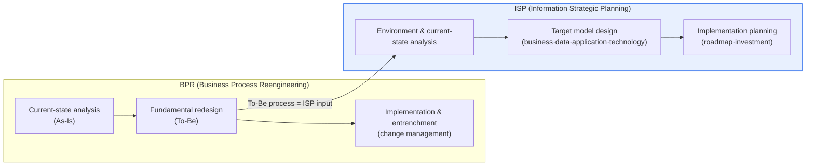
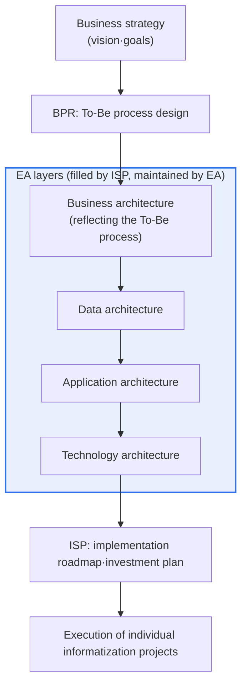

# Comparison of ISP and BPR and Their Complementary Use

## 1. Overview

### A. Definition
> **ISP (Information Strategic Planning)** is the activity of establishing an organization's informatization goals, tasks, and implementation plans in alignment with its business strategy, whereas **BPR (Business Process Reengineering)** is a management innovation technique that fundamentally redesigns business processes to pursue dramatic improvements in cost, quality, service, and speed.

The key to properly understanding these two techniques lies in the fact that '**their starting points and targets differ**.' BPR is a concept advocated by Michael Hammer and James Champy in the early 1990s, and it starts from a business perspective: "**how do we fundamentally innovate the way we work (our processes)?**" Its core theme is not 'incremental improvement' but 'fundamental rethinking from a blank slate.' Rather than merely making existing procedures somewhat faster, it asks from square one, "Can we eliminate this work entirely? Can we do it in an entirely new way?"

ISP, on the other hand, starts from an informatization perspective — "**how do we build and operate the information systems that will support that work?**" — and draws up an organization-wide informatization blueprint (master plan). It translates the business strategy into an informatization strategy and derives the business, data, application, and technology architectures and implementation roadmap required for it. Therefore, in logical sequence, it is natural to first redesign the future process (To-Be) with BPR and then establish the informatization plan that supports it with ISP. If the order is reversed and only informatization is pursued while leaving old processes untouched, it amounts to no more than the so-called '**paving the cow paths**' (computerizing old work), which halves the return on investment.

### B. Background and Necessity
Examining the historical context in which the two techniques were born makes their characteristics clearer. BPR was born in the early 1990s out of a sense of crisis that incremental improvement alone (such as TQM) would make survival difficult amid globalization and intensifying competition, whereas ISP took hold as a response to a reality in which individual systems proliferated in disarray and waste grew even as informatization investment exploded. The former responded to a 'crisis of work,' the latter to the 'disorder of informatization.'

There is a background to why BPR and ISP, though they emerged separately, inevitably came to be linked. In the 1990s, companies experienced a '**productivity paradox**' in which productivity failed to rise despite enormous investment in information technology. Much of the cause lay in the fact that while the technology introduced was new, the business procedures the technology was supposed to support remained decades-old and untouched. BPR answered this problem: "Before introducing technology, fundamentally change the process first."

Meanwhile, as informatization investment grew, the limits of building individual systems in a scattered manner became apparent. Systems built separately by each department failed to interconnect, and the silo problem of duplicated and inconsistent data intensified. ISP answered: "Before building individual systems, draw an enterprise-wide informatization blueprint first." Ultimately, the two techniques solve different problems — 'fundamental innovation of work' and 'enterprise-wide alignment of informatization,' respectively — but because actual projects must design future work together with the information systems that will support it, their linkage becomes essential.

### C. Difference in the Nature of the Two Techniques
In short, BPR addresses '**what and how we will work (the work itself)**,' while ISP addresses '**what we will support that work with (the information system)**.' If BPR's deliverable is an improved work flow (the To-Be process), ISP's deliverable is an informatization master plan and architecture. This difference in nature creates all the subsequent differences in procedure, scope, and outcomes.

Put differently, BPR's center of gravity is on '**change (innovation)**,' while ISP's is on '**alignment (design)**.' This difference in emphasis makes the two techniques complementary rather than conflicting. The ideal is a virtuous cycle in which information systems support innovated work, and aligned information systems in turn make work innovation sustainable.

## 2. Comparison of Execution Procedures

Let us first survey the flow of the two techniques and their points of contact. The following is an overall structural diagram that places the BPR and ISP procedures side by side and expresses the connection whereby BPR's output feeds into ISP as input.

BPR analyzes the current process to diagnose bottlenecks and waste, designs an ideal future process from the perspective of customer value, and then entrenches it in the organization. The key here is not to be bound by the As-Is. If the current state is analyzed in excessive detail, one is easily trapped within that frame and stays at 'improvement,' so BPR uses the As-Is only as the minimum needed for problem diagnosis and places its weight on To-Be design.

ISP analyzes the business strategy and the internal and external environment (market and technology trends, the level of the current information systems) to design an informatization target model and creates a phased implementation roadmap and investment plan. Both techniques share the broad framework of 'As-Is analysis → To-Be design → implementation,' but the decisive difference is that BPR's To-Be is a 'work flow,' whereas ISP's To-Be is an 'information system structure (architecture).' Because of this difference, BPR's To-Be becomes a natural input to ISP.

Here, the point that 'the depth of As-Is analysis' must be handled differently in the two techniques is a subtle point in practice. The longer BPR dwells on the As-Is, the more its thinking is trapped in the existing frame, making radical redesign difficult, so it restrains current-state analysis to the minimum needed for problem diagnosis. ISP, by contrast, must grasp the state of current information systems and data in relatively fine detail to compute an accurate implementation roadmap and investment scale, so the weight of As-Is analysis is comparatively large. Even for the same 'As-Is analysis,' there is a difference in nature: in BPR it is 'analysis to break away,' while in ISP it is 'analysis to carry forward.'

| Category | ISP | BPR |
|---|---|---|
| **Focus** | Informatization strategy & system blueprint | Fundamental innovation of business processes |
| **Perspective** | IT & information systems perspective | Business & customer-value perspective |
| **Scope** | Enterprise-wide information systems | Business, organization, and job roles overall |
| **Procedure** | Environment analysis → target model → implementation plan | Current-state analysis → fundamental redesign → implementation |
| **Key deliverables** | Informatization master plan, architecture, roadmap | Improved To-Be process, organizational design |
| **Nature** | Planning-centered (alignment, design) | Fundamental-innovation-centered (disruptive redesign) |
| **Improvement magnitude** | Systematic, incremental alignment | Aims at dramatic improvement |

## 3. Components and Core Principles of Each Technique

### A. BPR's Core Principles and Techniques
Understanding BPR through tables alone blurs its distinction from 'process improvement.' BPR's identity lies in four keywords — **fundamental, radical, dramatic, and process**. 'Fundamental' means questioning rules and assumptions taken for granted; 'radical' means not tinkering with the surface but redesigning from the roots; 'dramatic' means aiming for a several-fold improvement in performance rather than 10–20%; and 'process' means viewing the unit of analysis as the flow of work that creates customer value, rather than departments or functions.

As practical techniques, one integrates procedures that had been split into multiple steps into one, changes sequential processing into parallel processing, delegates decision-making authority to frontline workers (empowerment) to reduce approval steps, and uses information technology to eliminate physical movement and intermediation. For example, a process in which order-production-delivery had been disconnected by department and took several days is redesigned into a single integrated process with a case manager, drastically shortening processing time.

The typical way BPR fails is when, while professing 'innovation,' one is in fact unable to touch the existing organization and authority and only tweaks procedures slightly. Because fundamental redesign inevitably accompanies changes in the organization, jobs, and evaluation systems, top management's sponsorship and change management — which we will see later — determine success or failure.

An important point here is that information technology functions not as a mere support tool but as an '**enabler**' of redesign. For example, shared databases break the assumption that 'information can exist in only one place,' allowing multiple departments to use the same information simultaneously, and communication and workflow technologies break the assumption that 'only an expert can handle it,' allowing ordinary workers to perform specialized tasks. Reimagining processes on the premise of the new possibilities that technology opens up is the essence of BPR, and it is precisely at this point that BPR naturally meshes with ISP and informatization.

### B. ISP's Deliverables and Architecture
ISP's deliverables are broadly organized into four layers of architecture. The **business architecture** defines the structure of the work the organization performs; the **data architecture** defines the information to be managed and its relationships; the **application architecture** defines the system functions that will support the work; and the **technology architecture** defines the infrastructure and standards that will run them. These four layers must be mutually consistent, with rationale flowing from the upper layers (business) to the lower layers (technology).

ISP's value lies in securing **enterprise-wide consistency** beyond individual system construction plans. It places requirements scattered across departments within an enterprise-wide target model and binds them into an implementation roadmap containing priorities, investments, and schedules, thereby determining 'what to build, when, and in what order.' These deliverables subsequently serve as the baseline for individual informatization projects.

Priority determination is an especially important deliverable of ISP. Because resources are finite, not all tasks can be pursued simultaneously; each informatization task must be evaluated along axes such as 'contribution to business (effect)' and 'ease of implementation and urgency' and placed into phases. In this process, the implementation order is determined by considering preceding and succeeding dependencies (e.g., data standardization must precede integrated analysis to be possible). If priorities are set without basis, the tasks of politically powerful departments come first, undermining enterprise-wide optimization, so establishing objective evaluation criteria is one of ISP's key success factors.

ISP is often combined with **EA (Enterprise Architecture)**. If ISP is a project-type activity that establishes an informatization plan at a specific point in time, EA is a standing system that continuously manages the business–information–application–technology layers. When the target model drawn up by ISP is maintained and updated by EA, the plan does not end up as a one-off document but becomes the organization's living tool for consistency management.

### C. Common Success and Failure Factors of the Two Techniques
Although BPR and ISP have different targets, because they are both large-scale change projects, their success and failure factors substantially overlap. The first common success factor is **alignment with business strategy**. Whether it is process redesign or an informatization plan, if the rationale is not derived from business goals, direction is lost. The second is **participation of the business side**. The people who actually do the work and use the information must participate deeply in the design for a realistic To-Be to emerge. The third is **clear performance indicators (KPIs)**; only when improvement before and after can be measured numerically in terms such as cost, time, and quality is the effect of innovation proven and the next investment justified.

The common failure factors are also clear. The most frequent is '**analysis paralysis**' — analyzing the As-Is in excessive detail and being unable to move on to To-Be design. The next is the '**disconnect between planning and execution**,' where an excellent document is produced but fails to lead to follow-up projects and organizational change. A representative case is when an ISP master plan remains a document in a drawer, or when a BPR redesign is blocked by organizational resistance and cannot be executed. These failure factors must be defended against through the change management and governance we will see later.

## 4. Approaches to Complementary Use

BPR and ISP are not competitors but need each other. The most effective approach is to **take the To-Be process derived by BPR as the input to ISP and align it into EA's layered structure**. The following is a detailed architecture diagram showing how the two techniques mesh atop the EA layers.

Following the flow, starting from the business strategy, BPR defines the future shape of the work; that To-Be process becomes the business architecture and is concretized into the data, application, and technology architectures; and finally it is organized into ISP's implementation roadmap and investment plan and executed as individual projects. In this way, informatization investment is aligned in a direction that supports actual work innovation, and the error of computerizing old work can be avoided.

The three representative linkage approaches can be summarized as follows. First, **sequential linkage (BPR → ISP)** is the orthodox approach that first innovates the process and reflects its requirements into the informatization plan. Second, **integrated execution (BPR/ISP in parallel)** is an approach that, when time constraints are severe or work and informatization are strongly intertwined, runs both activities simultaneously as a single project; mutual feedback is fast but management complexity is high. Third, **standing EA-based alignment** is an approach that continuously maintains consistency across layers beyond one-off projects.

A mistake commonly made when executing the linkage is to draw BPR's To-Be as pure idealism and only belatedly encounter implementation constraints in ISP. For example, if the process presupposes real-time integrated processing but the data and technology architectures cannot support it, the redesign will not work in reality. Therefore, a mature organization examines informatization feasibility together from the BPR stage and installs **bidirectional feedback** that feeds the technical constraints confirmed in the ISP stage back into process design. Even in sequential linkage, the orthodox practice is not a complete one-way flow but iterative adjustment at the points of contact.

| Approach | Content | Suitable situation |
|---|---|---|
| **BPR → ISP sequential linkage** | Reflect the To-Be process into ISP requirements and target model | When process innovation clearly precedes |
| **Integrated BPR/ISP execution** | Advance process innovation and informatization planning simultaneously | When schedule pressure and the coupling of work and informatization are high |
| **EA-based alignment** | Continuously maintain consistency across business–information–application–technology layers | When large-scale, continuous informatization governance is needed |

Whichever approach is chosen, the success of the linkage depends on the 'traceability of requirements.' One must be able to trace to the end how each To-Be process defined by BPR leads to which data, function, and system requirements, and how those are realized as which application/technology architecture items and implementation tasks in ISP. If traceability is broken, the informatization project drifts away from the original intent of work innovation as it proceeds, easily reverting to the silos of 'technology apart, work apart.' EA's layer model and requirements matrix become practical tools that guarantee this traceability.

## 5. Comparison and Practical Cases

How the difference between the two techniques diverges in actual performance is confirmed by cases. Ford's redesign of its procurement-to-payment process, cited as a classic BPR case, is known to have fundamentally redesigned an invoice-matching-centered procedure into a database-based automatic matching method, drastically reducing the associated headcount (specific figures differ across sources, so it is safe to generalize it as a case that 'greatly reduced a workforce on the scale of several hundred people'). The key is the shift in thinking to 'invoiceless processing'; it was the elimination of the procedure itself, not the shortening of the procedure, that produced the dramatic result.

Conversely, the pattern in which a project that pushes informatization ahead without process innovation fails is also common. Many enterprise resource planning (ERP) implementation failures fall into this category. When introducing an ERP embodying standard processes while transplanting the existing inefficient business procedures as-is through customization, cost balloons and effect diminishes. In this case, organizations that used BPR to standardize and simplify their work and ISP to align the system blueprint before ERP implementation achieve far higher performance. That is, the fork between success and failure lies not at 'the moment of technology introduction' but in 'whether the process was changed first.'

A principle frequently cited in ERP implementation is '**adopting Best Practices**.' This means accepting as-is, to the greatest extent possible, the proven standard processes already embedded in the package, and changing the organization's work to fit them. This principle is itself in effect a form of BPR, and to minimize customization, BPR that redesigns work to fit the standard and ISP that defines the system scope must precede implementation. Conversely, if the package is excessively modified to preserve the organization's old procedures, maintenance costs snowball and future version upgrades also become difficult. This too empirically demonstrates the principle that 'process innovation must precede informatization.'

This is precisely why, in the public sector as well, ISP is mandated or recommended before informatization projects. The larger the budget invested, the more one must first finalize the enterprise-wide target model and implementation roadmap before building individual systems, in order to prevent duplicate investment and linkage failure.

What these cases commonly imply is the principle that 'information technology is a means, not an end.' In the Ford case, what produced the result was not the latest technology itself but the idea of scrapping the old rule of 'invoice matching,' and in the ERP failure cases, what caused the problem was not a lack of technology but the inertia of transplanting old processes as-is. That is, only when BPR asks 'what to eliminate,' ISP determines 'what to support it with,' and they are executed in that order does investment connect to performance. Conversely, if this order is skipped, the productivity paradox recurs, in which technology investment grows but performance does not follow.

## 6. Deep Dive: Changes in the DX Era and Anticipated Exam Directions

Recently, the two techniques have been evolving in combination with digital transformation (DX) strategy. If BPR was in the past centered on internal efficiency (cost, speed), today's process innovation targets **customer experience (CX), data-driven decision-making, and platformization** together. Process automation, too, is expanding in a direction that goes beyond people changing procedures to automating even judgment with RPA (Robotic Process Automation) and artificial intelligence. Accordingly, **process mining** techniques that discover and analyze processes have recently greatly increased the precision of As-Is diagnosis, underpinning the scientific rigor of BPR.

ISP, too, is expanding beyond the traditional 'five-year informatization plan' form into **digital strategy formulation (ISP/DX)** premised on the cloud, data, and artificial intelligence, and is trending toward integration with EA and cloud adoption strategy. The planning cycle is also shifting from long, heavy documents to an agile roadmap that is repeatedly updated. In the cloud era, the sourcing strategy of 'what to build in-house and what to use as a service' has emerged as a core ISP decision, and as data becomes a strategic asset, the weight of data architecture and governance has also grown.

From an exam perspective, questions repeatedly take the form of asking about ① the **comparison of the concepts, procedures, and deliverables** of ISP and BPR, ② the **complementary (linkage) approaches** and the rationale for their order, and ③ the **linkage** with EA and DX. In an answer, going beyond a simple enumeration of items to explain even 'why BPR must precede ISP' and 'what the trade-offs are between integrated and sequential execution' creates differentiation. Related and similar topics include EA/TOGAF, ERP, digital transformation, process mining, and change management.

In terms of answer-composition strategy, an effective flow is to clearly contrast the difference in perspective between the two techniques (work vs. information system) in the overview, place the procedure/deliverable comparison table and the linkage architecture conceptual diagram in the middle of the body, and then describe 'the rationale for the precedence order' and 'trade-offs' in the latter part. In particular, presenting the outlook of integration with DX and EA in the conclusion can demonstrate both currency and insight.

## 7. Considerations and Implications

1. **The principle that process innovation precedes informatization**: To keep informatization from cementing old work, one must first define the future process with BPR and then draw the information-system blueprint with ISP to maximize the return on investment. Failing to keep this order leads to the typical failure of 'computerizing old work.'
2. **Top management sponsorship and change management**: BPR entails fundamental changes to the organization, authority, and jobs, so resistance is great. Without strong top-down sponsorship and systematic change management (communication, education, and overhaul of the evaluation system), the redesign remains only on paper. ISP, too, requires adjustment of enterprise-wide priorities, so governance support is necessary.
3. **Choosing the linkage approach based on trade-offs**: Sequential linkage is stable but takes time, while integrated execution is fast but carries high management complexity and risk. The approach must be chosen by considering the organization's urgency, maturity, and the coupling of work and informatization.
4. **Continuous consistency management through EA**: Rather than ending ISP/BPR as one-off projects, one must continuously maintain the consistency of the business–information–application–technology layers with EA so that plans stay alive as the environment changes. A one-off master plan begins to grow stale from the moment it is established.
5. **Outlook on combination with DX, data, and AI**: Going forward, process innovation will expand in a direction that makes diagnosis scientific with process mining, automates even judgment with RPA and artificial intelligence, and encompasses customer experience and platform strategy. A professional engineer must be able to design ISP/BPR not as individual techniques but as integrated components of digital transformation strategy.
6. **Performance measurement and a continuous-improvement system**: Innovation does not end with a single project. One must have a management system that measures the effect before and after redesign with indicators such as cost, processing time, error rate, and customer satisfaction to prove the effect, and feeds those results back into the next improvement cycle. Innovation without measurement cannot prove its performance and loses the momentum for follow-up investment.

## References

- M. Hammer, "Reengineering Work: Don't Automate, Obliterate," Harvard Business Review, 1990 — https://hbr.org/1990/07/reengineering-work-dont-automate-obliterate
- The Open Group, TOGAF Standard (Enterprise Architecture) — https://www.opengroup.org/togaf

---

> **In one line**: BPR *fundamentally redesigns business processes from a blank slate*, while ISP *establishes the enterprise-wide informatization strategy and architecture to support them*; complementary use — first deriving the To-Be process with BPR, taking it as ISP's input, and aligning the business–information–technology layers with EA — prevents 'computerizing old work' and maximizes the return on informatization investment.
