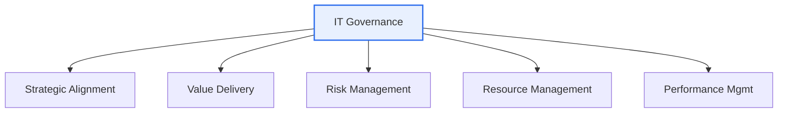

# IT Governance

## 1. Overview

### A. Definition
> A decision-making and accountability system in which the board of directors and management **Evaluate, Direct, and Monitor** IT resources and risks so that IT **aligns with the organization's strategy and goals** and creates value; COBIT and ISO/IEC 38500 are representative frameworks.

The core of IT governance lies in the **separation of governance (direction-setting and control) from management (execution)**. Governance is management determining and controlling "toward what IT should head," while management is actually building and operating the systems in line with that direction. Without this distinction, IT easily degenerates into a technical department that operates apart from the business.

### B. Background and Necessity
As the scale of IT investment grew and overall corporate activity came to depend on IT, the question "we spend money on IT, but does business value come out in proportion?" became a core management agenda. In the past, IT was hard to measure for performance and had ambiguous decision-making accountability, so investment failures, duplication, and security incidents were frequent. IT governance emerged to **align** IT investment with business strategy, manage risk and compliance, and secure **accountability and transparency** in IT decision-making. In particular, its importance grew further as regulatory compliance (internal control) and digital transformation overlapped.

## 2. Components (A)

IT governance consists of five interconnected areas. If **strategic alignment** is the starting point that aligns the direction IT will take with the business, **value delivery** is the result of realizing actual business value in that direction, and these two are underpinned by **risk management and resource management**. Finally, **performance measurement** quantifies results against goals and feeds them back into strategy, completing the cycle. If any one element is missing (e.g., the absence of performance measurement), governance remains a mere slogan.

| Component | Content | Core question |
|---|---|---|
| **Strategic alignment** | Alignment of IT strategy with business strategy | Is it the right direction? |
| **Value delivery** | Realization of the business value of IT investment | Is it worth it? |
| **Risk management** | Identification and control of IT risks, compliance | Is it safe? |
| **Resource management** | Optimization of IT resources such as personnel, infrastructure, and data | Is it efficient? |
| **Performance measurement** | Monitoring IT performance against goals | Are we doing well? |

## 3. Effectiveness Measurement Indicators (B)

Whether governance is working well must ultimately be confirmed with **quantitative indicators**. At this point, looking only at financial indicators misses IT's intangible value (capability, satisfaction), so the approach of measuring the four perspectives in a balanced way with the **Balanced Scorecard (BSC)** is widely used. The strategic objectives of each perspective are set as KGIs (goal indicators) and connected to and tracked via KPIs (performance indicators).

| Perspective (BSC) | Example indicators |
|---|---|
| **Financial** | IT ROI, TCO reduction rate, IT budget adherence rate |
| **Customer** | User satisfaction, SLA adherence rate |
| **Internal process** | System availability, mean time to recover (MTTR), project on-time delivery rate |
| **Learning & growth** | IT workforce capability, new-technology adoption rate |

> A KGI (goal indicator)–KPI (performance indicator) system connects strategic objectives to quantitative indicators. For example, the goal (KGI) of "improving customer response" is concretized into the KPI of "SLA adherence rate of 99%."

## 4. Effectiveness Measurement Methodologies (C)

To actually carry out measurement, standardized methodologies are needed. If BSC is the framework for "what to view in a balanced way," COBIT is a detailed framework that evaluates "how mature an IT process is," and ISO/IEC 38500 is the international standard that defines governance principles (EDM). These are not mutually exclusive and are used together.

| Methodology | Characteristics |
|---|---|
| **BSC** (Balanced Scorecard) | Balanced measurement of financial, customer, process, and learning-growth perspectives |
| **COBIT** | Framework for evaluating IT control and process maturity |
| **ISO/IEC 38500** | International standard for IT governance (EDM principles) |
| **Val IT / Risk IT** | Extension for IT investment-value and risk management (COBIT family) |
| **ITIL** | IT service management (operational performance) |
| **Benchmarking** | Performance comparison against industry peers |

COBIT evaluates the maturity of each IT process in stages (e.g., 0–5), revealing the gap between the "current level" and the "target level," so it is especially useful for setting improvement priorities.

## 5. Considerations and Implications
From a professional engineer's perspective, the success of IT governance depends not on "whether a framework is adopted" but on "how well it is tailored to the organization." First, transplanting COBIT/ISO 38500 wholesale does not fit the organization and becomes a formality, so one must selectively adopt only the necessary elements to fit the organization's size, maturity, and regulatory environment. Second, as COBIT 2019 made clear, one must **distinguish the roles of governance (direction, control) and management (execution)** to make accountability clear. Third, as ESG disclosure, digital transformation, and AI adoption expand, IT governance is broadening into **digital governance** that encompasses data, AI, and security, so it must be developed beyond technical control into a value-creation system for the entire organization.

---

> **In one line**: IT governance is a system that measures the five elements — *strategic alignment, value delivery, risk, resources, and performance* — with BSC, COBIT, ISO 38500, and the like to provide direction and control so that IT contributes to business value; tailoring to the organization's characteristics and the separation of governance from management are the keys to success.
