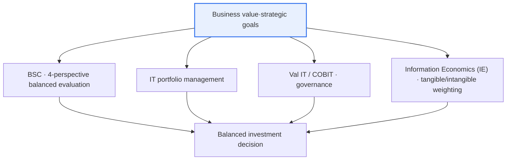

# IT Investment Analysis — Process, Frameworks, and Analytical Methodologies

## 1. Overview

### A. Definition
> **IT investment analysis** is a series of management activities that **quantitatively and qualitatively evaluate** how much an IT investment contributes to business value and strategic goals, set investment priorities within a limited budget, and manage and feed back performance after execution.

The fundamental reason IT investment analysis is needed lies in the structural characteristic that '**IT investment is large, but its effect is not easily visible**.' Companies spend a substantial percentage of their revenue on IT every year, but it is difficult to judge whether that investment actually increased revenue, reduced costs, or which among several candidates should be done first. The reason is that IT's effect largely includes intangible value (customer satisfaction, work efficiency, decision-making speed, strategic flexibility) that does not translate directly into financial performance. For example, the effect of introducing a new ERP is partly quantifiable, like 'improved inventory turnover,' but a considerable portion, like 'establishing a data-driven decision-making culture,' is not captured in numbers. For this reason, IT investment is often misunderstood as a 'cost center,' or conversely, is over-executed by chasing trends without basis.

IT investment analysis handles this difficulty with systematic processes, frameworks, and methodologies to allocate a limited budget where value is greatest, justify investment decisions to management and stakeholders, and verify performance after execution to reflect it in the next investment. That is, it is a management tool that answers "**how much, where, and why** to invest in IT, and **what the result is**." This is also a core area of IT governance that, beyond the feasibility review of individual projects, views the entire organization's IT investment as a single portfolio and manages risk and return in a balanced way.

### B. Necessity
IT investment is distinguished from other investments in that it is large in scale, difficult to reverse, and its success or failure determines the organization's competitiveness. A wrong large-system implementation produces not only sunk costs but also secondary losses of business paralysis and lost opportunity.

As IT budget constraints and the risk of investment failure grew, the need to decide and control investments based on evidence rather than 'gut feeling' increased. As it was repeatedly observed empirically that a considerable number of large-scale IT projects suffer from budget overruns, schedule delays, and shortfalls in expected effects, a system that objectively assesses feasibility before investment and verifies performance afterward became required. IT investment analysis satisfies this demand through (1) **rationalization of resource allocation** (prioritizing allocation where value is high), (2) **investment justification** (persuading management and shareholders), and (3) **securing performance accountability** (post-hoc verification and feedback). In particular, in today's world where IT has become the center of enterprise-wide strategy through digital transformation (DX), IT investment analysis serves as the compass of strategy execution.

## 2. The IT Investment Analysis Process

IT investment analysis is not a one-off review but a management process that cycles along the investment life cycle. In the first stage, **planning and candidate derivation**, one aligns business goals with the IT strategy and identifies investment candidates that will achieve those goals. Here, candidates emerge from diverse sources such as business-side needs, regulatory response, infrastructure replacement, and new-business support, and clearly connecting 'which business goal each candidate contributes to' becomes the baseline for subsequent evaluation. A candidate with a weak connection to goals is pushed down in priority no matter how technically attractive it is.

In the second stage, **analysis and evaluation**, one quantitatively and qualitatively assesses the cost, effect, and risk of each candidate. Cost is computed from a total cost of ownership (TCO) perspective that encompasses not only introduction costs but also operation and maintenance; effect is estimated together as financial benefits (cost reduction, revenue increase) and intangible benefits (satisfaction, flexibility); and risk is examined by scenario, reflecting technical, schedule, and market uncertainty. This stage is the heart of analysis, and the methodologies to be discussed later (NPV, ROI, AHP, etc.) are intensively mobilized here.

In the third stage, **prioritization and selection**, the evaluation results of individual candidates are synthesized from a portfolio perspective to decide the combination to execute within budget and personnel constraints. Even if individual projects are each feasible, the total may exceed the budget and risk limits, so one optimizes the combination by looking at both the risk-return balance and strategic contribution. Then, in the **execution and monitoring** stage, progress, budget, and quality are controlled, and in the final **post-hoc performance evaluation** stage, actual performance against goals is verified and its lessons are **fed back** into the next investment plan. This cycle of pre-, in-progress-, and post-execution evaluation is the core of investment management, and if the feedback loop is broken, the same failures repeat.

| Stage | Key activities | Deliverables |
|---|---|---|
| **Planning·candidate derivation** | Alignment of business goals, identification of investment candidates | Investment candidate list·alignment table |
| **Analysis·evaluation** | Quantitative/qualitative analysis of cost, effect, risk | Feasibility analysis document·evaluation scores |
| **Prioritization·selection** | Priority decisions from a portfolio perspective | Investment portfolio·budget proposal |
| **Execution·monitoring** | Control of progress, budget, quality | Progress reports·EVM indicators |
| **Post-hoc performance evaluation** | Verification of performance against goals·feedback | Performance evaluation report·improvement tasks |

## 3. The IT Investment Analysis Framework

A framework is a thinking structure that defines 'from what perspective to view an investment in a balanced way.' Looking only at financial performance easily misses strategic and intangible value, so a framework that forces a multifaceted perspective is needed.

The **BSC (Balanced Scorecard)** evaluates an investment from four perspectives: financial, customer, internal process, and learning-growth. For example, an investment in a collaboration platform may have a negligible short-term financial effect but hold great value from the 'learning-growth' and 'internal process' perspectives; BSC explicitly reveals such balance and corrects financial bias. **IT portfolio management** views not individual projects but the entire set of investments as a single portfolio and appropriately mixes high-risk, high-return (innovation) and low-risk, stable (maintenance) investments to optimize the risk-return of the entire organization. This applies financial portfolio theory to IT investment and follows the diversification principle of 'not betting everything on any one thing.'

The reason these two frameworks are complementary is that their perspectives differ. If BSC addresses 'what to measure' (the multifacetedness of performance), IT portfolio management addresses 'what to select' (optimization of the investment combination). In practice, one connects the two frameworks by evaluating each investment candidate across BSC's four perspectives to assign scores, then placing them on a portfolio matrix with those scores and their risk levels as coordinate axes, and preferentially selecting 'high-value, low-risk' investments.

**Val IT / COBIT** is an IT governance framework presented by ISACA, providing principles and processes that control the value creation, risk management, and resource management of IT investment at the organizational level. Val IT in particular focuses on value governance that continuously asks 'is the investment actually producing value (Are we getting the benefits?).' **Information Economics (IE)** is a technique that scores and ranks intangible effects (strategic fit, competitive response, organizational risk) that traditional cost-benefit analysis cannot capture, using weights; it is a representative attempt to reflect hard-to-quantify IT benefits in decision-making.

| Framework | Focus | Core idea |
|---|---|---|
| **BSC (Balanced Scorecard)** | Multifaceted performance | Balance of the four perspectives: financial, customer, process, learning-growth |
| **IT portfolio management** | Risk-return balance | View investments as a portfolio and diversify/optimize |
| **Val IT / COBIT** | Governance | Organizational control of IT investment value, risk, and resources |
| **Information Economics (IE)** | Intangible value | Score tangible and intangible effects with weights |

## 4. Analytical Methodologies (Quantitative·Qualitative·Risk)

Because the effect of IT investment is a mix of financial (quantitative) and intangible (qualitative), a method from any single family alone does not make for a complete evaluation. The orthodox practice in the field is a triple structure that rigorously assesses 'the part convertible to money' with quantitative techniques, complements it with 'the strategic value not convertible to money' using qualitative techniques, and reflects 'uncertainty' using risk techniques.

**Quantitative (financial) techniques** convert benefits and costs into monetary value to calculate investment feasibility. **NPV (Net Present Value)** is the sum of future cash flows discounted to present value; if it is greater than 0, the investment is considered worthwhile. It is the most theoretically robust indicator in that it reflects the time value of money. **IRR (Internal Rate of Return)** is the discount rate that makes NPV equal to 0; it shows the investment's rate of return as a percentage, making it good for direct comparison with the cost of capital. **ROI (Return on Investment)** is '(benefit − cost)/cost,' which is intuitive but has the limitation of not reflecting the time value. **TCO (Total Cost of Ownership)** encompasses the entire life-cycle cost — not only introduction costs but operation, education, maintenance, and disposal — preventing the error of judging by the initial price alone. **Payback Period** is the time it takes to recoup the investment; it is easy to understand but ignores benefits after recovery.

These financial indicators are complementary, so any one alone leads to misjudgment. ROI is easy to calculate but ignores the time value; the payback period is intuitive but misses long-term benefits after recovery. NPV is theoretically most robust but sensitive to discount-rate assumptions, and IRR has the limitation that multiple solutions arise when the sign of cash flows changes several times. So in practice, one cross-verifies from multiple angles by looking together at absolute value with NPV, rate of return with IRR, liquidity recovery speed with the payback period, and whole-life-cycle cost with TCO.

One thing to note is that all of these financial techniques rest on the premise that 'benefits can be reliably estimated.' In IT investment, this benefit estimation itself is the most difficult part, so no matter how sophisticated an NPV model is, if the inputs (expected savings, revenue increase) are poor, the result is distorted. Therefore, the quality of financial analysis diverges not at the formula but at 'the basis and assumptions of benefit estimation,' and the discipline of running both conservative estimation and post-hoc actual comparison (estimated vs. realized) to check optimism bias is important.

**Qualitative techniques** structure and evaluate intangible value and strategic contribution. Representatively, **AHP (Analytic Hierarchy Process)** divides evaluation criteria into a hierarchy, derives weights through pairwise comparison, and then scores each alternative to set priorities. AHP is widely used to systematically incorporate intangible benefits such as strategic alignment and customer value into decision-making, in that it converts qualitative judgment into quantitative rankings. **Risk techniques** reflect uncertainty: **sensitivity analysis** observes the variation in results by changing key variables (discount rate, demand); **scenario analysis** posits several situations such as optimistic, pessimistic, and baseline; and **Monte Carlo simulation** runs thousands of trials from the probability distributions of variables to obtain the probability distribution of results.

| Category | Method | Characteristics·uses |
|---|---|---|
| **Quantitative (financial)** | NPV·IRR·ROI·TCO·payback period | Evaluate investment feasibility in monetary value (time value via NPV·IRR) |
| **Qualitative** | AHP·weighted evaluation·strategic alignment | Structure and score intangible value and strategic contribution |
| **Risk** | Sensitivity·scenario·Monte Carlo | Reflect uncertainty and volatility probabilistically |

For example, for an automation project that invests KRW 300 million over three years to save KRW 150 million each year, the simple ROI looks attractive at '(450M − 300M)/300M = 50%,' but if NPV is calculated at a discount rate of 10%, the present value of future savings shrinks, so the actual net present value comes out smaller than that. If one further adds, via AHP weighting, the intangible benefit of 'transitioning the workforce freed by automation to high-value work,' an investment that was lower-ranked by financial indicators alone can rise to the top. Thus, only by using multiple techniques in combination does one reach an unbiased conclusion.

### A. Criteria for Choosing Quantitative vs. Qualitative Techniques
Which technique to use depends on the nature of the investment. Cost-reduction-type investments whose benefits are clearly convertible to money (infrastructure consolidation, automation) rely mainly on financial techniques such as NPV, IRR, and TCO. Conversely, strategic and innovative investments (a new platform, data-driven business) have uncertain and intangible benefits, so the weight of qualitative techniques such as AHP, information economics, and BSC grows. In actual decision-making, a common two-step approach is to confirm the 'lower bound of economic viability' with financial techniques, then add 'strategic fit' with qualitative techniques to produce an overall ranking.

Also, the more uncertain an investment, the greater the role of risk techniques. If the outcome diverges into a few distinct situations, scenario analysis fits; if multiple variables vary continuously, Monte Carlo simulation is appropriate. Whatever combination is used, one must bear in mind that a methodology is not a 'calculator that automatically produces the right answer' but a 'tool that makes the basis of judgment transparent.' Because conclusions change when assumptions (discount rate, benefit estimates, weights) change, stating the assumptions explicitly and reporting their robustness together with sensitivity is a requirement of trustworthy analysis.

## 5. Deep Dive: IT Investment Analysis in the Digital Transformation Era and Anticipated Exam Directions

Digital transformation (DX) and the spread of cloud and AI are changing the premises of IT investment analysis. First, the **cost structure has shifted from CapEx to OpEx**. In the past, servers and licenses were purchased as assets (CapEx) and depreciated, but the cloud is usage-based billing (OpEx), so the initial investment burden decreases and continuous spending occurs instead. For this reason, ways of reflecting 'elastic usage' in TCO computation and NPV modeling have become important, and the practice of cloud cost optimization called FinOps has emerged as a new axis of IT investment management. Second, as investments like AI and data, whose effects are uncertain and whose option value is large, increase, the Real Option perspective that complements traditional NPV's limitations is drawing attention. It evaluates as value the very flexibility of phased investment — 'start small now but expand if performance is good.'

Such changes demand a reinterpretation of the evaluation indicators themselves. For example, because a cloud migration reduces initial CapEx but incurs OpEx proportional to usage, looking only at the simple payback period makes it seem 'attractive because the initial cost is low,' but in the cumulative TCO over 3–5 years it may be more expensive than on-premises. Therefore, a migration investment must compare multi-year TCO by usage-growth scenario and reflect optimization opportunities such as auto-scaling and reserved instances in the benefits to reach a balanced conclusion. FinOps is precisely the movement to establish this continuous cost visualization and optimization as an organizational culture.

Third, **benefits realization management** is emphasized. If one pours effort only into feasibility evaluation before investment and neglects performance after execution, the gap between 'planned benefits' and 'realized benefits' is left unattended. So closed-loop management — connecting Val IT and BSC to post-hoc evaluation, tracking whether the target benefits are achieved via KPIs, and analyzing and correcting causes when they fall short — has established itself as a best practice. From the perspective of the professional engineer exam, this topic earns high marks when the answer (1) describes the process, frameworks, and methodologies in a structurally connected way, (2) contrasts the concepts and limitations of NPV, ROI, and AHP, (3) emphasizes the importance of intangible-value evaluation and post-hoc feedback in the conclusion, and (4) adds recent cloud/AI/DX context (OpEx shift, FinOps, real options) as deepening arguments. Since sub-questions such as 'quantitative vs. qualitative comparison,' 'the procedure of a specific methodology (AHP·NPV),' and 'application of BSC's four perspectives' are frequently posed, one must be able to explain each element independently as well.

## 6. Considerations and Implications

1. **Evaluating intangible value is the crux.** Because a considerable portion of IT's effect is intangible value not convertible to finance, looking only at quantitative indicators misses strategic investments. One must structure intangible benefits with AHP, information economics, and BSC to combine quantitative and qualitative in a balanced way; rather than forcibly monetizing intangible value, revealing it transparently through a weighting/scoring system is more persuasive.
2. **Linking pre- and post-hoc evaluation (closed loop) is important.** If one only assesses feasibility before investment and does not verify performance afterward, investment management is only half complete. Only with a Benefits Realization system that contrasts planned benefits with realized benefits via KPIs and feeds those lessons into the next investment does the organization's investment capability cumulatively improve.
3. **Alignment with business strategy is fundamental.** IT investment is not an end in itself but a means to achieve business goals, so one must prioritize investments aligned with strategy through BSC, COBIT, and IT governance. 'Technology-attraction'-centered investments with weak strategic connection are objects of caution.
4. **A balance of portfolio and risk perspectives is needed.** Beyond the feasibility of individual projects, one must view innovation, maintenance, and infrastructure investments as a single portfolio and diversify and optimize risk-return. For highly uncertain investments, a strategy of quantifying risk with sensitivity, scenario, and real options and limiting downside risk through phased investment is effective.
5. **Cost-model updates aligned with the cloud/DX environmental change are required.** One must overhaul TCO and NPV models to reflect the CapEx→OpEx shift, usage-based billing, and FinOps optimization, and evolve the methodology itself to match the changing times — for instance, evaluating option value for investments with uncertain effects like AI and data.

## References
- ISACA, Val IT Framework / COBIT — https://www.isaca.org/resources/cobit
- Kaplan & Norton, The Balanced Scorecard overview — https://www.investopedia.com/terms/b/balancedscorecard.asp
- IT investment performance management in general (information economics, IT portfolio) — https://en.wikipedia.org/wiki/IT_portfolio_management

---

> **In one line**: IT investment analysis is an activity that *quantitatively and qualitatively evaluates the business value of IT investment*; it combines the cyclical process of planning→analysis→selection→monitoring→post-hoc evaluation with the BSC, portfolio, and Val IT frameworks and the NPV·ROI·TCO (quantitative), AHP (qualitative), and scenario (risk) methodologies to evaluate even intangible value in a balanced way, and it is a management tool that manages strategy-aligned investments from a portfolio and closed-loop perspective.
