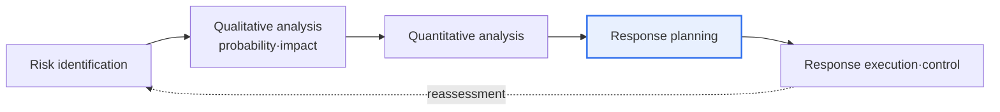

# IT Project Risk Response

## 1. Overview

### A. Definition
> **Risk Response** is a management activity that **identifies and analyzes uncertainties (risks)** that threaten project objectives — or that conversely can become opportunities — **and establishes and executes response strategies** appropriate to them. It is a core process of the PMBOK risk management knowledge area.

An easily missed point in the definition of risk is that risk includes **not only negative threats but also positive opportunities**. Traditionally, risk management is understood only as "preventing bad things," but PMBOK also treats the possibility that things go better than expected (opportunity) as an object of management. The complete goal of risk response is to minimize threats and maximize opportunities.

### B. Necessity
IT projects have **unusually high uncertainty** due to requirement changes, the introduction of new technologies, tight schedules, and the like. Leaving such uncertainty unattended leads to schedule delays, budget overruns, and quality degradation. If one identifies risks in advance and prepares response plans, then when a problem actually occurs, one can execute prepared measures without being flustered, raising the probability of project success.

## 2. The Procedure for Establishing a Risk Response Plan (A)

The logic of the procedure is **"since not all risks can be treated equally, filter and focus."** First, in the identification stage, one broadly compiles a risk register. Next, with **qualitative analysis**, one prioritizes using a P-I Matrix that combines probability of occurrence and impact, concentrating resources on the important few. Large risks are quantified in terms of monetary and schedule impact through **quantitative analysis**, where EMV (Expected Monetary Value) or Monte Carlo simulation is used. Based on this analysis, a response plan is established per risk, and in the execution stage, one monitors triggers and manages even residual and secondary risks. Because risks continually change during the project, this procedure is **periodically reassessed**.

| Stage | Content |
|---|---|
| **Identification** | Compile a risk register |
| **Qualitative analysis** | Evaluate probability·impact (P-I Matrix), prioritize |
| **Quantitative analysis** | Quantify monetary·schedule impact (EMV, Monte Carlo) |
| **Response planning** | Designate a strategy, owner, and contingency reserve per risk |
| **Execution·control** | Trigger monitoring, management of residual·secondary risks |

## 3. Response Strategies for Threats (Negative Risks) (B)

Threat response strategies are chosen differently **according to the size and nature of the risk**. A threat too severe to bear is addressed by **avoidance**, which eliminates the cause itself (e.g., excluding altogether the scope that uses unverified technology); a threat difficult for us to handle well is **transferred** to a third party via insurance or outsourcing. Most threats are handled by **mitigation**, which reduces the probability or impact (e.g., verifying technical risk with a prototype, reducing the impact of failure with redundancy); and a small threat that is bearable even if it occurs is **accepted** by securing only a contingency reserve.

| Strategy | Content | Example |
|---|---|---|
| **Avoid** | Eliminate the cause of the threat | Delete high-risk scope |
| **Transfer** | Shift the risk to a third party | Insurance·outsourcing·contract |
| **Mitigate** | Reduce probability of occurrence·impact | Prototype·redundancy |
| **Accept** | Bear it with no separate measures | Secure a contingency reserve (small-scale risk) |

## 4. Response Strategies for Opportunities (Positive Risks) (C)

Opportunity responses form a **symmetric structure** with threat strategies. They pair as avoid↔exploit, transfer↔share, and mitigate↔enhance, with accept common to both. A good opportunity one definitely wants to seize is **exploited** so that it is surely realized (e.g., assigning top talent first to finish early); an opportunity that grows larger with a partner than alone is **shared** (joint venture, partnership); and an opportunity whose probability or benefit can be increased is **enhanced** by investing more resources. Taking only the benefit if it arises without any special measure is **acceptance**.

| Strategy | Content | Example |
|---|---|---|
| **Exploit** | Realize the opportunity for certain | Assign top talent first |
| **Share** | Realize it in cooperation with a third party | Partnership·joint venture |
| **Enhance** | Increase probability of occurrence·impact | Add resources |
| **Accept** | Use the opportunity with no active measures | Take the benefit if it arises |

## 5. Considerations and Implications
- **Manage both threats and opportunities, but use escalation**: Risks beyond the project manager's authority (at the strategic or organizational level) are **escalated** to higher management to make the response owner clear.
- **Financial preparation with reserves**: Known risks are secured with a **Contingency Reserve** and unknown risks with a **Management Reserve**. The former is controlled by the PM, the latter by higher management.
- **Iterative reassessment in an agile environment**: In IT projects where requirements change frequently, it is effective to reassess risks per sprint to respond quickly to change.
- **Management of residual·secondary risks**: One must track both the residual risk that remains after executing a response and the secondary risk newly induced by the response, so that the effectiveness of management is secured.

---

> **In one line**: Risk response concentrates on high-priority risks through the procedure of *identification→qualitative/quantitative analysis→response planning→execution and control*, manages threats with the symmetric strategies of *avoid·transfer·mitigate·accept* and opportunities with *exploit·share·enhance·accept*, and complements this with escalation and reserves.
