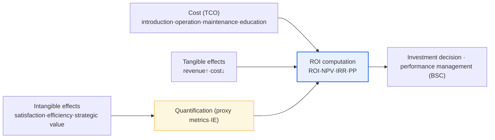
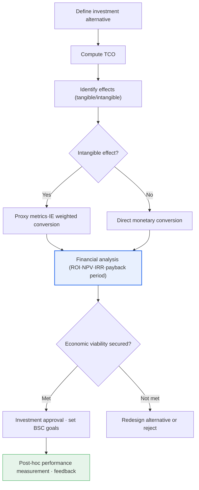

# The IT-ROI Investment Performance Evaluation Model

## 1. Overview

### A. Definition
> **IT-ROI (Return On Investment)** is a model that quantitatively measures the effect obtained from an IT investment (revenue increase, cost reduction, risk avoidance, etc.) relative to the cost invested, thereby **evaluating the economic feasibility and performance of the IT investment in monetary units**. The most basic formula is `ROI(%) = (effect − cost) / cost × 100`, and to this are combined NPV·IRR, which reflect the time value of money, TCO, which encompasses total cost, and the Information Economics (IE) technique, which weights and evaluates intangible effects, forming a single evaluation system.

The fundamental reason IT-ROI is demanded lies in the need to '**prove the performance of IT investment in the language management understands (money)**.' IT organizations continually request investments — infrastructure replacement, new system construction, cloud migration, AI adoption — but if they cannot present in numbers "how much value that investment ultimately created," it is difficult to secure budget justification from the CFO and the board. Traditionally, IT has been perceived as a cost center, and because its effect relative to investment is opaque, it has been the budget cut first in every economic downturn. To change this perception, IT-ROI provides the basis for setting investment priorities and verifying performance afterward by converting invested cost (TCO) and produced effect into the same monetary measure for comparison.

However, IT's effects include not only **tangible effects** such as revenue increase and labor-cost reduction but also large portions of **intangible effects** such as improved customer satisfaction, faster decision-making, work engagement, and strategic flexibility (option value). In particular, IT investments in the digital transformation era tend to have a larger proportion of intangible and strategic effects than tangible ones, so there is a fundamental limitation that simple financial ROI alone cannot fully capture investment value. Therefore, the practical core of the IT-ROI model lies in 'how to reliably quantify (monetize) intangible effects,' and it is at this point that complementary techniques such as information economics, BSC, and real options appear.

### B. Background and Necessity
The background to IT-ROI's settling into a methodology lies in the large-scale IT investment that expanded from the 1990s onward and the frequent experiences of investment failure in proportion to it. Centered on the United States, the so-called **productivity paradox** debate arose — "we spend enormous money on IT, so why doesn't productivity rise?" — and this triggered academic and practical efforts to rigorously measure the effects of IT investment. Domestically as well, as large informatization projects in the public and financial sectors increased, procedures to verify economic feasibility in advance at the budgeting stage (pre-investment evaluation) and to verify actual performance after a project ends (post-hoc evaluation) were institutionalized.

The necessity can be summarized in three points. First, **rationalization of resource allocation**. Within a limited IT budget, which project to invest in first must be decided by quantitative evidence rather than gut feeling. Second, **accountability**. By measuring actual effects after investment and verifying results against plan, the transparency of IT governance is secured. Third, **communication**. By translating IT performance into financial language, one forms consensus with management and the business side and secures the momentum for continuous investment.

## 2. The IT-ROI Evaluation Framework and Its Components

IT-ROI evaluation consists of a series of flows that compute cost, measure tangible and intangible effects, and synthesize them with financial techniques to connect them to decision-making. The structural diagram below shows the relationship between the inputs (cost, effect) and outputs (investment decision, performance management) that go into the evaluation.

Accurately capturing the **cost (TCO) aspect** first is the starting point of ROI reliability. A common beginner's error is to calculate only visible initial costs such as hardware and software introduction costs. In reality, however, a considerable portion of the cost occurs after introduction. Operation and maintenance, license renewal, incident response, user education, organizational change management, and even system disposal costs must be included for the true scale of the investment to be revealed. This is called TCO (Total Cost of Ownership), and it is generally known that the initial introduction cost accounts for only 20–30% of the total cost over the system's life cycle, with the remaining 70–80% occurring in the operation and maintenance stages. If TCO is underestimated, ROI is inflated beyond reality, leading to wrong investment decisions.

The **tangible effect aspect** is the effect directly convertible to money. For example, if automating call-center consultation saves the labor cost of 20 agents, this is a clear quantitative effect, and if introducing an e-commerce recommendation system raises the average order value by 8%, the revenue increase can be calculated. Tangible effects have the advantage of being evaluated relatively accurately by financial techniques (ROI·NPV·IRR), but one must always bear in mind that they explain only a part of IT investment value.

The **intangible effect aspect** is the most difficult area of IT-ROI. Improved customer satisfaction, better decision-making accuracy, brand trust, reduced regulatory risk, and strategic flexibility for future expansion are not, in themselves, monetary units. But if one gives up on measurement just because something is intangible, a paradox arises in which the more strategically important an investment is, the more it is undervalued. Therefore, in practice one sets **proxy metrics** to monetize indirectly. For example, improved customer satisfaction is converted as 'reduced churn → maintained customer lifetime value (LTV) → defended revenue,' and improved work efficiency as 'reduced processing time × hourly labor cost × number of cases.' This systematic approach of quantifying intangible effects is Information Economics (IE).

| Component | Details | Cautions in evaluation |
|---|---|---|
| **Cost (TCO)** | Introduction·operation·maintenance·education·change management·disposal | Beware calculating only initial cost; reflect the entire life cycle |
| **Tangible effect** | Revenue increase, reduction of labor·inventory·time costs | Easy to quantify with financial techniques |
| **Intangible effect** | Customer satisfaction, work efficiency, risk reduction, strategic flexibility | Indirect monetization via proxy metrics·weights needed |

## 3. Major Evaluation Techniques and the Computation Procedure

Several financial and qualitative techniques are used together in IT-ROI evaluation. The process diagram below shows the procedure from an investment alternative entering to the final performance management.

### A. Financial Techniques
Financial techniques are powerful for evaluating tangible effects. **ROI** is `(effect−cost)/cost×100`, which is intuitive but has the weakness of not reflecting the time value of money or the investment period. What complements this is **NPV (Net Present Value)**, obtained by discounting future cash flows to present value at an appropriate discount rate, summing them, and then subtracting the initial investment. If NPV is greater than 0, that investment earns more than the cost of capital and is an economic investment. **IRR (Internal Rate of Return)** is the discount rate that makes NPV equal to 0; it expresses the investment's rate of return as a percentage, useful for comparing projects of different scales. **Payback Period** is the time it takes to recoup the investment; it is easy to calculate and gives a sense of risk, but ignores effects after recovery and the time value.

These techniques are used complementarily. For example, even if two projects have the same ROI, a project whose effects are front-loaded is advantageous in NPV and IRR. In practice, a multifaceted evaluation that looks together at absolute value with NPV, relative rate of return with IRR, and risk-exposure period with the payback period is the standard.

### B. TCO and Information Economics (IE)
**TCO**, as explained earlier, is a technique that secures completeness of cost, and it is often used in decisions such as cloud migration by comparing the 5-year TCO against on-premises. **Information Economics** is an extension technique that evaluates by adding intangible and strategic value to the financial ROI as weights. By weight-summing item-by-item value and risk scores such as 'fit with business strategy,' 'contribution to competitive advantage,' and 'organizational risk' onto the pure financial ROI score, it reflects in the evaluation the strategic value that financial figures alone do not reveal. When determining the weights of intangible effects, a multi-criteria decision-making technique such as AHP (Analytic Hierarchy Process) is sometimes used together.

| Technique | Computation method | Strength | Limitation |
|---|---|---|---|
| **ROI** | (effect−cost)/cost×100 | Intuitive, easy to communicate | Does not reflect time value·period |
| **NPV** | Σ present value of cash flows − investment | Reflects time value, absolute value | Sensitive to discount-rate assumptions |
| **IRR** | Discount rate at NPV=0 | Compares projects of different scale | Multiple solutions·unrealistic reinvestment assumption |
| **Payback Period (PP)** | Time to recoup investment | Intuitive on risk | Ignores post-recovery effect·time value |
| **TCO** | Total life-cycle cost | Captures hidden costs | Effect side is separate |
| **Information Economics (IE)** | Financial ROI + intangible·strategic weights | Reflects intangible value | Subjectivity of weights |

## 4. Application Cases and Comparison

Technique selection varies according to the nature of the investment. The reason this difference arises is that the type, timing, and strategic character of effects differ by investment. For example, **cost-reduction-type investments** (e.g., legacy-server consolidation, RPA adoption) have mostly tangible effects realized in the short term, so a sufficiently persuasive evaluation is possible with ROI and the payback period alone. In practice, one replaces repetitive manual work with RPA to automate 10,000 hours of work per year, calculates the hourly processing cost, and proves recovery within 12 months.

By contrast, **strategic and platform-type investments** (e.g., building a data platform, cloud migration, AI adoption) have effects that appear intangibly over the long term, so they are easily undervalued by simple ROI. In this case, one must present the multi-year effects at present value with NPV and reflect strategic flexibility (the option value of being able to quickly add new services in the future) as weights via information economics for the investment feasibility to be revealed. In a cloud migration case, the orthodox approach is to compare the on-premises 5-year TCO with the cloud 5-year TCO, but to quantify together not only simple cost but also intangible effects such as opportunity-cost reduction from elastic scaling and shortened time-to-market.

Third, **regulatory-response and risk-avoidance-type investments** (e.g., security hardening, personal-information-protection systems) do not increase revenue, so traditional ROI may appear negative; however, if one calculates the avoidance value (risk-adjusted return) as 'probability of a breach × expected damage,' the investment justification is secured. Thus, even for the same IT-ROI, which technique to put front and center and what to use as a complementary technique differ by investment type.

### A. A Simple Computation Example
To concretize the concept, consider an example. Suppose a company invests an initial introduction cost of KRW 300 million in a document-processing automation system and thereafter spends KRW 50 million per year on maintenance and operation for four years. If this system automates 8,000 hours of repetitive manual work per year and the hourly processing cost is converted at KRW 25,000, the annual savings effect is about KRW 200 million. Looking at the simple cumulative ROI on a 4-year basis, with a total effect of KRW 800 million and a total cost of KRW 500 million (KRW 300 million introduction + KRW 200 million maintenance), it comes to `(8−5)/5×100 = 60%`. If one further reflects the time value of money and calculates NPV at a discount rate of 8%, the present value of future effects shrinks, so the net present value comes out at a more conservative figure than 60%. The payback period is computed at about 2 years by dividing the initial cost of KRW 300 million by the annual net effect (KRW 200M − KRW 50M = KRW 150M). Thus, since the strength of the conclusion 'there is economic viability' differs depending on which technique one uses, presenting multiple techniques together is the orthodox practice. (The above figures are assumed values for explaining the principle; in an actual project one must compute with the organization's own data.)

## 5. Deep Dive: Linkage with BSC and Recent Trends

IT-ROI attains greater completeness when combined with the **Balanced Scorecard (BSC)** rather than used alone. BSC views performance in a balanced way across four perspectives — customer, internal process, and learning and growth — rather than being confined to the financial perspective alone. Since many of the intangible effects of IT investment map naturally to the customer, process, and learning-growth perspectives, placing IT-ROI's financial figures together with BSC's non-financial indicators can complement the strategic value that financial ROI misses. In fact, many organizations use, in IT investment review, an evaluation sheet with two axes of financial feasibility (NPV·IRR) and strategic alignment (BSC·information-economics score).

Recent trends include, first, a **strengthening of the value-realization perspective**. Rather than ending with the pre-investment ROI at the time of approval, benefits management — which continuously tracks actual effects after a project ends and manages results against plan — is emphasized in IT governance (COBIT, etc.). Second, the **difficulty of measuring the ROI of digital transformation and AI investments**. Investments whose effects are broad and intangible, such as adopting generative AI, make traditional ROI computation especially difficult, so the practice of evaluating with proxy metrics such as productivity-improvement hours and quality-improvement rates and with pilot-based phased investment (an option-like approach) is spreading. Third, the **reflection of ESG and sustainability value**, with increasing attempts to include non-financial effects of IT investment such as carbon reduction and energy efficiency in performance. However, since the degree of standardization of these latest indicators still varies greatly by organization, careful design suited to the organizational context is needed rather than assertion.

## 6. Considerations and Implications (Professional Engineer's Perspective)

1. **Quantifying intangible effects determines success or failure.** Because a considerable part of IT value is intangible, unless one systematically converts it with proxy metrics (customer retention rate, reduced processing time, risk-avoidance amount), a paradox arises in which the more strategically important an investment is, the more it is undervalued. One must combine complementary techniques such as information economics, AHP, and real options to fit the situation.

2. **Complete cost computation from a TCO perspective is the premise.** Avoiding the error of looking only at introduction cost, one must reflect the entire life-cycle cost — operation, maintenance, education, change management, and disposal — for ROI not to be distorted. In particular, in cloud and subscription models, one must note that long-term operating costs can far exceed the initial cost.

3. **Evaluate multi-dimensionally in linkage with BSC and IT governance.** Rather than being buried in a single financial ROI, one evaluates from the balanced perspective of financial, customer, process, and learning-growth, and connects it to the value-realization process of governance frameworks such as COBIT to create a closed loop of pre-hoc evaluation and post-hoc verification.

4. **Operate pre-hoc evaluation and post-hoc performance management as a closed loop.** Rather than ending with the estimated ROI at the time of investment approval, one must continuously measure actual effects to verify results against plan and feed them back into the next investment decision, so that IT-ROI becomes a substantive management tool rather than a formality.

5. **Secure transparency of trade-offs and assumptions.** Because numerous assumptions (discount rate, effect estimates, intangible weights) intervene in ROI computation, one must present, via sensitivity analysis, the variation in results as assumptions change, to raise the reliability of the decision. In particular, since the proxy metrics for intangible effects are themselves estimates, presenting optimistic and pessimistic scenarios in parallel is the way to avoid criticism of overstatement.

6. **Apply techniques differently by investment type.** Cost-reduction types are sufficient with ROI and the payback period, but strategic and platform types must reflect long-term and intangible value with NPV, real options, and information economics, and risk-avoidance types must be evaluated with avoidance value (probability × damage). Applying a single yardstick uniformly to all investments causes the error of undervaluing strategic investments.

In sum, the essence of IT-ROI is not the calculation formula itself but 'how to reliably translate intangible value into money, reveal the assumptions transparently, and operate it as a management system that connects pre-hoc judgment with post-hoc verification.' From a professional engineer's perspective, beyond the calculation methods of individual techniques, the capability to design and operate IT-ROI as an investment decision-making system aligned with the organization's IT governance and strategy is required.

## References
- ISACA, COBIT 2019 — Governance and management objectives (value realization/benefits management): https://www.isaca.org/resources/cobit
- Kaplan & Norton, Balanced Scorecard (Harvard Business Review overview): https://hbr.org/1992/01/the-balanced-scorecard-measures-that-drive-performance-2
- Brynjolfsson, overview of the IT productivity paradox discussion: https://en.wikipedia.org/wiki/Productivity_paradox

---

> **In one line**: IT-ROI is a model that *quantitatively evaluates effect relative to IT investment cost (TCO)*; it combines the financial techniques of ROI·NPV·IRR·payback period with information economics and BSC to measure tangible and intangible effects in a balanced way, but **quantifying intangible effects and pre–post closed-loop performance management** are its core challenges.
