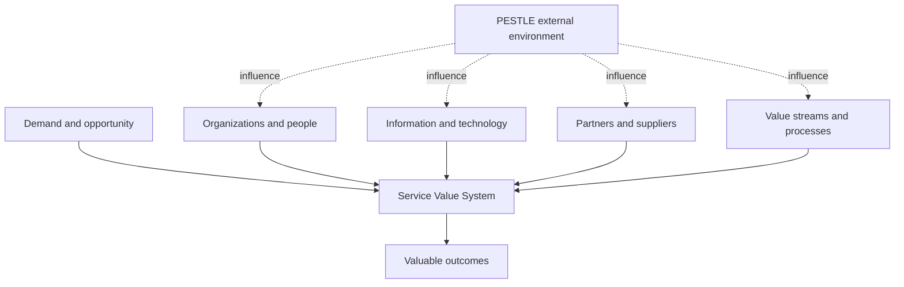
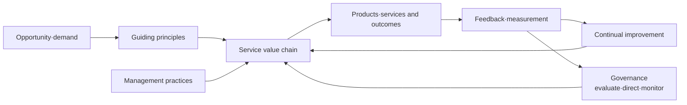
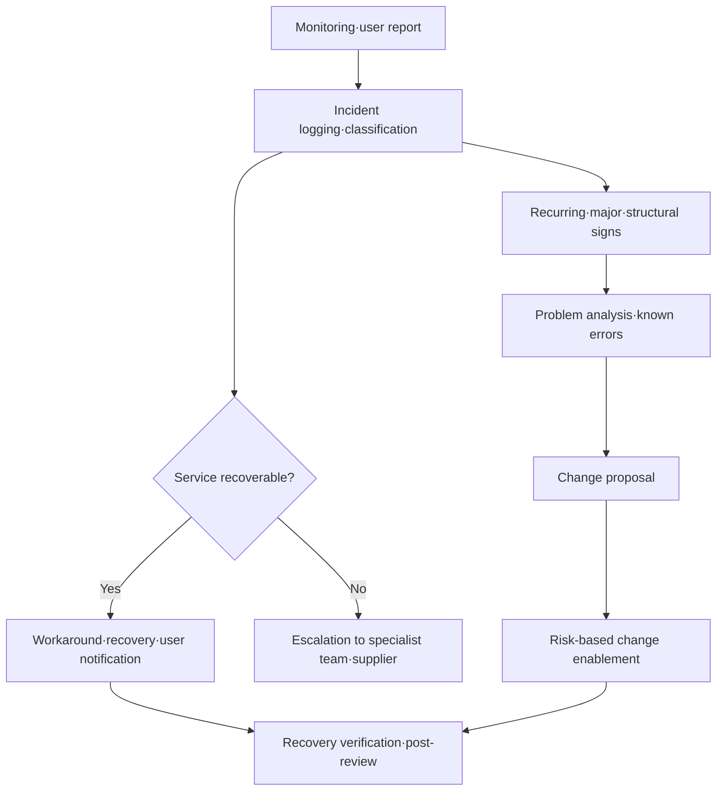

# ITIL 4 (Information Technology Infrastructure Library) and Service Management

## 1. Overview

> ITIL 4 is a service management framework that helps an organization co-create value with its customers and stakeholders while designing, transitioning, operating, and improving digital products and services.

ITIL (Information Technology Infrastructure Library) is a practical guide for shifting IT from the operation of technical components to a perspective that manages the quality and value of services. As IT has come to determine business performance, customer experience, regulatory compliance, and cost efficiency beyond merely supporting work, it has become difficult to explain business goals with operational management that only reduces the number of incidents.

ITIL 4 is not a process standard that forces fixed procedures on every organization. Taking the value a service creates and stakeholder outcomes as its starting point, it combines value streams and management practices to fit the organization's size, risk, technology, and supply chain. Therefore, even the same practice may apply different levels of control to a financial institution's core-account service and a startup's experimental service.

Whereas the earlier ITIL v3 emphasized the service life cycle and per-process control, ITIL 4 centers on the Service Value System (SVS), value chain activities, the four-dimension perspective, and the seven guiding principles, encompassing agility, collaboration, and automation as well. This change means that DevOps, agile, cloud, and SRE are not mutually exclusive with IT service management, and can be combined under a common value goal.

In a professional engineer's answer, one should explain ITIL 4 not simply as a list of 34 practices, but as a closed-loop management system that receives demand and opportunity as inputs, produces outcomes through service relationships, and learns again through governance and continual improvement.

### 1.1 Background and Necessity

First, service consumers want business outcomes rather than uptime itself. An online shopping mall regards whether an order is properly accepted and payment completed as more important than whether the server is alive. If one does not connect IT operational metrics with business performance metrics, one may achieve high uptime yet fail to create customer value.

Second, with the spread of cloud and SaaS, the boundary of service components has extended beyond the organization. Because internal servers, public cloud, external APIs, open source, and partner operations constitute a single service flow, supplier management and contractual boundaries of responsibility are essential.

Third, agile and DevOps enable rapid change, but raising only the speed of change can worsen problems of incidents, security accidents, and audit traceability. ITIL 4's change enablement, deployment, incident, problem, and service-level management practices, instead of pitting speed against control, balance them on a risk basis.

Fourth, data and automation have become the center of operational decision-making. Only by connecting observability data, configuration information, user feedback, and cost information into a single service context can one detect problems early and set priorities for improvement investment.

### 1.2 Core Characteristics

The core of ITIL 4 is not process-compliance rate but value co-creation. It is not the service provider alone that creates value; outcomes are realized when the consumer's capabilities, mode of use, and business context are combined.

Also, a practice is an execution capability that considers people, information, technology, partners, and value streams together. A practice does not mature merely by writing procedures in a document; responsibility and authority, tools, data, proficiency, and measurement and improvement must work together.

## 2. Basic Concepts of Service Management

### 2.1 Service·Value·Outcome

A service is a bundle of activities a provider performs so that customers can obtain their desired outcomes without directly bearing specific costs and risks. Here, it is important that the provider does not transfer all technical components to the customer. The customer does not purchase a server but consumes the capability to obtain a business outcome.

Value is perceived through the combination of utility and warranty. Utility concerns what the service does — its function and fitness for purpose — while warranty concerns how reliably it is provided under promised conditions — its quality and fitness for use.

For example, a mobile banking service providing a transfer function is utility. That transactions are processed within a defined time, recovered upon failure, and personal information protected is warranty. Even with many functions, if warranty is insufficient, users rate the service's value low.

A service relationship is a relationship in which provider and consumer cooperate to provide and consume the service. The relationship includes service provision, service consumption, and relationship management. It should be seen not as a relationship that merely exchanges SLA documents, but as an operational relationship that jointly adjusts goals, risks, feedback, and improvement priorities.

### 2.2 Perspective on Cost and Risk

The service consumer bears both direct and indirect costs. Direct costs are items that appear in the contract or budget, such as usage fees, licenses, and personnel costs; indirect costs occur in the course of using the service, such as opportunity losses due to education, transition, delay, and failure.

Risk is the uncertainty that keeps a service from producing outcomes. Even if the provider manages some of the risk, if the consumer organization's data quality, user education, and business processes are inadequate, the overall outcome worsens. Therefore, in service-level negotiations one distinguishes the risks the provider can control from the risks the consumer must manage.

The professional engineer should not record only a list of functions in the service catalog and SLA, but should define together the key outcomes, quality conditions, cost factors, risk owners, and measurement methods. Only with this structure can one explain incident priorities and investment feasibility in business language.

| Concept | Core question | Practical management point |
|---|---|---|
| Utility | What work does the service enable? | Function, usage scenarios, outcome metrics |
| Warranty | Can it be used stably under promised conditions? | Availability, capacity, security, continuity |
| Cost | How much resource does provision·consumption take? | TCO, unit cost, license, personnel |
| Risk | What uncertainties may obstruct outcomes? | Risk register, controls, residual risk |
| Outcome | What change do stakeholders obtain? | KPI, customer performance, business effect |

## 3. ITIL 4's Four-Dimension Perspective

Service-management decisions should not optimize only one dimension. ITIL 4 examines four dimensions in balance: organizations and people, information and technology, partners and suppliers, and value streams and processes. Because the external environment PESTLE also affects the four dimensions, one must examine regulatory, economic, social, technological, legal, and environmental changes together.

### 3.1 Organizations and People

This includes organizational structure, roles and responsibilities, delegation of authority, capability, culture, and communication. If the service desk and the development team have different goals, they end up shifting blame rather than resolving incidents quickly. Therefore, RACI, an on-call system, escalation paths, and learning time must be reflected in the service operating model.

Viewing people only as operating costs makes automation adoption prone to failure. A redeployment plan is needed that, after reducing repetitive work through automation, strengthens capabilities in analysis, design, customer communication, and risk management. Role-based education and on-site coaching are also part of practice maturity.

### 3.2 Information and Technology

This addresses the data and tools needed to design and operate a service. Representative examples are the configuration management database (CMDB), monitoring, logs and traces, the service catalog, the knowledge base, the deployment pipeline, and ITSM tools.

The meaning and quality of data matter more than introducing many tools. If asset identifiers differ from one another, one cannot connect incidents and configuration items, and monitoring alerts do not translate into business impact. One must design information classification, retention, access control, and data-quality rules.

### 3.3 Partners and Suppliers

This manages external actors that participate in the service — cloud providers, network operators, package suppliers, outsourced operators, open-source communities, and the like. Supplier performance should be evaluated not by contractual uptime alone but including failure collaboration, security notification, recovery drills, data export, and termination support.

In multi-cloud, the boundary of responsibility by supplier is especially important. Because a provider's platform failure and a customer's misconfiguration have different response owners, one must document the service model and the operational responsibility matrix and verify them periodically.

### 3.4 Value Streams and Processes

This addresses the sequence, control, waiting, handoff, and automation of the activities by which demand is converted into outcomes. If a process is the rule that controls work, a value stream is the entire path along which value actually moves in a specific product or service.

For example, the value stream of a new mobile feature for customers proceeds through idea, requirements, design, development, testing, deployment, observation, and feedback. Since increasing only the approvals at each stage creates bottlenecks, it is desirable to concentrate control on high-risk changes and automate low-risk standard changes.

| Dimension | Check question | Representative deliverables |
|---|---|---|
| Organizations and people | Who decides and what capabilities are needed? | Operating model, RACI, capability plan |
| Information and technology | What data and tools must be connected? | CMDB, knowledge base, observability design |
| Partners and suppliers | Are external dependencies and responsibility boundaries clear? | Contracts, OLA, supplier evaluation sheet |
| Value streams and processes | Where do waiting, rework, and control occur? | Value stream map, procedures, automation rules |

## 4. The Service Value System (SVS)

ITIL 4's SVS describes how all of an organization's components and activities combine into a single system to create value. The inputs are opportunity and demand, and the output is value through products and services. The five components of the SVS are guiding principles, governance, the service value chain, management practices, and continual improvement.

### 4.1 The Seven Guiding Principles

The guiding principles are decision-making criteria not dependent on a specific tool or organization. The principles are not selected one at a time like a checklist but applied together according to the situation.

First, focus on value. Confirm the outcomes customers, users, and the organization obtain, rather than the completion of activities themselves. Second, start where you are. Replacing everything without diagnosing existing assets and capabilities increases cost and transition risk.

Third, progress iteratively with feedback. Rather than finalizing a large design at once, measure and learn from small changes. Fourth, collaborate and promote visibility. Only when development, operations, security, and business use the same dashboard and terminology do hidden waiting and responsibility gaps decrease.

Fifth, think and work holistically. Even if you raise the throughput of a specific team, if the overall service flow slows, it is not optimization. Sixth, keep it simple and practical. Remove or automate approval and reporting procedures that cannot explain their control purpose and risk.

Seventh, optimize and automate. First analyze waste and bottlenecks, then automate stable, repetitive work. Because automating a bad procedure as-is spreads errors faster, standardization and exception handling are needed before automation.

### 4.2 Governance and Continual Improvement

Governance is the system that evaluates the organization, directs its course, and monitors results. Management decides the service portfolio, risk tolerance, investment, regulatory compliance, and supply-chain principles, and the operational organization implements that direction through value streams and practices.

Continual improvement is not a one-off project of a separate innovation team but an operational activity repeated at all levels. One must create a cycle of registering improvement opportunities, deciding priorities, measuring a baseline, executing small steps, verifying results, and disseminating knowledge.

Improvement priorities are not decided solely by items with the most complaints. One evaluates together customer impact, risk reduction, cost savings, regulatory importance, implementation difficulty, and learning effect, and connects the improvement backlog to the product·service roadmap.

## 5. The Service Value Chain and Value Streams

The service value chain is the operating model of interconnected activities an organization performs to provide and realize value. The six activities are Plan, Improve, Engage, Design & Transition, Obtain/Build, and Deliver & Support. Not all services pass through the six activities in the same order; the path varies according to the type of demand.

| Activity | Purpose | Representative deliverables |
|---|---|---|
| Plan | Shared understanding of vision, current state, and improvement direction | Strategy, portfolio, policy |
| Improve | Continual improvement of products, services, and practices | Improvement backlog, retrospective results |
| Engage | Management of stakeholder demand, transparency, and relationships | Requirements, feedback, SLA |
| Design & Transition | Design and transition meeting quality, cost, and time-to-market goals | Design documents, release plans |
| Obtain/Build | Secure and develop needed service components | Code, infrastructure, supply contracts |
| Deliver & Support | Provide and support the service under agreed conditions | Operations, incident handling, knowledge |

### 5.1 Example Value Stream for a New Service

Suppose an online education institution launches a real-time lecture captioning feature. In Engage, it gathers the needs of students with disabilities, instructors, and the customer center; in Plan, it sets privacy and cost goals. In Design & Transition, it designs latency, accuracy, retention period, and an alternative means in case of failure.

In Obtain/Build, it configures a speech-recognition API and a caption store and prepares test data. In Deliver & Support, after deployment it observes quality, latency, and error rate, and when an incident occurs, the service desk and supplier respond together. In Improve, it improves the dictionary and the model based on actual user feedback.

If one measures only the productivity of the team responsible for each activity in this flow, one misses the whole experience. One must measure together outcome-linked metrics such as lecture-playback success rate, caption delivery time, error-report resolution time, and feature adoption rate.

### 5.2 Value Stream Design Principles

When drawing a value stream, do not merely list activity names; indicate the start and end conditions from customer request to outcome confirmation, along with inputs·outputs, owners, waiting time, rework, control, and automation. Only by distinguishing lead time and processing time using actual data can bottlenecks be seen.

Handle low-risk standard requests with the catalog and auto-approval, and strengthen impact assessment, approval, and verification for high-risk changes. Applying control proportional to risk in this way makes it possible to achieve ITIL's controllability and DevOps's speed at the same time.

## 6. Major Management Practices and Operational Linkage

ITIL 4 presents 34 management practices, comprising 14 general management practices, 17 service management practices, and 3 technical management practices. A practice is a broader concept than a process, including together the people, responsibilities, knowledge, technology, suppliers, and value streams needed to achieve a purpose.

General management includes strategy, portfolio, risk, information security, supplier, relationship, project, organizational change, and measurement and reporting. Service management includes incident, problem, change enablement, service desk, service level, service request, configuration, asset, and availability·capacity·continuity. Technical management includes capabilities related to deployment·infrastructure·platform, software development and management, and technology architecture.

### 6.1 The Linkage of Incident, Problem, and Change

An incident is an unplanned interruption or quality degradation of a service, and incident management aims to restore the agreed service level as quickly as possible. If finding the root cause delays recovery, one first applies a workaround and separates the follow-up analysis into problem management.

A problem is a cause, or potential cause, of one or more incidents. Problem management analyzes recurring incidents and structural defects and manages known errors and workarounds to reduce recurrence.

Change (enablement) is the ability to assess, approve, schedule, and implement changes affecting a service in accordance with their risk. If all changes are approved identically, it becomes a bottleneck, and if all changes are deployed without control, the risk of failure grows. One must distinguish risk levels into standard, normal, and emergency changes and vary the level of automation.

### 6.2 Service Desk and Service-Level Management

The service desk is the entry point for users and the service provider, and it is not a mere telephone-reception counter but a core practice that manages demand, expectations, and experience. It must integrate multi-channel contact points, knowledge search, auto-classification, user authentication, communication templates, and feedback collection.

Service-level management translates business needs into measurable service targets and manages whether targets are achieved and how to improve. An SLA should include not only availability but also response·recovery time, throughput, data recovery, security notification, user experience, measurement-exclusion conditions, and boundaries of responsibility.

If an SLA includes too many metrics, operators concentrate on formally meeting targets. One should select a small number of metrics that represent the key journeys and business outcomes, and align the measurement criteria of the internal OLA and supplier contracts.

### 6.3 Configuration·Asset·Knowledge Management

Service configuration management provides reliable information about service configuration items and their relationships. Asset management manages the life cycle of assets and their value, cost, and risk. The two practices are linked, but not every asset is a service configuration item, and their purposes and levels of control also differ.

Knowledge management makes resolution methods and decision rationale reusable. When recording knowledge after closing an incident, one should include the applicability conditions, risks, verification procedures, expiration date, and owner rather than a simple copy of the original text. Only then will an incorrect resolution not repeat in auto-recommendation or self-service.

## 7. Comparison of ITIL 4 with Related Approaches

ITIL 4 provides an operating system and common language for service management, but it does not single-handedly replace enterprise-wide governance or a development methodology. COBIT is strong in enterprise IT governance and objectives·controls; ISO/IEC 20000 is suitable for the requirements and auditing of a service management system; and DevOps and SRE have strengths in engineering practices for fast delivery and highly reliable operations.

| Approach | Main purpose | Strength | Cautions in application |
|---|---|---|---|
| ITIL 4 | Service value co-creation and operational management | Value chain·practices·common language | Do not misuse it as document·approval-centered |
| ISO/IEC 20000 | Service management system requirements and conformity | Audit·certification·system perspective | Certification is not the same as service quality |
| COBIT | Enterprise IT governance and objectives·controls | Connects business goals·risk·control | Operational execution procedures need separate design |
| DevOps | Improving dev·ops flow and deployment speed | Automation·collaboration·short feedback | Must embed risk·regulatory control |
| SRE | Reliability goals and engineering operations | SLO·error budget·automation | Needs alignment of service language with non-IT stakeholders |

ITIL 4 and DevOps are not opposed. A DevOps pipeline that deploys changes in small units and performs automated verification can be the means of executing the change-enablement and deployment-management practices. Conversely, ITIL's service levels and incident learning make it possible to confirm whether changes DevOps rapidly produced contribute to customer outcomes.

SRE's error budget connects the acceptable reliability risk to deployment decisions. Combining the error budget with ITIL's continual improvement and service-level management makes it possible to create an operating policy that permits innovation while targets are met and concentrates on stabilization once the budget is exhausted.

## 8. Application Cases

### 8.1 Payment Failure on an E-commerce Platform

Assume payment-approval delays occurred during a large-scale discount event. Monitoring detects API latency and failure rate, and the service desk groups customer reports and classifies it as a major incident. The primary goal of incident management is not root-cause identification but preventing order loss through an alternative payment path and a reprocessing queue.

Problem management analyzes the chain of causes — a specific payment provider's timeout, a surge in retries, and database-connection exhaustion. Change enablement standardizes the retry policy and a circuit breaker, and performs load testing and failure drills before the next event.

Performance is not evaluated by the number of incidents alone. One looks together at order success rate, the percentile of payment latency, the number of customer refunds, the time from detection to mitigation, and the recurrence rate. Using such outcome-centered metrics makes it possible to manage customer value directly, rather than the infrastructure team's mere uptime.

### 8.2 A Public Institution's Cloud Migration

A public institution must consider together regulations, personal information, budget, procurement contracts, and dependencies on existing systems. In Plan, it organizes the service portfolio and regulatory requirements; in Engage, it agrees on the responsibilities of the business side, security, audit, and the cloud provider.

In Design & Transition, it designs data classification, encryption, backup, recovery objectives, access control, log retention, and data export upon termination. If, in the Obtain/Build stage, it manages infrastructure as code and verifies the configuration baseline, it can improve change history and reproducibility.

After transition, in Deliver & Support, it connects supplier monitoring with the internal service desk. Because even when the SLA is met, if complaint-handling delays or business interruptions occur the service value is low, one additionally measures business processing time and user satisfaction.

### 8.3 A Model Change on a Data Platform

When an analytics platform changes its data schema, multiple reports and AI models may be affected. Using service configuration management, one grasps the relationships among data products, pipelines, and consumers, and performs impact analysis and backward-compatibility verification before the change.

Standard changes are processed quickly with automated testing and an approval policy, but changes affecting personal-information columns or regulatory reports are classified as normal changes. After the change, one observes data quality, pipeline latency, report errors, and model performance, and if there is an anomaly, provides a rollback or a compatibility view.

This case shows that ITIL 4 is not a framework for traditional infrastructure operations alone but can also apply to the value streams of data and AI services.

## 9. Deep Dive: Directions for Applying ITIL 4 in the Digital Service Era

### 9.1 Combining Product-Centered Operations with Service Management

Even if a product team drives the backlog and deployment, it must manage the service's life cycle, operational responsibility, customer feedback, and cost·risk. Including operational readiness, observability, security, support knowledge, and recovery drills in the product team's definition of done can reduce the disconnect between development and operations.

The service catalog, too, can develop from a static menu into a digital portal that shows the consumption conditions of products, APIs, datasets, and platforms. It is good to include, in a catalog item, the owner, cost unit, SLO, support hours, dependencies, data classification, and the method of request·termination.

### 9.2 Automation·AIOps and Control

Event correlation, anomaly detection, ticket classification, knowledge recommendation, and auto-recovery raise the efficiency of Deliver & Support. However, because a model's false positives, misses, or bias can lead to operational failure, one must divide the level of automation by risk and install approval, an audit log, and a kill switch.

When applying generative AI to the service desk, one manages the basis and currency of answers, exposure of sensitive information, permission-based search, and final human confirmation. It is safer to store AI-generated resolutions separately from verified knowledge in an experimental state, and to leave the results of application as feedback data.

### 9.3 Maturity and Measurement

Maturity assessment should measure the ability to achieve purpose rather than the possession of documents. For example, the maturity of incident management is evaluated not by the existence of a ticket form but by whether detection quality, recovery time, recurrence rate, user communication, and post-hoc learning actually improve.

The measurement system is structured in layers of inputs·activities·outputs·outcomes. Inputs include personnel·budget·tools; activities include change·support·improvement; outputs include resolution·deployment·reports; and outcomes include service reliability·customer performance·cost·risk reduction. Only by using outcome indicators and leading indicators together can one prevent long-term quality from being damaged by the achievement of short-term goals.

## 10. Considerations and Implications

### 10.1 Preventing Over-adoption of the Framework

Adopting all of ITIL 4's terminology and documents at once increases the burden on the field and degenerates into formal compliance. One must select one or two core services, diagnose their value streams and major pain points, and then expand the practices whose effect has been confirmed in a phased manner.

### 10.2 Value- and Risk-Based Control

Because service importance and risk exposure differ by organization, one does not apply the same level of approval. Proportional control is needed — for example, strong traceability and recovery verification for core services in payments, healthcare, and the public sector, and a limited scope and fast feedback for internal experimental services.

### 10.3 Boundaries of Responsibility and Supply-Chain Resilience

Using cloud and SaaS does not make operational responsibility disappear but divides it. One must confirm the boundary of responsibility in the contract, failure notification, data movement, sub-suppliers, the termination plan, and recovery drills at the service-design stage, and verify supplier performance periodically.

### 10.4 Data Quality and Observability

If CMDB, logs, metrics, traces, and the catalog are not connected to one another, the reliability of automation and analysis declines. One must define a common identifier and tag standard, data owners, a retention policy, and quality checks, and provide dashboards that translate into service impact.

### 10.5 Integration with DevOps·SRE

Rather than approval steps that slow changes, one must design automated verification, progressive deployment, rollback, error budgets, and post-reviews that reduce risk. ITIL 4 practices contribute to real reliability improvement rather than document burden when embedded in the development pipeline and the SRE operating model.

### 10.6 Change in People and Culture

Improvement of service management is harder in changing collaboration methods and psychological safety than in introducing tools. Because punishing incidents as an individual's mistake increases concealment, one must establish blame-free post-reviews and learning-sharing, and provide the education and career paths needed for new roles.

### 10.7 Managing the Side Effects of Measurement

If one targets only ticket throughput or the SLA-adherence rate, side effects arise, such as splitting complex incidents or inducing early closure with the customer. Management must look in balance at customer outcomes, recurrence rate, quality, employee burden, cost, and risk, and review conflicts among indicators.

### 10.8 Answer Strategy from the Professional Engineer's Perspective

The answer should first present the definition and components, and connect the relationships of SVS–four dimensions–value chain–practices with a conceptual diagram. It then explains operational application through incident·problem·change cases, and compares the differences from and complementarity with DevOps·SRE·ISO/IEC 20000·COBIT.

Finally, one should present considerations from the perspectives of organization·technology·supply chain·process·data·culture. Rather than a rote-memorized list of 34, emphasizing the value stream by which demand is converted into outcomes and the feedback of continual improvement shows the essence of ITIL 4.

## References

- PeopleCert, ITIL 4 Management Practices 2023: https://www.peoplecert.org/news-and-announcements/2023/itil-4-management-practices-2023
- ITIL, Introduction to the ITIL Maturity Model: https://itil.com/-/media/itilsite/site-assets/documents/capability-and-maturity/introduction-to-the-itil-mm.pdf
- Atlassian, ITIL 4 Guiding Principles and Practices: https://www.atlassian.com/itsm/itil

---

> **In one line**: ITIL 4 is not a system for memorizing service-life-cycle procedures, but a service management framework that combines the SVS with the value chain, four dimensions, and practices to convert demand into measurable customer value and continuously improve.
