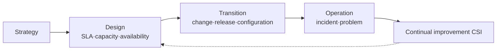

# IT Service Management System (ITSM) and ISO/IEC 20000

## 1. Overview

### A. Definition
> A management system that plans, provides, operates, and improves IT from a **business-aligned service perspective**. **ISO/IEC 20000** is its international standard (SMS, Service Management System), and it uses **ITIL** as a representative reference framework (a collection of best practices).

Traditional IT operations focused on running "technical assets" such as servers and networks well. What matters to users, however, is not equipment but "**a service that can be used reliably when needed**." ITSM embodies this shift in perception, viewing IT not as a mass of technology but as a **bundle of services** that delivers value to customers, and it is a process system that promises, measures, and improves the quality of those services with SLAs. ISO/IEC 20000 adds certifiable requirements ("shall") to this, enabling an organization to prove that it has management capability at an international level.

### B. Background and Necessity
As IT became the center of business, a single failure directly translated into business loss, and ad-hoc operations relying on individual staff members' capabilities could no longer guarantee quality. Organizations came to demand (1) **consistent service quality and SLA adherence**, (2) **process standardization and repeatability** that is maintained even when personnel change, (3) **IT governance** that responds to audits and regulations, and (4) **operational efficiency** in terms of cost-effectiveness, and ITSM institutionalizes these through the PDCA (Plan-Do-Check-Act) cycle. In particular, its core value is creating a **virtuous cycle** that, beyond reactively responding to problems, eliminates the root causes of recurring failures and continuously improves.

## 2. ISO/IEC 20000 Service Management Processes

The processes of ISO/IEC 20000 are grouped into four axes of service: "provision–relationship–resolution–control." If the service delivery processes erect the **skeleton of promises** such as SLA, capacity, and availability, the relationship processes manage the **contact points** with customers and suppliers, the resolution processes **recover and eradicate** failures that occur, and the control processes manage the risk from changes to underpin all of this.

| Area | Process (example) | Purpose |
|---|---|---|
| **Service delivery** | SLM, capacity·availability·continuity, budgeting, information security | Promise and design service levels |
| **Relationship** | Business relationship·supplier management | Manage customer·supplier contact points |
| **Resolution** | Incident·problem management | Failure recovery and root-cause elimination |
| **Control** | Configuration (CMDB)·change·release management | Control change risk·maintain configuration |

## 3. Service Design, Build, and Transition Activities (A/B/C/D)

A service has a life cycle (ITIL's service life cycle) that starts from strategy, passes through design, transition, and operation, and feeds back into continual improvement. Why each stage is needed is what matters.

**A. Design** defines in advance, before building the service, "how fast, how uninterrupted (SLA), how much load (capacity), and how to recover in a disaster (continuity)." The goals set here become the baseline for all subsequent stages. **B. Transition** is the stage of safely handing the designed service over to the operating environment; it controls change through **change·release management** so that changes do not cause unexpected failures, and records all configuration items (CIs) and their relationships in the **CMDB** to grasp the degree of impact. For example, when planning a patch for a specific server, identifying in advance via the CMDB the services that depend on that server makes it possible to predict and block the ripple effect if the change fails. **C. Operation** actually runs the service, performing **incident management** (symptom response), which restores the service quickly, and **problem management** (cause elimination), which removes the root of recurring failures, in a distinct manner. **D. Continual improvement (CSI)** measures and analyzes the SLA-achievement rate, processing time, and the like to refine processes through PDCA.

| Stage | Key activities |
|---|---|
| **Design** | Define SLA, design capacity·availability·continuity, information security |
| **Transition** | Change·release·deployment, configuration management (CMDB), verification·knowledge management |
| **Operation** | Incident·problem·request handling, event management |
| **Continual improvement (CSI)** | Measurement·analysis·improvement (PDCA) |

## 4. Related Concepts

Service-level promises are connected hierarchically. To keep the **SLA** with the customer, the **OLA** between internal teams and the **UC** with external suppliers must be underpinned, and if any one layer collapses, the SLA is broken. What underpins this connection is the CMDB, which holds the relationships among CIs.

| Concept | Description |
|---|---|
| **SLA/OLA/UC** | Service-level agreements among customer·internal team·external supplier (hierarchically linked) |
| **CMDB** | Provides a basis for impact analysis by managing configuration items (CIs)·relationships |
| **ITIL 4** | Evolves toward a focus on the Service Value System (SVS)·value streams·four dimensions |

## 5. Considerations and Implications
From a professional engineer's perspective, the success of ITSM adoption depends not on whether the standard is complied with but on the **manner of entrenchment**. If one only has process documents while the on-site culture, capability, and tools do not follow, it remains a mere formal certification. Therefore, organizational change management that clarifies **responsibilities and roles (RACI)** must proceed alongside an ITSM solution (ticket·CMDB automation). Recently, as the pace of change accelerates and heavy change control becomes a bottleneck, ITSM is trending toward **convergence with DevOps and SRE**. SRE's **error budget** quantifies the trade-off between "stability and deployment speed," making change management more flexible, and automation replaces repetitive operations. Ultimately, ITSM is expanding, in linkage with IT governance such as COBIT and with quality management, into **business-value-centered service governance**.

---

> **In one line**: ITSM is a system that *manages IT from a business-aligned service perspective*, and ISO/IEC 20000 guarantees quality through the processes of design (SLA·capacity)→transition (change·release·CMDB)→operation (incident·problem)→continual improvement (CSI), recently evolving through convergence with DevOps·SRE.
