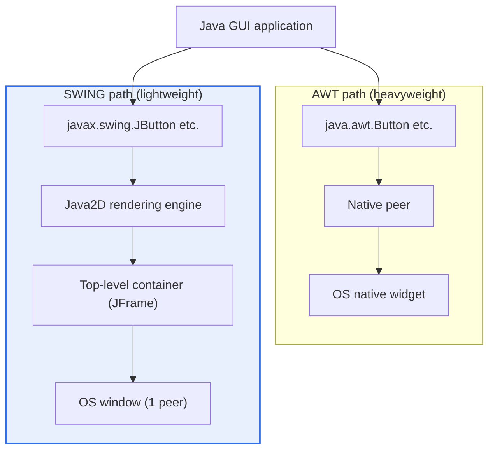
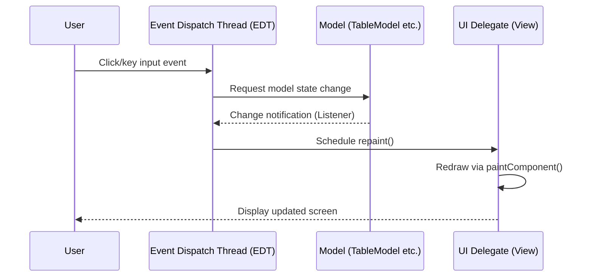
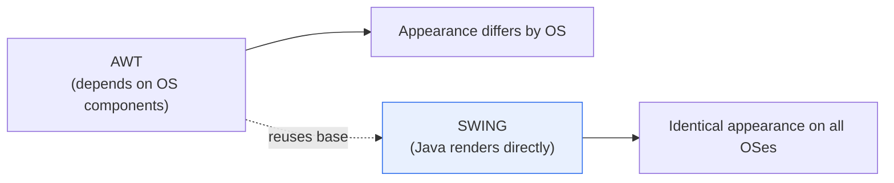

# Java AWT and SWING

## 1. Overview

### A. Concept

> **AWT** (Abstract Window Toolkit) and **SWING** are standard libraries in Java for **implementing a GUI (Graphical User Interface)**. AWT is the early approach (heavyweight) that relies on the operating system's native components, while SWING is the successor approach (lightweight) in which Java itself draws the screen to increase platform independence.

The fundamental reason for comparing the two libraries side by side lies in the question, '**how does one realize Java's ideal of platform independence (Write Once, Run Anywhere, WORA) in the GUI, the most OS-dependent area?**' Server and computation logic port to JVM bytecode without much difficulty, but the parts attached to the screen and input devices — windows, buttons, fonts, mouse events — are implemented very differently on each operating system, making 'write once, run identically everywhere' the hardest point to keep. The design difference between AWT and SWING is precisely two generations of solutions that solved this difficulty in different ways.

The early **AWT** (JDK 1.0, 1996) took the approach of directly using the native GUI components each operating system already provides (Windows buttons, X Window windows, etc.). A single `java.awt.Button` in Java code maps 1:1 to a real button (peer) that exists in the OS. This approach yields fast rendering and a familiar OS-native look because it uses the widgets the OS has optimized, but precisely because each OS's components differ in appearance, size, and behavior, the screen varies by platform, and one can use only the 'least common multiple' of widgets that all OSes have in common, greatly limiting expressiveness. This ran head-on against the ideal of 'identical everywhere' that Java espoused.

What improved this limitation is **SWING** (JDK 1.2, 1998, part of the JFC). SWING does not rely on the OS's native widgets; Java itself draws the pixels directly. Only the top-level window (JFrame·JDialog) attaches to an OS resource (peer), and the buttons, tables, trees, and other components within it are all pictures Java draws. Thanks to this, it guarantees the same appearance and behavior on any OS, and provides rich components such as tables (JTable), trees (JTree), and tabs (JTabbedPane) as well as free replacement of the Look & Feel. However, because Java draws directly, in its early days (late 1990s to early 2000s), when hardware performance was low, it was sometimes criticized as 'heavy and slow.' In short, the evolution from AWT to SWING can be summarized as a process of pursuing a truly platform-independent GUI by escaping native dependence.

### B. Background and Necessity

The essential tension a GUI framework must resolve is '**native affinity (fast, OS-standard appearance) versus platform consistency (identical appearance, rich expression)**.' AWT chose the former and lost the latter; SWING partly gave up the former for the latter. This trade-off is an enduring theme of GUI design that recurs even in today's cross-platform frameworks (Electron, Flutter, React Native), which is why the AWT/SWING contrast frequently appears on exams not as mere Java-syntax knowledge but as material for understanding the 'archetype of GUI-architecture choice.'

## 2. Architecture — Lightweight vs. Heavyweight Components

The technical core that divides AWT and SWING is whether a component maps to an OS resource — that is, the distinction between **heavyweight** and **lightweight**. The structural diagram below contrasts where the two approaches place drawing responsibility among the application, JVM, and OS.

A **heavyweight component (AWT)** has each component occupy one native OS resource, that is, a peer. Creating 100 buttons amounts to creating 100 OS widgets. This approach imposes a small burden on the Java side and responds quickly because the OS handles drawing and events on its behalf, but it consumes many OS resources called peers and its behavior diverges by OS. Also, because a heavyweight component is always drawn above lightweight components — a 'Z-order overlap' problem — mixing AWT and SWING sometimes caused menus to be hidden behind other components.

A **lightweight component (SWING)** does not have its own OS resource; Java draws it directly onto the screen area of the top-level heavyweight container (such as JFrame) that contains it. No matter how many components there are, the actual OS windows are only the few top-level ones, so resource efficiency is good, and because Java controls all drawing, it produces a completely identical screen regardless of the OS. Expressions difficult with native widgets — transparent areas, rounded corners, custom painting — are also free. This principle that 'Java draws it all' is the source of SWING's platform independence and rich expressiveness.

| Category | Heavyweight | Lightweight |
|---|---|---|
| **Representative** | AWT | SWING |
| **OS resource (peer)** | Occupied per component | Only the top-level container occupies one |
| **Drawing agent** | OS | Java (Java2D) |
| **Appearance consistency** | Differs by OS | Identical on all OSes |
| **Customization** | Limited | Free |

## 3. MVC Structure and the Rendering Pipeline

Another design strength of SWING is that each component has an **MVC (Model-View-Controller) variant structure**. For example, JTable separates the model holding the data (TableModel), the view responsible for screen presentation (renderer/UI Delegate), and the controller responsible for editing and interaction. The diagram below shows the process by which user input passes through the Event Dispatch Thread (EDT) to update the model and view and reflect it on the screen.

The **practical meaning of model-view separation** stands out on screens that handle large data. When drawing a table of tens of thousands of rows, the model holds only the data and the view renders only the visible portion, so memory and performance can be saved. Multiple views sharing the same model, or changing only the Look & Feel to apply a different appearance, is also thanks to this separation. This is the same principle as today's state-view separation in the front end (React, etc.), showing that SWING adopted a design ahead of its time.

The **Event Dispatch Thread (EDT) rule** is the most frequently mistaken point in SWING development. Because SWING components are not thread-safe, all UI updates must be performed on the single EDT thread. If a long-running task (file I/O, network) is run on the EDT, the screen freezes, so the orthodox pattern is to process it on a background thread with `SwingWorker` and pass only the result to the EDT to update the screen. Violating this rule causes intermittent rendering errors or deadlock, and this 'single UI thread' model became a common principle later shared by most GUI frameworks.

**Pluggable Look & Feel** is a symbolic feature of SWING. A single line of `UIManager.setLookAndFeel(...)` can change the appearance wholesale to Metal (Java default), Nimbus, or the System L&F, which mimics each OS. This is possible because Java draws directly, giving the flexibility of "mimicking each OS's native feel with the same code, but a completely unified appearance when needed."

## 4. AWT vs. SWING Comparison and Real Cases

The two libraries are in a relationship of **inheritance and extension**, not replacement. SWING did not discard AWT; it reused AWT's fundamental infrastructure — the event-handling model (Delegation Event Model), layout managers (BorderLayout, GridLayout, etc.), graphics (Graphics), and color — as-is, and only rebuilt the component hierarchy as lightweight. That is why, even when writing a SWING application, one imports and uses the layout and event classes of `java.awt.*` together. This fact is the key point that corrects the common misconception that "SWING completely replaced AWT."

| Category | AWT | SWING |
|---|---|---|
| **Component** | Heavyweight (native peer) | Lightweight (Java rendering) |
| **Platform independence** | Low (differs by OS) | High (identical presentation) |
| **Number of components** | Basic·limited | Rich (table·tree·tab) |
| **Look & Feel** | Fixed to OS | Replaceable (Pluggable) |
| **MVC separation** | Weak | Strong (model-view separation) |
| **Package** | java.awt | javax.swing |
| **Naming convention** | Button, Frame | JButton, JFrame (J prefix) |
| **Relationship** | Base infrastructure | AWT-based extension |

The difference becomes clear when seen through concrete cases. First, comparing the **integrated development environment (IDE)** IntelliJ IDEA with the older Eclipse family, IntelliJ is SWING-based and provides nearly identical screens on all OSes, whereas Eclipse is based on SWT/JFace, which uses native widgets, so its appearance differs by OS — a representative case showing that even within the same Java camp, the choice of 'consistency vs. native' diverged. Second, in-house **trading and account-system clients in the financial sector** and various **enterprise management consoles** were built en masse with SWING (displaying large data with JTable) in the 2000s and are still maintained today. Third, Oracle's database management tools and installation wizards, too, are written in SWING and operate identically on Windows, Linux, and Mac. Thus, SWING's value was great in tools and internal systems that must 'deploy to multiple OSes but unify the screen.'

## 5. Deep Dive — Evolution into JavaFX and Its Modern Position

The generation succeeding AWT·SWING is **JavaFX** (first released 2008, becoming a Java API from JavaFX 2.0). JavaFX improved on SWING's limitations in several respects. First, its **Scene Graph**-based architecture treats the screen as a tree-structured object, naturally supporting animation, effects, and transformation. Second, it introduced **CSS styling** and **FXML** (declarative UI markup) to separate design from logic and provide a manner familiar to web developers. Third, with a GPU-accelerated rendering pipeline (Prism), it handles rich media, charts, and 3D. It also has a built-in data-binding (Property/Binding) function to support model-view synchronization at the language level.

A notable change is that **from JDK 11 (2018), JavaFX was separated from the JDK** and is distributed as a separate module (OpenJFX). That is, Oracle detached JavaFX from the core JDK and handed it over to the open-source community (Gluon, etc.), and JavaFX is now added and used as a Maven/Gradle dependency. By contrast, **AWT and SWING are still included in the standard JDK**, and Oracle maintains them as stable legacy with 'no plans for removal.' Ironically, the successor JavaFX is dropped from the core while the older SWING remains, so in practice SWING often keeps its position as the default for Java desktop.

Meanwhile, in the broader trend, the center of gravity of GUIs has shifted from the desktop to the **web and mobile**. Today, new applications are made with the browser (SPA), mobile apps, and cross-platform frameworks like Electron/Flutter, and the share of new adoption of Java desktop GUIs has declined. Even so, AWT·SWING continue in active use in the UIs of industrial control and instrumentation equipment, internal tools in finance and the public sector, and the maintenance of already-built large-scale SWING assets.

## 6. Considerations and Implications

From a professional engineer's perspective, AWT·SWING should be read not as knowledge of a single library but as a lens on GUI-architecture decisions.

1. **The trade-off between platform independence and performance·native affinity.** AWT is native, so it is fast and gains the OS-standard appearance but loses consistency and expressiveness; SWING gains consistency and rich expression but bears the rendering burden. This opposition recurs as-is in the choice of Electron (consistency via web technology, heavy memory), Flutter (consistency via its own rendering), and React Native (affinity via native widgets), so it must be weighed carefully when deciding the GUI stack of a new project.

2. **Legacy maintenance and modernization strategy.** A considerable number of Java enterprise clients are written in SWING and still in operation. When dealing with these, one must choose among (a) continued maintenance, (b) gradual migration to JavaFX, and (c) rebuilding as web (SPA)·lightweight client, considering the organization's personnel, lifespan, and cost. Not knowing principles such as the EDT rule and SwingWorker makes it easy to create subtle bugs during modernization.

3. **The universality of the single-UI-thread model.** SWING's EDT rule (all UI updates on one thread, heavy work in the background) became a common principle later shared by nearly all GUI frameworks. Understanding this concept accurately makes it possible to apply UI responsiveness and concurrency design consistently even when moving to another framework.

4. **The pioneering of architectural separation (MVC).** SWING's model-view separation is a case that implemented, ahead of its time, the state-view separation philosophy of today's front end. The design principle of separating data, presentation, and interaction is an asset that persists even as the framework changes, so the design sense gained by learning legacy is transferable to a new stack.

5. **The risk-management perspective of standard inclusion.** The fact that JavaFX was separated from the JDK (JDK 11), requiring separate dependency management, while SWING/AWT remain in the core, shows that in technology selection, 'the vendor's long-term support and inclusion in the standard' is a judgment criterion as important as performance and features.

## References

- Oracle, "The Swing Tutorial (The Java Tutorials)" — https://docs.oracle.com/javase/tutorial/uiswing/
- Oracle, "AWT (java.awt) API Documentation" — https://docs.oracle.com/en/java/javase/17/docs/api/java.desktop/java/awt/package-summary.html
- OpenJFX, "JavaFX — Getting Started / Modular distribution" — https://openjfx.io/

---

> **In one line**: AWT is a *heavyweight GUI that depends on OS-native components*, while SWING is a *lightweight GUI in which Java draws directly with Java2D to provide platform independence, rich components, MVC separation, and Look & Feel replacement*; SWING extended atop AWT's foundation to overcome its limits, and although it later led to JavaFX with its scene graph, CSS, and GPU acceleration, SWING/AWT remain in the standard JDK and are still in active use in legacy and internal tools.
