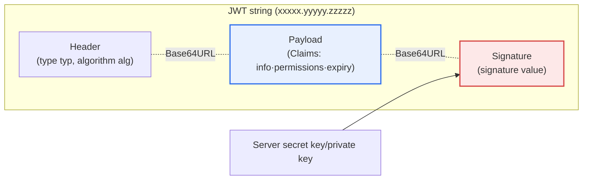
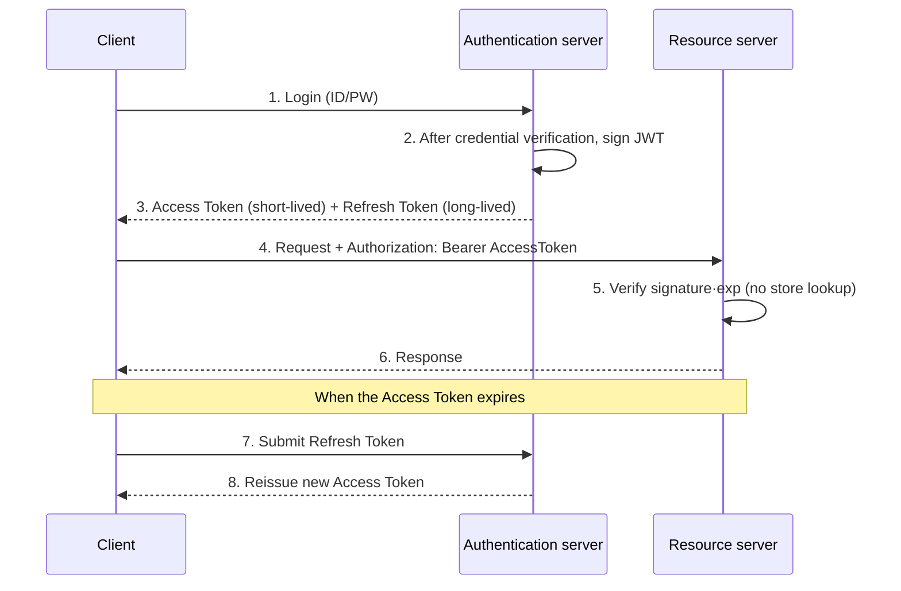

# JWT (JSON Web Token)

## 1. Overview

### A. Concept
> **JWT** is a token (standard: RFC 7519) that contains the **information (Claims) needed for authentication and authorization in JSON form and digitally signs it**, enabling a server to authenticate users without storing sessions (stateless). It is expressed as a single string (`xxxxx.yyyyy.zzzzz`) by encoding three parts separated by dots (.) in Base64URL.

The fundamental reason JWT is widely used lies in the fact that it '**lets the server not have to remember the login state**.' To understand the background of this idea, one must first note the structural burden of the traditional session approach. In the session approach, when a user logs in, the server issues a session identifier (Session ID) and keeps that session's actual state (user ID, permissions, login time, etc.) in server memory, a DB, or a separate session store. Thereafter, on every request, it looks up the store with the session ID sent by the client to confirm the user. That is, the 'Source of Truth' resides in the server-side store.

This structure is no problem on a single server, but in a distributed·cloud environment with multiple servers, it immediately becomes a bottleneck. Because one does not know which server a request will be routed to, all servers must be able to see the same session, and for this one must either pin to a specific server with a sticky session or place a central session store like Redis to share it. The former hinders load balancing and zero-downtime deployment, while the latter makes the store a single point of failure (SPOF) and a performance bottleneck. When traffic reaches tens of thousands of requests per second, the session lookup that occurs on every request is itself a burden.

JWT inverts this idea. It **puts the information needed for authentication into the token itself and signs it**, and the client keeps this token and submits it on every request. The server only needs to verify the token's signature and does not need to look up a separate store. If the signature is valid, it trusts the token's contents. By thus moving the source of truth from the server store to the token itself, the server becomes stateless, and no matter which server a request goes to, it only needs to verify. That is why it suits authentication in distributed environments where servers scale horizontally, such as MSA, API gateways, mobile, and SPAs. However, this self-containment carries a price — the characteristic that once issued, a token is hard for the server to forcibly invalidate before expiry — and this trade-off governs the entire design that follows.

### B. Characteristics
JWT's characteristics can be summarized in four points. First, **server statelessness (Stateless)** — the server does not keep sessions, so horizontal scaling is easy. Second, **self-containment (Self-contained)** — the information needed for verification is inside the token, so it is processed without external lookup. Third, **signature-based integrity (Integrity)** — the signature detects forgery and tampering, but the key point is that a signature is not 'hiding the content (confidentiality)' but 'guaranteeing the content has not been changed (integrity).' Fourth, **portability (Portability)** — being a universal format of JSON and Base64URL, it is used across languages, platforms, and domains. These characteristics are interlocked: statelessness yields scalability, self-containment makes statelessness possible, and the price is the limitation of the difficulty of invalidation.

## 2. The Structure and Components of JWT

JWT has a structure in which the three parts Header, Payload, and Signature are joined by dots (.). Below is the overall structural diagram.

**A. Header.** The header holds the token's metadata. Its core fields are `typ`, which indicates the token type (usually `JWT`), and `alg`, which indicates the algorithm used for signing (e.g., `HS256`, `RS256`). Why the header matters is that the verifying side reads here 'with which algorithm it should verify.' This very point is also the starting point of a famous security vulnerability. Attacks are known in which an attacker changes `alg` to `none` (skipping signature verification) or swaps an asymmetric method (RS256) for a symmetric one (HS256) to abuse the public key as if it were the secret key. Therefore, in practice, the server must not trust the header's `alg` as-is but must fix the allowed algorithms in the server configuration (Allowlist) and verify accordingly.

**B. Payload and Claims.** The payload is a set of claims, the actual information. Claims are divided into three kinds. **Registered claims** are reserved words defined by the standard: `iss` (issuer), `sub` (subject), `aud` (audience), `exp` (expiration time), `iat` (issued at), `nbf` (not before), and `jti` (token unique ID). **Public claims** are named with URIs and the like to avoid collisions, and **private claims** are user-defined values agreed upon between the issuer and the user (e.g., `role`, `dept`). The principle to remember here without fail is that **the payload is signed but not encrypted**. Because Base64URL is encoding, not encryption, anyone can decode and read the contents. Therefore, sensitive information such as passwords, national ID numbers, and card numbers must never be placed in it, and if it must be included, it must be separately encrypted with JWE (JSON Web Encryption).

**C. Signature.** The signature is generated with a key the server holds, taking `Base64URL(Header) + "." + Base64URL(Payload)` as input. The symmetric-key method (HS256) both signs and verifies with a single secret key, while the asymmetric-key methods (RS256·ES256) sign with a private key and verify with a public key. The signature's role is to guarantee integrity — if even one character of the payload is changed, the signature no longer matches and verification fails. So the management of the signing key is the vital point of JWT security. In HS256, if the secret key leaks, an attacker can forge arbitrary tokens, and if the key is short, it can be broken by brute force. In an MSA environment where multiple services only verify, RS256, which only requires distributing the public key to the verifying side, becomes a safer choice by reducing the risk of key exposure.

One more thing to note is the **token size**. The more claims — permissions, roles, department — are put in the payload, the larger the token becomes, and this token travels in the HTTP header of every request. For example, if excessive claims make the token reach several KB, in an environment of thousands of requests per second, the cumulative bandwidth and header-parsing cost become non-negligible. Because some web servers and proxies impose a header-size limit (e.g., 8KB), a request itself may be rejected if the token exceeds it. Therefore, it is desirable to design the payload to hold only the minimum claims essential for authentication and authorization, and to have the server look up detailed information when needed.

The table below organizes the three components; the 'why' of each element was explained in the paragraphs above.

| Component | Content | Practical caution |
|---|---|---|
| **Header** | Token type (`typ`), signing algorithm (`alg`) | Fix allowed algorithms on the server to prevent `alg` forgery |
| **Payload** | Claims (registered/public/private): user·permissions·`exp` etc. | Not encryption → no sensitive info, `exp` required |
| **Signature** | Header+Payload signed with a key | Key management is the vital point; RS256 recommended for MSA |

## 3. Authentication·Authorization Flow and Token Strategy

The following is a detailed diagram of the process from login to request verification and reissuance upon expiry.

**A. Issuance and submission.** When a user logs in with an ID and password, the authentication server verifies the credentials and then issues a JWT that contains the information and is signed. The client keeps this and thereafter sends it in the HTTP header of subsequent requests in the form `Authorization: Bearer <token>`. Because the resource server only needs to verify the signature and expiration time, the round-trip cost of a session-store lookup disappears. In fact, in large-scale APIs, this difference noticeably reduces response latency and store load.

**B. The trade-off of storage location.** Where the client places the token is a core decision of security design. **Local storage** is easy to handle but is accessed by JavaScript, so the token can be stolen wholesale in an XSS (Cross-Site Scripting) attack. Conversely, an **`HttpOnly` cookie** blocks script access and is strong against XSS, but because the browser automatically attaches the cookie, it is exposed to CSRF (Cross-Site Request Forgery). So in practice, the method of placing the token in an `HttpOnly`+`Secure`+`SameSite` cookie and using a CSRF token alongside it is frequently recommended. Because neither side is a panacea, one must choose according to the threat model.

**C. Access·refresh token strategy.** The standard pattern that mitigates JWT's greatest weakness — the difficulty of forced invalidation — is the dual-token structure. The **access token** is given a short lifetime (e.g., 5–15 minutes) so that even if it is stolen, the damage window is minimized. Instead, to eliminate the inconvenience of the user logging in every time, a long-lived **refresh token** (e.g., days to weeks) is issued separately, and when the access token expires, it is submitted to reissue a new access token. Because the damage from a stolen refresh token is large, the server stores and manages it (rotation, reuse detection), and at this point JWT partly yields its complete statelessness and reintroduces server state. That is, in practice JWT is not 'pure statelessness' but chooses a 'balance point between the benefits of statelessness and control of invalidation.'

**D. The quantitative trade-off of lifetime setting.** Token lifetime is a weighing between security and usability. For example, extending the access token's lifetime to 60 minutes reduces reissuance calls, lowering server load and latency, but if the token is stolen, unauthorized access is possible for up to 60 minutes. Conversely, reducing the lifetime to 5 minutes shrinks the theft-damage window to one-twelfth, but the reissuance traffic to the authentication server becomes roughly 12 times greater. So in practice, the higher the risk of a domain, the shorter the access token is set — on the order of minutes — and usability is preserved with refresh-token rotation. Since a single number of 'how many minutes' thus simultaneously governs security, performance, and usability, the lifetime setting must be decided based on a domain risk assessment.

## 4. Comparison with the Session Approach

The core of the comparison is 'where the source of truth resides.' The session places it in the server store, JWT in the token itself. From this single difference derive all differences in scalability, invalidation, and data exposure.

| Category | Session | JWT |
|---|---|---|
| **State storage** | Kept in server (store) | Client keeps the token, server stateless |
| **Scalability** | Requires session sharing·synchronization (burden) | Easy horizontal scaling |
| **Invalidation** | Can delete immediately from the store | Hard to forcibly discard before expiry |
| **Request cost** | Store lookup on every request | Signature verification only (no lookup) |
| **Data exposure** | Kept in server (little exposure) | Payload can be decoded (no sensitive info) |

The reason a session is strong at invalidation is that the truth is on the server, so deleting it is the end of it, and the reason JWT is weak at invalidation is that the truth is already replicated to the token in the client's hands, leaving the server no means to recover it. Conversely, the reason JWT leads in scalability comes from the same root — since the server has no state to hold onto, it can freely add servers. The practical implication is clear. Banking and admin consoles that frequently need immediate forced logout and session invalidation favor sessions (or a mix with sessions), while large-scale stateless APIs and MSAs favor JWT. So the answer is not 'which is better' but 'what to optimize for.'

## 5. Deep Dive: Recent Trends and Practical Application Cases

**A. Combination with OAuth 2.0·OIDC.** Today, JWT is used not standalone but standardized as the access-token format of **OAuth 2.0** and the ID-token format of **OpenID Connect (OIDC)**. An OIDC ID token is effectively a JWT and conveys, in a standard way, 'who authenticated' via claims such as `iss`, `aud`, `exp`, and `sub`. Social logins from Google, Apple, Kakao, and the like, and IdPs (Identity Providers) such as Auth0, Okta, and Keycloak, are all based on this combination. In large-scale services, the IdP publishes a list of public keys at a **JWKS (JSON Web Key Set)** endpoint, and each resource server downloads this to verify tokens. This method makes key rotation possible without code changes on the verifying side, simplifying key management in an environment composed of dozens to hundreds of microservices.

**B. Practical cases in MSA·zero trust.** Large-scale MSAs represented by Netflix and Uber verify JWT first at the API gateway, and even in internal service-to-service calls they propagate the token (Token Propagation) so that each service independently judges authorization. This connects with the zero-trust principle of **verifying all requests**, abandoning perimeter-based security that 'trusts the internal network.' However, because of the invalidation limit of self-contained tokens, in practice the settled pattern is to set the access-token lifetime short — on the order of minutes — and combine refresh-token rotation with theft detection. The combination of the gateway verifying the token and then re-signing it internally in a lighter form, or guaranteeing service-to-service trust at a separate layer with the service mesh's mutual TLS (mTLS), is also widely used.

**C. Anticipated exam directions and answer-composition strategy.** From a professional engineer's perspective, JWT requires more than 'explaining the concept'; one earns high marks by connecting ① the trade-off with sessions (scalability vs. invalidation), ② security design grounded in the fact that the payload is a signature, not encryption (no sensitive info·HTTPS·`exp`), ③ the access/refresh dual token and rotation, and ④ the extension into OAuth2/OIDC·MSA·zero trust. Presenting concrete threats such as `alg` confusion attacks (none·RS↔HS) or storage location (XSS vs. CSRF) with their rationale can reveal depth.

## 6. Considerations and Implications

From a professional engineer's perspective, JWT is not a matter of whether to adopt a single technology, but of how to balance the conflicting factors of scalability, security, and operational complexity in the domain context. The implications below organize the judgment criteria for striking that balance.

1. **Security design is a premise, not an option.** Because the payload is not encrypted, do not put sensitive information in it; always transmit over HTTPS (TLS); use a strong signing algorithm and a sufficiently long key; and fix the header's `alg` with a server allowlist to block algorithm-confusion attacks. Not omitting the verification of `exp`, `aud`, and `iss` is also basic.

2. **Complement the invalidation limit with architecture.** Because an issued JWT is hard to forcibly discard before expiry, to handle logout and theft, combine a short access-token lifetime, refresh-token rotation·reuse detection, and a `jti`-based blacklist (or a token version·issue-time cutoff). Since this is a decision to partly give up pure statelessness, one must explicitly choose the balance point between the benefits of statelessness and the need for control.

3. **Design storage location and threat model together.** Because local storage (XSS-vulnerable) and `HttpOnly` cookies (CSRF-vulnerable) are exposed to different threats, one must decide the storage location to fit the service's threat model and run XSS prevention (CSP·input validation) and CSRF prevention (SameSite·CSRF token) alongside.

4. **Pursue alignment with standards and the ecosystem.** Adopting proven standards and IdPs such as OAuth 2.0·OIDC·JWKS is advantageous over building one's own authentication in terms of key rotation, interoperability, and audit. In MSA in particular, the combination of RS256/ES256, which distributes only the public key to the verifying side, and JWKS reduces the risk of key exposure.

5. **Maintain the perspective of appropriate technology choice.** JWT is not a panacea. Because a domain with frequent immediate invalidation·forced logout may be better suited to sessions or a mixed approach, it is the professional engineer's judgment to compare with sessions along the axes of scalability, invalidation, and operational complexity and choose the approach suited to the domain. [[msa]]

## References
- RFC 7519, JSON Web Token (JWT) — https://datatracker.ietf.org/doc/html/rfc7519
- RFC 8725, JSON Web Token Best Current Practices — https://datatracker.ietf.org/doc/html/rfc8725
- OWASP JSON Web Token Cheat Sheet — https://cheatsheetseries.owasp.org/cheatsheets/JSON_Web_Token_for_Java_Cheat_Sheet.html

---

> **In one line**: JWT is a *stateless token that contains and signs authentication information*, composed of Header·Payload·Signature; placing the source of truth in the token itself, it excels at MSA·API authentication, but the facts that the payload is a signature rather than encryption and the limit of forced invalidation must be complemented with HTTPS·short expiry·refresh-token rotation·combination with standards (OAuth2/OIDC).
