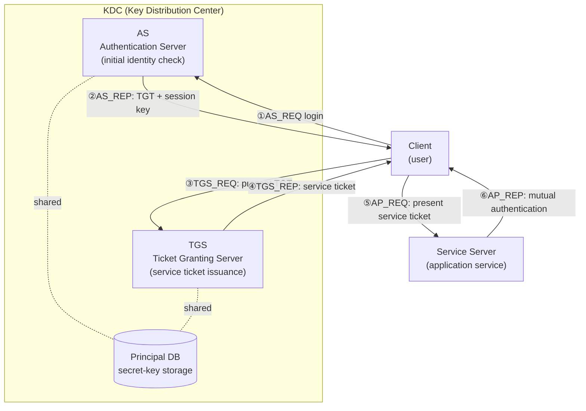
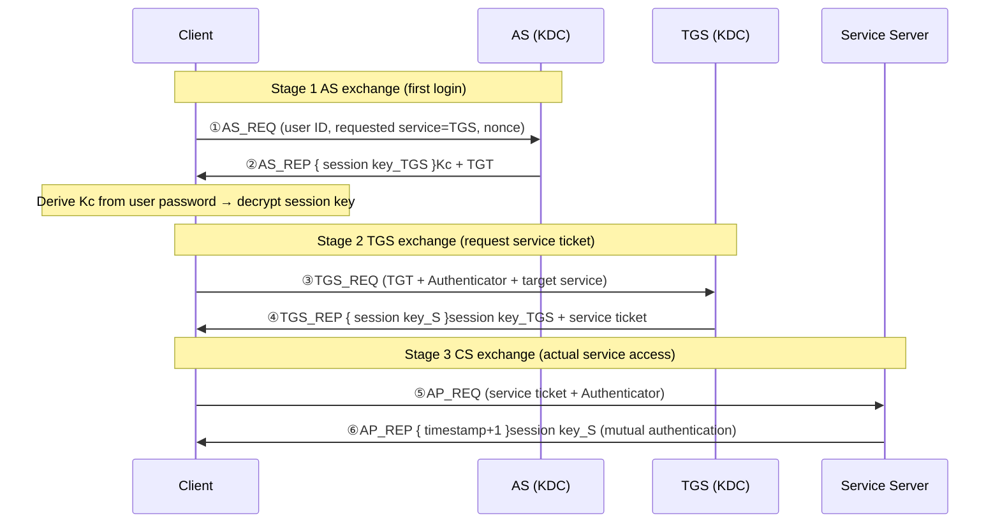

# The Kerberos Authentication Protocol

## 1. Overview

> **Kerberos** is a **network authentication protocol** that mutually authenticates users and services on an open network, centered on the **KDC (Key Distribution Center)** — a trusted third party (TTP) — using symmetric-key cryptography and **ticket**-based credentials.

Kerberos began with MIT's Project Athena in the 1980s and was designed to perform authentication securely even over an untrusted network. Its name derives from Cerberus, the three-headed dog that guards the gate of the underworld in Greek mythology, which is a metaphor for the structure whereby Kerberos establishes authentication through the interaction of three parties — the **client, the server, and the KDC**. The version widely used today is **Kerberos v5**, standardized in RFC 4120 (2005); it is the default protocol for Microsoft **Active Directory** domain authentication and has established itself as the SSO foundation technology for Linux and Unix environments.

The fundamental background to Kerberos's emergence is the **danger of transmitting plaintext passwords** and the **inefficiency of repeated authentication**. Early protocols such as Telnet, FTP, and rlogin sent the password over the network each time they authenticated, defenseless against sniffing. Moreover, having a user enter and transmit credentials each time they accessed multiple services was harmful to both usability and security. Kerberos achieves two goals simultaneously: **not transmitting the password over the network** (proving identity by whether one can decrypt ciphertext with the symmetric key derived from the password), and **accessing multiple services with a single login** (SSO).

Kerberos's design philosophy is summarized in three principles. First, it implements **mutual authentication using only symmetric-key cryptography**, operating without the complex certificate management of a public-key infrastructure (PKI). Second, the **KDC serves as a central trust point that holds the secret keys of all parties**, so N parties need only share a key with the KDC, avoiding the N×N individual key-exchange problem. Third, it prevents replay attacks with **timestamps and short-lived tickets**. Thanks to these three principles, Kerberos functions as a scalable authentication infrastructure within the internal networks of large organizations.

Kerberos's characteristics can be summarized as follows.

- **Passwordless on wire:** It confirms identity by whether decryption with the symmetric key derived from the password succeeds, and the password itself is not sent over the network.
- **SSO (Single Sign-On):** It reuses the TGT obtained at the first login to receive multiple service tickets, so repeated authentication is unnecessary.
- **Mutual Authentication:** Not only the client but also the server proves possession of the session key, preventing connections to a forged (phishing-type) server.
- **Symmetric-key-based scalability:** Each party need only share a key with the KDC, so key management stays linear even as the organization grows.
- **Time dependency:** Because it relies on timestamps for replay defense, precise time synchronization is a prerequisite for its operation.

## 2. Kerberos Components and Overall Structure

Kerberos consists of the KDC, which handles authentication, and the clients and service servers that use it. The KDC is logically divided into two functions — the **AS (Authentication Server)** and the **TGS (Ticket Granting Server)** — and shares a **database** that holds the long-term secret keys of all principals. This separated structure is the core of Kerberos: the AS handles the 'first login' and the TGS handles 'access to individual services,' minimizing password exposure.

The core components explained in prose are as follows.

**A. KDC and Realm.** The KDC is the heart of Kerberos, holding the master keys of all users and services in the organization. The administrative domain managed by one KDC is called a **Realm**, conventionally written in uppercase (e.g., `EXAMPLE.COM`). Within one Realm, because the KDC knows the keys of all principals, it can, as a mediator, securely distribute a session key between two strangers. This, however, means that **the KDC is a single point of failure (SPOF) and a highest-value target**. If the KDC is compromised, the identity of the entire Realm can be forged, so in practice one places a master KDC and multiple read-only replica KDCs (slaves) to secure availability, and strongly isolates the KDC servers physically and logically.

**B. Ticket and TGT.** A ticket is an encrypted credential by which the KDC guarantees that "this client may access this service." Inside a ticket are the client identity, session key, validity period, issuance time, and the like, and it is **encrypted with the target service's secret key**, so the client cannot read its contents and merely relays it. In particular, the ticket the AS issues at the first login is called the **TGT (Ticket Granting Ticket)**, which is an 'all-purpose pass' for later receiving individual service tickets from the TGS. The introduction of the TGT is Kerberos's decisive idea: the user uses the password-derived key only once at login and thereafter presents only the TGT, so the password is not repeatedly exposed.

**C. Session Key and Authenticator.** A session key is a temporary symmetric key valid only during a specific communication session, generated by the KDC and securely delivered to both sides. When the client accesses a service, it sends, along with the ticket, an **Authenticator**, which is the client identity and the **current timestamp** encrypted with the session key. The server decrypts the Authenticator with the session key inside the ticket and verifies the freshness of the timestamp, thereby preventing an attacker who intercepted the ticket from replaying it later. The core of replay defense is that the ticket is reusable but the Authenticator is single-use per request. At this time, the server remembers, within a short time window (replay cache), Authenticators it has already seen and filters out duplicate submissions of the same timestamp, thereby blocking even ultra-fast replays within the time window.

**D. Ticket Options (Flags) and Lifetime Management.** A ticket carries flags that control its use. A **renewable** ticket can extend its validity period by resubmitting to the KDC before expiry, within the maximum lifetime (max renew) limit, thereby avoiding re-authentication during long-running batch jobs while keeping each ticket's absolute lifetime short. A **forwardable** ticket allows a remote server the user has accessed to access yet another service on the user's behalf (delegation) and is used in multi-tier applications (web→WAS→DB) to pass the end-user's identity backward. However, because delegation has the server act on the user's behalf, there is a risk of misuse, so in practice one limits delegation to specific services with **Constrained Delegation**. Ticket lifetime is a typical trade-off — the shorter it is, the smaller the theft-damage window but the greater the reissuance load — so organizations adjust policy values such as a 10-hour TGT and several-hour service tickets according to the security grade.

## 3. The Kerberos Authentication Procedure (Detailed)

Kerberos v5 authentication logically consists of three stages and six messages: **AS exchange → TGS exchange → CS (Client/Server) exchange**. The sequence below shows what is encrypted with which key in each message.

**A. AS Exchange — Initial Authentication and TGT Acquisition.** When the user logs in, the client sends `AS_REQ` containing its ID, a request to "use the TGS service," and a random number (nonce) for replay prevention to the AS. The notable point is that **the password is not sent**. The AS pulls the user's secret key (derived from the password hash, `Kc`) from the DB and composes the response `AS_REP`, which contains (i) the session key for the client and TGS encrypted with `Kc` and (ii) the **TGT** encrypted with the TGS's secret key. If the client succeeds in decrypting (i) by creating `Kc` from the password the user just entered, its being the genuine user is thereby proven. If the password is wrong, decryption fails and authentication is annulled, so the AS confirms identity by 'whether decryption succeeds' without needing to verify the password itself. This is the principle by which Kerberos authenticates without letting the password flow over the network.

A practical point to note here is that in the early design without pre-authentication, an attacker could send `AS_REQ` with an arbitrary user ID, receive the response encrypted with `Kc`, and attempt an **offline dictionary attack (AS-REP Roasting)**. So Kerberos v5 introduced **PA-ENC-TIMESTAMP pre-authentication**, in which the client attaches a timestamp encrypted with `Kc` in the request, hardening it so that only one who knows the correct password can make a valid request.

**B. TGS Exchange — Service Ticket Acquisition.** Now the client wants to access a specific service (e.g., a file server). The client sends `TGS_REQ` containing the TGT received earlier, an Authenticator encrypted with the session key, and the name of the target service. The TGS decrypts the TGT with its own key to obtain the session key inside, and decrypts the Authenticator with that session key to verify timestamp freshness. On successful verification, the TGS generates a new **service session key** and makes it into (i) a part encrypted with the TGT session key and (ii) a **service ticket** encrypted with the target service's secret key, returning `TGS_REP`. The beauty of this stage is that **the password is not needed again**. The user used the password only once at login, and thereafter receives multiple service tickets with the TGT alone, which is precisely the realization of SSO.

**C. CS Exchange — Service Access and Mutual Authentication.** The client sends `AP_REQ` to the service server, containing the service ticket and a new Authenticator. The server opens the service ticket with its own secret key to obtain the session key, and decrypts the Authenticator with that key to verify the timestamp. The server thereby authenticates the client. Furthermore, if **mutual authentication** is needed, the server adds 1 to the Authenticator's timestamp, encrypts it with the session key, and returns `AP_REP`; the client decrypts this and confirms that the server is a legitimate server that knows the real session key (i.e., not a forged server). Thereafter, the two sides continue communication with confidentiality and integrity guaranteed by the established session key.

## 4. Comparison — Kerberos vs. Other Authentication Methods

Kerberos's position becomes clear when contrasted with other authentication methods. The table below is a supplementary summary; the reasons the differences arise are explained in the sentences beneath it.

| Category | Kerberos | PKI/certificate (X.509) | SAML/OAuth·OIDC | Simple password |
|------|----------|-------------------|------------------|----------------|
| Trust model | Symmetric key·central KDC (TTP) | Public key·CA hierarchy | IdP-centered token | None (server-stored) |
| Crypto method | Symmetric key | Asymmetric key | Signed token (JWT etc.) | Hash storage |
| Main application | Organizational internal-network SSO | Internet·digital signature | Web·cloud SSO | Small scale |
| Replay defense | Timestamp·short ticket | Nonce·signature | Token expiry·nonce | Vulnerable |
| Scalability limit | Realm boundary·time sync | Certificate-management burden | IdP dependence | Very low |

The fundamental difference between Kerberos and PKI comes from the **key-management method**. Because Kerberos is symmetric-key, the KDC must know all keys, so it is powerful within the organizational boundary (Realm) but unsuitable for authentication between two arbitrary parties on the internet who do not know each other. PKI, by contrast, is public-key, so it can convey trust via a CA's signature even between strangers who have not shared keys in advance, and is used in internet e-commerce and digital signatures. Therefore, Kerberos (AD) suits SSO for bank internal-employee systems, while PKI suits external web payments and accredited digital signatures.

To give a numerical sense of this difference, PKI requires only one certificate (public key) per party for N parties, whereas the method of having any two arbitrary parties directly share a symmetric key requires N(N−1)/2 keys. Kerberos circumvents this problem via the central point of the KDC, mediating authentication of any pair with **only N keys (one per party-KDC pair)**, so key management does not explode even in an organization of thousands of people. This is the basis of the scalability that made Kerberos the de facto standard for large-scale internal-network SSO.

The relationship between Kerberos and SAML/OIDC is closer to **layered complementarity** than replacement. Kerberos is strong at OS- and service-level authentication on the internal network, but it is hard to handle in web and cloud environments that cross firewalls, due to time-synchronization requirements and firewall-traversal issues. So large enterprises configure hybrid SSO in which they first authenticate internally with Kerberos (AD) and then have an IdP such as **AD FS** or Keycloak convert this into a SAML·OIDC token to integrate with cloud SaaS (e.g., Microsoft 365, Salesforce). In fact, most domestic financial and public institutions connect on-premises AD with cloud services this way.

## 5. Deep Dive — Practical Application, Attack Techniques, and Defenses

Kerberos is a theoretically robust protocol, but actual security incidents arise from **operational and implementation loopholes** rather than mathematical flaws in the protocol. This section, centered on Active Directory — the most widely used implementation — examines representative attack techniques and defenses, and the modernization trend of cryptographic algorithms.

**A. Kerberos in Active Directory.** In a Windows domain, the domain controller (DC) plays the role of KDC, each service is registered with a **SPN (Service Principal Name)**, and service-account access rights are conveyed via group SIDs held in the **PAC (Privilege Attribute Certificate)** inside the ticket. When a user logs into the domain, they receive a TGT, and each time they access a shared folder, SQL Server, SharePoint, etc., a service ticket is automatically issued behind the scenes, so the user uses resources without re-logging in. This is the reality of the 'log in once and everything works' SSO experience felt in organizations.

**B. Representative Attacks and Defenses.** Kerberos is robust, but operational vulnerabilities become the attack surface. ① **Pass-the-Ticket** is an attack that reuses a ticket stolen from memory, mitigated by shortening ticket lifetime and endpoint protection (credential isolation). ② **Golden Ticket** is a fatal attack that steals the hash of the KDC's master account `krbtgt` to forge arbitrary TGTs, and periodically resetting the `krbtgt` password (twice) is virtually the only fundamental countermeasure. ③ **Silver Ticket** is a localized attack that forges only a service ticket with a specific service account's key, and ④ **Kerberoasting** is a technique that requests the service ticket of an SPN-attached service account and cracks that account's password offline; using a long, complex password (or a gMSA, group managed service account) for the service account is the defense. Because these attacks mostly originate from **weak service-account passwords, excessive ticket lifetimes, and neglect of krbtgt management**, the focus of defense is on operational hygiene rather than the protocol itself. The table below organizes the major attacks and defenses.

| Attack | Principle | Target key | Core defense |
|------|------|---------|-----------|
| Pass-the-Ticket | Reuse a stolen valid ticket | Session ticket | Shorten ticket lifetime·credential isolation |
| Golden Ticket | Forge TGT with krbtgt hash | krbtgt | Periodic double reset of krbtgt |
| Silver Ticket | Forge service ticket with service key | Service account | Protect·monitor service-account key |
| Kerberoasting | Offline crack of service ticket | Service account PW | Long password·gMSA·enforce AES |
| AS-REP Roasting | Crack accounts without pre-auth | User PW | Enforce PA-ENC-TIMESTAMP pre-auth |

**C. Cross-Realm Authentication.** Large-scale, multinational organizations are divided into multiple Realms; for a user of one Realm to access a service in another Realm, the two KDCs must share an **inter-realm key**. The user receives a 'cross-realm TGT' from their own KDC aimed at the other Realm's TGS, presents it to the other Realm's KDC, and that KDC trusts it and issues a service ticket. As the number of Realms grows, placing a trust key for every pair becomes impractical, so **hierarchical trust (tree structure)** or AD's tree·forest trust relationships shorten the path. A practical case is when a domestic large-enterprise group binds the parent company's and affiliates' domains with a forest trust to allow SSO access to group-common systems. However, the longer the trust path, the greater the risk that a compromise in one Realm propagates in a chain, so trust-relationship design is directly tied to security-boundary design.

**D. Modernization of Cryptographic Algorithms.** In the past, Kerberos supported weak ciphers such as DES and RC4-HMAC, which made Kerberoasting cracking easy. The current standard defaults to **AES128/256-CTS-HMAC-SHA1**, and RFC 8009 added an SHA-2-based AES cipher suite. In practice, it is recommended to disable RC4·DES via domain policy and enforce allowing only AES. Also, Microsoft has recently expanded **PKINIT**, which performs initial authentication with a public key to complement the limits of symmetric keys, as well as smart-card and **FIDO2** integration, showing that Kerberos is evolving from a pure symmetric-key model into a hybrid.

**E. Anticipated Exam Directions and Answer-Composition Strategy.** In the Professional Engineer of Information Management exam, Kerberos varies not only as a standalone 25-point essay but also as a 10-point short answer (the role of the TGT, the reason for separating AS and TGS) and as integrated questions tied to SSO, zero trust, and AD security. When writing an answer, one gains differentiation by (i) presenting the 3-stage, 6-message flow as a sequence diagram that specifies even **what is encrypted with which key**, (ii) **describing the design reasons as principles** — 'why authentication succeeds without sending the password' and 'why the TGT was introduced,' and (iii) concluding with **attack-defense responses** such as Golden/Silver Ticket·Kerberoasting and operational issues such as time synchronization·krbtgt management. Recently, linkage with passwordless (FIDO2)·hybrid SSO·zero trust has emerged as a deepening point, so presenting an architectural perspective in addition to protocol knowledge is a high-scoring strategy.

## 6. Considerations and Implications (Professional Engineer's Perspective)

- **Time synchronization (Time Skew) management:** Because Kerberos prevents replay with timestamps, if the clock error among client, server, and KDC exceeds the allowance (default 5 minutes), authentication fails. Therefore, **precise time synchronization using NTP is an essential premise**, and in large-scale distributed, global environments, the time-synchronization infrastructure itself becomes a core element of availability. This is a hidden operational cost of adopting Kerberos.

- **KDC availability·confidentiality design:** The KDC has the duality of being both a SPOF and a highest-value target. On the availability side, master-replica KDC multiplexing and regional distribution are needed; on the confidentiality side, KDC-server isolation, least privilege, periodic renewal of `krbtgt`, and privileged-access monitoring must proceed together. As a trade-off, increasing replica KDCs raises availability but also expands the attack surface, since more nodes have keys replicated to them.

- **Boundary and linkage strategy (hybrid SSO):** Because Kerberos is optimized for the internal network, it is unsuitable alone for cloud, mobile, and B2B environments. It is foreseeable that **hybrid identity**, combining on-premises Kerberos (AD) with a SAML/OIDC IdP, will become the standard architecture, and further, within the **zero-trust** trend of evaluating user location and device state on every access, Kerberos will be redefined into the role of 'internal primary authentication.'

- **Crypto-agility and passwordlessness:** The crypto-agility to swiftly retire weak ciphers (DES·RC4) and transition to AES·SHA-2 determines the security level. In the mid-to-long term, **passwordless** authentication combined with PKINIT·FIDO2·Windows Hello will spread, heading in a direction that removes the fundamental cause of password-based offline cracking (the Kerberoasting kind). From a professional engineer's perspective, one must emphasize in the answer that **operational hygiene (account management·ticket lifetime·monitoring) determines actual security success or failure** as much as protocol selection.

- **Control of delegation and least privilege:** Forwardable-ticket-based delegation gives the convenience of passing the end-user's identity backward in multi-tier applications, but because the server acts on the user's behalf, it becomes a conduit for privilege spread if compromised. Therefore, one should avoid unconstrained delegation and limit the delegation target to specific services with **Constrained Delegation·Resource-Based Constrained Delegation (RBCD)**, and continuously audit delegation accounts to enforce the least-privilege principle. The balance between convenience and reducing the attack surface is the essence of delegation design.

- **Monitoring·detection and regulatory linkage:** Because Kerberos attacks abuse the normal protocol flow, they are hard to detect with a firewall alone, and **behavior-based detection** that correlates abnormal ticket-request patterns (bulk SPN ticket requests, forced RC4 use, TGT use by expired accounts, etc.) with a SIEM is needed. Also, because account management, access control, and log retention are directly tied to certification requirements such as ISMS-P and ISO/IEC 27001, Kerberos operational policy must be managed in an integrated way within the security-governance system to secure substantive compliance.

## References

- RFC 4120, "The Kerberos Network Authentication Service (V5)" — https://datatracker.ietf.org/doc/html/rfc4120
- RFC 8009, "AES Encryption with HMAC-SHA2 for Kerberos 5" — https://datatracker.ietf.org/doc/html/rfc8009
- MIT Kerberos Documentation — https://web.mit.edu/kerberos/
- Microsoft, "Kerberos Authentication Overview" — https://learn.microsoft.com/en-us/windows-server/security/kerberos/kerberos-authentication-overview

---

> **In one line**: Kerberos is an internal-network authentication protocol that realizes mutual authentication and SSO without exposing the password, using a central KDC (AS·TGS), symmetric keys, tickets (TGT), and timestamps; operational hygiene such as time synchronization·KDC protection·krbtgt management and hybrid linkage determine actual security success or failure.
